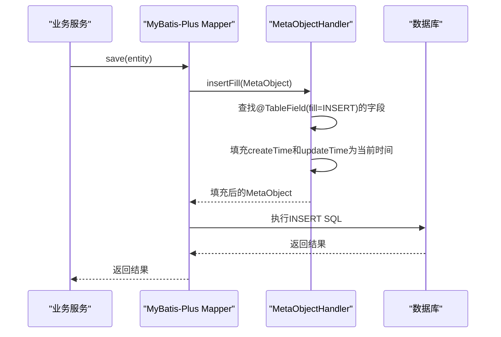

# 基础实体类

<cite>
**Referenced Files in This Document**  
- [BaseEntity.java](file://backend/common-core/src/main/java/com/mall/common/core/domain/BaseEntity.java)
- [Merchant.java](file://backend/merchant-service/src/main/java/com/mall/merchant/domain/entity/Merchant.java)
- [Product.java](file://backend/product-service/src/main/java/com/mall/product/domain/entity/Product.java)
- [MybatisPlusConfig.java](file://backend/sms-service/src/main/java/com/mall/sms/config/MybatisPlusConfig.java)
</cite>

## 目录
1. [简介](#简介)
2. [核心设计与技术实现](#核心设计与技术实现)
3. [字段定义与注解使用](#字段定义与注解使用)
4. [继承机制与子类扩展](#继承机制与子类扩展)
5. [MyBatis-Plus自动填充机制](#mybatis-plus自动填充机制)
6. [最佳实践](#最佳实践)

## 简介

`BaseEntity` 是本系统中所有持久化实体的基类，位于 `common-core` 模块中，旨在为所有业务实体提供统一的公共审计字段和基础功能。通过继承 `BaseEntity`，各业务模块（如商家服务、商品服务）的实体类能够自动获得创建时间、更新时间、创建者、更新者等审计字段，从而确保数据的一致性和可追溯性，同时极大地减少了重复代码的编写。

该设计遵循了领域驱动设计（DDD）中“通用语言”和“共享内核”的理念，将跨领域、跨服务的通用概念抽象到公共模块中，实现了代码的高复用性和系统的可维护性。`BaseEntity` 不仅是一个简单的数据容器，更是一个集成了JPA注解、MyBatis-Plus自动填充、逻辑删除和乐观锁等特性的综合性基础类。

**Section sources**
- [BaseEntity.java](file://backend/common-core/src/main/java/com/mall/common/core/domain/BaseEntity.java#L1-L81)

## 核心设计与技术实现

`BaseEntity` 的核心设计目标是提供一个稳定、可复用且功能完备的实体基类。其技术实现主要依赖于以下几个关键点：

1.  **JPA集成**：通过使用 `@MappedSuperclass` 注解，`BaseEntity` 被声明为一个映射超类。这意味着它的字段和映射信息会被所有继承它的实体类所继承，但 `BaseEntity` 本身不会映射到数据库中的一个独立表。`@EntityListeners(AuditingEntityListener.class)` 注解启用了Spring Data JPA的审计功能，允许框架自动管理 `@CreatedDate` 和 `@LastModifiedDate` 等注解的填充。

2.  **双框架兼容**：代码中同时存在JPA注解（如 `@Column`, `@Id`）和MyBatis-Plus注解（如 `@TableField`, `@TableLogic`）。这表明系统可能在不同服务中使用了不同的持久层框架，或者正处于从一种框架向另一种框架迁移的过程中。`BaseEntity` 的设计巧妙地兼容了这两种框架，确保了在不同服务中的通用性。

3.  **序列化支持**：实现了 `Serializable` 接口，这对于实体对象在网络间传输（如通过Feign进行服务间调用）或在缓存中存储是必需的。

4.  **Lombok简化**：使用 `@Data` 注解自动生成getter、setter、`toString`、`equals` 和 `hashCode` 方法，极大地简化了代码，减少了样板代码的编写。

**Section sources**
- [BaseEntity.java](file://backend/common-core/src/main/java/com/mall/common/core/domain/BaseEntity.java#L18-L81)

## 字段定义与注解使用

`BaseEntity` 封装了以下核心公共字段，每个字段都通过特定的注解来定义其数据库映射和行为。

### 公共审计字段

| 字段名 | Java类型 | 数据库列名 | 核心注解 | 作用机制 |
| :--- | :--- | :--- | :--- | :--- |
| `id` | Long | (主键) | `@Id`, `@GeneratedValue(strategy = GenerationType.AUTO)` | 主键ID，使用数据库自增策略生成。 |
| `createTime` | LocalDateTime | create_time | `@CreatedDate`, `@Column(updatable = false)`, `@TableField(fill = FieldFill.INSERT)` | **创建时间**。`@CreatedDate` 由JPA审计监听器填充，`@TableField(fill = FieldFill.INSERT)` 表明MyBatis-Plus在插入时自动填充。`updatable = false` 确保该字段在更新时不会被修改。 |
| `updateTime` | LocalDateTime | update_time | `@LastModifiedDate`, `@TableField(fill = FieldFill.INSERT_UPDATE)` | **更新时间**。`@LastModifiedDate` 由JPA审计监听器填充，`@TableField(fill = FieldFill.INSERT_UPDATE)` 表明MyBatis-Plus在插入和更新时都会自动填充。 |
| `createBy` | String | create_by | `@CreatedBy`, `@TableField(fill = FieldFill.INSERT)` | **创建者**。`@CreatedBy` 由JPA审计监听器填充（通常需要配置`AuditorAware`）。MyBatis-Plus在插入时自动填充。 |
| `updateBy` | String | update_by | `@LastModifiedBy`, `@TableField(fill = FieldFill.INSERT_UPDATE)` | **更新者**。`@LastModifiedBy` 由JPA审计监听器填充。MyBatis-Plus在插入和更新时自动填充。 |

### 其他通用字段

| 字段名 | Java类型 | 数据库列名 | 核心注解 | 作用机制 |
| :--- | :--- | :--- | :--- | :--- |
| `deleted` | Integer | (逻辑删除) | `@TableLogic` | **逻辑删除标志**。`@TableLogic` 是MyBatis-Plus的注解，用于实现逻辑删除。当执行删除操作时，框架会自动将该字段的值从0（存在）更新为1（已删除），而不是物理删除记录。 |
| `version` | Integer | (乐观锁) | (注释) | **版本号（乐观锁）**。此字段被注释掉，表明乐观锁功能可能未在当前版本中启用，或由其他机制实现。若启用，该字段用于在更新时检查版本号，防止并发更新冲突。 |

**Section sources**
- [BaseEntity.java](file://backend/common-core/src/main/java/com/mall/common/core/domain/BaseEntity.java#L43-L80)

## 继承机制与子类扩展

`BaseEntity` 通过Java的继承机制被各个业务实体类所继承，从而实现了公共字段的复用。以下是 `merchant-service` 和 `product-service` 中的两个典型继承案例。

### merchant-service 继承案例

在 `merchant-service` 模块中，`Merchant` 实体类直接继承了 `BaseEntity`。

```java
@Data
@EqualsAndHashCode(callSuper = true)
@Entity
@Table(name = "merchant")
public class Merchant extends BaseEntity {
    // 业务特定字段...
}
```

**关键点分析**：
- `@EqualsAndHashCode(callSuper = true)`：此Lombok注解非常重要。它指示生成的 `equals` 和 `hashCode` 方法必须考虑父类 `BaseEntity` 的字段（特别是 `id`）。如果 `callSuper = false`，则比较时会忽略父类字段，可能导致逻辑错误。
- **字段继承**：`Merchant` 实体自动拥有了 `id`, `createTime`, `updateTime` 等所有 `BaseEntity` 的字段，无需重复定义。
- **数据库映射**：`Merchant` 的 `createTime` 字段映射到数据库的 `create_time` 列，而 `BaseEntity` 中的 `@TableField(value = "created_time")` 注解表明MyBatis-Plus期望的列名为 `created_time`。这存在一个潜在的不一致，需要在MyBatis-Plus配置或数据库表结构中进行协调。

**Section sources**
- [Merchant.java](file://backend/merchant-service/src/main/java/com/mall/merchant/domain/entity/Merchant.java#L1-L607)

### product-service 继承案例

在 `product-service` 模块中，`Product` 实体类同样继承了 `BaseEntity`。

```java
@Data
@EqualsAndHashCode(callSuper = false)  // 注意：此处为false
@JsonIgnoreProperties(ignoreUnknown = true)
public class Product extends BaseEntity {
    // 业务特定字段...
}
```

**关键点分析**：
- `@EqualsAndHashCode(callSuper = false)`：与 `Merchant` 不同，此处 `callSuper` 为 `false`。这可能是一个潜在的错误，因为 `Product` 的 `equals` 方法将不会考虑从 `BaseEntity` 继承的 `id` 字段。正确的做法应该是 `callSuper = true`，以确保基于主键的正确比较。
- **价值体现**：通过继承，`Product` 实体无需再定义 `createTime` 和 `updateTime` 字段，保证了所有商品记录都具备统一的审计信息，简化了开发并保证了数据模型的一致性。

**Section sources**
- [Product.java](file://backend/product-service/src/main/java/com/mall/product/domain/entity/Product.java#L1-L184)

## MyBatis-Plus自动填充机制

`BaseEntity` 的自动填充功能依赖于MyBatis-Plus的 `MetaObjectHandler` 机制。虽然 `BaseEntity` 自身定义了 `@TableField(fill = ...)` 注解来指定哪些字段需要填充，但实际的填充逻辑是在配置类中实现的。

### 配置与实现

在 `sms-service` 模块的 `MybatisPlusConfig.java` 配置类中，定义了全局的 `MetaObjectHandler`：

```java
@Bean
public GlobalConfig globalConfig() {
    GlobalConfig globalConfig = new GlobalConfig();
    globalConfig.setMetaObjectHandler(new MetaObjectHandler() {
        @Override
        public void insertFill(MetaObject metaObject) {
            LocalDateTime now = LocalDateTime.now();
            this.strictInsertFill(metaObject, "createTime", LocalDateTime.class, now);
            this.strictInsertFill(metaObject, "updateTime", LocalDateTime.class, now);
        }

        @Override
        public void updateFill(MetaObject metaObject) {
            this.strictUpdateFill(metaObject, "updateTime", LocalDateTime.class, LocalDateTime.now());
        }
    });
    return globalConfig;
}
```

**作用机制**：
1.  **插入填充 (`insertFill`)**：当执行插入操作时，MyBatis-Plus会调用 `insertFill` 方法。该方法会查找所有标记了 `@TableField(fill = FieldFill.INSERT)` 或 `@TableField(fill = FieldFill.INSERT_UPDATE)` 且值为 `null` 的字段（如 `createTime` 和 `updateTime`），并将其填充为当前时间。
2.  **更新填充 (`updateFill`)**：当执行更新操作时，MyBatis-Plus会调用 `updateFill` 方法。该方法会查找所有标记了 `@TableField(fill = FieldFill.UPDATE)` 或 `@TableField(fill = FieldFill.INSERT_UPDATE)` 且值为 `null` 的字段（如 `updateTime`），并将其填充为当前时间。

**价值**：
- **自动化**：开发者无需在业务代码中手动设置 `createTime` 和 `updateTime`，由框架自动完成，避免了人为疏忽。
- **一致性**：确保所有服务在处理这些审计字段时遵循相同的规则，保证了数据的准确性和一致性。
- **减少代码**：消除了大量重复的 `setCreateTime(LocalDateTime.now())` 之类的样板代码。

**Diagram sources**
- [MybatisPlusConfig.java](file://backend/sms-service/src/main/java/com/mall/sms/config/MybatisPlusConfig.java#L47-L59)



**Diagram sources**
- [MybatisPlusConfig.java](file://backend/sms-service/src/main/java/com/mall/sms/config/MybatisPlusConfig.java#L47-L59)
- [BaseEntity.java](file://backend/common-core/src/main/java/com/mall/common/core/domain/BaseEntity.java#L52-L58)

## 最佳实践

1.  **始终调用 `super()`**：当在子类中重写 `equals` 和 `hashCode` 方法时，务必确保调用父类的方法，以包含 `BaseEntity` 中的 `id` 字段。使用 `@EqualsAndHashCode(callSuper = true)` 是最简单有效的方式。

2.  **字段命名一致性**：注意 `BaseEntity` 中 `@TableField(value = "created_time")` 与 `@Column(name = "create_time")` 存在不一致。在实际项目中，应统一命名规范（如全部使用 `create_time`），并在 `@TableField` 中明确指定正确的列名，例如 `@TableField(value = "create_time", fill = FieldFill.INSERT)`。

3.  **理解填充时机**：自动填充只在字段值为 `null` 时生效。如果在业务代码中手动设置了 `updateTime`，则框架不会覆盖它。这为特殊场景提供了灵活性。

4.  **逻辑删除的使用**：利用 `@TableLogic` 注解，可以方便地实现软删除。在查询时，MyBatis-Plus会自动添加 `WHERE deleted = 0` 的条件，隐藏已删除的记录。

5.  **模块化设计**：将 `BaseEntity` 放置在 `common-core` 模块中，体现了良好的模块化设计思想。它作为所有服务的共享依赖，确保了基础功能的统一。

通过遵循这些最佳实践，`BaseEntity` 能够在系统中发挥其最大价值，为开发者提供一个强大、可靠且易于维护的基础。

**Section sources**
- [BaseEntity.java](file://backend/common-core/src/main/java/com/mall/common/core/domain/BaseEntity.java#L1-L81)
- [MybatisPlusConfig.java](file://backend/sms-service/src/main/java/com/mall/sms/config/MybatisPlusConfig.java#L1-L63)