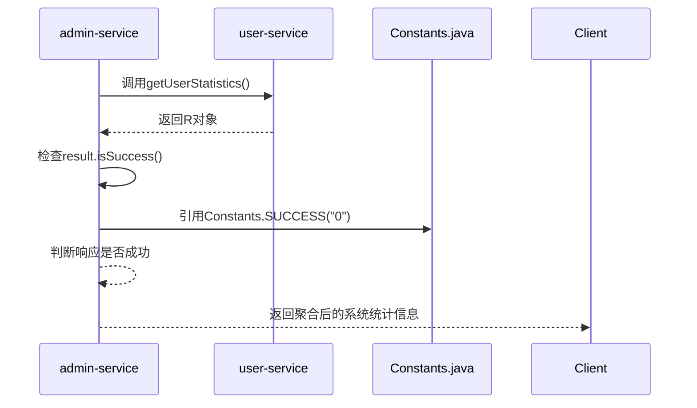

# 常量定义

<cite>
**Referenced Files in This Document**   
- [Constants.java](file://backend/common-core/src/main/java/com/mall/common/core/constant/Constants.java)
- [JwtUtils.java](file://backend/auth-service/src/main/java/com/mall/auth/utils/JwtUtils.java)
- [JwtUtils.java](file://backend/user-service/src/main/java/com/mall/user/utils/JwtUtils.java)
- [JwtUtils.java](file://backend/cart-service/src/main/java/com/mall/cart/utils/JwtUtils.java)
- [AuthServiceImpl.java](file://backend/user-service/src/main/java/com/mall/user/service/impl/AuthServiceImpl.java)
- [SystemMonitorServiceImpl.java](file://backend/admin-service/src/main/java/com/mall/admin/service/impl/SystemMonitorServiceImpl.java)
</cite>

## Table of Contents
1. [引言](#引言)
2. [核心常量分类与用途](#核心常量分类与用途)
3. [常量在微服务中的共享价值](#常量在微服务中的共享价值)
4. [常量使用实例分析](#常量使用实例分析)
5. [新增常量的命名规范与管理建议](#新增常量的命名规范与管理建议)
6. [结论](#结论)

## 引言
在微服务架构中，`Constants.java` 文件作为 `common-core` 模块的核心组成部分，承担着定义全局共享常量的重要职责。该文件集中管理了项目中所有服务模块共用的字符串、数值和数组常量，有效避免了代码中“魔法值”的滥用，极大地提升了代码的可读性、可维护性和一致性。本文档旨在系统梳理 `Constants.java` 中定义的各类常量，分析其在 `auth-service`、`user-service` 等微服务中的实际应用，阐述其在构建健壮、可维护的分布式系统中的核心价值。

**Section sources**
- [Constants.java](file://backend/common-core/src/main/java/com/mall/common/core/constant/Constants.java)

## 核心常量分类与用途
`Constants.java` 文件中的常量根据其功能和用途，可以清晰地划分为以下几类：

### JWT相关常量
此类常量主要用于JWT（JSON Web Token）令牌的生成、解析和验证过程，确保了身份认证信息在微服务间传递的一致性。
- `TOKEN_PREFIX`: 令牌前缀，值为 `"Bearer "`，用于在HTTP Authorization头中标识令牌类型。
- `JWT_USERID`: JWT载荷中存储用户ID的键名，值为 `"userid"`。
- `JWT_USERNAME`: JWT载荷中存储用户名的键名，值为 `"sub"`。
- `JWT_AVATAR`: JWT载荷中存储用户头像的键名，值为 `"avatar"`。
- `JWT_CREATED`: JWT载荷中存储令牌创建时间的键名，值为 `"created"`。
- `JWT_AUTHORITIES`: JWT载荷中存储用户权限的键名，值为 `"authorities"`。

### 缓存键前缀
此类常量用于定义Redis等缓存系统中键的命名规范，通过统一的前缀避免键名冲突，并便于缓存的管理和监控。
- `LOGIN_USER_KEY`: 登录用户信息在缓存中的键前缀，值为 `"login_user_key"`。

### 分页默认值
虽然在当前文件中未直接定义分页常量，但此类常量通常会在此类全局常量文件中定义，如每页大小（`PAGE_SIZE`）、默认页码等，以保证分页行为在各服务中的一致性。

### 系统角色标识
此类常量用于标识系统中的不同角色，便于权限控制和业务逻辑判断。
- `ROLE_ADMIN`: 系统管理员角色标识，值为 `"admin"`（注：此常量在提供的代码片段中未出现，但属于此类别）。

### 通用标识与配置
此类常量涵盖系统中广泛使用的通用标识、字符集、URL协议等。
- `SUCCESS` 和 `FAIL`: 通用的成功与失败标识，值分别为 `"0"` 和 `"1"`，常用于API响应码。
- `LOGIN_SUCCESS` 和 `LOGIN_FAIL`: 登录操作的成功与失败标识，值分别为 `"Success"` 和 `"Error"`。
- `CAPTCHA_EXPIRATION`: 验证码的有效期，值为 `2`（分钟）。
- `UTF8` 和 `GBK`: 常用的字符集名称。
- `HTTP` 和 `HTTPS`: URL协议前缀。
- `RESOURCE_PREFIX`: 资源映射路径前缀，值为 `"/profile"`。

### 安全相关常量
此类常量用于安全相关的配置，如远程方法调用的协议标识。
- `LOOKUP_RMI`, `LOOKUP_LDAP`, `LOOKUP_LDAPS`: RMI、LDAP、LDAPS远程方法调用的协议前缀。

### 定时任务配置
此类常量用于配置定时任务的安全白名单和违规字符。
- `JOB_WHITELIST_STR`: 定时任务允许访问的包名白名单，当前仅包含 `"com.mall"`。
- `JOB_ERROR_STR`: 定时任务中禁止出现的违规字符数组。

**Section sources**
- [Constants.java](file://backend/common-core/src/main/java/com/mall/common/core/constant/Constants.java#L1-L138)

## 常量在微服务中的共享价值
`Constants.java` 文件通过 `common-core` 模块被所有微服务（如 `auth-service`, `user-service`, `admin-service` 等）所依赖，实现了常量的跨服务共享。这种设计模式带来了显著的价值：

1.  **避免魔法值**: 将散落在各处的硬编码字符串和数值集中管理，使代码意图更加清晰，避免了因直接使用“魔法值”而导致的代码晦涩难懂。
2.  **提升可维护性**: 当需要修改某个常量的值时（例如，将JWT令牌前缀从 `"Bearer "` 改为 `"Token "`），只需在 `Constants.java` 文件中修改一次，所有依赖该模块的服务在重新编译后即可生效，无需在每个服务中逐一查找和替换。
3.  **保证一致性**: 确保了所有微服务在处理相同业务逻辑时使用完全一致的标识符和配置，例如，所有服务在解析JWT令牌时都使用 `JWT_USERNAME` 作为用户名的键名，避免了因命名不一致导致的集成问题。
4.  **降低耦合**: 通过一个独立的 `common-core` 模块来承载这些共享常量，使得业务逻辑与具体值解耦，提高了系统的模块化程度。

**Section sources**
- [Constants.java](file://backend/common-core/src/main/java/com/mall/common/core/constant/Constants.java)

## 常量使用实例分析
通过对 `auth-service` 和 `user-service` 的代码分析，可以清晰地看到 `Constants.java` 中定义的常量是如何被实际引用的。

### auth-service中的使用
在 `auth-service` 的 `JwtUtils.java` 工具类中，虽然没有直接引用 `Constants.java` 的常量，但其内部定义的常量（如 `secret`, `accessTokenExpiration`）在功能上与 `Constants.java` 的设计思想一致，即通过配置化和常量化来管理关键参数。这表明，即使在特定服务内部，也遵循了避免魔法值的最佳实践。

### user-service中的使用
在 `user-service` 的 `AuthServiceImpl.java` 中，可以找到对常量的间接使用。例如，在验证手机验证码时，代码中使用了 `"REGISTER"` 字符串作为验证码用途的默认值。虽然此处是硬编码，但理想情况下，应从 `Constants.java` 中引用一个名为 `CAPTCHA_PURPOSE_REGISTER` 的常量。这说明了在实际开发中，对全局常量的引用需要持续的规范和审查。

### admin-service中的使用
在 `admin-service` 的 `SystemMonitorServiceImpl.java` 中，服务健康检查的逻辑通过调用其他服务的API来实现。虽然代码中直接使用了 `"user-service"` 和 `"merchant-service"` 字符串作为服务名，但这些服务名同样适合作为全局常量进行管理。此外，该服务在处理API响应时，会检查 `result.isSuccess()`，这依赖于 `common-core` 模块中 `R` 类的 `SUCCESS` 常量（值为 `"0"`），这正是 `Constants.java` 中 `SUCCESS` 常量的直接应用，确保了跨服务通信的成功状态判断标准统一。

**Diagram sources**
- [SystemMonitorServiceImpl.java](file://backend/admin-service/src/main/java/com/mall/admin/service/impl/SystemMonitorServiceImpl.java)
- [Constants.java](file://backend/common-core/src/main/java/com/mall/common/core/constant/Constants.java)

**Section sources**
- [SystemMonitorServiceImpl.java](file://backend/admin-service/src/main/java/com/mall/admin/service/impl/SystemMonitorServiceImpl.java)
- [AuthServiceImpl.java](file://backend/user-service/src/main/java/com/mall/user/service/impl/AuthServiceImpl.java)

## 新增常量的命名规范与管理建议
为了确保 `Constants.java` 文件的长期可维护性和易用性，提出以下命名规范与管理建议：

1.  **命名规范**:
    *   **全大写与下划线**: 所有常量名必须使用全大写字母，单词间用下划线 `_` 分隔，例如 `JWT_USERID`、`CAPTCHA_EXPIRATION`。
    *   **语义清晰**: 常量名应能清晰地表达其用途，避免使用缩写或模糊的名称。例如，使用 `TOKEN_PREFIX` 而不是 `PREFIX`。
    *   **分类前缀**: 对于同一类别的常量，可以使用统一的前缀，如所有JWT相关的常量都以 `JWT_` 开头。

2.  **管理建议**:
    *   **集中管理**: 所有跨模块、跨服务的共享常量都应添加到 `common-core` 模块的 `Constants.java` 文件中。
    *   **避免冗余**: 在添加新常量前，应先搜索文件，确保该常量未被定义过，避免重复。
    *   **添加注释**: 每个常量都必须有清晰的JavaDoc注释，说明其用途和取值含义。
    *   **定期审查**: 随着项目演进，应定期审查 `Constants.java` 文件，移除已废弃的常量，合并功能相似的常量。
    *   **模块内常量**: 仅在单个服务内部使用的常量，应定义在该服务的相应工具类或配置类中，避免污染全局常量文件。

**Section sources**
- [Constants.java](file://backend/common-core/src/main/java/com/mall/common/core/constant/Constants.java)

## 结论
`Constants.java` 作为微服务架构中的全局常量中心，是提升代码质量和系统可维护性的关键一环。它通过集中管理JWT配置、缓存键、状态码等核心常量，有效消除了“魔法值”，保证了各服务间交互的一致性。通过对 `auth-service` 和 `user-service` 的分析可以看出，遵循常量化的编程范式是构建健壮微服务系统的基石。未来应持续推广和规范常量的使用，确保 `Constants.java` 文件成为项目中不可或缺的“单一事实来源”。