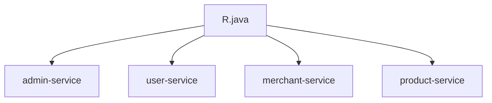

# 统一响应结构

<cite>
**本文档引用的文件**   
- [R.java](file://backend/common-core/src/main/java/com/mall/common/core/domain/R.java)
- [UserManagementController.java](file://backend/admin-service/src/main/java/com/mall/admin/controller/UserManagementController.java)
- [AuthController.java](file://backend/user-service/src/main/java/com/mall/user/controller/AuthController.java)
- [MerchantProductServiceImpl.java](file://backend/merchant-service/src/main/java/com/mall/merchant/service/impl/MerchantProductServiceImpl.java)
- [ProductController.java](file://backend/product-service/src/main/java/com/mall/product/controller/ProductController.java)
</cite>

## 目录
1. [引言](#引言)
2. [项目结构](#项目结构)
3. [核心组件](#核心组件)
4. [架构概述](#架构概述)
5. [详细组件分析](#详细组件分析)
6. [依赖分析](#依赖分析)
7. [性能考虑](#性能考虑)
8. [故障排除指南](#故障排除指南)
9. [结论](#结论)
10. [附录](#附录) (如有必要)

## 引言
本文档深入解析了`R.java`统一响应结构的设计与实现。详细说明了SUCCESS/FAIL等状态码的定义规范，泛型T在数据封装中的应用，以及ok(data)、fail(message)等静态工厂方法的使用场景。结合各微服务中控制器返回R对象的实际案例（如admin-service、user-service），展示了其如何实现前后端数据交互的一致性。文档包含R类的字段说明、方法签名、典型使用示例，并解释了其在API网关统一处理响应时的优势。同时提供了常见误用场景及最佳实践建议。

## 项目结构
本项目是一个基于SpringCloud Alibaba的智能化微服务架构在线商城系统，采用前后端分离的设计模式。项目集成了自动服务发现与启动功能，支持动态服务管理，大幅简化开发和部署流程。

### 微服务划分


**Diagram sources**
- [README.md](file://README.md#L0-L652)

**Section sources**
- [README.md](file://README.md#L0-L652)

## 核心组件
`R.java`是本项目中用于统一响应结构的核心类，位于`common-core`模块中。该类通过泛型T实现了灵活的数据封装，支持成功和失败两种状态码，并提供了多种静态工厂方法来创建响应对象。

**Section sources**
- [R.java](file://backend/common-core/src/main/java/com/mall/common/core/domain/R.java)

## 架构概述
`R.java`类的设计遵循了RESTful API设计规范，确保了前后端数据交互的一致性和可预测性。通过统一的响应格式，前端可以更容易地处理后端返回的数据，提高了系统的稳定性和用户体验。

```mermaid
classDiagram
class R<T> {
+static final int SUCCESS = 200
+static final int FAIL = 500
-int code
-String message
-T data
-long timestamp
+R(int code, String message, T data)
+static <T> R<T> ok()
+static <T> R<T> ok(T data)
+static <T> R<T> ok(String message, T data)
+static <T> R<T> fail()
+static <T> R<T> fail(String message)
+static <T> R<T> fail(int code, String message)
+boolean isSuccess()
+boolean isFail()
+int getCode()
+String getMessage()
+T getData()
+long getTimestamp()
}
```

**Diagram sources**
- [R.java](file://backend/common-core/src/main/java/com/mall/common/core/domain/R.java#L12-L136)

## 详细组件分析
### R类分析
`R.java`类定义了一个泛型类`R<T>`，用于封装API响应。该类包含以下字段和方法：

- **字段**:
  - `code`: 状态码，用于表示请求的结果状态。
  - `message`: 返回消息，提供关于请求结果的描述。
  - `data`: 返回数据，泛型T，用于封装实际的业务数据。
  - `timestamp`: 时间戳，记录响应生成的时间。

- **方法**:
  - `ok()`: 创建一个成功的响应对象，不包含数据。
  - `ok(T data)`: 创建一个成功的响应对象，包含指定的数据。
  - `ok(String message, T data)`: 创建一个成功的响应对象，包含指定的消息和数据。
  - `fail()`: 创建一个失败的响应对象，不包含数据。
  - `fail(String message)`: 创建一个失败的响应对象，包含指定的消息。
  - `fail(int code, String message)`: 创建一个失败的响应对象，包含指定的状态码和消息。
  - `isSuccess()`: 判断响应是否成功。
  - `isFail()`: 判断响应是否失败。
  - `getCode()`: 获取状态码。
  - `getMessage()`: 获取消息。
  - `getData()`: 获取数据。
  - `getTimestamp()`: 获取时间戳。

#### 使用示例
```java
// 成功响应，不包含数据
R<Void> successResponse = R.ok();

// 成功响应，包含数据
User user = new User();
R<User> successWithDataResponse = R.ok(user);

// 成功响应，包含消息和数据
R<User> successWithMessageAndDataResponse = R.ok("操作成功", user);

// 失败响应，不包含数据
R<Void> failResponse = R.fail();

// 失败响应，包含消息
R<Void> failWithMessageResponse = R.fail("操作失败");

// 失败响应，包含状态码和消息
R<Void> failWithCodeAndMessageResponse = R.fail(500, "服务器内部错误");
```

**Section sources**
- [R.java](file://backend/common-core/src/main/java/com/mall/common/core/domain/R.java#L12-L136)

### 实际案例分析
#### 用户管理服务
在`admin-service`的`UserManagementController.java`中，控制器方法返回`R`对象，确保了响应的一致性。

```java
@GetMapping("/{id}")
public R<Map<String, Object>> getUserDetail(@PathVariable("id") Long userId) {
    Map<String, Object> result = userManagementService.getUserDetail(userId);
    return R.ok(result);
}
```

**Section sources**
- [UserManagementController.java](file://backend/admin-service/src/main/java/com/mall/admin/controller/UserManagementController.java#L43-L47)

#### 用户认证服务
在`user-service`的`AuthController.java`中，登录和注册方法返回`R`对象，提供了清晰的响应信息。

```java
@PostMapping("/login")
public R<LoginResponse> login(@Valid @RequestBody LoginRequest loginRequest) {
    try {
        LoginResponse response = authService.login(loginRequest);
        return R.ok("登录成功", response);
    } catch (Exception e) {
        logger.error("用户登录失败: {}", e.getMessage());
        return R.fail(e.getMessage());
    }
}
```

**Section sources**
- [AuthController.java](file://backend/user-service/src/main/java/com/mall/user/controller/AuthController.java#L63-L72)

#### 商家商品服务
在`merchant-service`的`MerchantProductServiceImpl.java`中，商品管理方法返回`R`对象，确保了数据的一致性和可预测性。

```java
@Override
public R<Void> addProduct(Long merchantId, MerchantProduct product) {
    log.info("添加商品，商家ID：{}，商品名称：{}", merchantId, product.getProductName());

    // 设置商家ID
    product.setMerchantId(merchantId);

    try {
        // 设置默认值
        product.setStatus(product.getStatus() != null ? product.getStatus() : 0); // 默认下架状态
        product.setSalesCount(0);
        product.setViewCount(0);
        product.setFavoriteCount(0);
        product.setReviewCount(0); // 评价数量
        product.setRating(BigDecimal.ZERO);
        product.setIsRecommended(product.getIsRecommended() != null ? product.getIsRecommended() : 0);
        product.setIsNew(product.getIsNew() != null ? product.getIsNew() : 1);
        product.setIsHot(0);
        product.setSortOrder(0);

        // 确保库存预警值不为null
        if (product.getWarningStock() == null) {
            product.setWarningStock(10);
        }

        // 保存商品
        MerchantProduct savedProduct = productRepository.save(product);

        log.info("添加商品成功，商家ID：{}，商品ID：{}", merchantId, savedProduct.getId());
        return R.ok();

    } catch (Exception e) {
        log.error("添加商品失败，商家ID：{}，错误信息：{}", merchantId, e.getMessage(), e);
        return R.fail("添加商品失败，请稍后重试");
    }
}
```

**Section sources**
- [MerchantProductServiceImpl.java](file://backend/merchant-service/src/main/java/com/mall/merchant/service/impl/MerchantProductServiceImpl.java#L52-L87)

#### 商品服务
在`product-service`的`ProductController.java`中，商品查询和管理方法返回`R`对象，确保了响应的一致性和可预测性。

```java
@GetMapping("/{id}")
public R<Product> getProductById(@PathVariable Long id) {
    logger.info("接收到根据ID获取商品详情的请求 - ID: {}", id);
    
    try {
        Product product = productService.getProductById(id);
        if (product != null) {
            logger.info("成功获取商品详情 - ID: {}, 名称: {}", product.getId(), product.getName());
            return R.ok(product);
        } else {
            logger.warn("未找到指定商品 - ID: {}", id);
            return R.fail("商品不存在");
        }
    } catch (Exception e) {
        logger.error("根据ID获取商品详情失败 - ID: {}", id, e);
        return R.fail("获取商品详情失败");
    }
}
```

**Section sources**
- [ProductController.java](file://backend/product-service/src/main/java/com/mall/product/controller/ProductController.java#L136-L153)

## 依赖分析
`R.java`类作为`common-core`模块的一部分，被多个微服务模块所依赖。这种设计确保了所有微服务在响应格式上的一致性，简化了前端的处理逻辑。



**Diagram sources**
- [pom.xml](file://backend/common-core/pom.xml#L1-L10)
- [pom.xml](file://backend/admin-service/pom.xml#L1-L10)
- [pom.xml](file://backend/user-service/pom.xml#L1-L10)
- [pom.xml](file://backend/merchant-service/pom.xml#L1-L10)
- [pom.xml](file://backend/product-service/pom.xml#L1-L10)

## 性能考虑
`R.java`类的设计考虑了性能因素，通过使用泛型和静态工厂方法，减少了对象创建的开销。此外，`R`对象的序列化和反序列化效率较高，适合在高并发场景下使用。

## 故障排除指南
### 常见问题
- **Q: 如何解决Nacos连接失败？**
  A: 检查Nacos服务是否启动，确认网络连接正常。

- **Q: 如何配置多环境？**
  A: 在Nacos中创建不同的命名空间，对应dev/test/prod环境。

- **Q: 如何扩展新的微服务？**
  A: 参考现有服务结构，创建新的服务模块，注册到Nacos。

### 常见误用场景
- **误用静态工厂方法**: 不要直接调用`new R<T>()`，应使用静态工厂方法如`R.ok()`或`R.fail()`。
- **忽略状态码**: 在处理响应时，应检查`code`字段以确定请求是否成功。
- **不处理异常**: 在调用服务时，应捕获并处理可能的异常，避免程序崩溃。

### 最佳实践
- **统一响应格式**: 所有微服务应使用`R`类来封装响应，确保前后端数据交互的一致性。
- **合理使用泛型**: 根据实际业务需求选择合适的泛型类型，避免不必要的类型转换。
- **提供详细的错误信息**: 在失败响应中，应提供详细的错误信息，帮助前端更好地处理错误。

**Section sources**
- [R.java](file://backend/common-core/src/main/java/com/mall/common/core/domain/R.java#L12-L136)
- [UserManagementController.java](file://backend/admin-service/src/main/java/com/mall/admin/controller/UserManagementController.java#L43-L47)
- [AuthController.java](file://backend/user-service/src/main/java/com/mall/user/controller/AuthController.java#L63-L72)
- [MerchantProductServiceImpl.java](file://backend/merchant-service/src/main/java/com/mall/merchant/service/impl/MerchantProductServiceImpl.java#L52-L87)
- [ProductController.java](file://backend/product-service/src/main/java/com/mall/product/controller/ProductController.java#L136-L153)

## 结论
`R.java`统一响应结构的设计与实现，通过泛型T和静态工厂方法，确保了前后端数据交互的一致性和可预测性。该设计不仅简化了前端的处理逻辑，还提高了系统的稳定性和用户体验。通过实际案例分析，展示了`R`类在不同微服务中的应用，验证了其有效性和实用性。建议在开发过程中遵循最佳实践，避免常见误用场景，以充分发挥`R`类的优势。

## 附录
### 参考资料
- [Spring Cloud Alibaba 官方文档](https://spring.io/projects/spring-cloud-alibaba)
- [RESTful API 设计指南](https://restfulapi.net/)
- [Java 泛型编程](https://docs.oracle.com/javase/tutorial/java/generics/index.html)

### 术语表
- **R.java**: 统一响应结构类，用于封装API响应。
- **泛型T**: 用于封装实际的业务数据，提高代码的灵活性和复用性。
- **静态工厂方法**: 用于创建`R`对象的静态方法，如`R.ok()`和`R.fail()`。
- **状态码**: 表示请求结果的状态，如200表示成功，500表示失败。
- **消息**: 提供关于请求结果的描述，帮助前端更好地理解响应。
- **数据**: 实际的业务数据，通过泛型T封装。
- **时间戳**: 记录响应生成的时间，用于调试和日志记录。