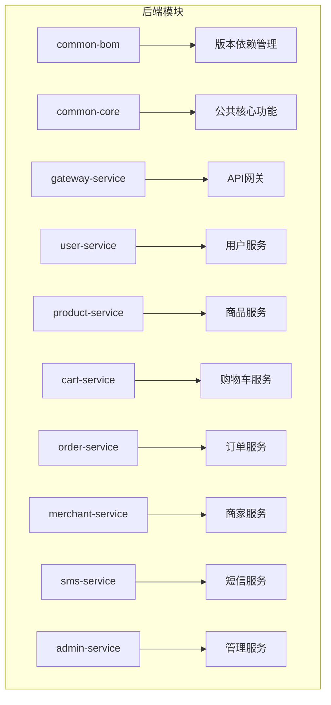
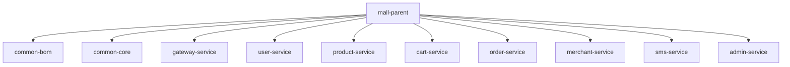
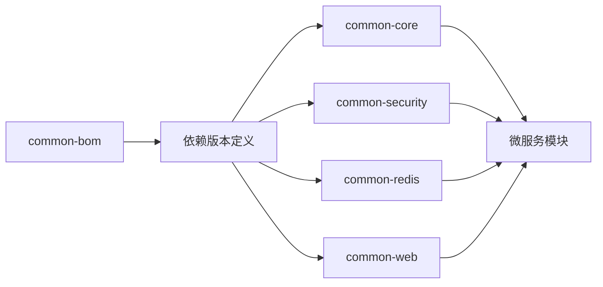
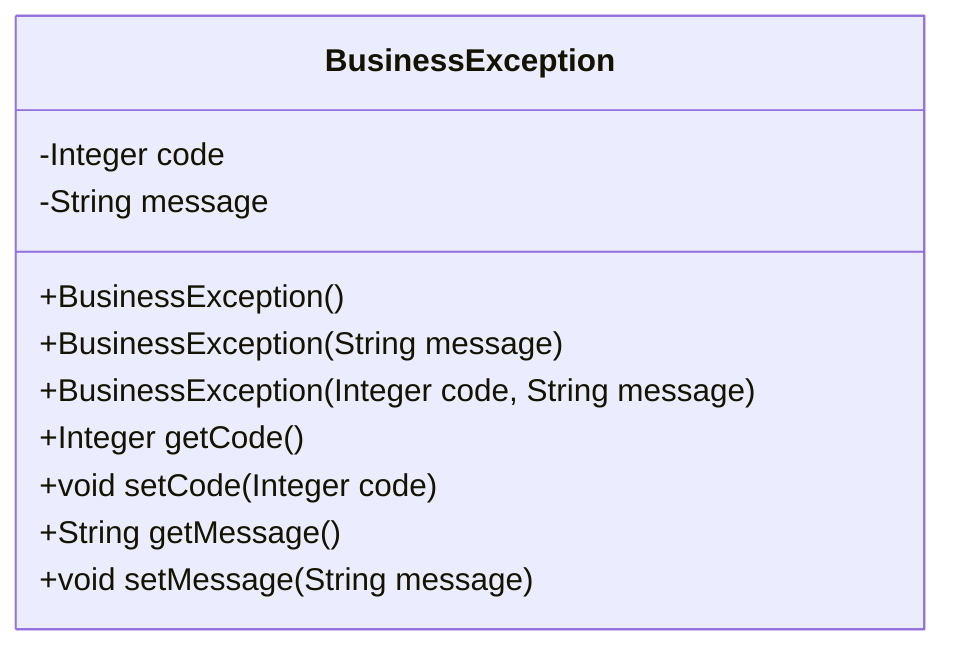
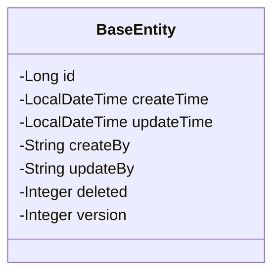
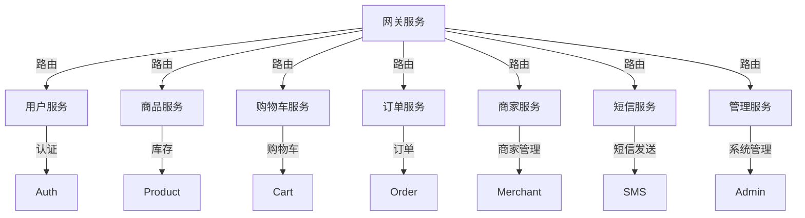
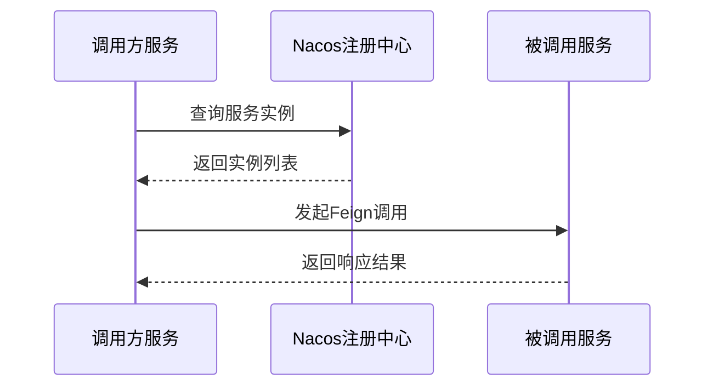
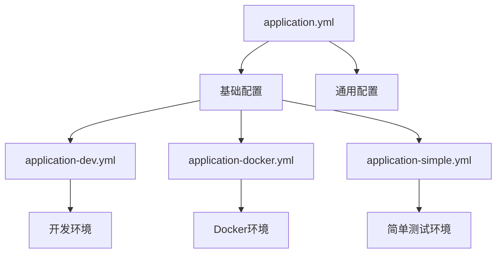
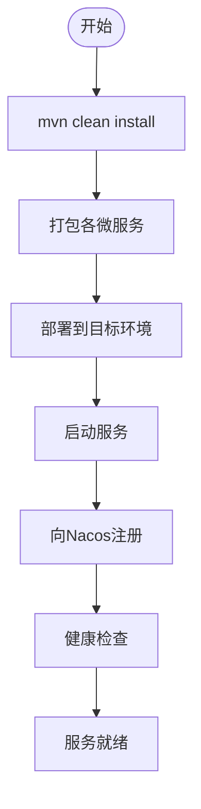

# 后端架构

<cite>
**本文档引用文件**  
- [backend/pom.xml](file://backend/pom.xml)
- [backend/common-core/pom.xml](file://backend/common-core/pom.xml)
- [backend/common-bom/pom.xml](file://backend/common-bom/pom.xml)
- [backend/common-core/src/main/java/com/mall/common/core/domain/R.java](file://backend/common-core/src/main/java/com/mall/common/core/domain/R.java)
- [backend/common-core/src/main/java/com/mall/common/core/exception/BusinessException.java](file://backend/common-core/src/main/java/com/mall/common/core/exception/BusinessException.java)
- [backend/common-core/src/main/java/com/mall/common/core/domain/BaseEntity.java](file://backend/common-core/src/main/java/com/mall/common/core/domain/BaseEntity.java)
- [backend/admin-service/pom.xml](file://backend/admin-service/pom.xml)
- [backend/user-service/pom.xml](file://backend/user-service/pom.xml)
- [backend/product-service/pom.xml](file://backend/product-service/pom.xml)
- [backend/order-service/pom.xml](file://backend/order-service/pom.xml)
- [backend/cart-service/pom.xml](file://backend/cart-service/pom.xml)
- [backend/merchant-service/pom.xml](file://backend/merchant-service/pom.xml)
- [backend/sms-service/pom.xml](file://backend/sms-service/pom.xml)
- [backend/gateway-service/pom.xml](file://backend/gateway-service/pom.xml)
</cite>

## 目录
1. [项目结构](#项目结构)
2. [Maven多模块结构](#maven多模块结构)
3. [BOM版本管理机制](#bom版本管理机制)
4. [common-core公共模块](#common-core公共模块)
5. [微服务职责划分](#微服务职责划分)
6. [服务间通信机制](#服务间通信机制)
7. [配置文件管理](#配置文件管理)
8. [项目构建与启动流程](#项目构建与启动流程)
9. [开发规范与扩展指导](#开发规范与扩展指导)

## 项目结构

本项目采用典型的微服务架构，后端模块化设计清晰，分为公共模块、网关服务和多个业务微服务。整体结构如下：



**图示来源**  
- [backend/pom.xml](file://backend/pom.xml#L43-L59)

## Maven多模块结构

项目采用Maven多模块架构，以`mall-parent`为父工程，统一管理所有子模块的依赖和构建配置。这种结构实现了模块间的解耦与复用。



**图示来源**  
- [backend/pom.xml](file://backend/pom.xml#L43-L59)

**本节来源**  
- [backend/pom.xml](file://backend/pom.xml#L1-L200)

## BOM版本管理机制

项目通过`common-bom`模块实现依赖版本的集中管理，确保各微服务使用统一的第三方库版本，避免版本冲突。



**图示来源**  
- [backend/common-bom/pom.xml](file://backend/common-bom/pom.xml#L20-L44)

**本节来源**  
- [backend/common-bom/pom.xml](file://backend/common-bom/pom.xml#L1-L45)

## common-core公共模块

`common-core`模块封装了项目中通用的功能组件，包括统一返回格式、基础异常处理和基础实体类，为各微服务提供标准化支持。

### 统一返回格式R.java

`R.java`类定义了统一的API响应结构，包含状态码、消息、数据和时间戳，确保前后端交互的一致性。

```mermaid
classDiagram
class R<T> {
+int SUCCESS = 200
+int FAIL = 500
-int code
-String message
-T data
-long timestamp
+R(int code, String message, T data)
+static <T> R<T> ok()
+static <T> R<T> ok(T data)
+static <T> R<T> fail(String message)
+boolean isSuccess()
+boolean isFail()
}
```

**图示来源**  
- [backend/common-core/src/main/java/com/mall/common/core/domain/R.java](file://backend/common-core/src/main/java/com/mall/common/core/domain/R.java#L13-L137)

### 异常处理机制

`BusinessException`类作为业务异常的基类，支持自定义错误码和消息，便于全局异常处理器统一处理并返回标准化错误响应。



**图示来源**  
- [backend/common-core/src/main/java/com/mall/common/core/exception/BusinessException.java](file://backend/common-core/src/main/java/com/mall/common/core/exception/BusinessException.java#L6-L58)

### 基础实体类BaseEntity

`BaseEntity`类提供基础的数据库字段，如创建时间、更新时间、创建者、更新者等，通过JPA注解实现自动填充，减少重复代码。



**图示来源**  
- [backend/common-core/src/main/java/com/mall/common/core/domain/BaseEntity.java](file://backend/common-core/src/main/java/com/mall/common/core/domain/BaseEntity.java#L36-L81)

**本节来源**  
- [backend/common-core/pom.xml](file://backend/common-core/pom.xml#L1-L78)
- [backend/common-core/src/main/java/com/mall/common/core/domain/R.java](file://backend/common-core/src/main/java/com/mall/common/core/domain/R.java#L1-L137)
- [backend/common-core/src/main/java/com/mall/common/core/exception/BusinessException.java](file://backend/common-core/src/main/java/com/mall/common/core/exception/BusinessException.java#L1-L58)
- [backend/common-core/src/main/java/com/mall/common/core/domain/BaseEntity.java](file://backend/common-core/src/main/java/com/mall/common/core/domain/BaseEntity.java#L1-L81)

## 微服务职责划分

各微服务按照业务领域进行划分，职责明确，边界清晰，遵循单一职责原则。



**图示来源**  
- [backend/pom.xml](file://backend/pom.xml#L43-L59)

**本节来源**  
- [backend/user-service/pom.xml](file://backend/user-service/pom.xml#L1-L127)
- [backend/product-service/pom.xml](file://backend/product-service/pom.xml#L1-L161)
- [backend/cart-service/pom.xml](file://backend/cart-service/pom.xml#L1-L127)
- [backend/order-service/pom.xml](file://backend/order-service/pom.xml#L1-L127)
- [backend/merchant-service/pom.xml](file://backend/merchant-service/pom.xml#L1-L127)
- [backend/sms-service/pom.xml](file://backend/sms-service/pom.xml#L1-L127)
- [backend/admin-service/pom.xml](file://backend/admin-service/pom.xml#L1-L157)

## 服务间通信机制

微服务之间通过多种方式进行通信，包括HTTP调用（Feign）、消息队列（RocketMQ）等，确保松耦合和高可用。

### Feign声明式调用

各服务通过Feign客户端进行服务间调用，简化了HTTP请求的编写，实现了服务发现和负载均衡。



**图示来源**  
- [backend/admin-service/pom.xml](file://backend/admin-service/pom.xml#L60-L64)

### RocketMQ消息通信

通过RocketMQ实现异步消息通信，用于解耦服务间的强依赖，提高系统吞吐量和可靠性。


**本节来源**  
- [backend/pom.xml](file://backend/pom.xml#L29)
- [backend/admin-service/pom.xml](file://backend/admin-service/pom.xml#L60-L64)

## 配置文件管理

项目采用多环境配置管理，通过`application.yml`和环境特定配置文件（如`application-dev.yml`）实现不同环境的差异化配置。



**本节来源**  
- [backend/admin-service/src/main/resources/application-dev.yml](file://backend/admin-service/src/main/resources/application-dev.yml)
- [backend/admin-service/src/main/resources/application-docker.yml](file://backend/admin-service/src/main/resources/application-docker.yml)
- [backend/user-service/src/main/resources/application-simple.yml](file://backend/user-service/src/main/resources/application-simple.yml)

## 项目构建与启动流程

项目通过Maven进行构建，各微服务独立打包和部署，支持多种启动方式，包括本地启动和Docker部署。



**本节来源**  
- [backend/pom.xml](file://backend/pom.xml#L162-L191)
- [backend/admin-service/pom.xml](file://backend/admin-service/pom.xml#L133-L154)

## 开发规范与扩展指导

为确保代码质量和团队协作效率，制定以下开发规范和扩展指导：

1. **代码结构规范**：遵循Maven标准目录结构，按功能划分包名
2. **命名规范**：采用驼峰命名法，类名大写开头，方法名小写开头
3. **异常处理**：使用`BusinessException`进行业务异常抛出，避免直接抛出RuntimeException
4. **日志记录**：使用SLF4J进行日志输出，按级别分类记录
5. **接口文档**：使用Knife4j生成API文档，确保接口描述清晰
6. **单元测试**：为关键业务逻辑编写单元测试，保证代码质量
7. **新模块添加**：在父POM中添加模块声明，继承common-bom和common-core
8. **依赖管理**：新增依赖需在common-bom中定义版本，避免版本冲突

**本节来源**  
- [backend/pom.xml](file://backend/pom.xml#L15-L41)
- [backend/common-core/pom.xml](file://backend/common-core/pom.xml#L19-L77)
- [backend/admin-service/pom.xml](file://backend/admin-service/pom.xml#L17-L117)