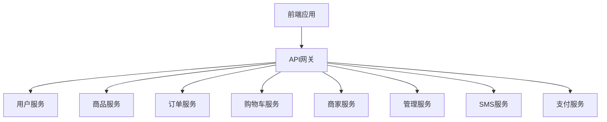
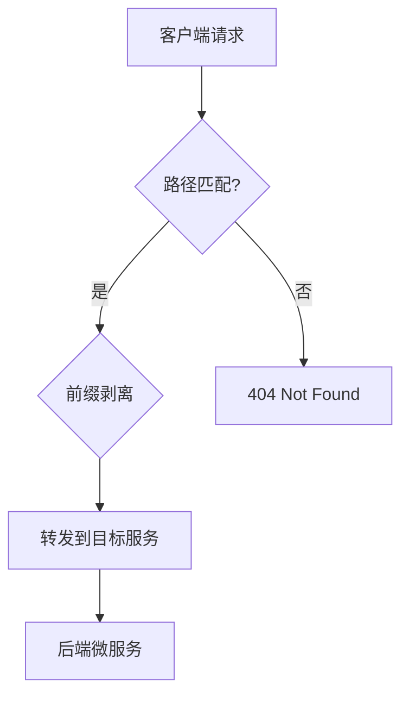
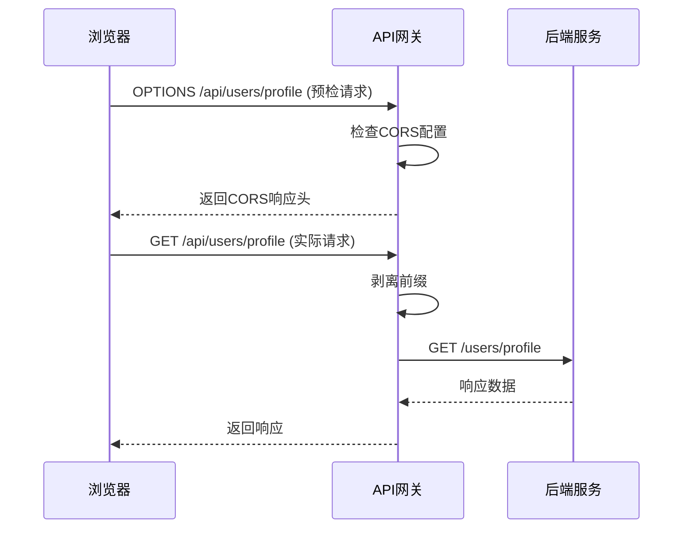
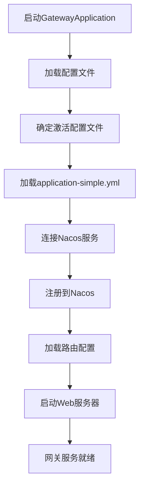

# API网关路由

<cite>
**Referenced Files in This Document**   
- [GatewayApplication.java](file://backend/gateway-service/src/main/java/com/mall/gateway/GatewayApplication.java)
- [application.yml](file://backend/gateway-service/src/main/resources/application.yml)
- [application-simple.yml](file://backend/gateway-service/src/main/resources/application-simple.yml)
- [商家入驻404问题-根本修复完成.md](file://商家入驻404问题-根本修复完成.md)
</cite>

## 目录
1. [项目结构](#项目结构)
2. [核心路由配置机制](#核心路由配置机制)
3. [服务发现与负载均衡](#服务发现与负载均衡)
4. [路径匹配与前缀剥离](#路径匹配与前缀剥离)
5. [跨域配置](#跨域配置)
6. [网关初始化流程](#网关初始化流程)
7. [新增路由配置示例](#新增路由配置示例)
8. [常见路由错误排查](#常见路由错误排查)

## 项目结构

本项目采用微服务架构，API网关作为所有前端请求的统一入口，负责将请求路由到相应的后端微服务。网关服务位于`backend/gateway-service`目录下，其核心配置文件为`application.yml`和`application-simple.yml`。



**Diagram sources**
- [application-simple.yml](file://backend/gateway-service/src/main/resources/application-simple.yml#L24-L138)

**Section sources**
- [application-simple.yml](file://backend/gateway-service/src/main/resources/application-simple.yml#L1-L157)

## 核心路由配置机制

Spring Cloud Gateway的路由配置是通过YAML文件中的`spring.cloud.gateway.routes`属性来定义的。每个路由规则包含ID、目标URI、断言（Predicates）和过滤器（Filters）四个核心部分。

在本项目中，路由配置主要定义在`application-simple.yml`文件中，该文件通过`spring.profiles.active: simple`被激活，优先级高于`application.yml`。



**Diagram sources**
- [application-simple.yml](file://backend/gateway-service/src/main/resources/application-simple.yml#L24-L138)

**Section sources**
- [application-simple.yml](file://backend/gateway-service/src/main/resources/application-simple.yml#L1-L157)

## 服务发现与负载均衡

网关通过服务发现机制将前端请求路由到后端微服务。在本项目中，服务发现由Nacos实现，路由配置中的`lb://`前缀表示使用负载均衡。

### 服务发现配置

```yaml
spring:
  cloud:
    nacos:
      discovery:
        server-addr: localhost:8848
        namespace: simple
        enabled: true
```

关键配置说明：
- `server-addr`: Nacos服务器地址
- `namespace`: 命名空间，必须与服务注册的命名空间一致（如`simple`）
- `enabled`: 启用服务发现

### 负载均衡路由

路由规则中的`uri: lb://service-name`表示：
1. `lb://`：使用Spring Cloud LoadBalancer进行负载均衡
2. `service-name`：目标微服务的注册名称

例如，用户服务的路由配置：
```yaml
- id: user-service
  uri: lb://user-service
  predicates:
    - Path=/api/users/**
  filters:
    - StripPrefix=1
```

当请求`/api/users/profile`时，网关会：
1. 通过Nacos发现`user-service`的所有实例
2. 使用负载均衡策略选择一个实例
3. 将请求转发到选中的实例

**Section sources**
- [application-simple.yml](file://backend/gateway-service/src/main/resources/application-simple.yml#L10-L14)
- [application-simple.yml](file://backend/gateway-service/src/main/resources/application-simple.yml#L26-L31)

## 路径匹配与前缀剥离

### 路径匹配（Path Predicates）

路径匹配是路由的核心机制，通过`Path`断言来定义哪些请求应该被路由到特定服务。

```yaml
predicates:
  - Path=/api/users/**
```

路径匹配规则：
- `/api/users/**`：匹配以`/api/users/`开头的所有路径
- `**`：通配符，匹配任意层级的子路径
- 匹配区分大小写

### 前缀剥离（StripPrefix Filter）

前缀剥离过滤器用于在转发请求前移除指定数量的路径前缀。

```yaml
filters:
  - StripPrefix=1
```

#### 剥离规则示例

| 原始请求路径 | StripPrefix | 剥离后路径 | 转发到服务 |
|------------|------------|-----------|-----------|
| `/api/users/profile` | 1 | `/users/profile` | user-service |
| `/api/product/list` | 2 | `/list` | product-service |
| `/api/cart/items` | 2 | `/items` | cart-service |

#### 配置错误案例

在商家服务的修复过程中，曾出现`StripPrefix=2`的错误配置：

```yaml
# 错误配置
- id: merchant-service
  uri: lb://merchant-service
  predicates:
    - Path=/api/merchant/**
  filters:
    - StripPrefix=2  # 错误：应为1
```

错误路径转换：
```
/api/merchant/apply -> /apply  # 错误，服务无法找到该路径
```

正确配置：
```yaml
# 正确配置
- id: merchant-service
  uri: lb://merchant-service
  predicates:
    - Path=/api/merchant/**
  filters:
    - StripPrefix=1  # 正确
```

正确路径转换：
```
/api/merchant/apply -> /merchant/apply  # 正确，匹配服务Controller
```

**Section sources**
- [application-simple.yml](file://backend/gateway-service/src/main/resources/application-simple.yml#L29-L31)
- [application-simple.yml](file://backend/gateway-service/src/main/resources/application-simple.yml#L45-L47)
- [商家入驻404问题-根本修复完成.md](file://商家入驻404问题-根本修复完成.md#L56-L73)

## 跨域配置

跨域资源共享（CORS）配置在网关层面统一处理，避免每个微服务单独配置。

### 全局CORS配置

```yaml
spring:
  cloud:
    gateway:
      globalcors:
        cors-configurations:
          "[/**]":
            allowedOriginPatterns: "*"
            allowedMethods: "*"
            allowedHeaders: "*"
            allowCredentials: true
            exposedHeaders: "Content-Disposition,Content-Type,Cache-Control"
```

配置项说明：
- `allowedOriginPatterns`: 允许的源，`*`表示允许所有域名
- `allowedMethods`: 允许的HTTP方法，`*`表示所有方法
- `allowedHeaders`: 允许的请求头，`*`表示所有头
- `allowCredentials`: 是否允许携带凭证（如Cookie）
- `exposedHeaders`: 暴露给客户端的响应头

### CORS处理流程



**Diagram sources**
- [application-simple.yml](file://backend/gateway-service/src/main/resources/application-simple.yml#L131-L138)

**Section sources**
- [application-simple.yml](file://backend/gateway-service/src/main/resources/application-simple.yml#L131-L138)

## 网关初始化流程

网关服务的初始化流程从`GatewayApplication`启动类开始，通过Spring Boot的自动配置机制完成。

### 启动类分析

```java
@EnableDiscoveryClient
@SpringBootApplication(exclude = { 
    org.springframework.boot.autoconfigure.jdbc.DataSourceAutoConfiguration.class 
})
public class GatewayApplication {
    
    public static void main(String[] args) {
        SpringApplication.run(GatewayApplication.class, args);
        System.out.println("(♥◠‿◠)ﾉﾞ  网关服务启动成功   ლ(´ڡ`ლ)ﾞ");
    }
}
```

关键注解说明：
- `@EnableDiscoveryClient`: 启用服务发现客户端
- `@SpringBootApplication`: Spring Boot应用主类
- `exclude`: 排除数据源自动配置，因为网关不需要数据库

### 初始化流程



初始化关键步骤：
1. **配置加载**：根据`spring.profiles.active`加载`application-simple.yml`
2. **服务发现**：连接Nacos服务器，注册自身为服务实例
3. **路由加载**：读取`spring.cloud.gateway.routes`配置
4. **服务启动**：启动Reactive Web服务器，监听8080端口

**Diagram sources**
- [GatewayApplication.java](file://backend/gateway-service/src/main/java/com/mall/gateway/GatewayApplication.java#L10-L17)

**Section sources**
- [GatewayApplication.java](file://backend/gateway-service/src/main/java/com/mall/gateway/GatewayApplication.java#L1-L18)

## 新增路由配置示例

### 添加新服务路由

假设需要添加`inventory-service`（库存服务）的路由：

```yaml
- id: inventory-service
  uri: lb://inventory-service
  predicates:
    - Path=/api/inventory/**
  filters:
    - StripPrefix=1
```

### 添加兼容路由

为支持旧版前端路径，可添加兼容路由：

```yaml
# 库存服务兼容路由
- id: inventory-service-compat
  uri: lb://inventory-service
  predicates:
    - Path=/api/inventory-service/**
  filters:
    - name: StripPrefix
      args:
        parts: 2
```

### 配置验证步骤

1. **确认服务已注册**：访问Nacos控制台，检查`inventory-service`是否已注册
2. **更新配置文件**：将路由配置添加到`application-simple.yml`
3. **重启网关服务**：使新配置生效
4. **测试路由**：使用curl或前端调用测试

```bash
# 测试路由
curl http://localhost:8080/api/inventory/stock/123
```

**Section sources**
- [application-simple.yml](file://backend/gateway-service/src/main/resources/application-simple.yml#L24-L138)

## 常见路由错误排查

### 404路由未匹配

#### 可能原因

1. **路径不匹配**：请求路径与路由断言不匹配
2. **服务未注册**：目标服务未在Nacos中注册
3. **命名空间不匹配**：网关与服务在不同Nacos命名空间
4. **配置文件错误**：修改了错误的配置文件

#### 排查步骤

1. **检查请求路径**：
   ```bash
   # 查看实际请求路径
   curl -v http://localhost:8080/api/users/profile
   ```

2. **检查服务注册**：
   - 访问 `http://localhost:8848/nacos`
   - 查看目标服务是否在`simple`命名空间中注册

3. **检查配置文件**：
   - 确认修改的是`application-simple.yml`而非`application.yml`
   - 检查`namespace`配置是否一致

4. **查看网关日志**：
   ```bash
   .\tail-logs.ps1 gateway
   ```

### 跨域失败

#### 可能原因

1. **CORS配置错误**：网关未正确配置CORS
2. **凭证问题**：`allowCredentials`与通配符冲突
3. **预检请求失败**：OPTIONS请求未正确处理

#### 解决方案

1. **检查CORS配置**：
   ```yaml
   globalcors:
     cors-configurations:
       "[/**]":
         allowedOriginPatterns: "*"
         allowedMethods: "*"
         allowedHeaders: "*"
         allowCredentials: true
   ```

2. **禁用凭证（如需通配符）**：
   ```yaml
   allowCredentials: false  # 使用*时需禁用凭证
   ```

3. **测试预检请求**：
   ```bash
   curl -X OPTIONS http://localhost:8080/api/users/profile \
     -H "Origin: http://localhost:5173" \
     -H "Access-Control-Request-Method: GET"
   ```

### 服务发现失败

#### 典型错误

```
Unable to find instance for merchant-service
```

#### 根本原因

- 网关在`public`命名空间查找服务
- 商家服务在`simple`命名空间注册

#### 修复方法

```yaml
# 修复nacos discovery namespace
nacos:
  discovery:
    namespace: simple  # 从public改为simple
```

**Section sources**
- [application-simple.yml](file://backend/gateway-service/src/main/resources/application-simple.yml#L11-L14)
- [商家入驻404问题-根本修复完成.md](file://商家入驻404问题-根本修复完成.md#L40-L54)
- [DEVELOPMENT.md](file://DEVELOPMENT.md#L370-L471)