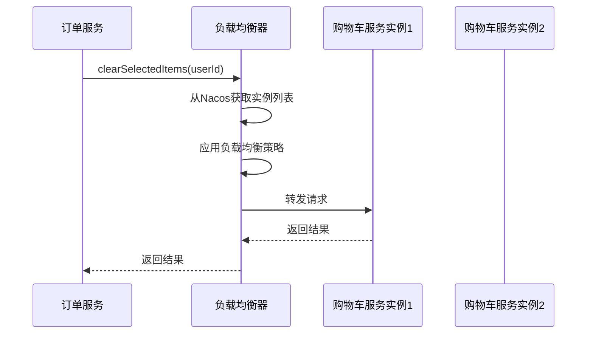
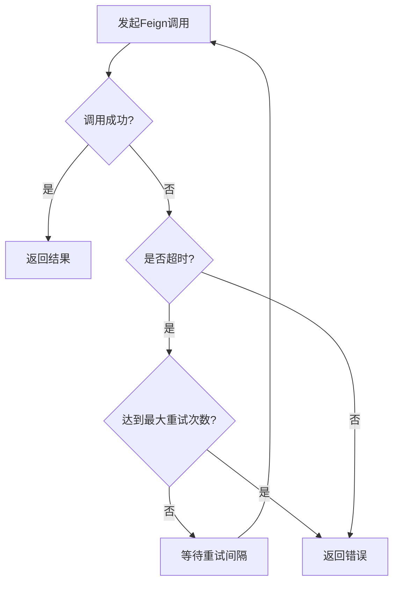

# Feign声明式调用

<cite>
**本文档引用文件**   
- [OrderServiceImpl.java](file://backend/order-service/src/main/java/com/mall/order/service/impl/OrderServiceImpl.java)
- [CartClient.java](file://backend/order-service/src/main/java/com/mall/order/client/CartClient.java)
- [PaymentClient.java](file://backend/order-service/src/main/java/com/mall/order/client/PaymentClient.java)
- [ProductClient.java](file://backend/order-service/src/main/java/com/mall/order/client/ProductClient.java)
- [application.yml](file://backend/order-service/src/main/resources/application.yml)
- [FeignClientException.java](file://backend/order-service/src/main/java/com/mall/order/exception/FeignClientException.java)
- [GlobalExceptionHandler.java](file://backend/order-service/src/main/java/com/mall/order/exception/GlobalExceptionHandler.java)
- [OrderServiceApplication.java](file://backend/order-service/src/main/java/com/mall/order/OrderServiceApplication.java)
</cite>

## 目录
1. [引言](#引言)
2. [Feign客户端接口定义](#feign客户端接口定义)
3. [Feign调用实现机制](#feign调用实现机制)
4. [服务发现与负载均衡](#服务发现与负载均衡)
5. [超时与重试配置](#超时与重试配置)
6. [常见问题与解决方案](#常见问题与解决方案)
7. [总结](#总结)

## 引言

在微服务架构中，服务间的通信是系统核心功能之一。OpenFeign作为Spring Cloud生态中的声明式REST客户端，极大地简化了服务间调用的复杂性。本文以`order-service`调用`cart-service`和`payment-service`为例，深入分析OpenFeign在微服务通信中的实现机制。

在本系统中，订单服务（order-service）需要与购物车服务（cart-service）、支付服务（payment-service）和商品服务（product-service）进行交互，完成订单创建、支付处理、库存管理等核心业务流程。通过OpenFeign，这些跨服务调用被抽象为简单的Java接口调用，实现了声明式的REST通信。

**Section sources**
- [OrderServiceImpl.java](file://backend/order-service/src/main/java/com/mall/order/service/impl/OrderServiceImpl.java#L40-L916)

## Feign客户端接口定义

OpenFeign的核心思想是将HTTP请求抽象为Java接口。在本系统中，`order-service`通过定义Feign客户端接口来调用其他微服务。

### CartClient接口

`CartClient`是订单服务调用购物车服务的Feign客户端接口：

```java
@FeignClient(name = "cart-service", path = "/api/cart")
public interface CartClient {
    
    @GetMapping("/{userId}")
    Map<String, Object> getCart(@PathVariable("userId") Long userId);
    
    @GetMapping("/{userId}/items")
    List<Map<String, Object>> getCartItems(@PathVariable("userId") Long userId, 
                                          @RequestParam(value = "selected", defaultValue = "true") Boolean selected);
    
    @DeleteMapping("/{userId}/selected")
    Boolean clearSelectedItems(@PathVariable("userId") Long userId);
}
```

该接口通过`@FeignClient`注解声明，其中：
- `name = "cart-service"`：指定要调用的服务名称
- `path = "/api/cart"`：指定基础路径

接口中的方法使用Spring MVC注解（如`@GetMapping`、`@DeleteMapping`）来定义HTTP请求的类型、路径和参数。

### PaymentClient接口

`PaymentClient`是订单服务调用支付服务的Feign客户端：

```java
@FeignClient(name = "payment-service", path = "/api/payment")
public interface PaymentClient {
    
    @PostMapping("/create")
    Map<String, Object> createPayment(@RequestBody Map<String, Object> paymentRequest);
    
    @PostMapping("/refund")
    Map<String, Object> refund(@RequestBody Map<String, Object> refundRequest);
}
```

### ProductClient接口

`ProductClient`用于调用商品服务：

```java
@FeignClient(name = "product-service", path = "/api/products")
public interface ProductClient {
    
    @GetMapping("/{productId}")
    Map<String, Object> getProduct(@PathVariable("productId") Long productId);
    
    @PostMapping("/batch")
    List<Map<String, Object>> getProductsBatch(@RequestBody List<Long> productIds);
    
    @GetMapping("/{productId}/stock/check")
    Boolean checkStock(@PathVariable("productId") Long productId, @RequestParam("quantity") Integer quantity);
}
```

这些Feign客户端接口在`OrderServiceImpl`中被注入并使用：

```java
@Service
@RequiredArgsConstructor
public class OrderServiceImpl implements OrderService {
    private final ProductClient productClient;
    private final CartClient cartClient;
    private final PaymentClient paymentClient;
    // ...
}
```

**Section sources**
- [CartClient.java](file://backend/order-service/src/main/java/com/mall/order/client/CartClient.java#L11-L60)
- [PaymentClient.java](file://backend/order-service/src/main/java/com/mall/order/client/PaymentClient.java#L10-L65)
- [ProductClient.java](file://backend/order-service/src/main/java/com/mall/order/client/ProductClient.java#L20-L48)
- [OrderServiceImpl.java](file://backend/order-service/src/main/java/com/mall/order/service/impl/OrderServiceImpl.java#L56-L58)

## Feign调用实现机制

### 声明式REST通信流程

OpenFeign通过动态代理机制将接口调用转换为HTTP请求。当`OrderServiceImpl`调用`cartClient.clearSelectedItems(userId)`时，实际执行流程如下：

1. **代理拦截**：Feign创建`CartClient`接口的动态代理对象
2. **请求构建**：根据方法上的注解信息构建HTTP请求
3. **服务发现**：通过Nacos查找`cart-service`的实例地址
4. **负载均衡**：选择具体的服务实例
5. **发送请求**：执行HTTP调用并处理响应
6. **结果返回**：将响应结果反序列化并返回给调用方

在订单创建流程中，`doCreateOrder`方法展示了完整的Feign调用过程：

```java
private Order doCreateOrder(CreateOrderRequest request) {
    // 调用商品服务获取商品信息
    List<Map<String, Object>> products = productClient.getProductsBatch(productIds);
    
    // 调用商品服务检查库存
    Boolean stockSufficient = productClient.checkStock(item.getProductId(), item.getQuantity());
    
    // 调用商品服务扣减库存
    Boolean deductResult = productClient.deductStock(stockRequest);
    
    // 调用购物车服务清空选中商品
    cartClient.clearSelectedItems(request.getUserId());
    
    // 调用支付服务创建支付订单
    Map<String, Object> paymentResult = paymentClient.createPayment(paymentRequest);
}
```

### 请求参数传递

Feign支持多种参数传递方式，包括路径变量、请求参数和请求体：

- **路径变量**：使用`@PathVariable`注解
- **请求参数**：使用`@RequestParam`注解
- **请求体**：使用`@RequestBody`注解

在`ProductClient`的`checkStock`方法中：
```java
Boolean checkStock(@PathVariable("productId") Long productId, @RequestParam("quantity") Integer quantity);
```
Feign会将`productId`作为路径变量，`quantity`作为查询参数，生成类似`/api/products/{productId}/stock/check?quantity=2`的URL。

### 异常处理机制

系统定义了专门的`FeignClientException`来处理远程调用异常：

```java
public class FeignClientException extends RuntimeException {
    private final String serviceName;
    private final String method;
    
    public FeignClientException(String serviceName, String method, String message) {
        super(String.format("调用 %s 服务失败 [%s]: %s", serviceName, method, message));
        this.serviceName = serviceName;
        this.method = method;
    }
    
    public String getServiceName() {
        return serviceName;
    }
    
    public String getMethod() {
        return method;
    }
}
```

在`GlobalExceptionHandler`中统一处理Feign调用异常：

```java
@ExceptionHandler(FeignClientException.class)
@ResponseStatus(HttpStatus.SERVICE_UNAVAILABLE)
public R<Void> handleFeignClientException(FeignClientException e) {
    log.error("远程服务调用失败: 服务={}, 方法={}, 错误={}", 
            e.getServiceName(), e.getMethod(), e.getMessage());
    return R.fail(503, e.getMessage());
}
```

**Section sources**
- [OrderServiceImpl.java](file://backend/order-service/src/main/java/com/mall/order/service/impl/OrderServiceImpl.java#L110-L119)
- [FeignClientException.java](file://backend/order-service/src/main/java/com/mall/order/exception/FeignClientException.java#L2-L34)
- [GlobalExceptionHandler.java](file://backend/order-service/src/main/java/com/mall/order/exception/GlobalExceptionHandler.java#L32-L38)

## 服务发现与负载均衡

### Nacos服务集成

系统通过Spring Cloud Alibaba与Nacos集成，实现服务注册与发现。在`application.yml`中配置Nacos：

```yaml
spring:
  cloud:
    nacos:
      discovery:
        server-addr: localhost:8848
        namespace: simple
```

`OrderServiceApplication`主类使用`@EnableFeignClients`注解启用Feign功能：

```java
@SpringBootApplication
@EnableFeignClients
@EnableJpaAuditing
@EnableTransactionManagement
@EnableScheduling
public class OrderServiceApplication {
    public static void main(String[] args) {
        SpringApplication.run(OrderServiceApplication.class, args);
        System.out.println("🚀 订单服务启动成功！");
    }
}
```

当`order-service`启动时，会自动注册到Nacos服务注册中心，同时能够发现`cart-service`、`payment-service`等其他服务的实例。

### 负载均衡策略

系统通过Spring Cloud LoadBalancer实现客户端负载均衡。在`pom.xml`中引入相关依赖：

```xml
<dependency>
    <groupId>org.springframework.cloud</groupId>
    <artifactId>spring-cloud-starter-loadbalancer</artifactId>
</dependency>
```

当Feign客户端发起调用时，LoadBalancer会从Nacos获取目标服务的所有可用实例，并根据负载均衡策略选择一个实例进行调用。默认使用轮询策略，但可以根据需要配置其他策略。



**Diagram sources**
- [application.yml](file://backend/order-service/src/main/resources/application.yml#L8-L11)
- [OrderServiceApplication.java](file://backend/order-service/src/main/java/com/mall/order/OrderServiceApplication.java#L20)
- [pom.xml](file://backend/order-service/pom.xml#L60-L64)

**Section sources**
- [application.yml](file://backend/order-service/src/main/resources/application.yml#L8-L11)
- [OrderServiceApplication.java](file://backend/order-service/src/main/java/com/mall/order/OrderServiceApplication.java#L20)

## 超时与重试配置

### Feign超时配置

在`application.yml`中配置Feign的连接和读取超时时间：

```yaml
feign:
  client:
    config:
      default:
        connectTimeout: 5000
        readTimeout: 10000
      product-service:
        connectTimeout: 3000
        readTimeout: 5000
      cart-service:
        connectTimeout: 2000
        readTimeout: 3000
      payment-service:
        connectTimeout: 5000
        readTimeout: 10000
```

这些配置的含义：
- `connectTimeout`：建立连接的超时时间（毫秒）
- `readTimeout`：读取响应的超时时间（毫秒）
- `default`：默认配置，适用于所有服务
- 服务名配置：针对特定服务的特殊配置

这种分级配置允许对不同服务设置不同的超时策略，例如对响应较快的购物车服务设置较短的超时时间，对可能较慢的支付服务设置较长的超时时间。

### Hystrix熔断配置

系统启用了Hystrix熔断机制：

```yaml
feign:
  hystrix:
    enabled: true
```

当服务调用失败率达到阈值时，Hystrix会自动熔断，防止故障扩散。同时可以配置fallback方法，在服务不可用时提供降级响应。

### 重试机制

虽然当前配置中未显式配置重试，但可以通过Spring Retry实现重试机制。典型的重试配置包括：
- 最大重试次数
- 重试间隔时间
- 重试条件（如特定异常类型）



**Section sources**
- [application.yml](file://backend/order-service/src/main/resources/application.yml#L50-L66)

## 常见问题与解决方案

### 服务名错误

**问题描述**：`@FeignClient(name = "xxx-service")`中的服务名与Nacos注册的服务名不匹配。

**解决方案**：
1. 检查Nacos控制台，确认目标服务的正确名称
2. 核对`application.yml`中的`spring.application.name`
3. 确保服务名大小写一致

### 接口参数序列化失败

**问题描述**：传递复杂对象时出现序列化/反序列化错误。

**解决方案**：
1. 确保传输对象有默认构造函数
2. 使用`@RequestBody`注解明确指定参数为请求体
3. 检查对象属性的访问权限（建议使用Lombok的`@Data`注解）
4. 确保对象实现了`Serializable`接口

### 连接超时

**问题描述**：Feign调用经常出现连接超时或读取超时。

**解决方案**：
1. 检查网络连通性
2. 适当增加超时时间配置
3. 实现合理的重试机制
4. 使用Hystrix进行熔断保护
5. 监控服务响应时间，优化慢查询

### 循环依赖问题

**问题描述**：两个服务相互调用导致循环依赖。

**解决方案**：
1. 重构业务逻辑，避免双向依赖
2. 使用消息队列解耦服务调用
3. 引入API网关统一管理服务间调用

### 服务发现失败

**问题描述**：无法发现目标服务实例。

**解决方案**：
1. 检查Nacos服务是否正常运行
2. 确认服务是否成功注册到Nacos
3. 检查网络配置和防火墙设置
4. 验证服务实例的健康检查状态

## 总结

OpenFeign通过声明式接口大大简化了微服务间的通信。在本系统中，`order-service`通过定义`CartClient`、`PaymentClient`等Feign客户端接口，实现了与`cart-service`、`payment-service`的无缝集成。

关键要点总结：
1. **声明式编程**：通过接口定义HTTP调用，无需关注底层实现
2. **服务发现集成**：与Nacos无缝集成，自动发现服务实例
3. **负载均衡**：客户端负载均衡，提高系统可用性
4. **配置灵活**：支持细粒度的超时、重试等配置
5. **异常处理**：统一的异常处理机制，提高系统健壮性

通过合理使用OpenFeign，系统实现了高内聚、低耦合的微服务架构，为业务的快速迭代和扩展提供了坚实的基础。

**Section sources**
- [OrderServiceImpl.java](file://backend/order-service/src/main/java/com/mall/order/service/impl/OrderServiceImpl.java#L40-L916)
- [CartClient.java](file://backend/order-service/src/main/java/com/mall/order/client/CartClient.java#L11-L60)
- [PaymentClient.java](file://backend/order-service/src/main/java/com/mall/order/client/PaymentClient.java#L10-L65)
- [application.yml](file://backend/order-service/src/main/resources/application.yml#L50-L66)