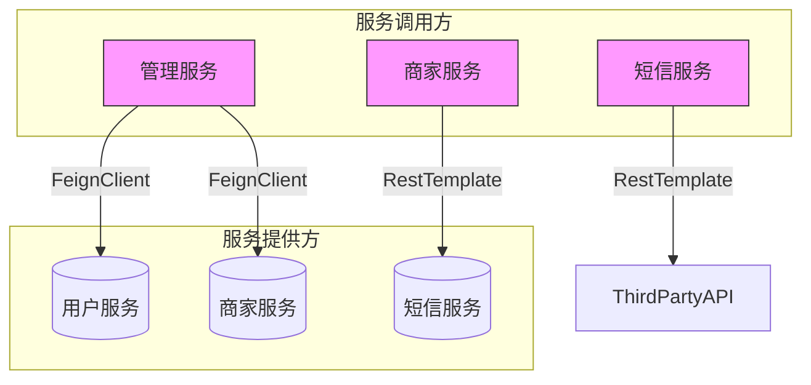
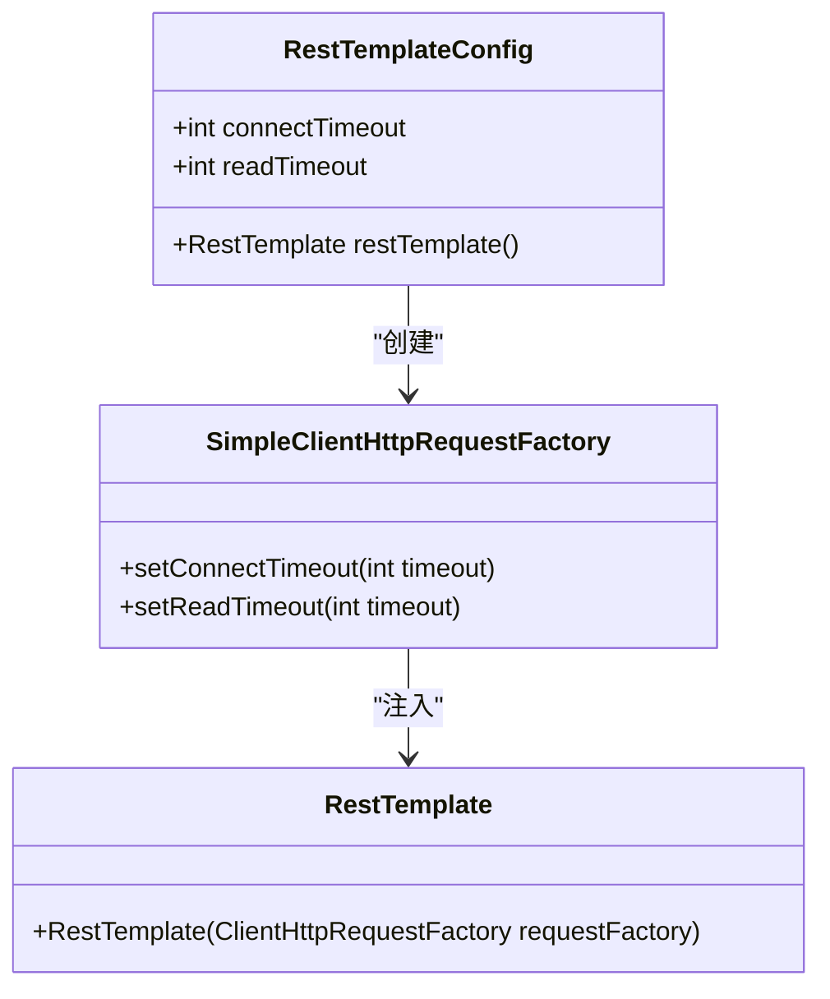
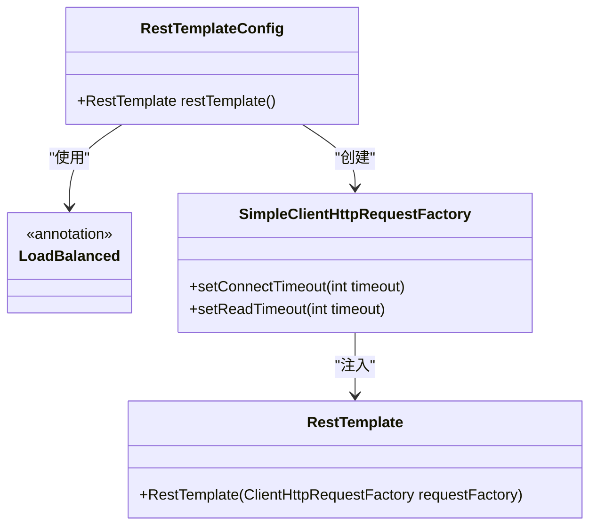
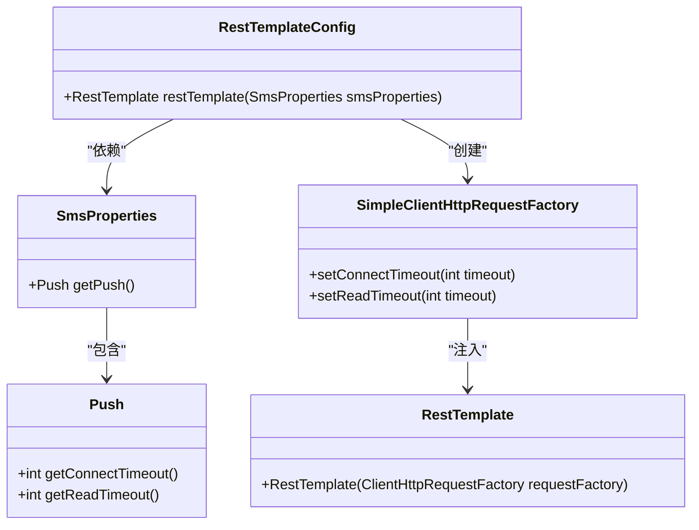
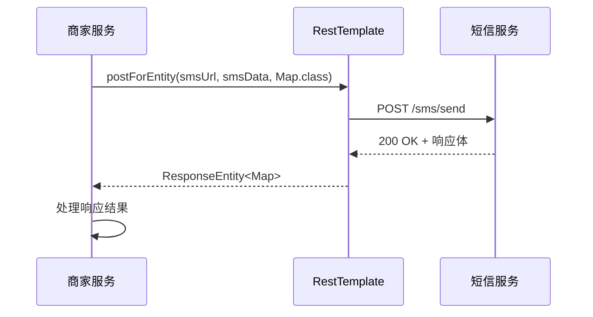
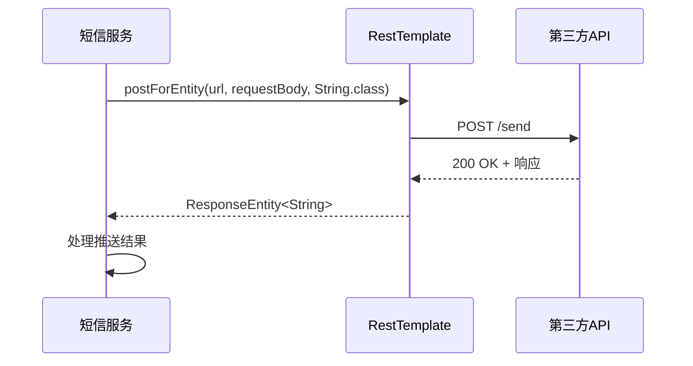
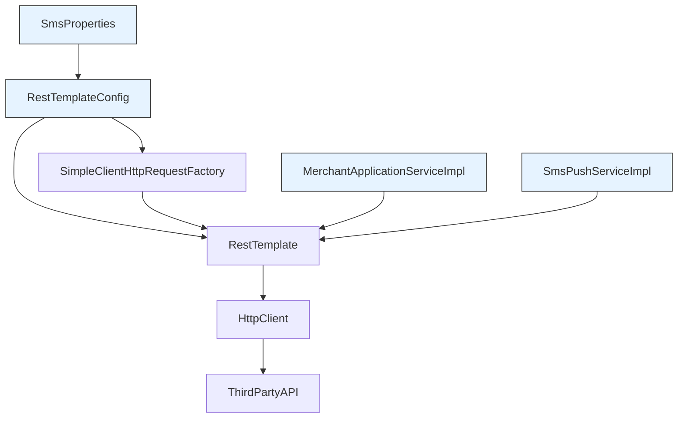

# RestTemplate调用

<cite>
**本文档引用文件**  
- [RestTemplateConfig.java](file://backend/admin-service/src/main/java/com/mall/admin/config/RestTemplateConfig.java)
- [RestTemplateConfig.java](file://backend/merchant-service/src/main/java/com/mall/merchant/config/RestTemplateConfig.java)
- [RestTemplateConfig.java](file://backend/sms-service/src/main/java/com/mall/sms/config/RestTemplateConfig.java)
- [SmsProperties.java](file://backend/sms-service/src/main/java/com/mall/sms/config/SmsProperties.java)
- [MerchantApplicationServiceImpl.java](file://backend/merchant-service/src/main/java/com/mall/merchant/service/impl/MerchantApplicationServiceImpl.java)
- [SmsPushServiceImpl.java](file://backend/sms-service/src/main/java/com/mall/sms/service/impl/SmsPushServiceImpl.java)
- [MerchantServiceClient.java](file://backend/admin-service/src/main/java/com/mall/admin/client/MerchantServiceClient.java)
- [UserServiceClient.java](file://backend/admin-service/src/main/java/com/mall/admin/client/UserServiceClient.java)
</cite>

## 目录
1. [介绍](#介绍)
2. [项目结构](#项目结构)
3. [核心组件](#核心组件)
4. [架构概述](#架构概述)
5. [详细组件分析](#详细组件分析)
6. [依赖分析](#依赖分析)
7. [性能考虑](#性能考虑)
8. [故障排除指南](#故障排除指南)
9. [结论](#结论)

## 介绍
本文档旨在全面介绍RestTemplate在本Spring Cloud微服务项目中的使用场景、配置方式及最佳实践。重点分析RestTemplateConfig中如何配置连接池、超时时间和消息转换器，说明在未使用Feign的场景下如何通过RestTemplate实现服务间HTTP通信。同时，对比RestTemplate与Feign的优缺点及适用场景，并提供包括异常处理、连接池参数调优和安全性配置在内的调用最佳实践。

## 项目结构
本项目为基于Spring Cloud的微服务架构，包含多个独立的服务模块。RestTemplate的配置和使用主要分布在以下几个服务中：
- **admin-service**: 管理后台服务，配置了基础的RestTemplate用于服务调用。
- **merchant-service**: 商家服务，配置了支持负载均衡的RestTemplate，用于调用短信服务。
- **sms-service**: 短信服务，配置了基于属性文件的RestTemplate，用于第三方API推送。

RestTemplate的配置类均位于各服务的`config`包下，命名为`RestTemplateConfig`。服务间的HTTP通信主要通过直接注入RestTemplate Bean并调用其方法实现。

**文档来源**
- [RestTemplateConfig.java](file://backend/admin-service/src/main/java/com/mall/admin/config/RestTemplateConfig.java)
- [RestTemplateConfig.java](file://backend/merchant-service/src/main/java/com/mall/merchant/config/RestTemplateConfig.java)
- [RestTemplateConfig.java](file://backend/sms-service/src/main/java/com/mall/sms/config/RestTemplateConfig.java)

## 核心组件
本项目中RestTemplate的核心组件包括：
1. **RestTemplateConfig**: 配置类，负责创建和配置RestTemplate Bean。
2. **SimpleClientHttpRequestFactory**: HTTP请求工厂，用于设置连接和读取超时。
3. **SmsProperties**: 属性配置类，为sms-service中的RestTemplate提供外部化配置。
4. **@LoadBalanced**: Spring Cloud提供的注解，用于启用RestTemplate的客户端负载均衡能力。

这些组件共同实现了服务间可靠、可配置的HTTP通信。

**文档来源**
- [RestTemplateConfig.java](file://backend/admin-service/src/main/java/com/mall/admin/config/RestTemplateConfig.java)
- [SmsProperties.java](file://backend/sms-service/src/main/java/com/mall/sms/config/SmsProperties.java)

## 架构概述
在本微服务架构中，RestTemplate作为服务间同步HTTP通信的核心工具，扮演着重要角色。其架构设计遵循Spring Boot和Spring Cloud的最佳实践，通过@Configuration类进行声明式配置，并利用Spring的依赖注入机制在服务中使用。

**图示来源**
- [MerchantServiceClient.java](file://backend/admin-service/src/main/java/com/mall/admin/client/MerchantServiceClient.java)
- [UserServiceClient.java](file://backend/admin-service/src/main/java/com/mall/admin/client/UserServiceClient.java)
- [MerchantApplicationServiceImpl.java](file://backend/merchant-service/src/main/java/com/mall/merchant/service/impl/MerchantApplicationServiceImpl.java)
- [SmsPushServiceImpl.java](file://backend/sms-service/src/main/java/com/mall/sms/service/impl/SmsPushServiceImpl.java)

## 详细组件分析

### RestTemplate配置分析
RestTemplate的配置在不同服务中有不同的实现方式，体现了灵活的配置策略。

#### admin-service中的RestTemplate配置
在admin-service中，RestTemplate通过`@Value`注解读取配置文件中的超时参数，实现了外部化配置。

**图示来源**
- [RestTemplateConfig.java](file://backend/admin-service/src/main/java/com/mall/admin/config/RestTemplateConfig.java#L15-L27)

#### merchant-service中的RestTemplate配置
merchant-service中的RestTemplate配置启用了客户端负载均衡功能，支持通过服务名进行调用。

**图示来源**
- [RestTemplateConfig.java](file://backend/merchant-service/src/main/java/com/mall/merchant/config/RestTemplateConfig.java#L16-L23)

#### sms-service中的RestTemplate配置
sms-service中的RestTemplate配置通过依赖注入SmsProperties对象，实现了更加结构化的配置管理。

**图示来源**
- [RestTemplateConfig.java](file://backend/sms-service/src/main/java/com/mall/sms/config/RestTemplateConfig.java#L12-L17)
- [SmsProperties.java](file://backend/sms-service/src/main/java/com/mall/sms/config/SmsProperties.java#L96-L121)

### 服务间通信实现
在未使用Feign的场景下，项目通过直接使用RestTemplate实现了服务间HTTP通信。

#### 商家服务调用短信服务
merchant-service在处理商家申请审批时，通过RestTemplate调用sms-service发送短信通知。

**图示来源**
- [MerchantApplicationServiceImpl.java](file://backend/merchant-service/src/main/java/com/mall/merchant/service/impl/MerchantApplicationServiceImpl.java#L307-L314)

#### 短信服务调用第三方API
sms-service在发送短信时，通过RestTemplate调用第三方推送API。

**图示来源**
- [SmsPushServiceImpl.java](file://backend/sms-service/src/main/java/com/mall/sms/service/impl/SmsPushServiceImpl.java#L31-L39)

## 依赖分析
RestTemplate的使用涉及多个层次的依赖关系，包括内部组件依赖和外部服务依赖。

**图示来源**
- [RestTemplateConfig.java](file://backend/admin-service/src/main/java/com/mall/admin/config/RestTemplateConfig.java)
- [SmsProperties.java](file://backend/sms-service/src/main/java/com/mall/sms/config/SmsProperties.java)
- [MerchantApplicationServiceImpl.java](file://backend/merchant-service/src/main/java/com/mall/merchant/service/impl/MerchantApplicationServiceImpl.java)
- [SmsPushServiceImpl.java](file://backend/sms-service/src/main/java/com/mall/sms/service/impl/SmsPushServiceImpl.java)

## 性能考虑
RestTemplate的性能配置主要集中在连接超时和读取超时的设置上，合理的配置可以有效避免服务雪崩。

- **连接超时(connectTimeout)**: 设置为5000毫秒，确保在服务不可达时能快速失败。
- **读取超时(readTimeout)**: 设置为30000毫秒，为复杂业务处理提供足够的时间。
- **连接池**: 本项目使用SimpleClientHttpRequestFactory，未配置连接池，生产环境建议使用HttpClient或OkHttp作为底层实现以支持连接池。

在高并发场景下，建议对RestTemplate进行如下优化：
1. 使用连接池管理HTTP连接，复用连接减少开销。
2. 配置合理的超时时间，避免线程长时间阻塞。
3. 结合Hystrix或Resilience4j实现熔断和降级。

## 故障排除指南
使用RestTemplate时可能遇到的常见问题及解决方案：

1. **连接超时**: 检查目标服务是否正常运行，网络是否通畅，超时配置是否合理。
2. **读取超时**: 检查目标服务处理逻辑是否过于复杂，响应时间是否过长。
3. **404错误**: 检查URL路径是否正确，服务是否已注册到注册中心。
4. **500错误**: 检查目标服务日志，确认内部异常原因。
5. **负载均衡失效**: 确保RestTemplate Bean上添加了@LoadBalanced注解，且服务名正确。

**文档来源**
- [RestTemplateConfig.java](file://backend/merchant-service/src/main/java/com/mall/merchant/config/RestTemplateConfig.java#L17)
- [MerchantApplicationServiceImpl.java](file://backend/merchant-service/src/main/java/com/mall/merchant/service/impl/MerchantApplicationServiceImpl.java#L307-L314)

## 结论
RestTemplate作为Spring生态中的经典HTTP客户端，在本项目中发挥了重要作用。通过合理的配置，实现了服务间的可靠通信。相比Feign，RestTemplate更加灵活，适合复杂的HTTP调用场景；而Feign则更加声明式，适合简单的服务间调用。在实际项目中，可以根据具体需求选择合适的工具，或结合使用两者以发挥各自优势。