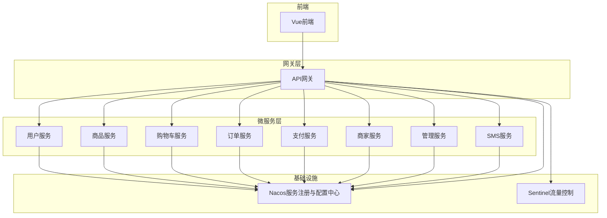
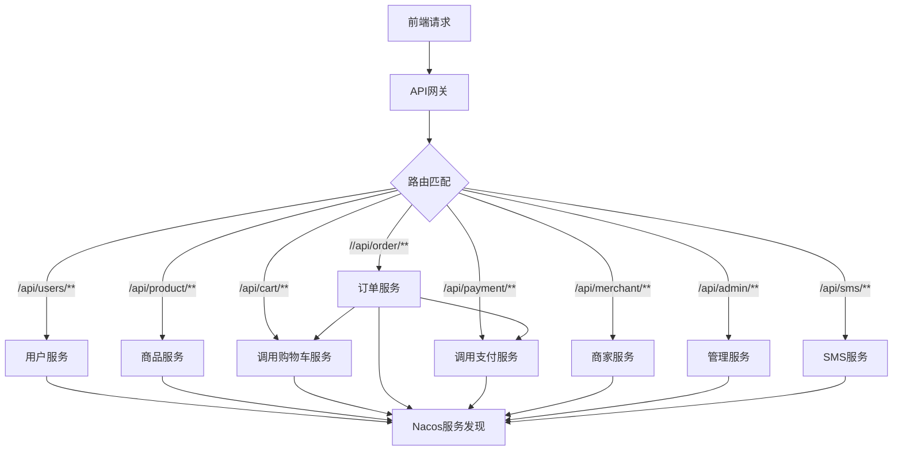
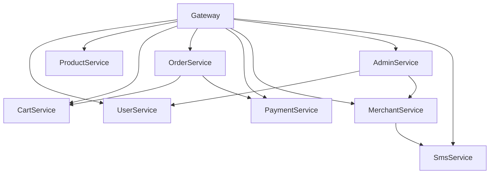

# 微服务通信

<cite>
**本文档引用文件**  
- [application.yml](file://backend/gateway-service/src/main/resources/application.yml)
- [CartClient.java](file://backend/order-service/src/main/java/com/mall/order/client/CartClient.java)
- [RestTemplateConfig.java](file://backend/admin-service/src/main/java/com/mall/admin/config/RestTemplateConfig.java)
- [RestTemplateConfig.java](file://backend/merchant-service/src/main/java/com/mall/merchant/config/RestTemplateConfig.java)
- [RestTemplateConfig.java](file://backend/sms-service/src/main/java/com/mall/sms/config/RestTemplateConfig.java)
</cite>

## 目录
1. [引言](#引言)
2. [项目结构](#项目结构)
3. [核心组件](#核心组件)
4. [架构概览](#架构概览)
5. [详细组件分析](#详细组件分析)
6. [依赖分析](#依赖分析)
7. [性能考虑](#性能考虑)
8. [故障排除指南](#故障排除指南)
9. [结论](#结论)

## 引言
本文档全面阐述了基于Spring Cloud的微服务架构中各服务间的通信机制与集成方式。重点解析API网关如何通过路由规则将前端请求转发至后端具体服务，介绍Feign客户端在服务间声明式REST调用的实现，以及RestTemplate在跨服务调用中的配置与作用。同时涵盖服务发现、负载均衡、安全认证和熔断降级等关键通信策略，为开发者提供服务集成的最佳实践指导。

## 项目结构
本项目采用典型的Spring Cloud微服务架构，包含多个独立部署的服务模块，通过API网关统一对外暴露接口，并利用Nacos实现服务注册与配置管理。各服务之间通过声明式客户端（Feign）或RestTemplate进行通信。



**图示来源**  
- [application.yml](file://backend/gateway-service/src/main/resources/application.yml#L1-L151)

**本节来源**  
- [application.yml](file://backend/gateway-service/src/main/resources/application.yml#L1-L151)

## 核心组件
系统核心通信组件包括Spring Cloud Gateway作为统一入口，Feign实现声明式服务调用，RestTemplate用于灵活的HTTP通信，Nacos提供服务发现与配置管理，Sentinel实现流量控制与熔断保护。

**本节来源**  
- [application.yml](file://backend/gateway-service/src/main/resources/application.yml#L1-L151)
- [CartClient.java](file://backend/order-service/src/main/java/com/mall/order/client/CartClient.java#L1-L61)

## 架构概览
整个系统采用分层微服务架构，前端请求首先到达API网关，网关根据预定义的路由规则将请求转发至对应的具体微服务。服务间通过Feign或RestTemplate进行内部通信，所有服务均注册到Nacos，实现服务发现与动态配置。



**图示来源**  
- [application.yml](file://backend/gateway-service/src/main/resources/application.yml#L23-L111)

**本节来源**  
- [application.yml](file://backend/gateway-service/src/main/resources/application.yml#L1-L151)

## 详细组件分析

### API网关路由机制分析
Spring Cloud Gateway作为系统的统一入口，承担着请求路由、路径重写、跨域处理等职责。其核心配置位于`gateway-service`的`application.yml`文件中。

#### 路由规则设计
网关通过`spring.cloud.gateway.routes`配置项定义了多个路由规则，每个规则包含ID、目标URI、断言（Predicates）和过滤器（Filters）：

- **服务发现**：使用`lb://service-name`格式，利用Ribbon实现客户端负载均衡
- **路径匹配**：通过`Path`断言实现基于路径前缀的路由匹配
- **前缀剥离**：通过`StripPrefix`过滤器去除路径前缀，实现路径重写

例如，`user-service`的路由配置如下：
```yaml
- id: user-service
  uri: lb://user-service
  predicates:
    - Path=/api/users/**
  filters:
    - StripPrefix=1
```
该配置表示将`/api/users/**`的请求转发至`user-service`，并去除第一级路径前缀，实际调用路径为`/users/**`。

#### 兼容性路由设计
为支持不同前端路径规范，系统设计了兼容性路由。例如商品服务同时支持`/api/product/**`和`/api/product-service/**`两种路径，均能正确路由至`product-service`。

**图示来源**  
- [application.yml](file://backend/gateway-service/src/main/resources/application.yml#L29-L60)

**本节来源**  
- [application.yml](file://backend/gateway-service/src/main/resources/application.yml#L29-L111)

### 声明式服务调用分析
系统采用Feign客户端实现服务间的声明式REST通信，以`order-service`调用`cart-service`为例。

#### Feign客户端实现
`CartClient`接口定义了对购物车服务的调用契约：

```java
@FeignClient(name = "cart-service", path = "/api/cart")
public interface CartClient {
    @GetMapping("/{userId}")
    Map<String, Object> getCart(@PathVariable("userId") Long userId);
    
    @GetMapping("/{userId}/items")
    List<Map<String, Object>> getCartItems(@PathVariable("userId") Long userId, 
                                          @RequestParam(value = "selected", defaultValue = "true") Boolean selected);
}
```

该接口通过`@FeignClient`注解声明目标服务名称和基础路径，方法上使用Spring MVC注解描述HTTP请求细节，实现了接口即契约的声明式调用。

#### 调用流程
当`order-service`需要获取用户购物车信息时，直接调用`CartClient`接口方法，Feign框架自动完成：
1. 从Nacos获取`cart-service`实例列表
2. 通过负载均衡选择目标实例
3. 构造HTTP请求并发送
4. 反序列化响应结果

**图示来源**  
- [CartClient.java](file://backend/order-service/src/main/java/com/mall/order/client/CartClient.java#L20-L61)

**本节来源**  
- [CartClient.java](file://backend/order-service/src/main/java/com/mall/order/client/CartClient.java#L1-L61)

### RestTemplate配置分析
除Feign外，系统也使用RestTemplate进行服务调用，不同服务对其进行了定制化配置。

#### 负载均衡配置
在`merchant-service`中，`RestTemplate`通过`@LoadBalanced`注解启用负载均衡能力：

```java
@Bean
@LoadBalanced
public RestTemplate restTemplate() {
    SimpleClientHttpRequestFactory factory = new SimpleClientHttpRequestFactory();
    factory.setConnectTimeout(5000);
    factory.setReadTimeout(30000);
    return new RestTemplate(factory);
}
```

启用该注解后，可直接使用服务名（如`http://sms-service`）作为请求地址，由Ribbon自动解析为具体实例地址。

#### 超时配置
多个服务中均对RestTemplate设置了连接和读取超时时间，防止因下游服务响应缓慢导致调用方线程阻塞。超时时间通常设置为：
- 连接超时：5000毫秒
- 读取超时：30000毫秒

部分服务（如`admin-service`）通过配置文件注入超时参数，提高配置灵活性。

**本节来源**  
- [RestTemplateConfig.java](file://backend/admin-service/src/main/java/com/mall/admin/config/RestTemplateConfig.java#L1-L29)
- [RestTemplateConfig.java](file://backend/merchant-service/src/main/java/com/mall/merchant/config/RestTemplateConfig.java#L1-L25)
- [RestTemplateConfig.java](file://backend/sms-service/src/main/java/com/mall/sms/config/RestTemplateConfig.java#L1-L18)

## 依赖分析
系统各服务通过API网关对外暴露，服务间依赖主要通过声明式客户端和RestTemplate实现。



**图示来源**  
- [application.yml](file://backend/gateway-service/src/main/resources/application.yml#L29-L111)
- [CartClient.java](file://backend/order-service/src/main/java/com/mall/order/client/CartClient.java#L20-L21)

**本节来源**  
- [application.yml](file://backend/gateway-service/src/main/resources/application.yml#L1-L151)
- [CartClient.java](file://backend/order-service/src/main/java/com/mall/order/client/CartClient.java#L1-L61)

## 性能考虑
系统在通信层面进行了多项性能优化：

1. **连接池配置**：虽未在当前代码中体现，但生产环境建议为RestTemplate配置HttpClient连接池
2. **超时控制**：合理设置连接和读取超时，避免资源长时间占用
3. **负载均衡**：通过Ribbon实现客户端负载均衡，提高系统整体吞吐量
4. **缓存机制**：结合Redis缓存频繁访问的数据，减少服务间调用
5. **异步调用**：对于非关键路径调用，可采用异步方式提高响应速度

## 故障排除指南
### 常见问题及解决方案
1. **服务无法发现**
   - 检查服务是否成功注册到Nacos
   - 确认`spring.application.name`配置正确
   - 验证网络连通性

2. **路由不生效**
   - 检查网关路由配置的路径匹配规则
   - 确认`StripPrefix`过滤器配置正确
   - 查看网关日志中的路由匹配信息

3. **Feign调用失败**
   - 确认目标服务名称与注册中心一致
   - 检查接口定义的路径和参数是否匹配
   - 查看是否有超时或熔断触发

4. **负载均衡不工作**
   - 确保`RestTemplate`添加了`@LoadBalanced`注解
   - 验证服务实例在Nacos中为健康状态

**本节来源**  
- [application.yml](file://backend/gateway-service/src/main/resources/application.yml#L1-L151)
- [CartClient.java](file://backend/order-service/src/main/java/com/mall/order/client/CartClient.java#L1-L61)

## 结论
本系统通过Spring Cloud Gateway实现了统一的API入口和灵活的路由策略，结合Feign声明式客户端和RestTemplate提供了多样化的服务间通信方式。通过Nacos实现服务发现与配置管理，保障了系统的可扩展性和可维护性。建议在实际部署中进一步完善熔断降级、链路追踪等机制，提升系统整体稳定性。