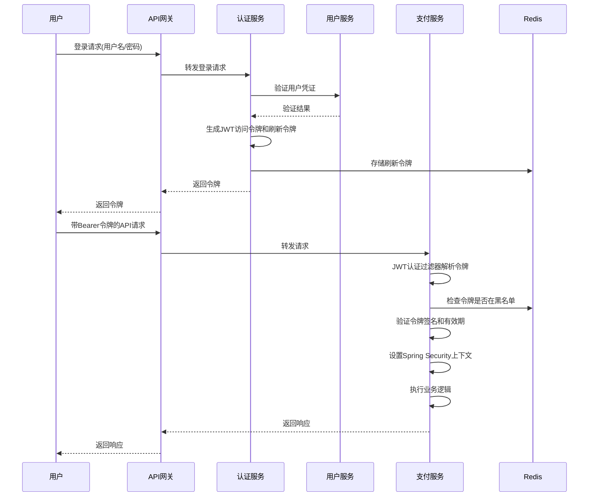
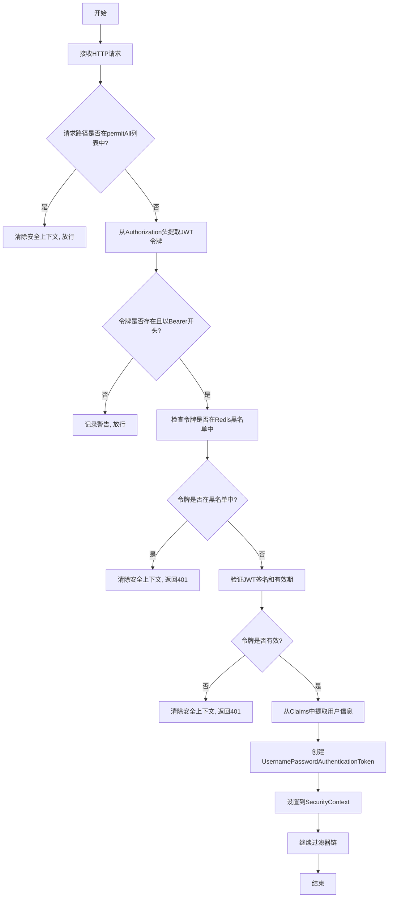
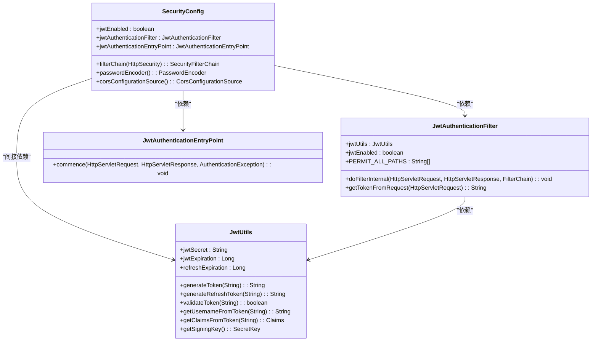
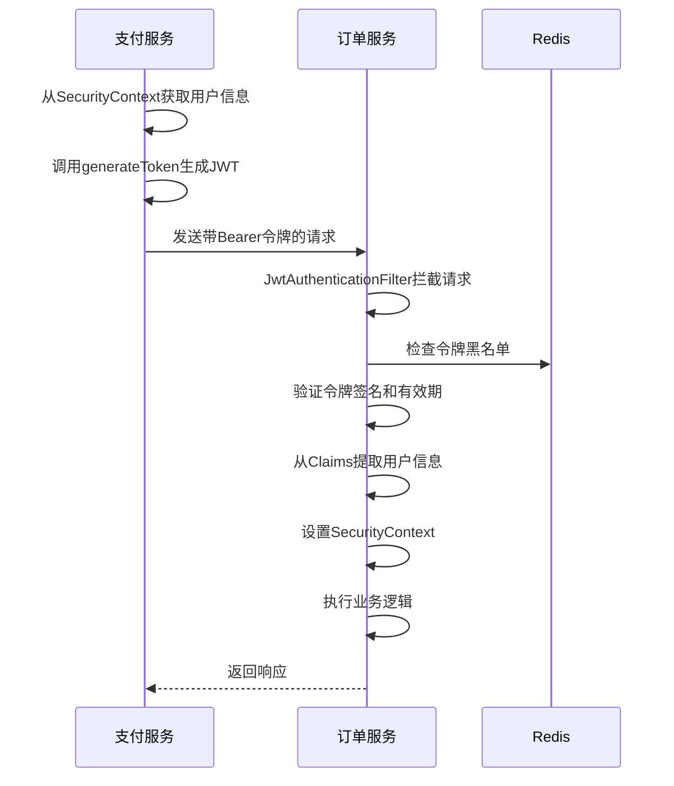

# 服务间安全认证

<cite>
**本文档引用文件**   
- [SecurityConfig.java](file://backend/user-service/src/main/java/com/mall/user/config/SecurityConfig.java)
- [SecurityConfig.java](file://backend/auth-service/src/main/java/com/mall/auth/config/SecurityConfig.java)
- [SecurityConfig.java](file://backend/payment-service/src/main/java/com/mall/payment/config/SecurityConfig.java)
- [JwtAuthenticationFilter.java](file://backend/user-service/src/main/java/com/mall/user/security/JwtAuthenticationFilter.java)
- [JwtAuthenticationFilter.java](file://backend/cart-service/src/main/java/com/mall/cart/security/JwtAuthenticationFilter.java)
- [JwtAuthenticationFilter.java](file://backend/payment-service/src/main/java/com/mall/payment/config/JwtAuthenticationFilter.java)
- [JwtUtils.java](file://backend/user-service/src/main/java/com/mall/user/utils/JwtUtils.java)
- [JwtUtils.java](file://backend/auth-service/src/main/java/com/mall/auth/utils/JwtUtils.java)
- [JwtAuthenticationEntryPoint.java](file://backend/user-service/src/main/java/com/mall/user/security/JwtAuthenticationEntryPoint.java)
- [JwtAuthenticationEntryPoint.java](file://backend/cart-service/src/main/java/com/mall/cart/security/JwtAuthenticationEntryPoint.java)
</cite>

## 目录
1. [引言](#引言)
2. [微服务间通信安全认证机制](#微服务间通信安全认证机制)
3. [JWT令牌在服务调用中的传递与验证](#jwt令牌在服务调用中的传递与验证)
4. [SecurityConfig中的认证过滤器链配置分析](#securityconfig中的认证过滤器链配置分析)
5. [服务间调用的令牌携带与验证流程](#服务间调用的令牌携带与验证流程)
6. [安全配置常见漏洞与加固建议](#安全配置常见漏洞与加固建议)
7. [总结](#总结)

## 引言
在微服务架构中，服务间的通信安全至关重要。本项目采用JWT（JSON Web Token）作为身份认证的核心机制，通过Spring Security框架实现细粒度的权限控制。JWT令牌在用户登录后生成，携带用户身份信息，在后续的服务调用中进行传递和验证，确保只有经过认证和授权的请求才能访问受保护的资源。本项目支持通过配置灵活控制JWT认证的启用与禁用，以适应开发和生产环境的不同需求。

## 微服务间通信安全认证机制
本项目通过JWT令牌实现微服务间的无状态安全认证。当用户成功登录后，认证服务（auth-service）会生成包含用户身份信息的JWT访问令牌和刷新令牌。访问令牌有效期较短（15分钟），用于API请求的认证；刷新令牌有效期较长（7天），存储在Redis中，用于获取新的访问令牌。用户登出时，令牌会被加入Redis黑名单，实现主动失效。整个会话管理采用无状态模式，所有会话信息存储在Redis中，支持单点登出。



**图示来源**
- [SecurityConfig.java](file://backend/auth-service/src/main/java/com/mall/auth/config/SecurityConfig.java#L28-L106)
- [JwtUtils.java](file://backend/auth-service/src/main/java/com/mall/auth/utils/JwtUtils.java#L25-L189)
- [JwtAuthenticationFilter.java](file://backend/payment-service/src/main/java/com/mall/payment/config/JwtAuthenticationFilter.java#L36-L265)

## JWT令牌在服务调用中的传递与验证
JWT令牌在服务调用中通过HTTP请求头的`Authorization`字段进行传递，格式为`Bearer <token>`。各微服务通过自定义的`JwtAuthenticationFilter`过滤器拦截请求，从请求头中提取令牌并进行验证。验证过程包括检查令牌是否为空、是否以`Bearer`开头、是否在黑名单中、签名是否有效以及是否过期。验证通过后，从令牌的Claims中提取用户身份信息（如用户ID、用户名、角色等），并将其设置到Spring Security的`SecurityContext`中，供后续的权限校验使用。



**图示来源**
- [JwtAuthenticationFilter.java](file://backend/user-service/src/main/java/com/mall/user/security/JwtAuthenticationFilter.java#L24-L135)
- [JwtAuthenticationFilter.java](file://backend/cart-service/src/main/java/com/mall/cart/security/JwtAuthenticationFilter.java#L22-L130)
- [JwtAuthenticationFilter.java](file://backend/payment-service/src/main/java/com/mall/payment/config/JwtAuthenticationFilter.java#L36-L265)

## SecurityConfig中的认证过滤器链配置分析
`SecurityConfig`类是Spring Security的核心配置，定义了安全过滤器链。配置主要包括禁用CSRF保护、配置CORS策略、设置无状态会话管理（`SessionCreationPolicy.STATELESS`）、配置异常处理入口点（`JwtAuthenticationEntryPoint`）以及添加JWT认证过滤器（`JwtAuthenticationFilter`）。URL访问权限通过`authorizeHttpRequests`方法进行配置，将特定路径（如登录、注册、健康检查等）设置为`permitAll`，其他路径则需要认证。此外，还配置了`PasswordEncoder`用于密码加密。



**图示来源**
- [SecurityConfig.java](file://backend/user-service/src/main/java/com/mall/user/config/SecurityConfig.java#L33-L158)
- [JwtAuthenticationFilter.java](file://backend/user-service/src/main/java/com/mall/user/security/JwtAuthenticationFilter.java#L24-L135)
- [JwtAuthenticationEntryPoint.java](file://backend/user-service/src/main/java/com/mall/user/security/JwtAuthenticationEntryPoint.java#L14-L31)
- [JwtUtils.java](file://backend/user-service/src/main/java/com/mall/user/utils/JwtUtils.java#L12-L173)

## 服务间调用的令牌携带与验证流程
服务间调用时，调用方需要从当前请求的`SecurityContext`中获取用户身份信息，并生成一个新的JWT令牌，然后将其放入下游服务的请求头中。例如，支付服务在调用订单服务时，会使用`JwtAuthenticationFilter`中的`generateToken`方法生成一个包含当前用户ID和角色的令牌，并通过`RestTemplate`或`WebClient`将其作为`Authorization`头发送。下游服务接收到请求后，会通过其`JwtAuthenticationFilter`验证令牌的有效性，并将用户信息重新设置到自己的`SecurityContext`中，从而实现用户身份的跨服务传递。

**服务间调用示例**
```java
// 支付服务调用订单服务
String token = jwtAuthenticationFilter.generateToken(userId, roles);
HttpHeaders headers = new HttpHeaders();
headers.set("Authorization", "Bearer " + token);
HttpEntity<String> entity = new HttpEntity<>(headers);
restTemplate.exchange("http://order-service/api/orders", HttpMethod.GET, entity, String.class);
```

**服务间调用流程**


**图示来源**
- [JwtAuthenticationFilter.java](file://backend/payment-service/src/main/java/com/mall/payment/config/JwtAuthenticationFilter.java#L36-L265)
- [SecurityConfig.java](file://backend/payment-service/src/main/java/com/mall/payment/config/SecurityConfig.java#L26-L158)

## 安全配置常见漏洞与加固建议
尽管JWT提供了强大的安全机制，但在实际应用中仍存在一些潜在的安全风险。以下是常见的漏洞及相应的加固建议：

### 令牌泄露
**风险**：JWT令牌一旦泄露，攻击者可以在有效期内冒充用户身份。
**加固建议**：
- 缩短访问令牌的有效期（如15分钟），并使用刷新令牌机制。
- 在用户登出或修改密码时，将令牌加入Redis黑名单。
- 使用HTTPS加密传输，防止令牌在传输过程中被窃取。
- 避免在日志、URL或客户端存储中明文记录令牌。

### 权限绕过
**风险**：攻击者可能通过修改JWT的Claims（如角色、用户ID）来提升权限。
**加固建议**：
- 使用强密钥（HS512）对JWT进行签名，并妥善保管密钥，避免硬编码在代码中。
- 在服务端严格验证JWT的签名，确保令牌未被篡改。
- 实现细粒度的权限控制，结合`@PreAuthorize`等注解进行方法级别的权限校验。
- 对于关键操作（如支付、删除），进行二次验证（如短信验证码）。

### 其他安全建议
- **禁用CSRF**：对于纯API服务，应禁用CSRF保护，避免不必要的复杂性。
- **配置CORS**：明确指定允许的源、方法和头，避免使用通配符`*`。
- **异常处理**：自定义`AuthenticationEntryPoint`和`AccessDeniedHandler`，返回统一的错误格式，避免泄露敏感信息。
- **日志记录**：记录认证失败的日志，便于安全审计和监控。

## 总结
本项目通过JWT令牌和Spring Security实现了微服务间的安全认证。`SecurityConfig`配置了无状态的认证过滤器链，`JwtAuthenticationFilter`负责令牌的解析和验证，`JwtAuthenticationEntryPoint`处理认证失败的响应。该机制确保了服务间调用的安全性，防止了未授权访问。通过合理的令牌策略、黑名单机制和细粒度的权限控制，有效防范了令牌泄露和权限绕过等安全风险。未来可进一步引入OAuth2.0或OpenID Connect等更标准的认证协议，提升系统的安全性和可扩展性。