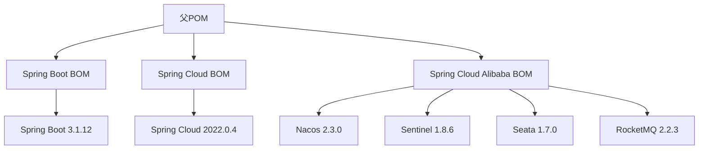

# 项目结构

<cite>
**Referenced Files in This Document**   
- [pom.xml](file://backend/pom.xml)
- [common-bom/pom.xml](file://backend/common-bom/pom.xml)
- [user-service/pom.xml](file://backend/user-service/pom.xml)
- [product-service/pom.xml](file://backend/product-service/pom.xml)
- [common-core/pom.xml](file://backend/common-core/pom.xml)
</cite>

## 目录
1. [项目结构](#项目结构)
2. [Maven多模块架构设计](#maven多模块架构设计)
3. [核心依赖版本管理机制](#核心依赖版本管理机制)
4. [微服务模块声明](#微服务模块声明)
5. [common-bom模块的依赖管理](#common-bom模块的依赖管理)
6. [模块继承关系与构建流程](#模块继承关系与构建流程)

## Maven多模块架构设计

本项目采用Maven多模块架构设计，以实现微服务系统的模块化和可维护性。整个项目结构清晰地划分为多个独立的模块，每个模块都有其特定的职责和功能。这种设计不仅有助于团队协作开发，还能够提高代码的复用性和系统的可扩展性。

在Maven多模块架构中，父POM文件（`pom.xml`）位于项目的根目录下，负责定义所有子模块的公共配置和依赖管理。通过这种方式，可以确保所有子模块使用一致的依赖版本，避免因版本不一致导致的问题。此外，父POM还定义了项目的整体构建流程，包括编译、测试、打包等步骤。

**Section sources**
- [pom.xml](file://backend/pom.xml#L1-L200)

## 核心依赖版本管理机制

在父POM文件中，通过`<properties>`标签定义了一系列核心依赖的版本号，这些版本号被用于管理Spring Boot、Spring Cloud Alibaba、Nacos、Sentinel、Seata、RocketMQ等关键组件的版本。例如，`<spring-boot.version>3.1.12</spring-boot.version>`定义了Spring Boot的版本为3.1.12，而`<nacos.version>2.3.0</nacos.version>`则指定了Nacos的版本为2.3.0。这样的版本管理机制使得项目中的所有模块都能够使用统一的依赖版本，从而减少了版本冲突的可能性。

此外，父POM中还通过`<dependencyManagement>`标签导入了多个BOM（Bill of Materials）文件，如`spring-boot-dependencies`、`spring-cloud-dependencies`和`spring-cloud-alibaba-dependencies`。这些BOM文件进一步细化了各个依赖项的具体版本，确保了整个项目中依赖的一致性。



**Diagram sources**
- [pom.xml](file://backend/pom.xml#L20-L30)

**Section sources**
- [pom.xml](file://backend/pom.xml#L15-L41)

## 微服务模块声明

在父POM文件中，通过`<modules>`标签声明了所有子模块，包括`common-bom`、`common-core`、`gateway-service`以及各个业务服务模块，如`user-service`、`product-service`等。每个子模块都是一个独立的Maven项目，拥有自己的`pom.xml`文件，用于定义该模块特有的依赖和配置。

例如，`user-service`模块在其`pom.xml`文件中声明了对`spring-boot-starter-web`、`spring-cloud-starter-alibaba-nacos-discovery`等依赖的引用，同时继承了父POM中定义的版本管理规则。这样，即使在不同的子模块中引入相同的依赖，也能保证它们使用相同的版本，从而避免了版本冲突。

**Section sources**
- [pom.xml](file://backend/pom.xml#L43-L59)
- [user-service/pom.xml](file://backend/user-service/pom.xml#L1-L127)
- [product-service/pom.xml](file://backend/product-service/pom.xml#L1-L161)

## common-bom模块的依赖管理

`common-bom`模块是一个专门用于管理内部公共模块版本的BOM模块。它通过`<dependencyManagement>`标签定义了`common-core`、`common-security`、`common-redis`和`common-web`等内部模块的版本。这些版本号通常与项目的整体版本保持一致，即使用`${project.version}`变量来动态获取。

通过将这些内部模块的版本管理集中到`common-bom`模块中，其他业务模块只需在自己的`pom.xml`文件中引入`common-bom`作为依赖管理，即可自动获得这些内部模块的最新版本。这种方式不仅简化了版本管理，还提高了项目的可维护性。

```mermaid
graph TD
A[common-bom] --> B[common-core]
A --> C[common-security]
A --> D[common-redis]
A --> E[common-web]
B --> F[版本: ${project.version}]
C --> G[版本: ${project.version}]
D --> H[版本: ${project.version}]
E --> I[版本: ${project.version}]
```

**Diagram sources**
- [common-bom/pom.xml](file://backend/common-bom/pom.xml#L20-L44)

**Section sources**
- [common-bom/pom.xml](file://backend/common-bom/pom.xml#L1-L45)

## 模块继承关系与构建流程

在Maven多模块架构中，子模块通过`<parent>`标签继承父POM的配置。例如，`user-service`模块在其`pom.xml`文件中声明了对`mall-parent`的继承，这意味着它会自动继承父POM中定义的所有属性和依赖管理规则。这种继承机制使得子模块可以专注于自身的业务逻辑，而无需关心底层的技术细节。

构建流程方面，Maven会首先解析父POM文件，然后依次处理每个子模块。在构建过程中，Maven会根据`<dependencyManagement>`中的定义，确保所有依赖项的版本一致性。此外，通过`<pluginManagement>`标签，父POM还可以统一管理插件的版本和配置，确保整个项目使用相同的构建工具。

**Section sources**
- [pom.xml](file://backend/pom.xml#L8-L13)
- [user-service/pom.xml](file://backend/user-service/pom.xml#L8-L13)
- [product-service/pom.xml](file://backend/product-service/pom.xml#L8-L13)
- [common-core/pom.xml](file://backend/common-core/pom.xml#L8-L13)