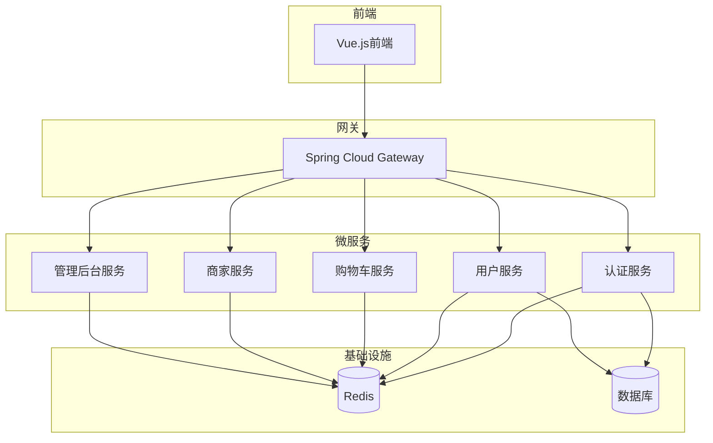
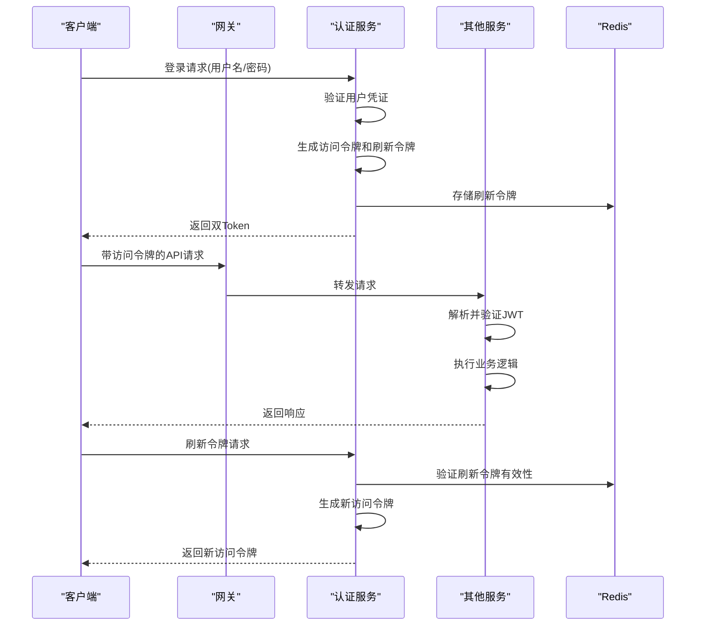
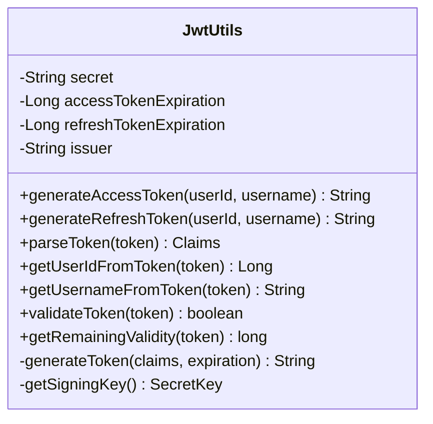
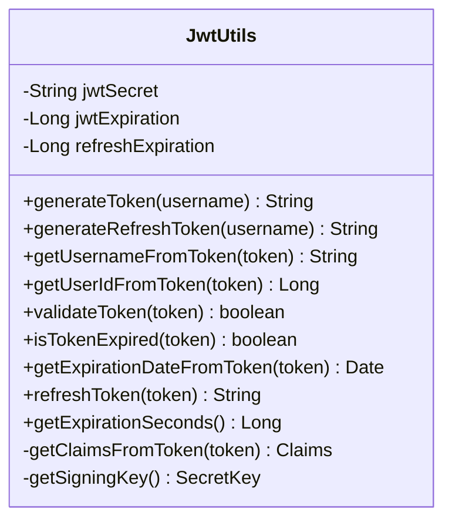
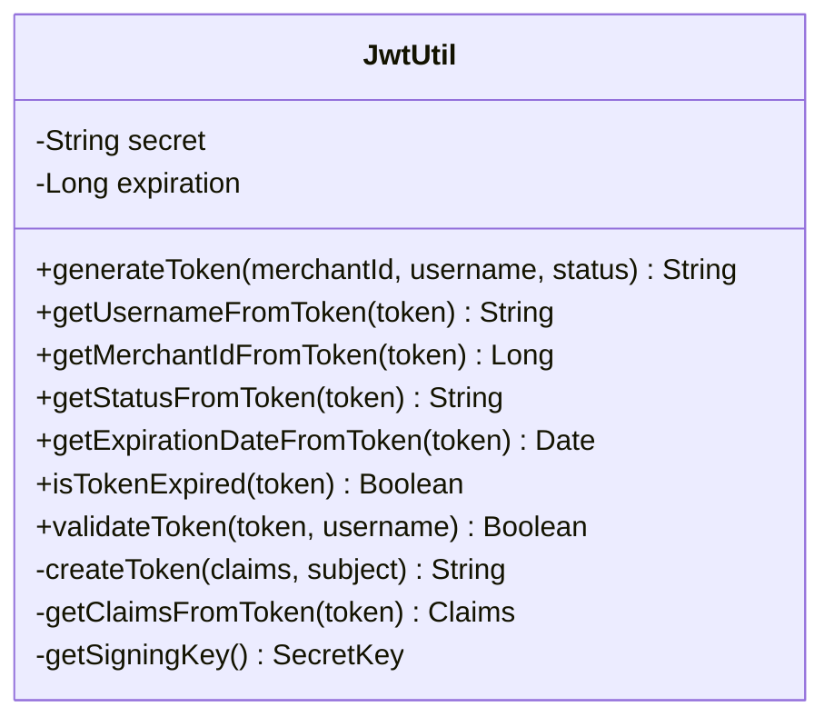
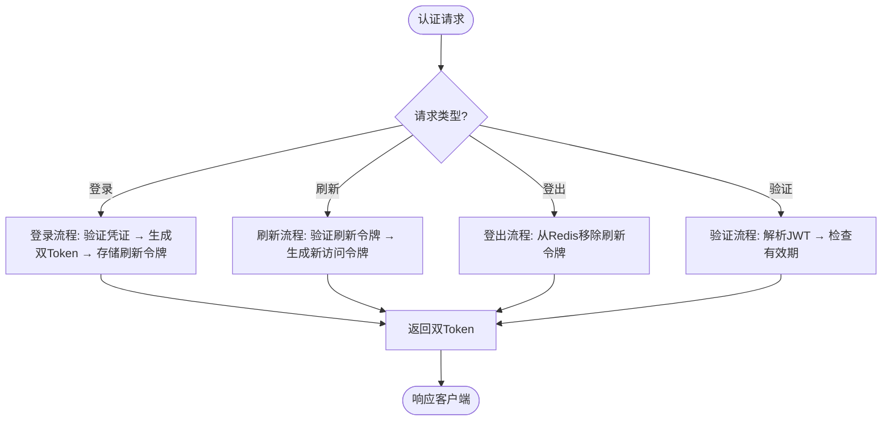
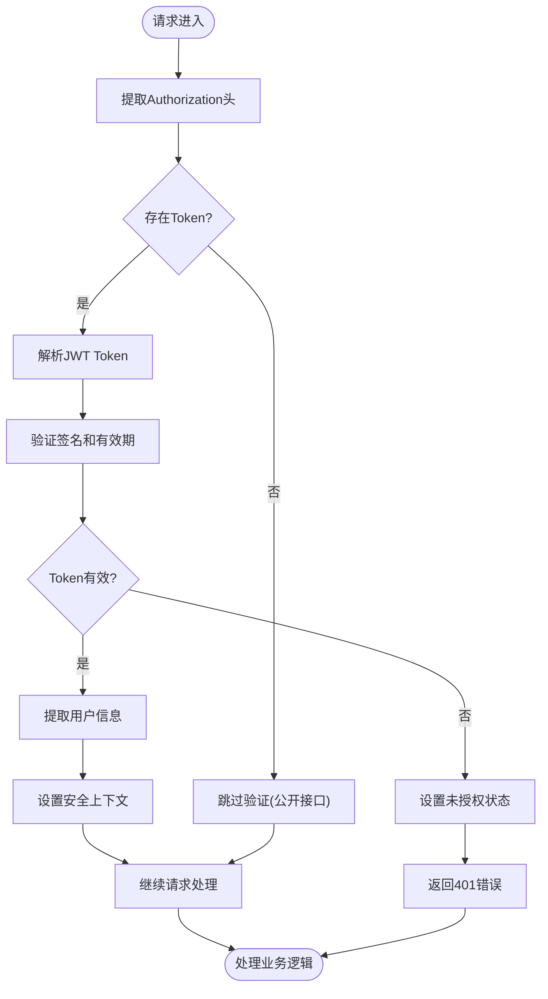

# JWT认证机制

<cite>
**本文档引用文件**  
- [JwtUtils.java](file://backend/auth-service/src/main/java/com/mall/auth/utils/JwtUtils.java)
- [JwtUtils.java](file://backend/cart-service/src/main/java/com/mall/cart/utils/JwtUtils.java)
- [JwtUtils.java](file://backend/user-service/src/main/java/com/mall/user/utils/JwtUtils.java)
- [JwtUtil.java](file://backend/admin-service/src/main/java/com/mall/admin/util/JwtUtil.java)
- [JwtUtil.java](file://backend/merchant-service/src/main/java/com/mall/merchant/util/JwtUtil.java)
- [AuthController.java](file://backend/admin-service/src/main/java/com/mall/admin/controller/AuthController.java)
- [AuthController.java](file://backend/auth-service/src/main/java/com/mall/auth/controller/AuthController.java)
- [AuthController.java](file://backend/user-service/src/main/java/com/mall/user/controller/AuthController.java)
- [JwtAuthenticationFilter.java](file://backend/cart-service/src/main/java/com/mall/cart/security/JwtAuthenticationFilter.java)
- [JwtAuthenticationFilter.java](file://backend/user-service/src/main/java/com/mall/user/security/JwtAuthenticationFilter.java)
</cite>

## 目录
1. [简介](#简介)
2. [项目结构](#项目结构)
3. [核心组件](#核心组件)
4. [架构概述](#架构概述)
5. [详细组件分析](#详细组件分析)
6. [依赖分析](#依赖分析)
7. [性能考虑](#性能考虑)
8. [故障排除指南](#故障排除指南)
9. [结论](#结论)

## 简介
本项目实现了一个基于JWT的无状态认证机制，支持多服务间的统一身份验证。系统采用双Token设计（访问令牌与刷新令牌），通过Redis实现Token吊销和会话管理，并在多个微服务中实现了兼容的JWT工具类。该机制确保了系统的安全性、可扩展性和高可用性。

## 项目结构
项目采用Spring Cloud微服务架构，包含多个独立的服务模块，每个服务都实现了JWT认证功能。主要服务包括认证服务、用户服务、购物车服务、商家服务和管理后台服务。



**图示来源**  
- [backend/auth-service](file://backend/auth-service)
- [backend/user-service](file://backend/user-service)
- [backend/cart-service](file://backend/cart-service)
- [backend/merchant-service](file://backend/merchant-service)
- [backend/admin-service](file://backend/admin-service)

**本节来源**  
- [backend](file://backend)

## 核心组件
系统的核心组件包括JWT工具类、认证控制器、JWT认证过滤器以及Redis集成。这些组件共同实现了安全可靠的无状态认证机制，支持Token的生成、解析、验证和刷新功能。

**本节来源**  
- [backend/auth-service/src/main/java/com/mall/auth/utils/JwtUtils.java](file://backend/auth-service/src/main/java/com/mall/auth/utils/JwtUtils.java)
- [backend/user-service/src/main/java/com/mall/user/security/JwtAuthenticationFilter.java](file://backend/user-service/src/main/java/com/mall/user/security/JwtAuthenticationFilter.java)
- [backend/auth-service/src/main/java/com/mall/auth/controller/AuthController.java](file://backend/auth-service/src/main/java/com/mall/auth/controller/AuthController.java)

## 架构概述
系统采用集中式认证服务与分布式验证相结合的架构模式。认证服务负责Token的生成和管理，其他服务通过JWT工具类验证Token的有效性。



**图示来源**  
- [backend/auth-service/src/main/java/com/mall/auth/controller/AuthController.java](file://backend/auth-service/src/main/java/com/mall/auth/controller/AuthController.java)
- [backend/auth-service/src/main/java/com/mall/auth/utils/JwtUtils.java](file://backend/auth-service/src/main/java/com/mall/auth/utils/JwtUtils.java)
- [backend/user-service/src/main/java/com/mall/user/security/JwtAuthenticationFilter.java](file://backend/user-service/src/main/java/com/mall/user/security/JwtAuthenticationFilter.java)

## 详细组件分析

### JWT工具类分析
系统在不同服务中实现了多个JWT工具类，虽然实现细节略有差异，但都提供了Token生成、解析和验证的核心功能。

#### 认证服务中的JwtUtils


**图示来源**  
- [backend/auth-service/src/main/java/com/mall/auth/utils/JwtUtils.java](file://backend/auth-service/src/main/java/com/mall/auth/utils/JwtUtils.java)

#### 用户服务中的JwtUtils


**图示来源**  
- [backend/user-service/src/main/java/com/mall/user/utils/JwtUtils.java](file://backend/user-service/src/main/java/com/mall/user/utils/JwtUtils.java)

#### 商家服务中的JwtUtil


**图示来源**  
- [backend/merchant-service/src/main/java/com/mall/merchant/util/JwtUtil.java](file://backend/merchant-service/src/main/java/com/mall/merchant/util/JwtUtil.java)

**本节来源**  
- [backend/auth-service/src/main/java/com/mall/auth/utils/JwtUtils.java](file://backend/auth-service/src/main/java/com/mall/auth/utils/JwtUtils.java)
- [backend/user-service/src/main/java/com/mall/user/utils/JwtUtils.java](file://backend/user-service/src/main/java/com/mall/user/utils/JwtUtils.java)
- [backend/merchant-service/src/main/java/com/mall/merchant/util/JwtUtil.java](file://backend/merchant-service/src/main/java/com/mall/merchant/util/JwtUtil.java)

### 认证流程分析
系统实现了完整的认证流程，包括登录、登出、Token刷新和验证等功能。

#### 认证控制器流程


**图示来源**  
- [backend/auth-service/src/main/java/com/mall/auth/controller/AuthController.java](file://backend/auth-service/src/main/java/com/mall/auth/controller/AuthController.java)

**本节来源**  
- [backend/auth-service/src/main/java/com/mall/auth/controller/AuthController.java](file://backend/auth-service/src/main/java/com/mall/auth/controller/AuthController.java)

### 安全过滤器分析
JWT认证过滤器负责在每个请求中验证Token的有效性，确保只有合法用户才能访问受保护的资源。

#### JWT认证过滤器流程


**图示来源**  
- [backend/user-service/src/main/java/com/mall/user/security/JwtAuthenticationFilter.java](file://backend/user-service/src/main/java/com/mall/user/security/JwtAuthenticationFilter.java)
- [backend/cart-service/src/main/java/com/mall/cart/security/JwtAuthenticationFilter.java](file://backend/cart-service/src/main/java/com/mall/cart/security/JwtAuthenticationFilter.java)

**本节来源**  
- [backend/user-service/src/main/java/com/mall/user/security/JwtAuthenticationFilter.java](file://backend/user-service/src/main/java/com/mall/user/security/JwtAuthenticationFilter.java)
- [backend/cart-service/src/main/java/com/mall/cart/security/JwtAuthenticationFilter.java](file://backend/cart-service/src/main/java/com/mall/cart/security/JwtAuthenticationFilter.java)

## 依赖分析
系统各组件之间的依赖关系清晰，遵循了高内聚低耦合的设计原则。

```mermaid
graph TD
AuthController --> JwtUtils
JwtAuthenticationFilter --> JwtUtils
AuthService --> JwtUtils
UserService --> JwtUtils
MerchantService --> JwtUtil
AdminService --> JwtUtil
JwtUtils --> Redis
JwtUtils --> "JWT库"
AuthService --> UserService
AuthService --> MerchantService
AuthService --> AdminService
style AuthController fill:#f9f,stroke:#333
style JwtUtils fill:#bbf,stroke:#333
style JwtAuthenticationFilter fill:#f96,stroke:#333
```

**图示来源**  
- [backend/auth-service/src/main/java/com/mall/auth/controller/AuthController.java](file://backend/auth-service/src/main/java/com/mall/auth/controller/AuthController.java)
- [backend/auth-service/src/main/java/com/mall/auth/utils/JwtUtils.java](file://backend/auth-service/src/main/java/com/mall/auth/utils/JwtUtils.java)
- [backend/user-service/src/main/java/com/mall/user/security/JwtAuthenticationFilter.java](file://backend/user-service/src/main/java/com/mall/user/security/JwtAuthenticationFilter.java)

**本节来源**  
- [backend/auth-service](file://backend/auth-service)
- [backend/user-service](file://backend/user-service)
- [backend/cart-service](file://backend/cart-service)
- [backend/merchant-service](file://backend/merchant-service)
- [backend/admin-service](file://backend/admin-service)

## 性能考虑
系统在设计时充分考虑了性能因素，通过合理的Token有效期设置、高效的JWT解析算法和Redis缓存优化来保证系统的高性能。

- 访问令牌有效期通常设置为较短时间（如2小时），以提高安全性
- 刷新令牌有效期较长（如7天），减少用户频繁登录
- 使用HS512或HS256签名算法，在安全性和性能之间取得平衡
- Redis用于存储刷新令牌和吊销列表，提供快速的Token状态查询
- JWT的无状态特性减少了数据库查询，提高了API响应速度

## 故障排除指南
当遇到JWT认证相关问题时，可以按照以下步骤进行排查：

1. **Token生成失败**：检查密钥配置是否正确，确保密钥长度符合算法要求
2. **Token验证失败**：确认Token格式是否正确（Bearer前缀），检查系统时间是否同步
3. **刷新Token失效**：验证Redis连接是否正常，检查刷新令牌是否已被使用或过期
4. **跨服务认证问题**：确保所有服务使用相同的JWT密钥和配置
5. **性能瓶颈**：监控JWT解析耗时，考虑增加缓存或优化算法

**本节来源**  
- [backend/auth-service/src/main/java/com/mall/auth/utils/JwtUtils.java](file://backend/auth-service/src/main/java/com/mall/auth/utils/JwtUtils.java)
- [backend/user-service/src/main/java/com/mall/user/security/JwtAuthenticationFilter.java](file://backend/user-service/src/main/java/com/mall/user/security/JwtAuthenticationFilter.java)
- [backend/auth-service/src/main/java/com/mall/auth/controller/AuthController.java](file://backend/auth-service/src/main/java/com/mall/auth/controller/AuthController.java)

## 结论
本JWT认证机制设计合理，实现了安全、高效、可扩展的无状态认证方案。通过双Token设计和Redis集成，既保证了系统的安全性，又提供了良好的用户体验。各服务中的JWT工具类虽然实现略有差异，但都遵循了统一的设计原则，确保了系统的整体一致性。