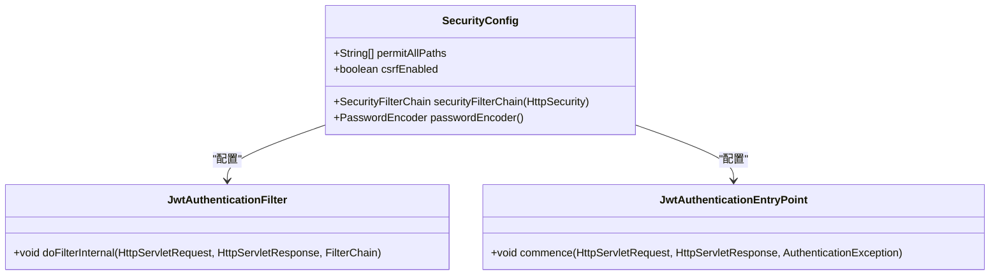
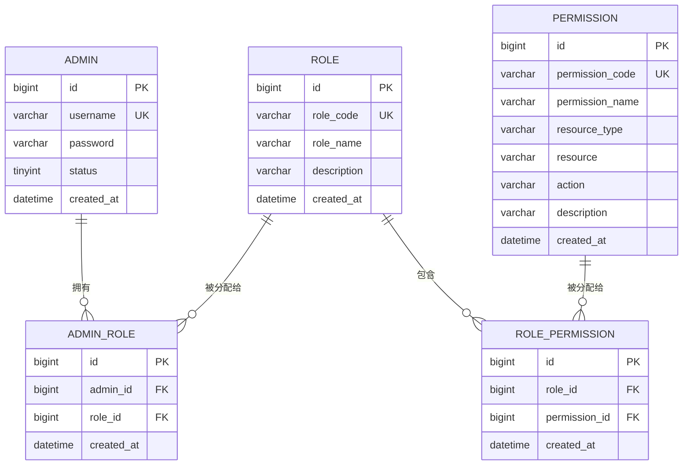
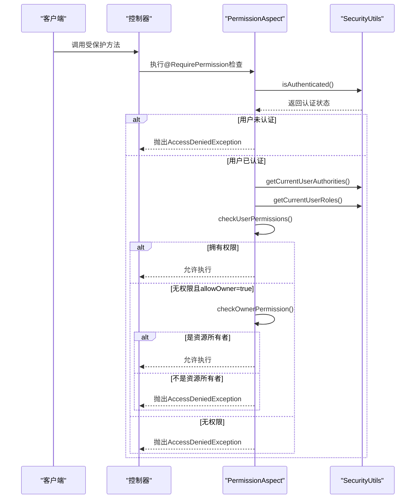
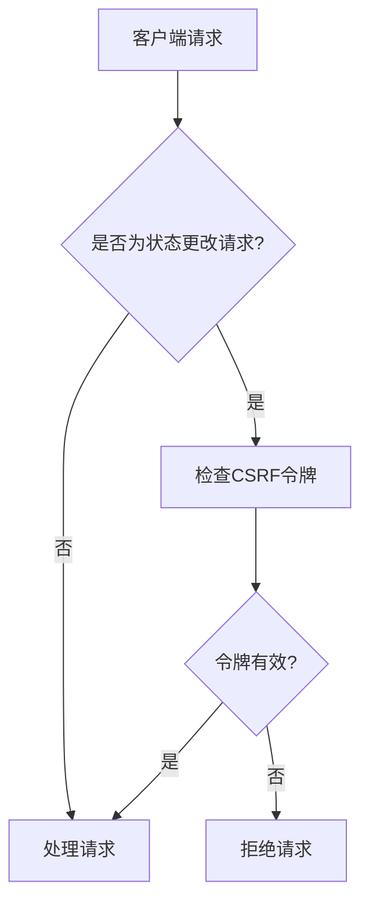
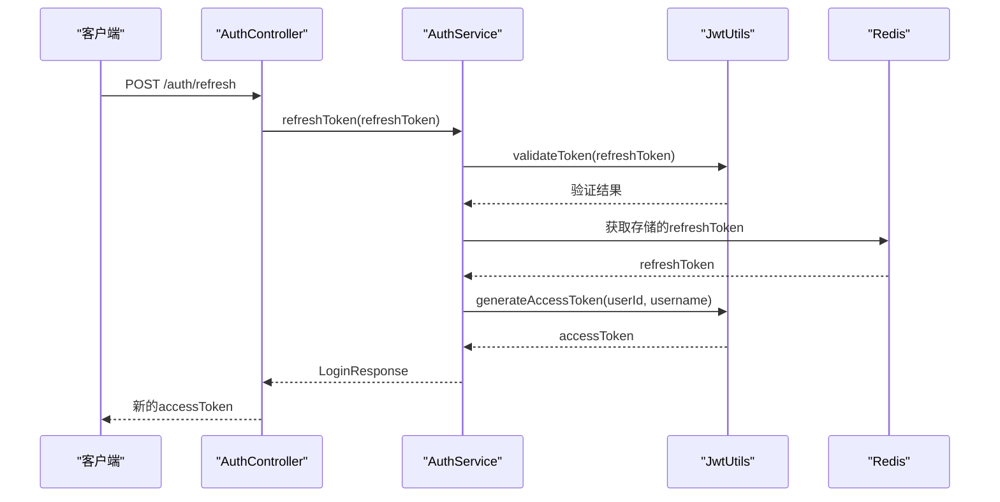
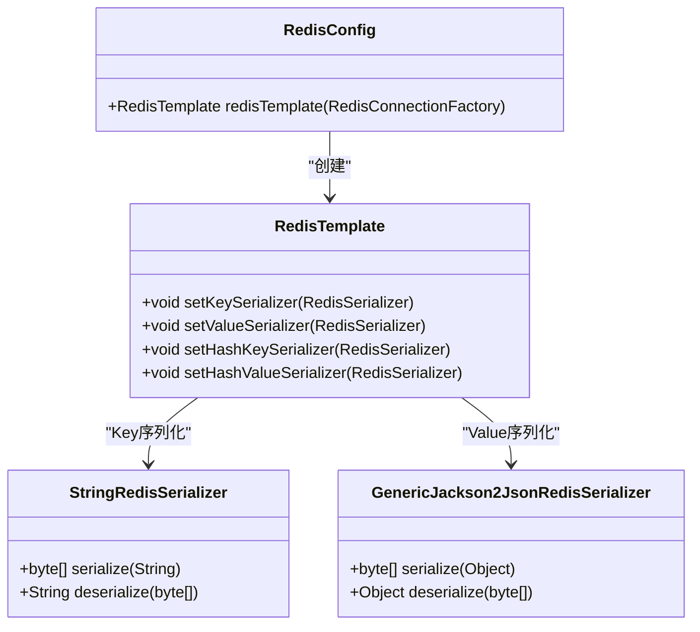

# 安全设计

<cite>
**本文档引用文件**  
- [SecurityConfig.java](file://backend/auth-service/src/main/java/com/mall/auth/config/SecurityConfig.java)
- [JwtUtils.java](file://backend/auth-service/src/main/java/com/mall/auth/utils/JwtUtils.java)
- [AuthController.java](file://backend/auth-service/src/main/java/com/mall/auth/controller/AuthController.java)
- [AuthService.java](file://backend/auth-service/src/main/java/com/mall/auth/service/AuthService.java)
- [RedisConfig.java](file://backend/auth-service/src/main/java/com/mall/auth/config/RedisConfig.java)
- [RequirePermission.java](file://backend/payment-service/src/main/java/com/mall/payment/annotation/RequirePermission.java)
- [PermissionAspect.java](file://backend/payment-service/src/main/java/com/mall/payment/aspect/PermissionAspect.java)
- [schema.sql](file://backend/admin-service/src/main/resources/sql/schema.sql)
- [data.sql](file://backend/admin-service/src/main/resources/sql/data.sql)
</cite>

## 目录
1. [简介](#简介)
2. [基于JWT的无状态认证流程](#基于jwt的无状态认证流程)
3. [Spring Security配置](#spring-security配置)
4. [权限控制（RBAC）实现](#权限控制rbac实现)
5. [接口访问控制（@RequirePermission注解）](#接口访问控制requirermission注解)
6. [CSRF防护机制](#csrf防护机制)
7. [敏感数据处理策略](#敏感数据处理策略)
8. [Token生成、验证与刷新机制](#token生成验证与刷新机制)
9. [Redis在会话管理中的作用](#redis在会话管理中的作用)
10. [安全漏洞防范建议与最佳实践](#安全漏洞防范建议与最佳实践)

## 简介

本安全设计文档深入剖析了在线商城系统的安全机制。系统采用基于JWT的无状态认证流程，结合Spring Security框架实现全面的安全控制。通过角色-权限模型（RBAC）实现细粒度的权限管理，并利用自定义`@RequirePermission`注解对API接口进行访问控制。系统还集成了CSRF防护、敏感数据加密处理以及基于Redis的会话管理机制，确保系统的安全性与可靠性。

**本文档引用文件**  
- [SecurityConfig.java](file://backend/auth-service/src/main/java/com/mall/auth/config/SecurityConfig.java)
- [JwtUtils.java](file://backend/auth-service/src/main/java/com/mall/auth/utils/JwtUtils.java)
- [AuthController.java](file://backend/auth-service/src/main/java/com/mall/auth/controller/AuthController.java)

## 基于JWT的无状态认证流程

系统采用JSON Web Token（JWT）实现无状态认证，所有服务通过JWT令牌进行身份验证和授权。认证流程如下：

1. 用户通过`/auth/login`接口提交用户名和密码。
2. 认证服务调用用户服务验证凭据。
3. 验证成功后，生成包含用户信息的JWT访问令牌和刷新令牌。
4. 访问令牌用于后续API请求的身份验证，有效期较短（默认15分钟）。
5. 刷新令牌用于获取新的访问令牌，有效期较长（默认7天），存储在Redis中。
6. 客户端在每次请求时将访问令牌放入`Authorization`头中。
7. 网关或各服务验证令牌的有效性并提取用户信息。

该流程实现了真正的无状态会话管理，所有认证信息都包含在令牌中，服务端无需存储会话状态。

**本文档引用文件**  
- [AuthController.java](file://backend/auth-service/src/main/java/com/mall/auth/controller/AuthController.java)
- [AuthService.java](file://backend/auth-service/src/main/java/com/mall/auth/service/AuthService.java)
- [JwtUtils.java](file://backend/auth-service/src/main/java/com/mall/auth/utils/JwtUtils.java)

## Spring Security配置

系统通过Spring Security配置实现全面的安全控制。核心配置包括：

- **无状态会话管理**：配置`SessionCreationPolicy.STATELESS`，禁用服务器端会话存储。
- **密码加密**：使用BCryptPasswordEncoder对用户密码进行加密存储。
- **匿名访问路径**：通过配置允许特定路径（如登录、注册）匿名访问。
- **请求授权**：除允许匿名访问的路径外，所有请求都需要经过身份验证。
- **禁用默认功能**：禁用表单登录和HTTP Basic认证，仅使用JWT进行认证。

**图源**  
- [SecurityConfig.java](file://backend/auth-service/src/main/java/com/mall/auth/config/SecurityConfig.java)

**本文档引用文件**  
- [SecurityConfig.java](file://backend/auth-service/src/main/java/com/mall/auth/config/SecurityConfig.java)

## 权限控制（RBAC）实现

系统采用基于角色的访问控制（RBAC）模型，实现细粒度的权限管理。核心组件包括：

- **权限表（permission）**：定义系统中的所有权限，包含权限编码、名称、资源类型、操作类型等。
- **角色表（role）**：定义系统角色，如超级管理员、普通管理员等。
- **角色权限关联表（role_permission）**：建立角色与权限之间的多对多关系。
- **管理员角色关联表（admin_role）**：建立管理员与角色之间的多对多关系。

权限数据通过SQL脚本初始化，例如超级管理员角色被赋予所有权限。用户登录后，系统会加载其所有权限和角色信息，用于后续的权限验证。

**图源**  
- [schema.sql](file://backend/admin-service/src/main/resources/sql/schema.sql)

**本文档引用文件**  
- [schema.sql](file://backend/admin-service/src/main/resources/sql/schema.sql)
- [data.sql](file://backend/admin-service/src/main/resources/sql/data.sql)

## 接口访问控制（@RequirePermission注解）

系统通过自定义`@RequirePermission`注解实现方法级别的权限控制。该注解支持多种配置选项：

- **value**：指定所需权限列表，用户必须拥有其中至少一个权限才能访问。
- **requireAll**：是否需要拥有所有指定权限，默认为false。
- **message**：权限检查失败时的错误消息。
- **allowOwner**：是否允许资源所有者访问，即使没有相应权限。
- **ownerField**：资源所有者字段名，用于确定资源的所有者。

权限检查由`PermissionAspect`切面实现，在方法执行前进行权限验证。切面会检查用户是否已认证、是否拥有所需权限，并支持资源所有者模式。

**图源**  
- [RequirePermission.java](file://backend/payment-service/src/main/java/com/mall/payment/annotation/RequirePermission.java)
- [PermissionAspect.java](file://backend/payment-service/src/main/java/com/mall/payment/aspect/PermissionAspect.java)

**本文档引用文件**  
- [RequirePermission.java](file://backend/payment-service/src/main/java/com/mall/payment/annotation/RequirePermission.java)
- [PermissionAspect.java](file://backend/payment-service/src/main/java/com/mall/payment/aspect/PermissionAspect.java)

## CSRF防护机制

系统通过Spring Security配置实现CSRF防护。在开发环境中，CSRF保护默认被禁用以方便测试；在生产环境中，CSRF保护应启用。

CSRF防护通过在表单中添加CSRF令牌来实现，服务器会验证每个状态更改请求（POST、PUT、DELETE等）中的CSRF令牌。由于系统主要采用JWT进行认证，且大部分API为无状态设计，CSRF风险相对较低，但仍建议在生产环境中启用CSRF保护以增强安全性。

**本文档引用文件**  
- [SecurityConfig.java](file://backend/auth-service/src/main/java/com/mall/auth/config/SecurityConfig.java)

## 敏感数据处理策略

系统采用多种策略处理敏感数据，确保数据安全：

- **密码加密**：用户密码使用BCrypt算法加密存储，即使数据库泄露也无法直接获取明文密码。
- **JWT签名**：所有JWT令牌使用HS512算法签名，防止令牌被篡改。
- **密钥管理**：JWT密钥和数据库密码等敏感信息通过配置文件管理，不应硬编码在代码中。
- **日志脱敏**：在日志记录中避免记录敏感信息如密码、完整令牌等。
- **HTTPS传输**：建议在生产环境中使用HTTPS协议，防止敏感数据在传输过程中被窃取。

**本文档引用文件**  
- [SecurityConfig.java](file://backend/auth-service/src/main/java/com/mall/auth/config/SecurityConfig.java)
- [JwtUtils.java](file://backend/auth-service/src/main/java/com/mall/auth/utils/JwtUtils.java)

## Token生成、验证与刷新机制

系统实现了完整的JWT令牌生命周期管理，包括生成、验证和刷新机制。

### Token生成
访问令牌和刷新令牌由`JwtUtils`类生成，包含以下声明（claims）：
- **userId**：用户ID
- **username**：用户名
- **type**：令牌类型（access或refresh）
- **iss**：签发者
- **iat**：签发时间
- **exp**：过期时间

### Token验证
验证过程包括：
1. 检查令牌签名是否有效
2. 检查令牌是否过期
3. 检查令牌是否在黑名单中（登出后）

### Token刷新
刷新流程：
1. 客户端使用刷新令牌请求`/auth/refresh`接口
2. 服务端验证刷新令牌的有效性
3. 验证Redis中存储的刷新令牌是否匹配
4. 生成新的访问令牌，刷新令牌保持不变
5. 将旧的访问令牌加入黑名单

**图源**  
- [AuthController.java](file://backend/auth-service/src/main/java/com/mall/auth/controller/AuthController.java)
- [AuthService.java](file://backend/auth-service/src/main/java/com/mall/auth/service/AuthService.java)
- [JwtUtils.java](file://backend/auth-service/src/main/java/com/mall/auth/utils/JwtUtils.java)

**本文档引用文件**  
- [AuthController.java](file://backend/auth-service/src/main/java/com/mall/auth/controller/AuthController.java)
- [AuthService.java](file://backend/auth-service/src/main/java/com/mall/auth/service/AuthService.java)
- [JwtUtils.java](file://backend/auth-service/src/main/java/com/mall/auth/utils/JwtUtils.java)

## Redis在会话管理中的作用

Redis在系统中扮演着关键角色，主要用于会话管理和令牌存储：

- **刷新令牌存储**：用户的刷新令牌存储在Redis中，键名为`refresh_token:{userId}`，设置7天过期时间。
- **令牌黑名单**：用户登出时，访问令牌被加入黑名单，键名为`token_blacklist:{token}`，过期时间等于令牌剩余有效期。
- **会话信息缓存**：可选地缓存用户会话信息，提高权限验证性能。
- **单点登出支持**：通过黑名单机制实现单点登出，使令牌立即失效。

Redis配置使用String序列化Key，Jackson序列化Value，确保数据的可读性和兼容性。

**图源**  
- [RedisConfig.java](file://backend/auth-service/src/main/java/com/mall/auth/config/RedisConfig.java)

**本文档引用文件**  
- [RedisConfig.java](file://backend/auth-service/src/main/java/com/mall/auth/config/RedisConfig.java)
- [AuthService.java](file://backend/auth-service/src/main/java/com/mall/auth/service/AuthService.java)

## 安全漏洞防范建议与最佳实践

为确保系统安全，建议遵循以下最佳实践：

### JWT安全最佳实践
- **使用强密钥**：JWT密钥应足够长且随机，建议至少256位。
- **合理设置过期时间**：访问令牌过期时间不宜过长，建议15-30分钟；刷新令牌可设置较长过期时间，但应支持主动失效。
- **启用令牌黑名单**：实现登出功能时，将令牌加入黑名单，防止已登出的令牌继续使用。
- **避免在令牌中存储敏感信息**：JWT令牌可能被解码查看，不应存储密码、身份证号等敏感信息。

### 密码安全最佳实践
- **使用强哈希算法**：推荐使用BCrypt、SCrypt或Argon2等抗暴力破解的密码哈希算法。
- **适当设置哈希强度**：BCrypt的work factor建议设置为10-12，在安全性和性能间取得平衡。
- **实施密码策略**：要求用户使用强密码，包含大小写字母、数字和特殊字符。

### API安全最佳实践
- **输入验证**：对所有API输入进行严格验证，防止注入攻击。
- **速率限制**：对登录、注册等敏感接口实施速率限制，防止暴力破解。
- **最小权限原则**：用户和角色应遵循最小权限原则，只授予完成工作所需的最低权限。
- **审计日志**：记录关键操作的审计日志，包括登录、权限变更、敏感数据访问等。

### 系统安全最佳实践
- **定期更新依赖**：及时更新框架和库，修复已知安全漏洞。
- **安全配置**：禁用不必要的服务和端口，配置防火墙规则。
- **HTTPS强制**：生产环境中强制使用HTTPS，防止中间人攻击。
- **安全监控**：实施安全监控和告警，及时发现异常行为。

通过遵循这些安全最佳实践，可以显著提高系统的安全性和可靠性，保护用户数据和系统资源。

**本文档引用文件**  
- [SecurityConfig.java](file://backend/auth-service/src/main/java/com/mall/auth/config/SecurityConfig.java)
- [JwtUtils.java](file://backend/auth-service/src/main/java/com/mall/auth/utils/JwtUtils.java)
- [AuthService.java](file://backend/auth-service/src/main/java/com/mall/auth/service/AuthService.java)