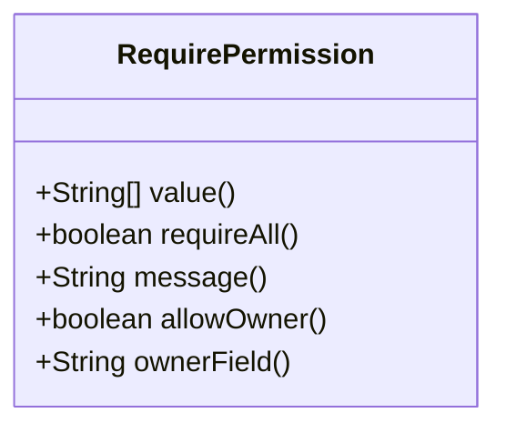
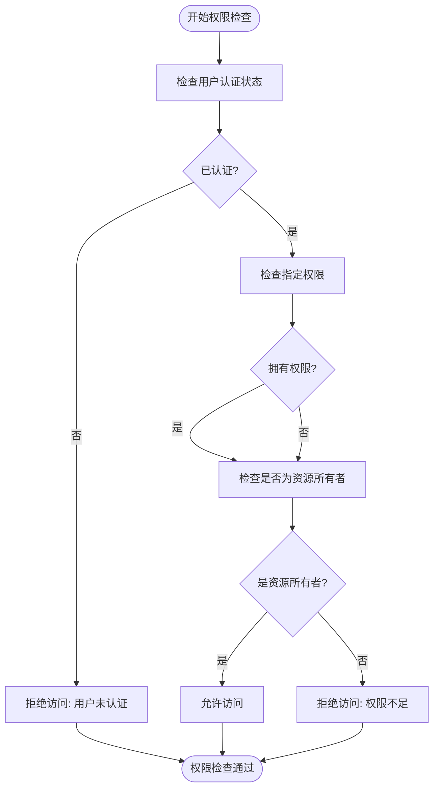
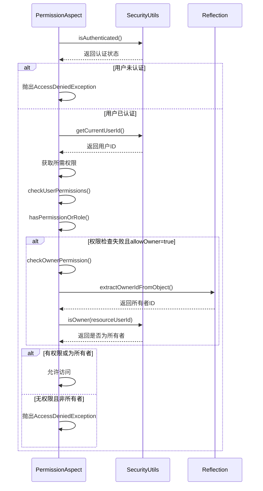
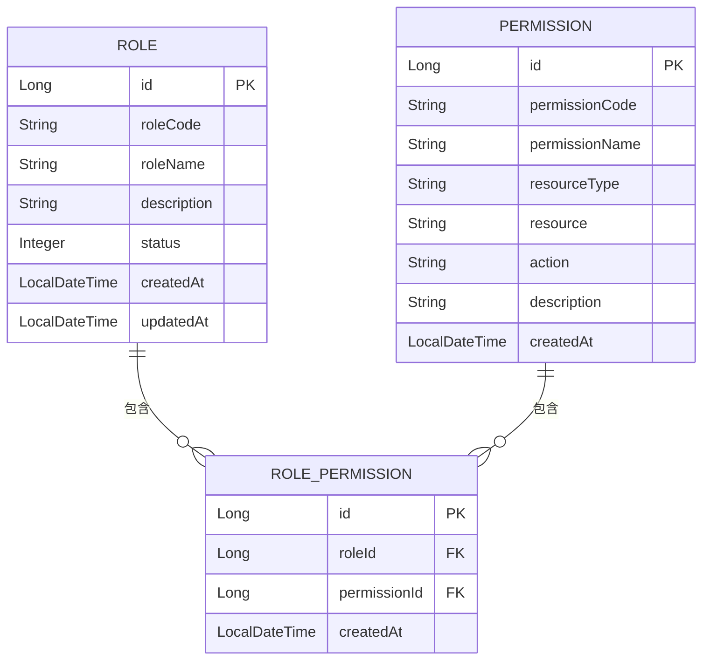

# 权限控制机制

<cite>
**Referenced Files in This Document**   
- [RequirePermission.java](file://backend/payment-service/src/main/java/com/mall/payment/annotation/RequirePermission.java)
- [PermissionAspect.java](file://backend/payment-service/src/main/java/com/mall/payment/aspect/PermissionAspect.java)
- [SecurityUtils.java](file://backend/payment-service/src/main/java/com/mall/payment/util/SecurityUtils.java)
- [Permission.java](file://backend/admin-service/src/main/java/com/mall/admin/domain/entity/Permission.java)
- [Role.java](file://backend/admin-service/src/main/java/com/mall/admin/domain/entity/Role.java)
- [RolePermission.java](file://backend/admin-service/src/main/java/com/mall/admin/domain/entity/RolePermission.java)
</cite>

## 目录
1. [权限控制机制概述](#权限控制机制概述)
2. [@RequirePermission注解详解](#requirepermission注解详解)
3. [PermissionAspect切面实现原理](#permissionaspect切面实现原理)
4. [角色与权限关系模型](#角色与权限关系模型)
5. [权限配置与策略示例](#权限配置与策略示例)
6. [总结](#总结)

## 权限控制机制概述

本系统采用基于RBAC（基于角色的访问控制）模型的权限控制系统，通过注解驱动的方式实现细粒度的权限控制。系统核心由`@RequirePermission`注解、`PermissionAspect`切面和`SecurityUtils`工具类组成，实现了灵活的权限检查机制。

权限控制系统的主要特点包括：
- 基于注解的声明式权限控制
- 支持方法级别和类级别的权限检查
- 提供资源所有者权限检查功能
- 支持多种权限检查策略
- 与Spring Security框架深度集成

**Section sources**
- [RequirePermission.java](file://backend/payment-service/src/main/java/com/mall/payment/annotation/RequirePermission.java#L1-L57)
- [PermissionAspect.java](file://backend/payment-service/src/main/java/com/mall/payment/aspect/PermissionAspect.java#L1-L234)

## @RequirePermission注解详解

`@RequirePermission`注解是权限控制的核心，用于标记需要权限检查的方法或类。该注解提供了丰富的参数配置，支持多种权限检查场景。

### 注解参数说明



**Diagram sources**
- [RequirePermission.java](file://backend/payment-service/src/main/java/com/mall/payment/annotation/RequirePermission.java#L13-L57)

#### value参数
`value`参数定义了访问该方法所需的权限列表。用户必须拥有其中至少一个权限才能访问（默认行为）。例如：

```java
@RequirePermission(value = {"USER", "ADMIN"})
public void someMethod() {
    // 方法实现
}
```

#### requireAll参数
`requireAll`参数控制权限检查的逻辑：
- `false`（默认值）：用户只需拥有`value`中任意一个权限即可访问
- `true`：用户必须拥有`value`中所有指定的权限才能访问

```java
// 用户必须同时拥有USER和PAYMENT权限才能访问
@RequirePermission(value = {"USER", "PAYMENT"}, requireAll = true)
public void paymentMethod() {
    // 支付相关方法
}
```

#### allowOwner参数
`allowOwner`参数启用资源所有者权限检查机制。当设置为`true`时，即使用户不满足`value`指定的权限要求，但如果当前用户是资源的所有者，仍然允许访问。

#### ownerField参数
`ownerField`参数指定资源对象中表示所有者的字段名称，默认值为`userId`。该字段用于在运行时通过反射获取资源所有者信息。

**Section sources**
- [RequirePermission.java](file://backend/payment-service/src/main/java/com/mall/payment/annotation/RequirePermission.java#L24-L57)

## PermissionAspect切面实现原理

`PermissionAspect`是权限检查的核心实现，通过AOP（面向切面编程）技术在方法执行前进行权限验证。

### 执行流程



**Diagram sources**
- [PermissionAspect.java](file://backend/payment-service/src/main/java/com/mall/payment/aspect/PermissionAspect.java#L44-L90)

### 核心方法解析

#### checkPermission方法
`checkPermission`是权限检查的入口方法，负责协调整个权限验证流程：

1. 验证用户是否已认证
2. 获取当前用户ID和所需权限
3. 执行权限检查
4. 如果权限检查失败且允许所有者访问，则进行所有者检查
5. 根据检查结果决定是否允许访问

#### checkUserPermissions方法
该方法根据`requireAll`参数的值，采用不同的权限检查策略：

- 当`requireAll=true`时，使用`allMatch`确保用户拥有所有指定权限
- 当`requireAll=false`时，使用`anyMatch`确保用户至少拥有一个指定权限

#### checkOwnerPermission方法
资源所有者权限检查通过以下步骤实现：
1. 获取方法参数列表
2. 遍历参数，查找包含所有者字段的对象
3. 通过反射获取资源所有者ID
4. 比较当前用户ID与资源所有者ID



**Diagram sources**
- [PermissionAspect.java](file://backend/payment-service/src/main/java/com/mall/payment/aspect/PermissionAspect.java#L44-L90)
- [SecurityUtils.java](file://backend/payment-service/src/main/java/com/mall/payment/util/SecurityUtils.java#L20-L306)

**Section sources**
- [PermissionAspect.java](file://backend/payment-service/src/main/java/com/mall/payment/aspect/PermissionAspect.java#L44-L90)
- [SecurityUtils.java](file://backend/payment-service/src/main/java/com/mall/payment/util/SecurityUtils.java#L20-L306)

## 角色与权限关系模型

系统采用标准的RBAC模型，通过角色和权限的多对多关系实现灵活的权限管理。

### 数据模型



**Diagram sources**
- [Role.java](file://backend/admin-service/src/main/java/com/mall/admin/domain/entity/Role.java#L12-L43)
- [Permission.java](file://backend/admin-service/src/main/java/com/mall/admin/domain/entity/Permission.java#L12-L50)
- [RolePermission.java](file://backend/admin-service/src/main/java/com/mall/admin/domain/entity/RolePermission.java#L12-L30)

### 关系说明

#### 角色实体（Role）
- `roleCode`：角色编码，用于系统内部识别
- `roleName`：角色名称，用于显示
- `status`：角色状态（1-正常，0-禁用）

#### 权限实体（Permission）
- `permissionCode`：权限编码，唯一标识一个权限
- `resourceType`：资源类型（如：USER, PRODUCT, ORDER）
- `resource`：具体资源标识
- `action`：操作类型（如：READ, WRITE, DELETE）

#### 角色权限关联（RolePermission）
通过中间表实现角色与权限的多对多关系，每个关联记录包含：
- `roleId`：角色ID
- `permissionId`：权限ID
- `createdAt`：创建时间

### 权限继承与聚合

系统通过`SecurityUtils`工具类实现了权限的聚合查询：

```java
public static List<String> getCurrentUserAuthorities() {
    Authentication authentication = SecurityContextHolder.getContext().getAuthentication();
    if (authentication != null && authentication.getAuthorities() != null) {
        return authentication.getAuthorities().stream()
                .map(GrantedAuthority::getAuthority)
                .collect(Collectors.toList());
    }
    return List.of();
}

public static List<String> getCurrentUserRoles() {
    Authentication authentication = SecurityContextHolder.getContext().getAuthentication();
    if (authentication != null && authentication.getAuthorities() != null) {
        return authentication.getAuthorities().stream()
                .map(GrantedAuthority::getAuthority)
                .map(role -> role.startsWith("ROLE_") ? role.substring(5) : role)
                .collect(Collectors.toList());
    }
    return List.of();
}
```

这种设计允许系统同时支持基于角色和基于权限的访问控制，提供了更大的灵活性。

**Section sources**
- [Role.java](file://backend/admin-service/src/main/java/com/mall/admin/domain/entity/Role.java#L12-L43)
- [Permission.java](file://backend/admin-service/src/main/java/com/mall/admin/domain/entity/Permission.java#L12-L50)
- [RolePermission.java](file://backend/admin-service/src/main/java/com/mall/admin/domain/entity/RolePermission.java#L12-L30)

## 权限配置与策略示例

### 管理员权限策略

```java
@GetMapping("/orders")
@RequirePermission(value = {"ADMIN"})
public ResponseEntity<Map<String, Object>> queryRefundOrders() {
    // 管理员可以查看所有退款订单
}
```

### 商家权限策略

```java
@GetMapping("/orders/user/{userId}")
@RequirePermission(value = {"MERCHANT", "ADMIN"}, allowOwner = true, ownerField = "merchantId")
public ResponseEntity<Map<String, Object>> getMerchantOrders() {
    // 商家可以查看自己的订单，管理员可以查看所有订单
}
```

### 普通用户权限策略

```java
@PostMapping("/orders")
@RequirePermission(value = {"USER"}, allowOwner = true, ownerField = "userId")
public ResponseEntity<Map<String, Object>> createPaymentOrder() {
    // 用户可以创建自己的支付订单
}
```

### 复合权限策略

```java
@RequirePermission(value = {"USER", "PAYMENT"}, requireAll = true)
public void processPayment() {
    // 用户必须同时拥有USER和PAYMENT权限
}
```

**Section sources**
- [PermissionAspect.java](file://backend/payment-service/src/main/java/com/mall/payment/aspect/PermissionAspect.java#L44-L90)
- [RequirePermission.java](file://backend/payment-service/src/main/java/com/mall/payment/annotation/RequirePermission.java#L24-L57)

## 总结

本系统的权限控制机制通过`@RequirePermission`注解和`PermissionAspect`切面实现了灵活、可扩展的权限管理。核心特点包括：

1. **声明式权限控制**：通过注解方式简化权限配置
2. **多维度权限检查**：支持角色、权限和资源所有者三种检查方式
3. **灵活的配置选项**：提供`requireAll`、`allowOwner`等参数满足不同场景需求
4. **标准化的数据模型**：基于RBAC模型，易于维护和扩展
5. **良好的可读性**：权限配置直观，便于理解和维护

该机制为系统提供了安全可靠的访问控制，同时保持了足够的灵活性以适应未来的业务需求变化。