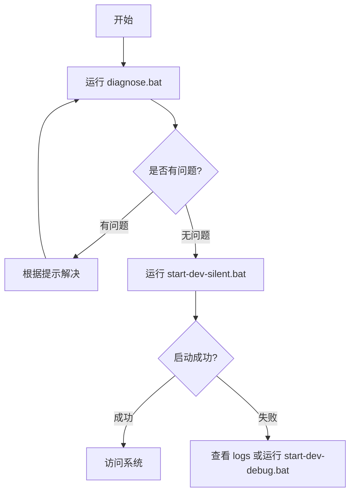

# 常见问题

<cite>
**本文档引用文件**  
- [TROUBLESHOOTING.md](file://TROUBLESHOOTING.md)
- [FLASH_EXIT_FIX_SUMMARY.md](file://FLASH_EXIT_FIX_SUMMARY.md)
- [STARTUP_FIXES.md](file://STARTUP_FIXES.md)
- [商家入驻404问题-根本修复完成.md](file://商家入驻404问题-根本修复完成.md)
- [backend/gateway-service/src/main/resources/application-simple.yml](file://backend/gateway-service/src/main/resources/application-simple.yml)
- [backend/merchant-service/src/main/java/com/mall/merchant/config/SecurityConfig.java](file://backend/merchant-service/src/main/java/com/mall/merchant/config/SecurityConfig.java)
- [backend/merchant-service/src/main/java/com/mall/merchant/controller/MerchantApplicationController.java](file://backend/merchant-service/src/main/java/com/mall/merchant/controller/MerchantApplicationController.java)
- [backend/admin-service/src/main/java/com/mall/admin/controller/MerchantApplicationController.java](file://backend/admin-service/src/main/java/com/mall/admin/controller/MerchantApplicationController.java)
- [backend/merchant-service/src/main/java/com/mall/merchant/service/impl/MerchantApplicationServiceImpl.java](file://backend/merchant-service/src/main/java/com/mall/merchant/service/impl/MerchantApplicationServiceImpl.java)
</cite>

## 目录
1. [环境配置问题](#环境配置问题)
2. [服务启动失败](#服务启动失败)
3. [数据库连接错误](#数据库连接错误)
4. [接口调用异常](#接口调用异常)
5. [商家入驻404问题](#商家入驻404问题)
6. [服务闪退问题](#服务闪退问题)

## 环境配置问题

### 问题：Java版本不兼容
**现象描述**：运行启动脚本时提示Java版本错误或无法识别`java`命令。

**排查步骤**：
1. 打开命令行，执行 `java -version`
2. 检查输出的Java版本号
3. 确认是否为Java 17或更高版本

**解决方案**：
- 升级到Java 17或更高版本
- 配置`JAVA_HOME`环境变量指向正确的JDK安装路径
- 将`%JAVA_HOME%\bin`添加到系统`PATH`环境变量中

### 问题：Maven未安装或配置
**现象描述**：启动微服务时提示`mvn`不是内部或外部命令。

**排查步骤**：
1. 执行 `mvn --version` 检查Maven是否可用
2. 检查`MAVEN_HOME`环境变量是否设置正确
3. 确认`%MAVEN_HOME%\bin`已添加到`PATH`

**解决方案**：
1. 从[Apache Maven官网](https://maven.apache.org/download.cgi)下载并安装Maven
2. 设置`MAVEN_HOME`环境变量
3. 将`%MAVEN_HOME%\bin`添加到系统`PATH`
4. 重启命令行窗口验证安装

### 问题：项目路径包含特殊字符
**现象描述**：启动脚本闪退或服务无法正常启动，日志中出现路径解析错误。

**排查步骤**：
1. 检查项目所在路径是否包含中文、空格或特殊符号
2. 确认路径是否为纯英文且无空格

**解决方案**：
- 将项目移动到纯英文路径，例如：`D:\workspace\springcloud-mall`
- 避免使用中文、空格、括号等特殊字符

**Section sources**
- [TROUBLESHOOTING.md](file://TROUBLESHOOTING.md#L83-L90)
- [STARTUP_FIXES.md](file://STARTUP_FIXES.md#L248-L260)

## 服务启动失败

### 问题：Docker Desktop未运行
**现象描述**：双击`start-dev-silent.bat`后窗口一闪而过，服务未启动。

**排查步骤**：
1. 检查系统托盘中是否有Docker Desktop图标
2. 执行 `docker ps` 命令测试Docker是否可用
3. 若命令无响应或报错，则Docker未运行

**解决方案**：
- 启动Docker Desktop应用程序
- 等待右下角托盘图标显示"Docker Desktop is running"
- 重新运行项目启动脚本

### 问题：端口被占用
**现象描述**：基础设施服务（MySQL、Redis、Nacos等）启动失败。

**常用端口**：
- `3307` - MySQL
- `6379` - Redis
- `8848` - Nacos
- `8080-8089` - 微服务
- `5173` - 前端

**排查步骤**：
```powershell
# 检查特定端口占用情况
netstat -ano | findstr :8080

# 检查所有相关端口
netstat -ano | findstr "3307 6379 8848 8080 8081 8082 8083 8084 8085 8086 8087 8088 8089 5173"
```

**解决方案**：
```powershell
# 找到占用端口的进程ID (PID)
netstat -ano | findstr :8080

# 结束占用端口的进程
taskkill /PID <PID> /F
```

### 问题：启动脚本权限不足
**现象描述**：脚本无法执行或部分命令被拒绝。

**解决方案**：
- 右键点击启动脚本（如`start-dev-silent.bat`）
- 选择"以管理员身份运行"

**Section sources**
- [TROUBLESHOOTING.md](file://TROUBLESHOOTING.md#L10-L50)
- [STARTUP_FIXES.md](file://STARTUP_FIXES.md#L183-L218)

## 数据库连接错误

### 问题：Nacos服务注册与发现不一致
**现象描述**：服务间调用失败，提示无法发现服务实例。

**排查步骤**：
1. 检查`merchant-service`注册的namespace
2. 检查`gateway-service`查找服务的namespace
3. 确认两者namespace是否一致

**解决方案**：
修改`backend/gateway-service/src/main/resources/application-simple.yml`中的namespace配置：
```yaml
spring:
  cloud:
    nacos:
      discovery:
        namespace: simple  # 确保与服务注册的namespace一致
```

**Section sources**
- [商家入驻404问题-根本修复完成.md](file://商家入驻404问题-根本修复完成.md#L40-L54)
- [backend/gateway-service/src/main/resources/application-simple.yml](file://backend/gateway-service/src/main/resources/application-simple.yml#L13)

## 接口调用异常

### 问题：网关路由StripPrefix配置错误
**现象描述**：API请求返回404，路径无法正确转发到目标服务。

**排查步骤**：
1. 检查网关路由配置中的`StripPrefix`值
2. 分析请求路径与目标路径的转换关系

**正确配置示例**：
```yaml
# 请求: /api/merchants/apply
# StripPrefix=1: 去掉/api -> /merchants/apply ✓
# StripPrefix=2: 去掉/api/merchants -> /apply ❌
filters:
  - StripPrefix=1
```

**解决方案**：
将`StripPrefix`值从`2`修改为`1`，确保路径正确转发。

**Section sources**
- [商家入驻404问题-根本修复完成.md](file://商家入驻404问题-根本修复完成.md#L55-L73)
- [backend/gateway-service/src/main/resources/application-simple.yml](file://backend/gateway-service/src/main/resources/application-simple.yml#L100)

## 商家入驻404问题

### 问题描述
提交商家入驻申请时，前端调用`/api/merchants/apply`接口返回404错误。

### 根本原因
1. **修改了错误的配置文件**：实际生效的是`application-simple.yml`，但修改了`application.yml`
2. **Nacos namespace不匹配**：服务注册在`simple`，网关在`public`查找
3. **StripPrefix配置错误**：配置为`2`导致路径转换错误
4. **缺少复数路由**：只有`/api/merchant/**`，缺少`/api/merchants/**`

### 解决方案
#### 1. 修改正确的配置文件
确保修改`backend/gateway-service/src/main/resources/application-simple.yml`而非`application.yml`。

#### 2. 统一Nacos namespace
```yaml
spring:
  cloud:
    nacos:
      discovery:
        namespace: simple  # 从public改为simple
```

#### 3. 修正StripPrefix配置
```yaml
filters:
  - StripPrefix=1  # 从2改为1
```

#### 4. 添加复数路由
```yaml
- id: merchant-service-plural
  uri: lb://merchant-service
  predicates:
    - Path=/api/merchants/**
  filters:
    - StripPrefix=1
```

#### 5. 配置安全白名单
在`SecurityConfig.java`中添加：
```java
.requestMatchers("/merchants/apply").permitAll()
.requestMatchers("/merchants/applications/**").permitAll()
```

### 验证方法
**浏览器测试**：
1. 访问 `http://localhost:5173/merchant/register`
2. 填写入驻表单并提交
3. 应收到"申请提交成功"提示

**API测试**：
```bash
curl -X POST http://localhost:8080/api/merchants/apply \
  -H "Content-Type: application/json" \
  -d '{"shopName":"测试店铺","entityType":"individual","contactName":"张三","contactPhone":"13800138000"}'
```

**预期响应**：
```json
{
  "code": 200,
  "success": true,
  "message": "申请提交成功，请等待审核"
}
```

```mermaid
graph TD
A[前端Vue应用] --> B[/api/merchants/apply]
B --> C[Vite代理]
C --> D[Gateway 8080]
D --> E{路由匹配}
E --> F[merchant-service-plural路由]
F --> G[StripPrefix=1]
G --> H[/merchants/apply]
H --> I[Nacos服务发现]
I --> J[在simple namespace查找]
J --> K[merchant-service实例]
K --> L[SecurityConfig检查]
L --> M[permitAll()通过]
M --> N[MerchantApplicationController]
N --> O[返回200 OK]
```

**Diagram sources**
- [backend/gateway-service/src/main/resources/application-simple.yml](file://backend/gateway-service/src/main/resources/application-simple.yml#L102-L107)
- [backend/merchant-service/src/main/java/com/mall/merchant/config/SecurityConfig.java](file://backend/merchant-service/src/main/java/com/mall/merchant/config/SecurityConfig.java#L47)
- [backend/merchant-service/src/main/java/com/mall/merchant/controller/MerchantApplicationController.java](file://backend/merchant-service/src/main/java/com/mall/merchant/controller/MerchantApplicationController.java#L17)

**Section sources**
- [商家入驻404问题-根本修复完成.md](file://商家入驻404问题-根本修复完成.md)
- [backend/gateway-service/src/main/resources/application-simple.yml](file://backend/gateway-service/src/main/resources/application-simple.yml)
- [backend/merchant-service/src/main/java/com/mall/merchant/config/SecurityConfig.java](file://backend/merchant-service/src/main/java/com/mall/merchant/config/SecurityConfig.java)

## 服务闪退问题

### 问题描述
双击`start-dev-silent.bat`后，命令行窗口一闪而过，服务未启动。

### 解决方案体系
项目已建立完整的闪退问题解决方案体系：

#### 1. 一键诊断工具（推荐）
**文件**：`diagnose.bat` / `diagnose.ps1`

**功能**：
- 自动检测8大类环境问题
- 彩色输出，问题一目了然
- 提供针对性解决方案
- 生成诊断摘要报告

**使用方法**：
```bash
diagnose.bat
```

#### 2. 调试启动模式
**文件**：`start-dev-debug.bat`

**特点**：
- 逐步显示执行过程
- 关键步骤暂停等待确认
- 显示详细的系统信息和诊断结果
- 提供完整的错误提示

#### 3. 增强的错误提示
`start-dev-silent.bat`已改进：
- 所有错误都有详细说明
- 提供具体的解决方案
- 确保不会闪退（所有分支都有pause）

### 常见闪退原因及修复

#### 原因1：Docker Desktop未运行（90%）
**检测**：
```bash
docker ps
# 若报错"error during connect"，说明Docker未运行
```

**解决**：
1. 启动Docker Desktop
2. 等待托盘图标显示运行状态
3. 重新运行启动脚本

#### 原因2：端口被占用（5%）
**检测**：
```powershell
netstat -ano | findstr "3307 6379 8848"
```

**解决**：
```powershell
# 结束占用端口的进程
taskkill /PID <PID> /F
```

#### 原因3：Maven未安装（3%）
**检测**：
```bash
mvn --version
# 若提示"mvn 不是内部或外部命令"
```

**解决**：
1. 安装Maven
2. 配置`MAVEN_HOME`环境变量
3. 添加`%MAVEN_HOME%\bin`到`PATH`

#### 原因4：路径包含特殊字符（1%）
**解决**：将项目移动到纯英文路径，如`D:\workspace\springcloud-mall`



**Diagram sources**
- [FLASH_EXIT_FIX_SUMMARY.md](file://FLASH_EXIT_FIX_SUMMARY.md#L216-L226)
- [TROUBLESHOOTING.md](file://TROUBLESHOOTING.md)

**Section sources**
- [FLASH_EXIT_FIX_SUMMARY.md](file://FLASH_EXIT_FIX_SUMMARY.md)
- [STARTUP_FIXES.md](file://STARTUP_FIXES.md)
- [TROUBLESHOOTING.md](file://TROUBLESHOOTING.md)