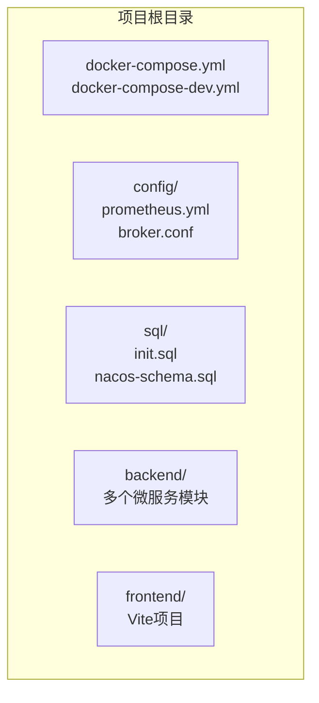
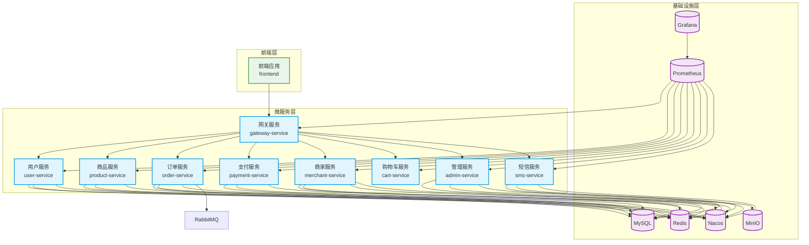
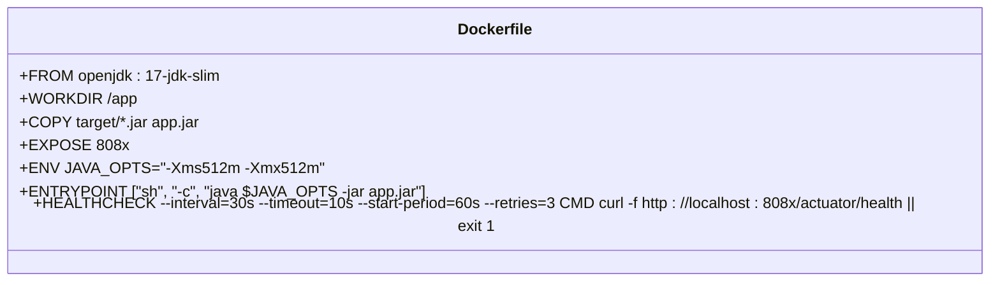
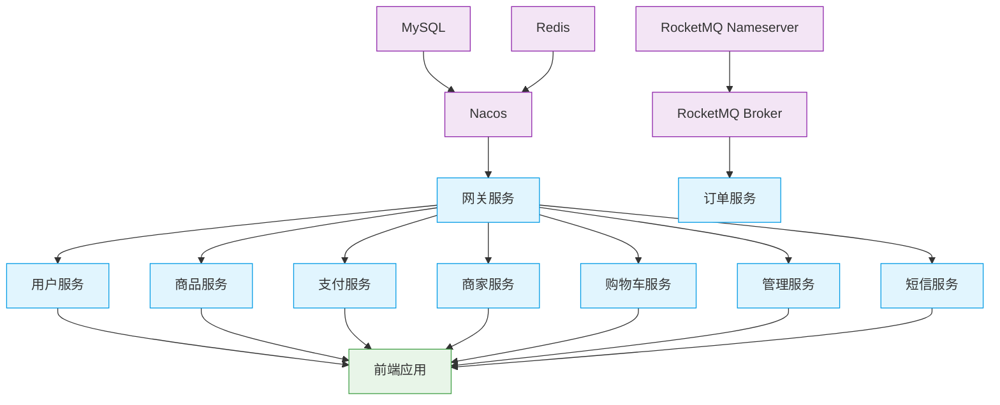
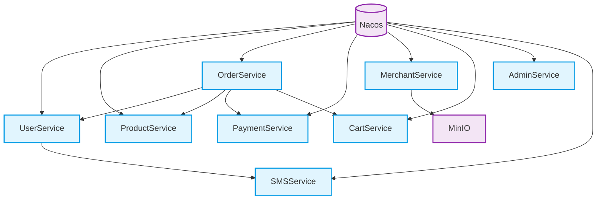

# 容器化部署

<cite>
**本文档引用文件**  
- [docker-compose.yml](file://docker-compose.yml)
- [docker-compose-dev.yml](file://docker-compose-dev.yml)
- [Dockerfile](file://backend/admin-service/Dockerfile)
- [Dockerfile](file://backend/order-service/Dockerfile)
- [application.yml](file://backend/gateway-service/src/main/resources/application.yml)
- [application-docker.yml](file://backend/admin-service/src/main/resources/application-docker.yml)
- [application-docker.yml](file://backend/user-service/src/main/resources/application-docker.yml)
- [AdminServiceApplication.java](file://backend/admin-service/src/main/java/com/mall/admin/AdminServiceApplication.java)
- [OrderServiceApplication.java](file://backend/order-service/src/main/java/com/mall/order/orderServiceApplication.java)
- [GatewayApplication.java](file://backend/gateway-service/src/main/java/com/mall/gateway/GatewayApplication.java)
- [start-dev-silent.bat](file://start-dev-silent.bat)
- [start-all-services.ps1](file://start-all-services.ps1)
- [restart-service.ps1](file://restart-service.ps1)
- [start-dev-debug.bat](file://start-dev-debug.bat)
- [restart-all-services-silent.ps1](file://restart-all-services-silent.ps1)
</cite>

## 目录
1. [简介](#简介)
2. [项目结构](#项目结构)
3. [核心组件](#核心组件)
4. [架构概述](#架构概述)
5. [详细组件分析](#详细组件分析)
6. [依赖分析](#依赖分析)
7. [性能考虑](#性能考虑)
8. [故障排除指南](#故障排除指南)
9. [结论](#结论)

## 简介
本文档详细阐述了 `springcloud-mall` 项目的容器化部署方案，重点聚焦于使用 Docker Compose 进行服务编排的完整实现。文档深入解析了生产级 `docker-compose.yml` 与开发级 `docker-compose-dev.yml` 的配置差异，涵盖 MySQL、Redis、Nacos、MinIO、Prometheus、Grafana 等基础设施服务的容器定义、网络配置、卷挂载和环境变量设置。同时，文档详细描述了各微服务（如 gateway-service、admin-service）的 Dockerfile 构建过程，包括基础镜像选择、JAR 包挂载、JVM 参数优化和启动命令配置。此外，还提供了容器间通信机制说明、部署拓扑图、启动依赖关系图以及常见部署问题的排查步骤和解决方案。

## 项目结构
项目采用典型的前后端分离微服务架构，后端服务位于 `backend` 目录下，前端位于 `frontend` 目录。容器化部署的核心配置文件 `docker-compose.yml` 和 `docker-compose-dev.yml` 位于项目根目录，用于定义所有服务的编排。`config` 目录存放 Prometheus 和 RocketMQ 的配置文件，`sql` 目录存放数据库初始化脚本。

**图示来源**
- [docker-compose.yml](file://docker-compose.yml#L1-L485)
- [docker-compose-dev.yml](file://docker-compose-dev.yml#L1-L92)
- [config](file://config)
- [sql](file://sql)

**本节来源**
- [docker-compose.yml](file://docker-compose.yml#L1-L485)
- [docker-compose-dev.yml](file://docker-compose-dev.yml#L1-L92)

## 核心组件
本项目的核心组件包括网关服务（gateway-service）、用户服务（user-service）、商品服务（product-service）、订单服务（order-service）、支付服务（payment-service）、商家服务（merchant-service）、购物车服务（cart-service）、管理服务（admin-service）和短信服务（sms-service）。这些服务均基于 Spring Boot 开发，并通过 Nacos 进行服务注册与发现。每个服务都包含独立的 `Dockerfile` 用于构建容器镜像，并通过 `docker-compose.yml` 文件进行统一编排和部署。

**本节来源**
- [docker-compose.yml](file://docker-compose.yml#L258-L452)
- [backend](file://backend)

## 架构概述
系统采用微服务架构，通过 Docker Compose 实现容器化部署。所有服务运行在名为 `mall-network` 的自定义桥接网络中，确保容器间可以互相通信。MySQL、Redis、Nacos 等基础设施服务作为基础依赖，为上层微服务提供数据存储、缓存和注册发现能力。微服务通过 Nacos 服务发现机制进行通信，网关服务作为系统的唯一对外入口，接收所有外部请求并路由到相应的后端服务。Prometheus 和 Grafana 提供监控和可视化能力，MinIO 提供对象存储服务。

**图示来源**
- [docker-compose.yml](file://docker-compose.yml#L1-L485)

**本节来源**
- [docker-compose.yml](file://docker-compose.yml#L1-L485)

## 详细组件分析

### Docker Compose 配置分析
`docker-compose.yml` 文件定义了生产环境的完整服务编排。它使用 `eclipse-temurin:17-jre` 作为基础镜像来运行所有 Java 微服务，通过挂载 `./backend/{service}/target` 目录将编译好的 JAR 包注入容器，并使用 `java -jar` 命令启动。所有服务都配置了 `depends_on` 指令，确保在启动微服务前，其依赖的数据库和中间件服务已准备就绪。环境变量 `SPRING_PROFILES_ACTIVE` 被设置为 `docker`，以激活容器化环境的特定配置。

#### 生产与开发环境对比
生产环境的 `docker-compose.yml` 与开发环境的 `docker-compose-dev.yml` 存在显著差异。开发环境仅启动 MySQL、Redis 和 Nacos 三个核心基础设施，不包含任何微服务或前端应用，旨在为本地开发提供一个轻量级的依赖环境。此外，开发环境的容器名称后缀为 `-dev`，并且为每个服务配置了 `healthcheck`，确保服务完全健康后才允许依赖它的服务启动，这在开发调试中非常有用。

**图示来源**
- [docker-compose.yml](file://docker-compose.yml#L1-L485)
- [docker-compose-dev.yml](file://docker-compose-dev.yml#L1-L92)

**本节来源**
- [docker-compose.yml](file://docker-compose.yml#L1-L485)
- [docker-compose-dev.yml](file://docker-compose-dev.yml#L1-L92)

### 微服务 Dockerfile 分析
每个微服务模块都包含一个 `Dockerfile`，用于构建其容器镜像。该文件以 `openjdk:17-jdk-slim` 为基础镜像，创建 `/app` 工作目录，并将位于 `target` 目录下的 JAR 包复制到容器中。通过 `EXPOSE` 指令声明服务端口，并使用 `ENV` 环境变量设置 JVM 的初始和最大堆内存（`-Xms512m -Xmx512m`）。`ENTRYPOINT` 指令定义了容器启动时执行的命令，即运行 JAR 包。此外，`HEALTHCHECK` 指令通过定期调用 `/actuator/health` 端点来检查服务的健康状况。

**图示来源**
- [Dockerfile](file://backend/admin-service/Dockerfile#L1-L15)
- [Dockerfile](file://backend/order-service/Dockerfile#L1-L15)

**本节来源**
- [Dockerfile](file://backend/admin-service/Dockerfile#L1-L15)
- [Dockerfile](file://backend/order-service/Dockerfile#L1-L15)

### 容器间通信机制
容器间通信主要通过 Docker 的自定义网络 `mall-network` 实现。当服务在 `docker-compose.yml` 中被定义时，Docker 会自动为每个服务创建一个 DNS 条目，其名称即为服务名（如 `mysql`, `redis`, `nacos`）。因此，微服务可以通过服务名直接访问其他容器，而无需关心其具体的 IP 地址。例如，`gateway-service` 可以通过 `redis` 这个主机名连接到 Redis 服务，通过 `nacos:8848` 连接到 Nacos 服务。这种基于服务发现的通信方式极大地简化了微服务架构的部署和管理。

**本节来源**
- [docker-compose.yml](file://docker-compose.yml#L272-L275)
- [application-docker.yml](file://backend/admin-service/src/main/resources/application-docker.yml#L11-L20)

### 启动依赖关系
服务的启动顺序至关重要，必须遵循严格的依赖关系。基础设施服务（MySQL、Redis、Nacos）必须最先启动。随后，网关服务（gateway-service）作为入口，需要在 Nacos 启动后才能注册自身。最后，其他微服务（如 user-service, product-service）在网关之后启动，并向 Nacos 注册。前端应用（frontend）是最后启动的，因为它依赖于网关服务提供 API。

**图示来源**
- [docker-compose.yml](file://docker-compose.yml#L59-L60)
- [docker-compose.yml](file://docker-compose.yml#L109-L110)
- [docker-compose.yml](file://docker-compose.yml#L282-L286)
- [docker-compose.yml](file://docker-compose.yml#L464-L465)

**本节来源**
- [docker-compose.yml](file://docker-compose.yml#L1-L485)
- [start-dev-silent.bat](file://start-dev-silent.bat#L104-L121)
- [start-all-services.ps1](file://start-all-services.ps1#L38-L47)

## 依赖分析
项目依赖主要分为两类：基础设施依赖和微服务间依赖。基础设施依赖包括 MySQL、Redis、Nacos、MinIO、RabbitMQ 等，这些服务通过 `docker-compose.yml` 文件中的 `depends_on` 指令进行管理。微服务间依赖则通过 Spring Cloud Alibaba 的 Nacos 组件实现服务发现。例如，`order-service` 通过 Feign Client 调用 `user-service` 和 `product-service`，而无需硬编码其地址。这种松耦合的设计使得服务可以独立部署和扩展。

**图示来源**
- [docker-compose.yml](file://docker-compose.yml#L304-L308)
- [application-docker.yml](file://backend/admin-service/src/main/resources/application-docker.yml#L19-L20)
- [application.yml](file://backend/gateway-service/src/main/resources/application.yml#L16-L17)

**本节来源**
- [docker-compose.yml](file://docker-compose.yml#L1-L485)
- [application-docker.yml](file://backend/admin-service/src/main/resources/application-docker.yml#L1-L38)
- [application.yml](file://backend/gateway-service/src/main/resources/application.yml#L1-L151)

## 性能考虑
在容器化部署中，性能优化主要体现在 JVM 参数配置和资源限制上。所有微服务均设置了 `-Xms512m -Xmx512m` 的 JVM 堆内存，这有助于避免频繁的垃圾回收，同时防止内存溢出。在生产环境中，应根据实际负载对这些参数进行调优。此外，Prometheus 和 Grafana 的集成提供了全面的监控能力，可以实时观察 CPU、内存、网络 I/O 以及应用层面的指标（如 HTTP 请求延迟、JVM 堆内存使用率），为性能瓶颈的定位和优化提供数据支持。

**本节来源**
- [Dockerfile](file://backend/admin-service/Dockerfile#L9)
- [docker-compose.yml](file://docker-compose.yml#L240)
- [docker-compose.yml](file://docker-compose.yml#L177-L211)

## 故障排除指南
部署过程中可能遇到的常见问题包括容器启动失败、网络连接超时和健康检查失败。

**容器启动失败**：首先检查 `docker logs <container_name>` 查看容器日志。常见原因包括端口被占用（如 3307, 6379, 8848）、`docker-compose.yml` 文件语法错误、或基础镜像拉取失败。确保 Docker Desktop 正在运行，并且没有其他进程占用所需端口。

**网络连接超时**：如果微服务无法连接到 MySQL 或 Redis，检查 `docker-compose.yml` 中的 `depends_on` 配置是否正确，并确认服务名在环境变量中拼写无误（如 `SPRING_DATA_REDIS_HOST: redis`）。使用 `docker exec -it <container_name> ping <other_service>` 命令测试容器间的网络连通性。

**健康检查失败**：确保微服务的 `/actuator/health` 端点可以正常访问。检查服务是否已成功注册到 Nacos，并确认其健康状态。如果服务启动较慢，可能需要调整 `HEALTHCHECK` 的 `start-period` 参数。

**本节来源**
- [start-dev-silent.bat](file://start-dev-silent.bat#L108-L117)
- [Dockerfile](file://backend/admin-service/Dockerfile#L13-L14)
- [docker-compose.yml](file://docker-compose.yml#L74-L78)

## 结论
`springcloud-mall` 项目通过 `docker-compose.yml` 实现了高效、可复用的容器化部署方案。该方案清晰地分离了生产与开发环境的配置，利用 Docker 网络和 Nacos 服务发现机制简化了微服务间的通信。通过标准化的 `Dockerfile` 和合理的 JVM 配置，确保了服务的稳定运行。结合 Prometheus 和 Grafana 的监控体系，为系统的可观测性提供了保障。遵循本文档的指导，可以快速、可靠地部署和维护整个微服务应用。