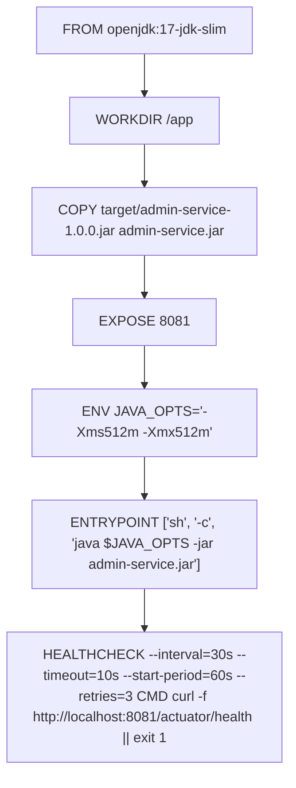
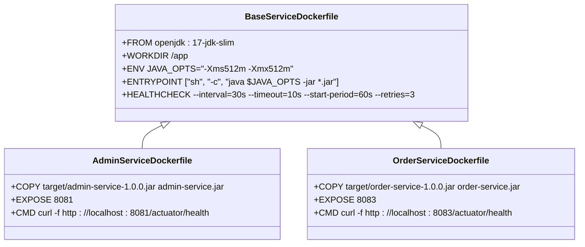
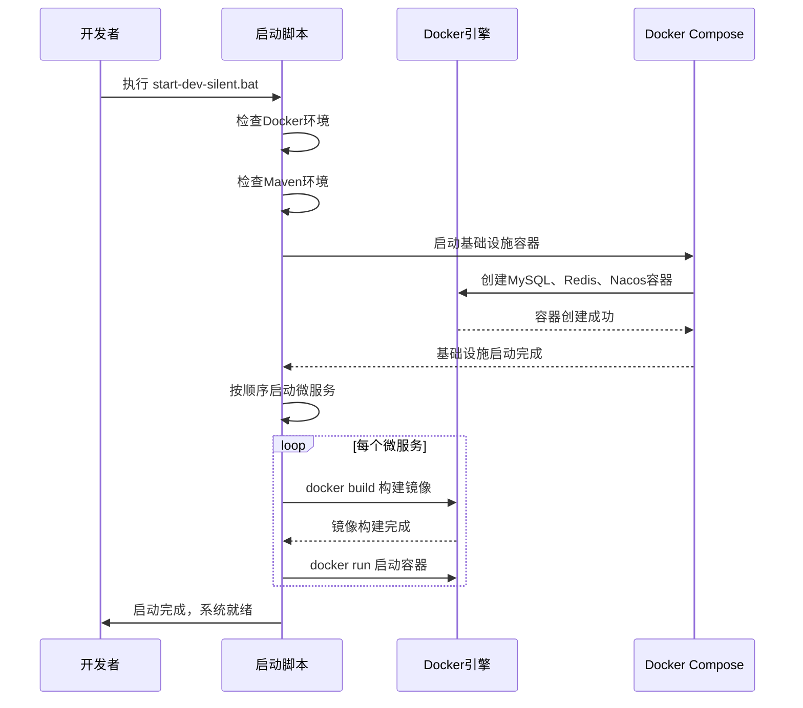

# 构建策略

<cite>
**本文档引用文件**   
- [admin-service/Dockerfile](file://backend/admin-service/Dockerfile)
- [order-service/Dockerfile](file://backend/order-service/Dockerfile)
- [admin-service/pom.xml](file://backend/admin-service/pom.xml)
- [order-service/pom.xml](file://backend/order-service/pom.xml)
- [admin-service/application-docker.yml](file://backend/admin-service/src/main/resources/application-docker.yml)
- [order-service/application-docker.yml](file://backend/order-service/src/main/resources/application-docker.yml)
- [docker-compose.yml](file://docker-compose.yml)
- [start-dev-silent.bat](file://start-dev-silent.bat)
- [start-docker.bat](file://start-docker.bat)
</cite>

## 目录

1. [Docker镜像构建策略概述](#docker镜像构建策略概述)  
2. [核心Dockerfile分析](#核心dockerfile分析)  
3. [微服务Dockerfile共性与差异](#微服务dockerfile共性与差异)  
4. [构建优化建议](#构建优化建议)  
5. [常见构建问题及解决方案](#常见构建问题及解决方案)  
6. [健康检查机制详解](#健康检查机制详解)  
7. [环境变量与JVM调优](#环境变量与jvm调优)  
8. [容器化部署流程](#容器化部署流程)

## Docker镜像构建策略概述

本项目采用Docker容器化部署方案，所有后端微服务均通过Docker镜像方式运行。每个微服务模块（如admin-service、order-service等）均包含独立的Dockerfile，用于构建可执行的容器镜像。整体部署通过`docker-compose.yml`文件进行编排管理，实现基础设施与业务服务的统一启动与配置。

构建策略基于OpenJDK 17运行环境，使用轻量级基础镜像`openjdk:17-jdk-slim`，确保镜像体积最小化的同时满足Spring Boot应用运行需求。各服务通过Maven打包生成JAR文件后，由Dockerfile进行镜像构建，最终通过Docker Compose统一编排启动。

**Section sources**  
- [docker-compose.yml](file://docker-compose.yml#L1-L38)  
- [start-dev-silent.bat](file://start-dev-silent.bat#L99-L104)  
- [start-docker.bat](file://start-docker.bat#L32-L38)

## 核心Dockerfile分析

以`admin-service`服务为例，其Dockerfile实现了标准化的Java应用容器化流程。该文件定义了从基础镜像选择、工作目录设置、JAR包复制、端口暴露、环境变量配置到启动命令执行的完整构建流程。



**Diagram sources**  
- [backend/admin-service/Dockerfile](file://backend/admin-service/Dockerfile#L1-L14)

### 基础镜像选择

采用`openjdk:17-jdk-slim`作为基础镜像，该镜像具有以下优势：
- 基于Debian Slim版本，系统体积小，安全性高
- 预装OpenJDK 17 JDK，满足Spring Boot 3.x运行要求
- 适合生产环境部署，避免不必要的系统组件

### 工作目录与文件复制

通过`WORKDIR /app`指令设置容器内工作目录为`/app`，所有应用相关操作均在此目录下执行。使用`COPY`指令将Maven构建生成的JAR包从宿主机`target/`目录复制到容器中，并重命名为`admin-service.jar`，便于统一管理。

### 端口暴露配置

`EXPOSE 8081`指令声明容器在运行时监听8081端口。该端口为admin-service服务的HTTP服务端口，用于接收外部请求。此指令仅为声明性配置，实际端口映射需在`docker-compose.yml`中定义。

**Section sources**  
- [backend/admin-service/Dockerfile](file://backend/admin-service/Dockerfile#L1-L7)  
- [backend/admin-service/application-docker.yml](file://backend/admin-service/src/main/resources/application-docker.yml#L1-L38)

## 微服务Dockerfile共性与差异

通过对`admin-service`和`order-service`两个服务的Dockerfile对比分析，可以总结出项目中微服务容器化构建的共性模式与差异化配置。

### 共性特征

所有微服务Dockerfile均遵循统一的构建规范：
- 使用相同的`openjdk:17-jdk-slim`基础镜像
- 设置相同的工作目录`/app`
- 采用一致的JAR包复制与命名规则
- 配置相同的JVM内存参数（512MB堆内存）
- 使用相同的ENTRYPOINT执行方式
- 实现一致的健康检查策略（间隔30秒，超时10秒，启动等待60秒，重试3次）



**Diagram sources**  
- [backend/admin-service/Dockerfile](file://backend/admin-service/Dockerfile#L1-L14)  
- [backend/order-service/Dockerfile](file://backend/order-service/Dockerfile#L1-L14)

### 差异化配置

尽管构建模式统一，各服务仍存在以下差异化配置：
- **JAR包名称不同**：根据服务名称命名，如`admin-service.jar`与`order-service.jar`
- **暴露端口不同**：各服务使用独立端口，避免冲突，如admin-service使用8081，order-service使用8083
- **健康检查端点路径一致但端口不同**：均检查`/actuator/health`端点，但基于各自服务端口

这些差异化配置通过Maven的`pom.xml`文件进行管理，确保构建时能正确生成对应的服务包。

**Section sources**  
- [backend/admin-service/Dockerfile](file://backend/admin-service/Dockerfile#L5-L7)  
- [backend/order-service/Dockerfile](file://backend/order-service/Dockerfile#L5-L7)  
- [backend/admin-service/pom.xml](file://backend/admin-service/pom.xml#L13-L15)  
- [backend/order-service/pom.xml](file://backend/order-service/pom.xml#L13-L15)

## 构建优化建议

为提升Docker镜像构建效率与运行性能，提出以下优化建议：

### 多阶段构建

建议采用多阶段构建（Multi-stage Build）策略，将构建环境与运行环境分离。第一阶段使用包含完整构建工具的镜像进行Maven打包，第二阶段使用轻量级运行时镜像复制JAR包并运行。

```dockerfile
# 构建阶段
FROM maven:3.8-openjdk-17 AS builder
WORKDIR /build
COPY pom.xml .
COPY src ./src
RUN mvn clean package -DskipTests

# 运行阶段
FROM openjdk:17-jdk-slim
WORKDIR /app
COPY --from=builder /build/target/*.jar app.jar
EXPOSE 8081
ENTRYPOINT ["java", "-jar", "app.jar"]
```

此方案可显著减小最终镜像体积，提升安全性。

### 镜像分层优化

合理利用Docker镜像分层机制，将不变内容与易变内容分离：
- 基础镜像层：`openjdk:17-jdk-slim`
- 依赖库层：通过`COPY`命令复制`lib`目录（若存在）
- 应用代码层：最后复制JAR包

这样在代码变更时，仅重建应用代码层，复用之前的缓存层，加快构建速度。

### 构建缓存利用

在CI/CD流程中启用Docker构建缓存，通过`--cache-from`参数指定缓存镜像，避免重复下载依赖和重新编译。

**Section sources**  
- [backend/admin-service/Dockerfile](file://backend/admin-service/Dockerfile#L1-L14)  
- [backend/order-service/Dockerfile](file://backend/order-service/Dockerfile#L1-L14)

## 常见构建问题及解决方案

在Docker镜像构建过程中，可能遇到以下常见问题及其解决方案：

### 文件未找到错误

**问题现象**：`COPY failed: no such file or directory`  
**原因分析**：Maven未成功构建JAR包，`target/`目录下无对应文件  
**解决方案**：
1. 确保先执行`mvn clean package`完成构建
2. 检查`pom.xml`中`<artifactId>`与Dockerfile中文件名是否匹配
3. 确认构建目录路径正确

### 权限错误

**问题现象**：容器启动时提示权限不足  
**原因分析**：JAR文件或目录权限设置不当  
**解决方案**：
- 在Dockerfile中添加权限设置指令：`RUN chmod +x /app/*.jar`
- 确保宿主机构建用户具有足够权限

### 端口冲突

**问题现象**：容器启动失败，提示端口已被占用  
**原因分析**：宿主机8081等端口被其他进程占用  
**解决方案**：
1. 使用`netstat -ano | findstr :8081`查找占用进程
2. 终止占用进程或修改`docker-compose.yml`中端口映射
3. 检查`start-dev-silent.bat`中服务端口配置

### 环境依赖缺失

**问题现象**：构建或运行时缺少Maven或Docker  
**解决方案**：
- 安装Docker Desktop并确保其正常运行
- 安装Maven并配置环境变量
- 使用`diagnose.ps1`脚本检查环境状态

**Section sources**  
- [start-dev-silent.bat](file://start-dev-silent.bat#L50-L93)  
- [diagnose.ps1](file://diagnose.ps1#L53-L120)  
- [STARTUP_FIXES.md](file://STARTUP_FIXES.md#L304-L311)

## 健康检查机制详解

Docker的HEALTHCHECK指令为容器提供了健康状态监控能力，确保服务真正可用而非仅容器运行。

### 配置参数解析

以admin-service为例：
```dockerfile
HEALTHCHECK --interval=30s --timeout=10s --start-period=60s --retries=3 \
  CMD curl -f http://localhost:8081/actuator/health || exit 1
```

- `--interval=30s`：检查间隔30秒
- `--timeout=10s`：每次检查超时时间为10秒
- `--start-period=60s`：容器启动后60秒内检查结果不计入失败次数
- `--retries=3`：连续3次检查失败才标记为不健康

### 检查逻辑

使用`curl -f`命令访问Spring Boot Actuator的`/actuator/health`端点：
- `-f`参数确保HTTP非200状态码时返回非零退出码
- `|| exit 1`确保命令执行失败时返回明确的失败状态
- 通过HTTP请求验证应用内部健康状态，而非仅进程存在

### 状态管理

Docker会为容器维护健康状态：
- `starting`：启动初期
- `healthy`：健康检查通过
- `unhealthy`：连续失败达到阈值

该机制与Docker Compose的依赖管理结合，可实现更可靠的微服务启动顺序控制。

**Section sources**  
- [backend/admin-service/Dockerfile](file://backend/admin-service/Dockerfile#L13-L14)  
- [backend/admin-service/pom.xml](file://backend/admin-service/pom.xml#L24-L28)  
- [backend/admin-service/application-docker.yml](file://backend/admin-service/src/main/resources/application-docker.yml#L35-L38)

## 环境变量与JVM调优

通过ENV指令配置环境变量，实现JVM运行时参数的灵活调整。

### JVM内存配置

```dockerfile
ENV JAVA_OPTS="-Xms512m -Xmx512m"
```

该配置设置JVM堆内存初始值与最大值均为512MB：
- `-Xms512m`：初始堆大小
- `-Xmx512m`：最大堆大小

此配置确保容器化应用内存使用可控，避免因内存溢出导致容器被OOM Killer终止。

### 启动命令执行

```dockerfile
ENTRYPOINT ["sh", "-c", "java $JAVA_OPTS -jar admin-service.jar"]
```

使用shell格式执行命令的优势：
- 支持环境变量替换（`$JAVA_OPTS`）
- 可执行复杂命令组合
- 兼容性好

ENTRYPOINT使用JSON数组格式确保命令被正确解析，避免字符串格式的解析歧义。

### 容器资源限制

建议在`docker-compose.yml`中配合设置资源限制：
```yaml
deploy:
  resources:
    limits:
      memory: 800M
    reservations:
      memory: 600M
```

确保容器内存限制略高于JVM堆大小，为元空间、栈空间等留出足够空间。

**Section sources**  
- [backend/admin-service/Dockerfile](file://backend/admin-service/Dockerfile#L9-L11)  
- [docker-compose.yml](file://docker-compose.yml#L10-L38)

## 容器化部署流程

完整的容器化部署流程包括构建、编排、启动三个阶段。

### 构建阶段

1. 执行Maven打包：`mvn clean package -DskipTests`
2. 执行Docker构建：`docker build -t admin-service .`
3. 重复以上步骤构建所有微服务镜像

### 编排阶段

通过`docker-compose.yml`文件定义服务依赖关系：
- 基础设施服务（MySQL、Redis、Nacos）优先启动
- 网关服务依赖注册中心
- 业务服务依赖网关和基础设施

### 启动阶段

使用批处理脚本自动化启动：
- `start-dev-silent.bat`：静默启动所有服务
- `start-docker.bat`：仅启动基础设施容器
- `restart-all-services-silent.ps1`：重启所有服务

启动流程包含环境检查、基础设施启动、微服务启动、状态验证等步骤，确保系统稳定运行。



**Diagram sources**  
- [start-dev-silent.bat](file://start-dev-silent.bat#L47-L123)  
- [docker-compose.yml](file://docker-compose.yml#L1-L38)  
- [start-docker.bat](file://start-docker.bat#L1-L60)