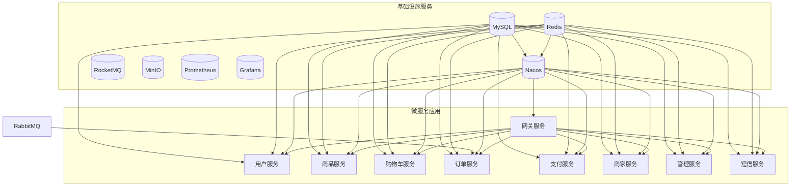
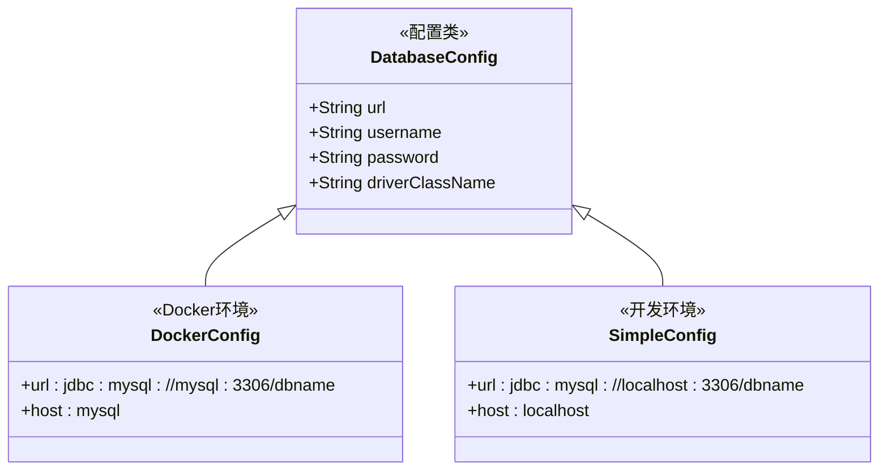
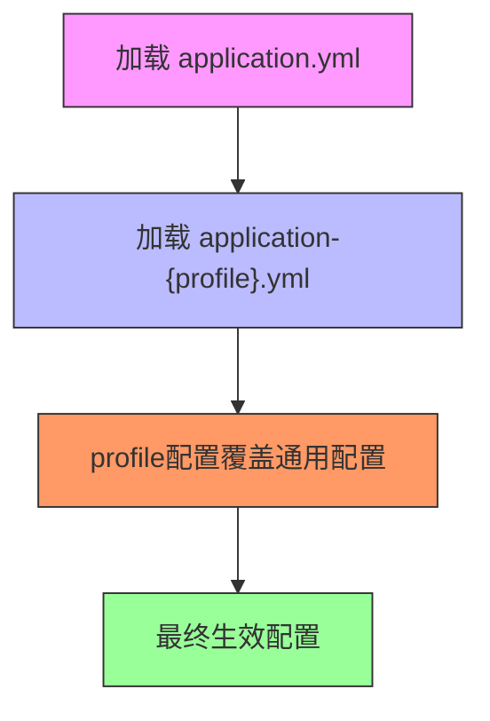
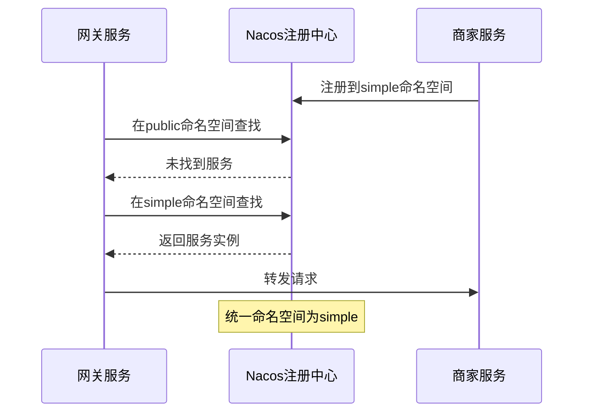
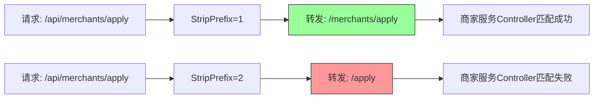

# 环境管理

<cite>
**本文档引用的文件**   
- [docker-compose.yml](file://docker-compose.yml)
- [docker-compose-dev.yml](file://docker-compose-dev.yml)
- [application-docker.yml](file://backend/admin-service/src/main/resources/application-docker.yml)
- [application-simple.yml](file://backend/gateway-service/src/main/resources/application-simple.yml)
- [application-docker.yml](file://backend/user-service/src/main/resources/application-docker.yml)
- [application-docker.yml](file://backend/merchant-service/src/main/resources/application-docker.yml)
- [商家入驻404问题-根本修复完成.md](file://商家入驻404问题-根本修复完成.md)
</cite>

## 目录
1. [多环境配置策略](#多环境配置策略)
2. [Docker生产环境编排](#docker生产环境编排)
3. [开发环境轻量级启动](#开发环境轻量级启动)
4. [微服务环境差异化配置](#微服务环境差异化配置)
5. [环境切换最佳实践](#环境切换最佳实践)
6. [配置冲突解决方案](#配置冲突解决方案)

## 多环境配置策略

本项目采用Spring Profiles机制实现多环境配置管理，通过`SPRING_PROFILES_ACTIVE`环境变量控制不同环境下的配置加载。核心配置文件包括：
- `application.yml`：基础通用配置
- `application-docker.yml`：Docker生产环境专用配置
- `application-simple.yml`：简化开发环境配置

配置优先级遵循Spring Boot规则：`application-{profile}.yml` > `application.yml`，当激活特定profile时，对应配置文件中的属性会覆盖基础配置。

**Section sources**
- [application-docker.yml](file://backend/admin-service/src/main/resources/application-docker.yml)
- [application-simple.yml](file://backend/gateway-service/src/main/resources/application-simple.yml)
- [商家入驻404问题-根本修复完成.md](file://商家入驻404问题-根本修复完成.md#L340-L348)

## Docker生产环境编排

通过`docker-compose.yml`文件实现生产环境的完整基础设施与服务编排，包含完整的微服务生态系统。



**Diagram sources **
- [docker-compose.yml](file://docker-compose.yml#L9-L452)

**Section sources**
- [docker-compose.yml](file://docker-compose.yml#L1-L485)

## 开发环境轻量级启动

通过`docker-compose-dev.yml`实现开发环境的轻量级基础设施启动，仅包含核心依赖服务。

```mermaid
graph TD
MySQL[(MySQL)]
Redis[(Redis)]
Nacos[(Nacos)]
MySQL --> Nacos
Redis --> Nacos
subgraph "健康检查"
MySQL --> HC1["健康检查: mysqladmin ping"]
Redis --> HC2["健康检查: redis-cli ping"]
Nacos --> HC3["健康检查: curl /nacos/actuator/health"]
end
subgraph "启动依赖"
MySQL -.-> Nacos
Nacos -.-> "其他微服务"
end
```

**Diagram sources **
- [docker-compose-dev.yml](file://docker-compose-dev.yml#L8-L78)

**Section sources**
- [docker-compose-dev.yml](file://docker-compose-dev.yml#L1-L92)

## 微服务环境差异化配置

各微服务通过`SPRING_PROFILES_ACTIVE`环境变量加载对应的配置文件，实现环境差异化配置。

### 数据库连接配置



**Diagram sources **
- [application-docker.yml](file://backend/user-service/src/main/resources/application-docker.yml#L3-L7)
- [application-simple.yml](file://backend/gateway-service/src/main/resources/application-simple.yml#L5-L9)

### 注册中心与Redis配置

微服务在不同环境下的注册中心和Redis配置差异：

| 配置项 | Docker环境 | 开发环境 |
|--------|------------|----------|
| **Nacos地址** | nacos:8848 | localhost:8848 |
| **Nacos命名空间** | docker | simple |
| **Redis主机** | redis | localhost |
| **Redis端口** | 6379 | 6379 |
| **Redis数据库** | 0-2 | 0-2 |

**Section sources**
- [application-docker.yml](file://backend/merchant-service/src/main/resources/application-docker.yml#L40-L45)
- [application-simple.yml](file://backend/gateway-service/src/main/resources/application-simple.yml#L7-L13)

## 环境切换最佳实践

### 配置文件优先级

遵循Spring Boot的配置优先级规则，确保环境特定配置能够正确覆盖通用配置。



**Diagram sources **
- [商家入驻404问题-根本修复完成.md](file://商家入驻404问题-根本修复完成.md#L340-L348)

### 环境变量覆盖规则

环境变量的优先级高于配置文件，可通过Docker环境变量实现配置覆盖：

1. 命令行参数（最高优先级）
2. 系统环境变量
3. 配置文件中的环境变量
4. application-{profile}.yml
5. application.yml（最低优先级）

**Section sources**
- [docker-compose.yml](file://docker-compose.yml#L242-L248)
- [docker-compose.yml](file://docker-compose.yml#L270-L279)

## 配置冲突解决方案

### Nacos命名空间不匹配问题

当服务注册与发现的命名空间不一致时会导致服务无法发现，解决方案：



**Diagram sources **
- [商家入驻404问题-根本修复完成.md](file://商家入驻404问题-根本修复完成.md#L98-L107)

### StripPrefix配置错误

路由前缀剥离配置错误会导致路径不匹配，正确配置应确保路径转换正确：



**Diagram sources **
- [商家入驻404问题-根本修复完成.md](file://商家入驻404问题-根本修复完成.md#L118-L124)

**Section sources**
- [商家入驻404问题-根本修复完成.md](file://商家入驻404问题-根本修复完成.md#L55-L73)
- [application-simple.yml](file://backend/gateway-service/src/main/resources/application-simple.yml#L102-L107)