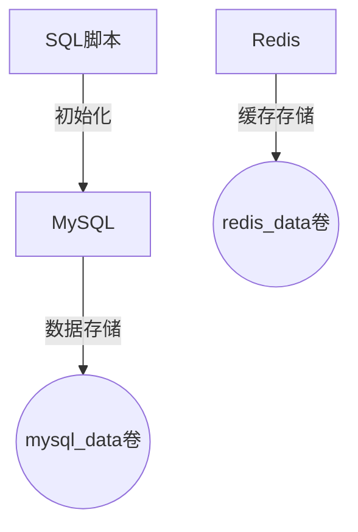
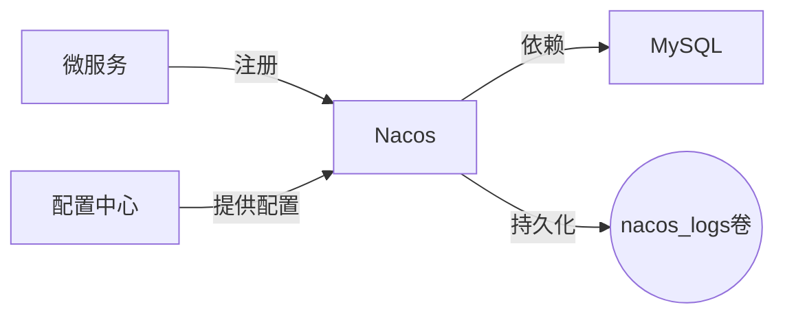
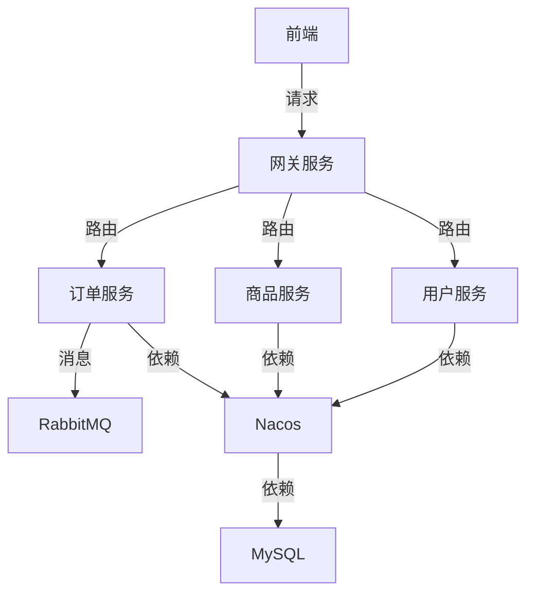
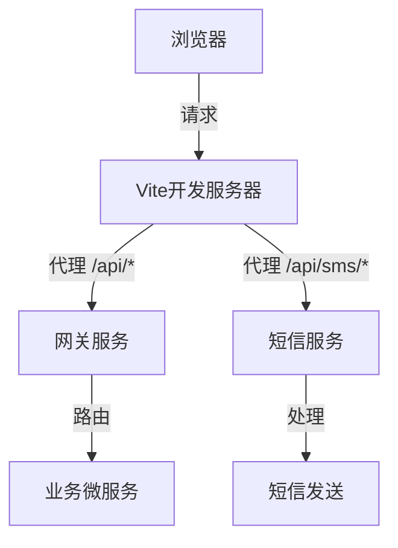
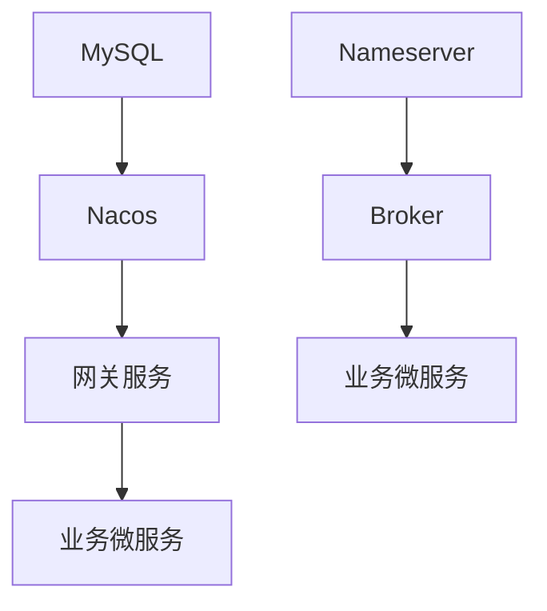

# 编排配置

<cite>
**本文档引用文件**   
- [docker-compose.yml](file://docker-compose.yml)
- [docker-compose-dev.yml](file://docker-compose-dev.yml)
- [prometheus.yml](file://config/prometheus.yml)
- [broker.conf](file://config/broker.conf)
- [vite.config.js](file://frontend/vite.config.js)
- [request.js](file://frontend/src/utils/request.js)
</cite>

## 目录
1. [生产环境编排文件解析](#生产环境编排文件解析)
2. [开发环境编排文件解析](#开发环境编排文件解析)
3. [基础设施服务详解](#基础设施服务详解)
4. [业务微服务详解](#业务微服务详解)
5. [前端服务容器化机制](#前端服务容器化机制)
6. [网络与卷配置](#网络与卷配置)
7. [服务依赖与启动顺序](#服务依赖与启动顺序)
8. [环境变量与配置注入](#环境变量与配置注入)
9. [常见编排问题排查](#常见编排问题排查)

## 生产环境编排文件解析

`docker-compose.yml` 文件定义了完整的生产级容器编排方案，包含基础设施服务、业务微服务和前端服务。该文件通过 Docker 统一启动整个平台，采用 Spring Boot 可执行 JAR 方式运行后端微服务，仅暴露网关端口到宿主机，其他服务通过容器网络内的注册中心互通。

文件采用模块化结构，首先定义了 MySQL、Redis、Nacos 等基础设施服务，随后配置了 Sentinel、RocketMQ、Elasticsearch 等中间件，接着定义了短信、网关、用户、商品等业务微服务，最后配置了前端 Vite 开发服务器。所有服务均连接到名为 `mall-network` 的自定义桥接网络，确保容器间通信安全。

**Section sources**
- [docker-compose.yml](file://docker-compose.yml#L1-L485)

## 开发环境编排文件解析

`docker-compose-dev.yml` 文件专为本地开发设计，仅启动必要的基础设施服务，包括 MySQL、Redis 和 Nacos。与生产环境相比，该文件具有以下特点：容器名称带有 `-dev` 后缀以示区分，使用独立的 `mall-dev-network` 网络实现环境隔离，配置了健康检查机制确保服务就绪。

该文件通过 `depends_on` 条件 `service_healthy` 确保 Nacos 在 MySQL 健康后才启动，避免了因依赖服务未就绪导致的启动失败。开发人员可使用 `docker-compose -f docker-compose-dev.yml up -d` 命令快速启动基础设施，然后在本地 IDE 中运行微服务进行开发调试，提高了开发效率并减少了资源消耗。

**Section sources**
- [docker-compose-dev.yml](file://docker-compose-dev.yml#L1-L92)

## 基础设施服务详解

### 数据库与缓存服务
MySQL 服务使用 `mysql:8.0` 镜像，容器名为 `mall-mysql`，通过端口映射 `3307:3306` 暴露给宿主机。数据持久化通过命名卷 `mysql_data` 实现，初始化脚本从 `./sql` 目录挂载。Redis 服务使用 `redis:7-alpine` 镜像，容器名为 `mall-redis`，通过 `redis_data` 卷持久化数据，并启用 AOF 持久化。

**Diagram sources**
- [docker-compose.yml](file://docker-compose.yml#L9-L38)

### 服务注册与配置中心
Nacos 服务作为注册中心和配置中心，使用 `nacos/nacos-server:v2.3.0` 镜像，容器名为 `mall-nacos`。它依赖于 MySQL 服务，通过环境变量配置数据库连接信息，并将日志持久化到 `nacos_logs` 卷。Nacos 通过 `8848` 和 `9848` 端口暴露，供微服务注册和配置拉取。

**Diagram sources**
- [docker-compose.yml](file://docker-compose.yml#L40-L63)

### 消息队列与监控系统
RocketMQ 由 Nameserver 和 Broker 两个服务组成，Nameserver 作为路由发现服务，Broker 作为消息存储和转发服务。Prometheus 和 Grafana 构成监控体系，Prometheus 通过 `./config/prometheus.yml` 配置文件抓取各服务的监控指标，Grafana 则从 Prometheus 读取数据进行可视化展示。

**Section sources**
- [docker-compose.yml](file://docker-compose.yml#L76-L211)
- [prometheus.yml](file://config/prometheus.yml#L1-L45)
- [broker.conf](file://config/broker.conf#L1-L78)

## 业务微服务详解

### 网关与核心业务服务
网关服务 (`gateway-service`) 作为系统的唯一对外入口，使用 `eclipse-temurin:17-jre` 镜像，通过 `8080` 端口暴露。它依赖于 MySQL、Nacos 和 Redis 服务，通过 `depends_on` 确保依赖服务先启动。业务微服务包括用户服务、商品服务、购物车服务、商家服务、订单服务和支付服务，均采用相同的容器化模式。

各微服务通过挂载 `./backend/[service-name]/target` 目录，将编译后的 JAR 文件注入容器，并以 `java -jar` 命令启动。环境变量 `SPRING_PROFILES_ACTIVE` 设置为 `docker`，指示服务使用 Docker 环境配置。订单服务额外依赖 RabbitMQ，用于异步处理订单消息。

**Diagram sources**
- [docker-compose.yml](file://docker-compose.yml#L258-L452)

### 短信服务
短信服务 (`sms-service`) 作为独立的业务服务，提供短信发送功能。它同样使用 `eclipse-temurin:17-jre` 镜像，通过 `8083` 端口暴露。服务依赖于 MySQL、Nacos 和 Redis，用于存储短信记录、服务发现和缓存验证码。环境变量配置了 Nacos 和 Redis 的连接地址，确保服务能正确注册和通信。

**Section sources**
- [docker-compose.yml](file://docker-compose.yml#L229-L257)

## 前端服务容器化机制

前端服务使用 `node:18-alpine` 镜像，容器名为 `mall-frontend`。通过挂载 `./frontend` 目录，将前端源码注入容器。启动命令 `npm install && npm run dev -- --host 0.0.0.0` 确保 Vite 开发服务器绑定到 `0.0.0.0`，允许容器外访问。

Vite 配置文件 `vite.config.js` 中的代理设置是关键，它将 `/api` 前缀的请求代理到网关服务 `http://localhost:8080`，实现了前后端分离开发。同时配置了 `/api/sms` 的特殊代理规则，当网关未启动时可直连短信服务进行联调。

**Diagram sources**
- [docker-compose.yml](file://docker-compose.yml#L453-L468)
- [vite.config.js](file://frontend/vite.config.js#L1-L73)

## 网络与卷配置

### 自定义网络
生产环境使用名为 `mall-network` 的自定义桥接网络，所有服务均连接到此网络，实现容器间的安全通信。开发环境使用独立的 `mall-dev-network` 网络，避免了环境间的干扰。自定义网络提供了服务发现功能，容器可通过服务名称直接通信。

### 数据卷管理
文件定义了多个命名卷用于数据持久化，包括 `mysql_data`、`redis_data`、`nacos_logs`、`prometheus_data` 等。这些卷由 Docker 管理，确保容器重启后数据不丢失。RocketMQ 的 `broker.conf` 配置文件以只读方式挂载，保证了配置的一致性。

**Section sources**
- [docker-compose.yml](file://docker-compose.yml#L469-L485)
- [docker-compose-dev.yml](file://docker-compose-dev.yml#L80-L92)

## 服务依赖与启动顺序

`depends_on` 指令定义了服务间的启动依赖关系。Nacos 依赖于 MySQL，确保数据库就绪后再启动注册中心。RocketMQ Broker 依赖于 Nameserver，保证消息队列的路由服务先运行。业务微服务普遍依赖于 MySQL、Nacos 和 Redis，形成清晰的启动链条。

尽管 `depends_on` 只能确保容器进程启动，不能保证应用就绪，但结合健康检查机制可有效解决此问题。例如，开发环境中的 Nacos 配置了健康检查，等待其 `/nacos/actuator/health` 接口返回成功后才认为服务健康。

**Diagram sources**
- [docker-compose.yml](file://docker-compose.yml#L59-L61)
- [docker-compose.yml](file://docker-compose.yml#L109-L110)

## 环境变量与配置注入

环境变量是微服务配置的核心。通过 `environment` 指令，将数据库密码、Redis 主机、Nacos 地址等配置注入容器。例如，`SPRING_CLOUD_NACOS_DISCOVERY_SERVER_ADDR: "nacos:8848"` 指定了 Nacos 服务的地址，微服务通过此地址进行注册。

配置文件通过卷挂载方式注入，如 Prometheus 的 `prometheus.yml` 和 RocketMQ 的 `broker.conf`。这种方式实现了配置与代码的分离，便于在不同环境中使用不同的配置。

**Section sources**
- [docker-compose.yml](file://docker-compose.yml#L15-L17)
- [docker-compose.yml](file://docker-compose.yml#L46-L53)

## 常见编排问题排查

### 服务启动超时
当服务启动时间超过 Docker 默认超时限制时，可能导致启动失败。解决方案是增加 `docker-compose up` 的超时时间，或优化服务启动逻辑。检查日志 `docker-compose logs [service]` 可定位具体原因。

### 依赖服务不可达
此问题通常由网络配置错误或服务启动顺序不当引起。确保所有服务连接到同一网络，并正确配置 `depends_on`。使用 `docker network inspect mall-network` 检查网络连接情况。

### 端口冲突
确保宿主机端口未被占用，特别是 `3307` (MySQL)、`6379` (Redis)、`8848` (Nacos) 和 `8080` (网关)。使用 `netstat -an | findstr [port]` (Windows) 或 `lsof -i :[port]` (Linux/Mac) 检查端口占用。

**Section sources**
- [UPDATE_SUMMARY.md](file://UPDATE_SUMMARY.md#L330-L335)
- [start-dev-silent.bat](file://start-dev-silent.bat#L111-L114)
- [start-docker.bat](file://start-docker.bat#L15-L18)