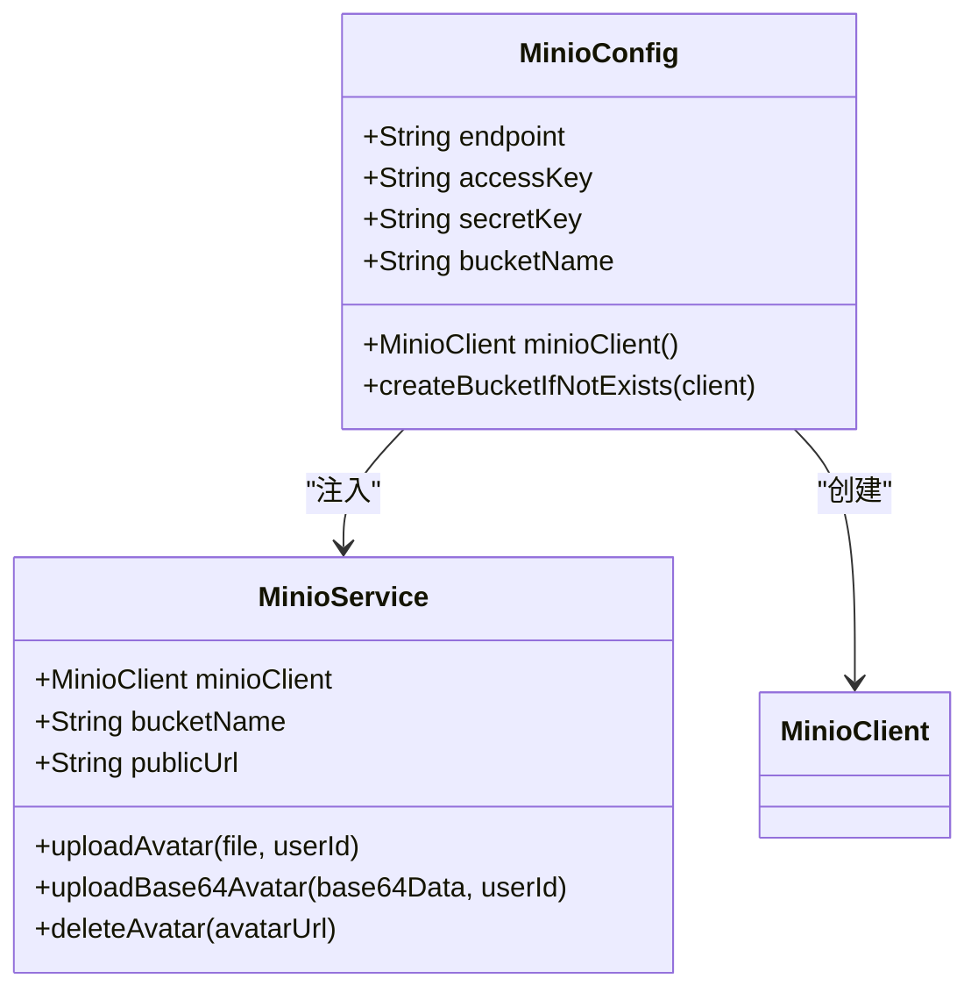
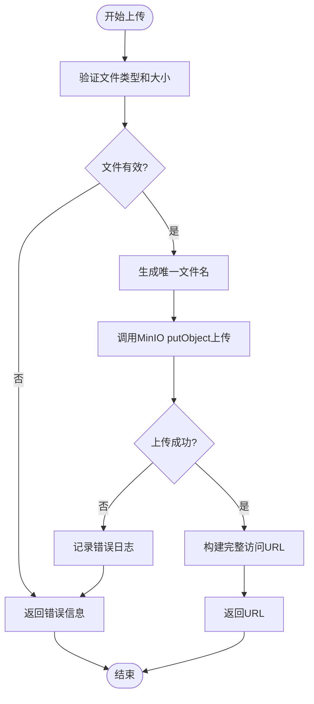
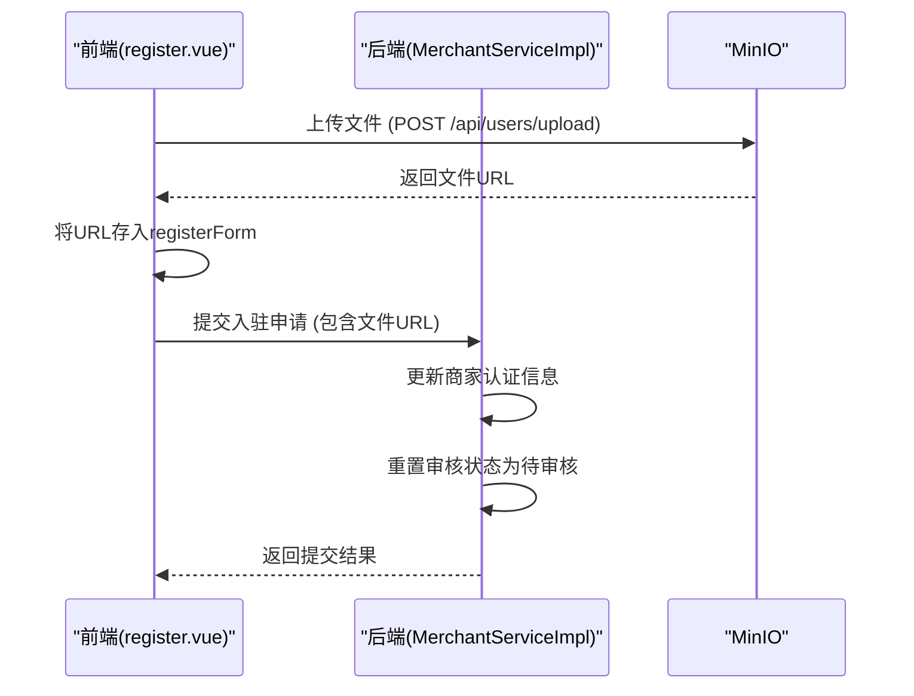
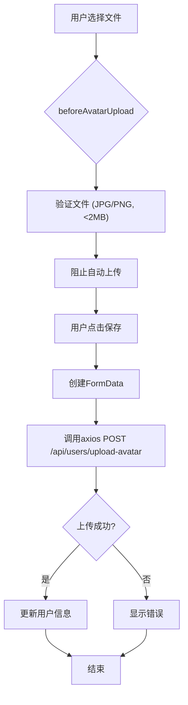

# 对象存储

<cite>
**本文档引用文件**  
- [docker-compose.yml](file://docker-compose.yml#L159-L174)
- [MinioConfig.java](file://backend/merchant-service/src/main/java/com/mall/merchant/config/MinioConfig.java#L1-L33)
- [MinioConfig.java](file://backend/user-service/src/main/java/com/mall/user/config/MinioConfig.java#L1-L91)
- [MinioService.java](file://backend/user-service/src/main/java/com/mall/user/service/MinioService.java#L1-L206)
- [FileUploadService.java](file://backend/merchant-service/src/main/java/com/mall/merchant/service/FileUploadService.java#L1-L143)
- [MerchantServiceImpl.java](file://backend/merchant-service/src/main/java/com/mall/merchant/service/impl/MerchantServiceImpl.java#L446-L487)
- [MerchantProductController.java](file://backend/merchant-service/src/main/java/com/mall/merchant/controller/MerchantProductController.java#L48-L73)
- [register.vue](file://frontend/src/views/merchant/auth/register.vue#L204-L214)
- [profile.vue](file://frontend/src/views/user/profile.vue#L375-L380)
</cite>

## 目录
1. [MinIO服务配置](#minio服务配置)
2. [MinIO客户端配置](#minio客户端配置)
3. [文件上传与下载流程](#文件上传与下载流程)
4. [商家资质文件上传实现](#商家资质文件上传实现)
5. [MinIO控制台与存储桶管理](#minio控制台与存储桶管理)
6. [前端文件上传集成](#前端文件上传集成)

## MinIO服务配置

在`docker-compose.yml`文件中，MinIO服务通过Docker容器化部署，配置了API端口、控制台端口、持久化卷和管理员凭据。该服务作为对象存储核心，为整个系统提供文件存储能力。

```mermaid
graph TB
subgraph "MinIO服务配置"
A[MinIO容器] --> B[API端口: 9000]
A --> C[控制台端口: 9001]
A --> D[持久化卷: minio_data]
A --> E[管理员凭据: minioadmin/minioadmin]
A --> F[启动命令: server /data --console-address ":9001"]
end
```

**Diagram sources**
- [docker-compose.yml](file://docker-compose.yml#L159-L174)

**Section sources**
- [docker-compose.yml](file://docker-compose.yml#L159-L174)

## MinIO客户端配置

系统在`merchant-service`和`user-service`两个微服务中均配置了MinIO客户端。`merchant-service`的`MinioConfig`类通过Spring Boot的`@Value`注解注入配置，创建`MinioClient` Bean，连接到本地MinIO服务器。`user-service`的`MinioConfig`则更加完善，在客户端初始化时会自动检查并创建指定的存储桶（bucket），同时设置存储桶为公开读权限，以便头像等资源可被外部访问。



**Diagram sources**
- [MinioConfig.java](file://backend/user-service/src/main/java/com/mall/user/config/MinioConfig.java#L1-L91)
- [MinioService.java](file://backend/user-service/src/main/java/com/mall/user/service/MinioService.java#L1-L206)

**Section sources**
- [MinioConfig.java](file://backend/merchant-service/src/main/java/com/mall/merchant/config/MinioConfig.java#L1-L33)
- [MinioConfig.java](file://backend/user-service/src/main/java/com/mall/user/config/MinioConfig.java#L1-L91)

## 文件上传与下载流程

文件上传流程主要由`MinioService`和`FileUploadService`实现。`MinioService`负责用户头像的上传，生成格式为`avatar_{userId}_{timestamp}.{ext}`的唯一文件名，并上传至MinIO。`FileUploadService`则用于商品图片上传，生成`product_{timestamp}_{uuid}.{ext}`格式的文件名。两个服务都实现了文件验证，包括文件类型（仅限图片）和大小限制（头像2MB，商品图片5MB）。文件上传成功后，返回包含`publicUrl`、`bucketName`和`fileName`的完整访问URL。



**Diagram sources**
- [MinioService.java](file://backend/user-service/src/main/java/com/mall/user/service/MinioService.java#L47-L104)
- [FileUploadService.java](file://backend/merchant-service/src/main/java/com/mall/merchant/service/FileUploadService.java#L81-L97)

**Section sources**
- [MinioService.java](file://backend/user-service/src/main/java/com/mall/user/service/MinioService.java#L1-L206)
- [FileUploadService.java](file://backend/merchant-service/src/main/java/com/mall/merchant/service/FileUploadService.java#L1-L143)

## 商家资质文件上传实现

在商家入驻流程中，商家需要上传营业执照、身份证正反面等资质文件。该功能在`MerchantServiceImpl`的`submitAuthentication`方法中实现，接收商家ID和包含资质文件URL的`Merchant`对象，更新商家认证信息并重置审核状态为待审核。前端`register.vue`组件通过`el-upload`组件上传文件，上传成功后将返回的URL存入`registerForm`表单中，最终随入驻申请一并提交。



**Diagram sources**
- [MerchantServiceImpl.java](file://backend/merchant-service/src/main/java/com/mall/merchant/service/impl/MerchantServiceImpl.java#L446-L487)
- [register.vue](file://frontend/src/views/merchant/auth/register.vue#L204-L214)

**Section sources**
- [MerchantServiceImpl.java](file://backend/merchant-service/src/main/java/com/mall/merchant/service/impl/MerchantServiceImpl.java#L446-L487)
- [register.vue](file://frontend/src/views/merchant/auth/register.vue#L204-L214)

## MinIO控制台与存储桶管理

MinIO服务通过9001端口暴露Web控制台，可通过`http://localhost:9001`访问，使用`minioadmin`/`minioadmin`登录。`user-service`在启动时会自动创建名为`user-avatars`的存储桶，并通过`SetBucketPolicyArgs`设置其为公开读权限，允许外部直接访问头像图片。`merchant-service`同样会创建`mall-products`存储桶用于商品图片，并设置公开读权限。存储桶的名称、访问密钥和公共URL均通过Spring Boot的`application.yml`配置文件注入。

**Section sources**
- [MinioConfig.java](file://backend/user-service/src/main/java/com/mall/user/config/MinioConfig.java#L28-L30)
- [FileUploadService.java](file://backend/merchant-service/src/main/java/com/mall/merchant/service/FileUploadService.java#L30-L34)

## 前端文件上传集成

前端使用Element Plus的`el-upload`组件集成文件上传功能。在用户个人中心`profile.vue`中，用户选择头像后，通过`beforeAvatarUpload`钩子进行文件类型和大小验证，阻止自动上传。随后在`saveAvatar`方法中，使用`axios`手动将文件通过`FormData`上传至`/api/users/upload-avatar`接口。上传成功后，将返回的URL更新到用户信息中。商家入驻页面`register.vue`也采用了相同的模式，上传营业执照和身份证照片。



**Diagram sources**
- [profile.vue](file://frontend/src/views/user/profile.vue#L324-L400)

**Section sources**
- [profile.vue](file://frontend/src/views/user/profile.vue#L324-L400)
- [register.vue](file://frontend/src/views/merchant/auth/register.vue#L654-L666)