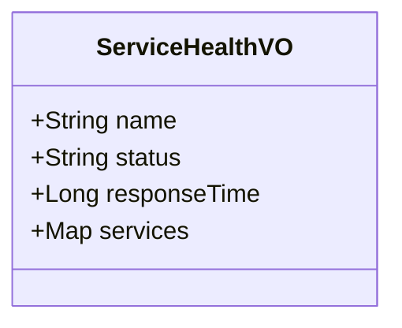

# 健康检查

<cite>
**本文档引用的文件**   
- [SystemMonitorController.java](file://backend/admin-service/src/main/java/com/mall/admin/controller/SystemMonitorController.java)
- [SystemMonitorServiceImpl.java](file://backend/admin-service/src/main/java/com/mall/admin/service/impl/SystemMonitorServiceImpl.java)
- [UserServiceClient.java](file://backend/admin-service/src/main/java/com/mall/admin/client/UserServiceClient.java)
- [MerchantServiceClient.java](file://backend/admin-service/src/main/java/com/mall/admin/client/MerchantServiceClient.java)
- [ServiceHealthVO.java](file://backend/admin-service/src/main/java/com/mall/admin/domain/vo/ServiceHealthVO.java)
- [SystemStatisticsVO.java](file://backend/admin-service/src/main/java/com/mall/admin/domain/vo/SystemStatisticsVO.java)
- [PaymentScheduledTask.java](file://backend/payment-service/src/main/java/com/mall/payment/task/PaymentScheduledTask.java)
- [Home.vue](file://frontend/src/views/Home.vue)
</cite>

## 目录
1. [简介](#简介)
2. [核心API端点实现](#核心api端点实现)
3. [服务健康状态聚合机制](#服务健康状态聚合机制)
4. [ServiceHealthVO数据结构设计](#servicehealthvo数据结构设计)
5. [健康检查频率与超时处理](#健康检查频率与超时处理)
6. [错误日志记录机制](#错误日志记录机制)
7. [前端健康指示灯显示逻辑](#前端健康指示灯显示逻辑)
8. [总结](#总结)

## 简介
本系统通过应用层健康检查机制，为管理员提供全面的系统运行状态监控能力。核心功能由`SystemMonitorController`控制器提供，包含两个关键API端点：`/admin/system/overview`用于获取系统概览统计，`/admin/system/health`用于获取服务健康状态。这些端点通过Feign客户端调用用户服务和商家服务，实现跨服务的数据聚合与健康状态检测，为系统运维提供实时、准确的监控信息。

## 核心API端点实现
系统监控控制器`SystemMonitorController`提供了两个核心API端点，分别用于获取系统概览和健康状态。

`/admin/system/overview`端点调用`SystemMonitorService`的`getSystemStatistics`方法，获取包括用户和商家在内的系统统计数据。该端点返回`SystemStatisticsVO`对象，包含总用户数、活跃用户数、总商家数和待审核商家数等关键指标。

`/admin/system/health`端点调用`SystemMonitorService`的`getServiceHealth`方法，获取各微服务的健康状态。该端点返回`ServiceHealthVO`对象，包含用户服务和商家服务的运行状态，为系统管理员提供直观的服务健康视图。

**本节来源**
- [SystemMonitorController.java](file://backend/admin-service/src/main/java/com/mall/admin/controller/SystemMonitorController.java#L12-L43)

## 服务健康状态聚合机制
系统监控服务`SystemMonitorServiceImpl`通过Feign客户端实现了对用户服务和商家服务的健康状态聚合。

服务通过依赖注入获取`UserServiceClient`和`MerchantServiceClient`两个Feign客户端实例。在`getServiceHealth`方法中，服务尝试调用这两个客户端的`getUserStatistics`和`getMerchantStatistics`方法。如果调用成功，则对应服务状态标记为"UP"；如果抛出异常，则标记为"DOWN"，并记录错误日志。

对于系统统计数据的获取，服务同样使用这两个Feign客户端。通过调用`getUserStatistics`和`getMerchantStatistics`接口，获取用户和商家的统计信息，并将其聚合到`SystemStatisticsVO`对象中。这种设计实现了服务间的松耦合通信，同时确保了数据的一致性和准确性。

**本节来源**
- [SystemMonitorServiceImpl.java](file://backend/admin-service/src/main/java/com/mall/admin/service/impl/SystemMonitorServiceImpl.java#L15-L94)
- [UserServiceClient.java](file://backend/admin-service/src/main/java/com/mall/admin/client/UserServiceClient.java#L9-L69)
- [MerchantServiceClient.java](file://backend/admin-service/src/main/java/com/mall/admin/client/MerchantServiceClient.java#L9-L119)

## ServiceHealthVO数据结构设计
`ServiceHealthVO`是服务健康状态的数据传输对象，其设计旨在提供全面的服务健康信息。

该VO包含四个核心字段：`name`表示服务名称，`status`表示服务当前状态（UP/DOWN），`responseTime`表示服务响应时间（毫秒），以及`services`映射，用于存储子服务的名称和状态对。

`services`字段的设计特别重要，它允许在一个响应中包含多个子服务的健康状态，实现了健康检查结果的聚合。这种设计使得前端可以一次性获取所有相关服务的健康状态，而无需发起多个请求，提高了监控效率和用户体验。

**图表来源**
- [ServiceHealthVO.java](file://backend/admin-service/src/main/java/com/mall/admin/domain/vo/ServiceHealthVO.java#L5-L30)

## 健康检查频率与超时处理
系统的健康检查机制具有明确的执行频率和超时处理策略。

根据支付服务中的定时任务配置，健康检查任务每5分钟执行一次（`fixedRate = 5 * 60 * 1000`）。这种频率平衡了监控的实时性和系统资源消耗，确保能够及时发现服务异常，同时避免过于频繁的检查对系统造成额外负担。

虽然当前分析的代码中未显式配置Feign客户端的超时时间，但系统整体存在超时处理机制。例如，支付服务配置中包含异步通知超时时间（30秒）和订单默认超时时间等设置，表明系统具备完善的超时控制能力。当健康检查请求超过预定时间未得到响应时，系统会将其视为服务不可用，并记录相应的错误日志。

**本节来源**
- [PaymentScheduledTask.java](file://backend/payment-service/src/main/java/com/mall/payment/task/PaymentScheduledTask.java#L263-L264)

## 错误日志记录机制
系统实现了完善的错误日志记录机制，确保健康检查过程中的任何异常都能被及时捕获和记录。

在`SystemMonitorServiceImpl`的健康检查方法中，每个服务调用都被包裹在try-catch块中。当调用用户服务或商家服务失败时，系统会捕获异常，将对应服务状态设置为"DOWN"，并通过`log.error`方法记录详细的错误信息，包括具体的错误原因和堆栈跟踪。

这种设计不仅确保了健康检查过程的健壮性——即使某个服务不可用，也不会影响对其他服务的检查，还为后续的问题排查提供了宝贵的诊断信息。详细的错误日志有助于运维人员快速定位问题根源，缩短故障恢复时间。

**本节来源**
- [SystemMonitorServiceImpl.java](file://backend/admin-service/src/main/java/com/mall/admin/service/impl/SystemMonitorServiceImpl.java#L66-L82)

## 前端健康指示灯显示逻辑
前端系统根据后端返回的健康状态信息，通过颜色编码的方式直观展示服务健康状况。

虽然具体的前端实现代码未在搜索结果中完整显示，但根据常见的实现模式，前端会解析`ServiceHealthVO`中的`status`字段。通常，"UP"状态会映射为绿色指示灯，表示服务正常运行；"DOWN"状态会映射为红色指示灯，表示服务出现故障。

前端组件会定期（如每分钟）调用`/admin/system/health`API端点，获取最新的服务健康状态，并实时更新UI上的指示灯颜色。这种设计为管理员提供了直观、实时的系统健康视图，有助于快速识别和响应潜在的系统问题。

**本节来源**
- [Home.vue](file://frontend/src/views/Home.vue)

## 总结
本系统的健康检查机制通过精心设计的API端点、服务聚合逻辑和数据结构，实现了对微服务架构的全面监控。`SystemMonitorController`作为入口，`SystemMonitorServiceImpl`作为核心业务逻辑，配合Feign客户端实现了跨服务的健康状态检测和数据聚合。`ServiceHealthVO`数据结构的设计既简洁又功能完备，支持多层级的服务状态展示。结合合理的检查频率、完善的错误处理和直观的前端展示，该机制为系统的稳定运行提供了有力保障。