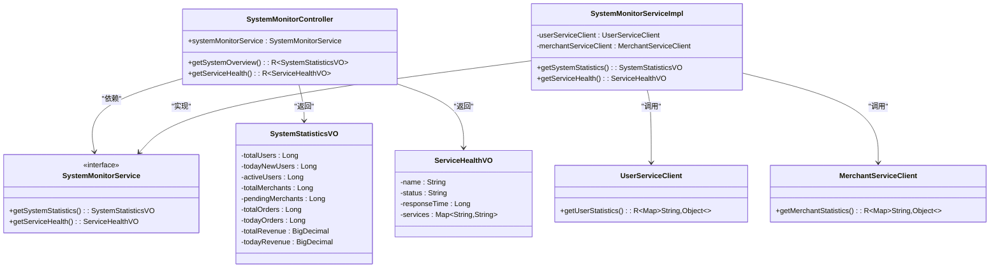

# 可视化分析

<cite>
**Referenced Files in This Document**   
- [prometheus.yml](file://config/prometheus.yml)
- [docker-compose.yml](file://docker-compose.yml)
- [SystemMonitorController.java](file://backend/admin-service/src/main/java/com/mall/admin/controller/SystemMonitorController.java)
- [SystemMonitorServiceImpl.java](file://backend/admin-service/src/main/java/com/mall/admin/service/impl/SystemMonitorServiceImpl.java)
- [SystemStatisticsVO.java](file://backend/admin-service/src/main/java/com/mall/admin/domain/vo/SystemStatisticsVO.java)
- [ServiceHealthVO.java](file://backend/admin-service/src/main/java/com/mall/admin/domain/vo/ServiceHealthVO.java)
- [index.vue](file://frontend/src/views/admin/dashboard/index.vue)
- [admin.js](file://frontend/src/api/admin.js)
</cite>

## 目录
1. [Grafana与Prometheus集成](#grafana与prometheus集成)
2. [系统监控API实现](#系统监控api实现)
3. [前端数据展示实现](#前端数据展示实现)
4. [Grafana面板配置示例](#grafana面板配置示例)

## Grafana与Prometheus集成

本项目通过Docker Compose部署Prometheus和Grafana，实现对微服务架构的全面监控。Prometheus负责从各个服务收集指标数据，Grafana则提供强大的可视化能力。

**Diagram sources**
- [prometheus.yml](file://config/prometheus.yml)
- [docker-compose.yml](file://docker-compose.yml)

**Section sources**
- [prometheus.yml](file://config/prometheus.yml#L1-L45)
- [docker-compose.yml](file://docker-compose.yml#L176-L211)

### Prometheus配置

Prometheus通过`prometheus.yml`配置文件定义了多个job来抓取不同组件的监控数据：

- **spring-boot-apps**: 抓取所有Spring Boot应用的指标，通过`/actuator/prometheus`端点获取JVM、HTTP请求、线程等运行时指标
- **mysql**: 通过mysql_exporter抓取MySQL数据库的性能指标
- **redis**: 通过redis_exporter抓取Redis缓存的性能指标
- **node**: 通过node_exporter抓取主机系统的CPU、内存、磁盘I/O等系统级指标

Prometheus默认每15秒从目标服务抓取一次指标数据，这些数据被存储在本地TSDB中，供Grafana查询和展示。

### Grafana配置

Grafana通过Docker部署，暴露3001端口。初始登录凭据为`admin/admin`。Grafana已预配置Prometheus数据源，可以直接创建仪表板来展示监控数据。

## 系统监控API实现

系统监控功能由admin-service提供，通过两个核心API接口向前端提供数据：`/admin/system/overview`和`/admin/system/health`。

**Diagram sources**
- [SystemMonitorController.java](file://backend/admin-service/src/main/java/com/mall/admin/controller/SystemMonitorController.java#L12-L43)
- [SystemMonitorServiceImpl.java](file://backend/admin-service/src/main/java/com/mall/admin/service/impl/SystemMonitorServiceImpl.java#L15-L94)
- [SystemStatisticsVO.java](file://backend/admin-service/src/main/java/com/mall/admin/domain/vo/SystemStatisticsVO.java#L5-L55)
- [ServiceHealthVO.java](file://backend/admin-service/src/main/java/com/mall/admin/domain/vo/ServiceHealthVO.java#L5-L30)

**Section sources**
- [SystemMonitorController.java](file://backend/admin-service/src/main/java/com/mall/admin/controller/SystemMonitorController.java#L1-L44)
- [SystemMonitorServiceImpl.java](file://backend/admin-service/src/main/java/com/mall/admin/service/impl/SystemMonitorServiceImpl.java#L1-L96)

### SystemMonitorController

`SystemMonitorController`是系统监控的API入口，提供了两个核心接口：

- `GET /admin/system/overview`: 获取系统概览统计数据，返回`SystemStatisticsVO`对象
- `GET /admin/system/health`: 获取服务健康状态，返回`ServiceHealthVO`对象

该控制器通过Spring的依赖注入机制获取`SystemMonitorService`的实例，并将请求委托给服务层处理。

### SystemMonitorServiceImpl

`SystemMonitorServiceImpl`是系统监控服务的具体实现，主要职责包括：

1. **聚合业务指标**：通过Feign客户端调用user-service和merchant-service，获取用户和商家的统计数据
2. **检查服务健康**：通过调用其他服务的API来检查其可用性，实现服务健康检查
3. **异常处理**：对远程调用进行异常捕获，确保一个服务的故障不会影响整个监控系统的可用性

服务健康检查通过尝试调用目标服务的API来实现。如果调用成功，则认为服务状态为"UP"；如果抛出异常，则认为服务状态为"DOWN"。

### 数据传输对象

系统使用两个数据传输对象（DTO）来封装监控数据：

- **SystemStatisticsVO**: 封装系统性能指标和业务指标，包括总用户数、活跃用户数、总商家数、待审核商家数、总订单数、总交易额等
- **ServiceHealthVO**: 封装服务健康状态，包括服务名称、状态（UP/DOWN）、响应时间以及各微服务的健康状态映射

## 前端数据展示实现

前端通过`index.vue`组件实现管理后台的仪表板，展示系统性能指标、服务健康度和业务指标。

**Diagram sources**
- [index.vue](file://frontend/src/views/admin/dashboard/index.vue#L167-L542)
- [admin.js](file://frontend/src/api/admin.js#L47-L67)

**Section sources**
- [index.vue](file://frontend/src/views/admin/dashboard/index.vue#L1-L834)
- [admin.js](file://frontend/src/api/admin.js#L1-L67)

### 组件结构

`index.vue`采用Vue 3的Composition API，主要包含以下部分：

- **模板部分**（template）：定义了仪表板的UI布局，包括欢迎区域、统计卡片网格、图表区域、数据表格区域和系统状态区域
- **脚本部分**（script setup）：定义了组件的逻辑，包括数据响应式定义、API调用、图表初始化和事件处理
- **样式部分**（style）：定义了组件的CSS样式，采用BEM命名规范

### 数据获取流程

组件在`onMounted`生命周期钩子中执行以下操作：

1. 初始化ECharts图表实例
2. 调用`getDashboardStats` API获取统计概览数据
3. 调用`getSalesTrend` API获取销售趋势数据
4. 调用`getUserDistribution` API获取用户分布数据

所有API调用都通过`@/api/admin`模块封装，该模块使用axios进行HTTP请求，并统一处理请求和响应。

### UI组件

仪表板包含多种UI组件：

- **统计卡片**：展示关键业务指标，如总用户数、商家数量、总订单数和总收入
- **时间序列图**：使用ECharts展示销售趋势，支持近7天、30天和90天的时间范围切换
- **饼图**：展示用户分布情况
- **数据表格**：展示最新订单列表
- **待处理事项列表**：展示需要管理员处理的事项
- **系统状态指示器**：以状态灯形式展示各基础设施组件的健康状态

## Grafana面板配置示例

Grafana提供了丰富的面板类型来满足不同的可视化需求。以下是常见的面板配置示例：

### 时间序列图（Time Series）

时间序列图是最常用的面板类型，用于展示指标随时间变化的趋势。

**常见时间序列查询示例：**

- **CPU使用率**：`100 - (avg by(instance) (irate(node_cpu_seconds_total{mode="idle"}[5m])) * 100)`
- **内存使用率**：`(node_memory_MemTotal_bytes - node_memory_MemAvailable_bytes) / node_memory_MemTotal_bytes * 100`
- **磁盘I/O**：`rate(node_disk_read_bytes_total[5m])` 和 `rate(node_disk_written_bytes_total[5m])`
- **HTTP请求速率**：`rate(http_server_requests_seconds_count[5m])`
- **JVM堆内存**：`jvm_memory_used_bytes{area="heap"}`

### 状态指示灯（State Timeline）

状态指示灯面板用于展示服务或系统的状态变化。

**状态指示灯配置要点：**
- 将服务状态映射为数值（UP=1, DOWN=0）
- 配置颜色方案（绿色表示UP，红色表示DOWN）
- 设置合适的刷新间隔（通常为15-30秒）

### 统计卡片（Stat）

统计卡片用于展示关键指标的当前值。

**统计卡片配置示例：**
- **总用户数**：`user_service_total_users`
- **在线用户数**：`user_service_active_users`
- **订单处理速率**：`rate(order_service_processed_orders_total[5m])`
- **API错误率**：`rate(http_server_requests_seconds_count{status=~"5.."}[5m]) / rate(http_server_requests_seconds_count[5m])`

### 其他常用面板

除了上述三种面板，Grafana还支持多种其他面板类型：

- **Gauge（仪表盘）**：以仪表盘形式展示指标，适合展示百分比或范围值
- **Bar Gauge（条形仪表）**：以条形图形式展示指标，适合比较多个指标
- **Table（表格）**：以表格形式展示指标数据，适合展示详细信息
- **Heatmap（热力图）**：展示指标在时间和数值维度上的分布，适合分析请求延迟等指标
- **Logs（日志）**：与Loki集成，展示结构化日志

**Diagram sources**
- [index.vue](file://frontend/src/views/admin/dashboard/index.vue#L47-L834)

**Section sources**
- [index.vue](file://frontend/src/views/admin/dashboard/index.vue#L1-L834)