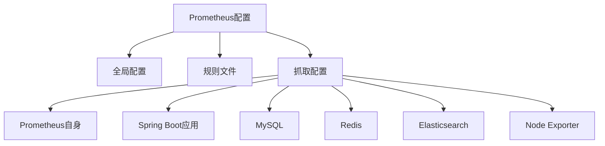
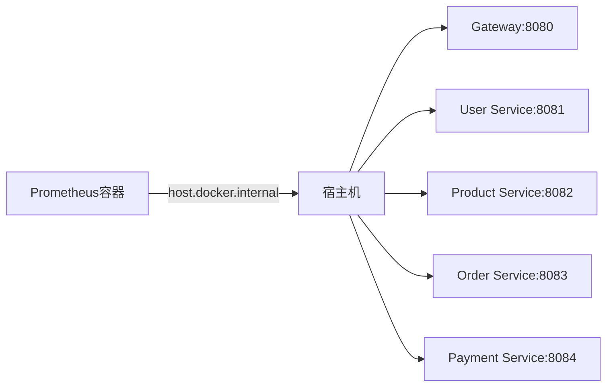

# 指标采集

<cite>
**Referenced Files in This Document**  
- [prometheus.yml](file://config/prometheus.yml)
- [application.yml](file://backend/admin-service/src/main/resources/application.yml)
- [application-docker.yml](file://backend/user-service/src/main/resources/application-docker.yml)
- [application.yml](file://backend/product-service/src/main/resources/application.yml)
- [application.yml](file://backend/order-service/src/main/resources/application.yml)
- [application.yml](file://backend/payment-service/src/main/resources/application.yml)
- [系统实现报告.md](file://系统实现报告.md)
</cite>

## 目录
1. [引言](#引言)
2. [Prometheus配置解析](#prometheus配置解析)
3. [核心监控目标配置](#核心监控目标配置)
4. [Docker环境中的主机访问](#docker环境中的主机访问)
5. [微服务监控配置](#微服务监控配置)
6. [数据库与中间件监控](#数据库与中间件监控)
7. [Spring Boot Actuator集成](#spring-boot-actuator集成)
8. [自定义业务指标](#自定义业务指标)
9. [总结](#总结)

## 引言

本文档旨在深入解析基于SpringCloud Alibaba的微服务在线商城系统的指标采集机制，重点聚焦于Prometheus的`scrape_configs`配置。通过分析`config/prometheus.yml`文件中的各个`job_name`配置，详细说明如何监控Prometheus自身、Spring Boot应用、MySQL、Redis、Elasticsearch和Node Exporter等关键组件。同时，结合Spring Boot Actuator的使用，阐述如何暴露和采集JVM、HTTP请求等系统指标以及自定义业务指标。

## Prometheus配置解析

Prometheus的配置文件`prometheus.yml`定义了全局配置、规则文件和抓取配置。全局配置指定了抓取间隔和评估间隔，而抓取配置则定义了需要监控的目标。



**Diagram sources**
- [prometheus.yml](file://config/prometheus.yml#L1-L45)

**Section sources**
- [prometheus.yml](file://config/prometheus.yml#L1-L45)

## 核心监控目标配置

### Prometheus自身监控

Prometheus通过`job_name: 'prometheus'`配置自身监控，抓取目标为`localhost:9090`，这是Prometheus服务的默认端口。

```yaml
- job_name: 'prometheus'
  static_configs:
    - targets: ['localhost:9090']
```

此配置确保Prometheus能够监控自身的运行状态，包括抓取性能、存储使用情况等关键指标。

**Section sources**
- [prometheus.yml](file://config/prometheus.yml#L12-L14)

### Spring Boot应用监控

Spring Boot应用通过`job_name: 'spring-boot-apps'`进行监控，使用`/actuator/prometheus`作为指标路径。目标地址通过`host.docker.internal`指定，确保在Docker环境中能够正确访问宿主机上的服务。

```yaml
- job_name: 'spring-boot-apps'
  metrics_path: '/actuator/prometheus'
  static_configs:
    - targets: 
      - 'host.docker.internal:8080'  # Gateway
      - 'host.docker.internal:8081'  # User Service
      - 'host.docker.internal:8082'  # Product Service
      - 'host.docker.internal:8083'  # Order Service
      - 'host.docker.internal:8084'  # Payment Service
```

**Section sources**
- [prometheus.yml](file://config/prometheus.yml#L17-L26)

## Docker环境中的主机访问

在Docker环境中，`host.docker.internal`是一个特殊的DNS名称，用于从容器内部访问宿主机。这对于开发和测试环境特别有用，因为它允许容器内的Prometheus实例访问运行在宿主机上的Spring Boot应用。



**Diagram sources**
- [prometheus.yml](file://config/prometheus.yml#L21-L25)

**Section sources**
- [prometheus.yml](file://config/prometheus.yml#L21-L25)

## 微服务监控配置

每个Spring Boot微服务都需要在`application.yml`中配置Actuator端点，以暴露必要的监控指标。

### 管理服务配置

管理服务`admin-service`在`application.yml`中配置了端口、数据源、Redis和Nacos等信息，并启用了健康检查和指标暴露。

```yaml
server:
  port: 8086

spring:
  application:
    name: admin-service

management:
  endpoints:
    web:
      exposure:
        include: health,info,metrics
  endpoint:
    health:
      show-details: always
```

**Section sources**
- [application.yml](file://backend/admin-service/src/main/resources/application.yml#L1-L90)

### 用户服务配置

用户服务`user-service`在`application-docker.yml`中配置了数据源和MyBatis Plus，同时禁用了Redis连接以适应Docker环境。

```yaml
spring:
  datasource:
    url: jdbc:mysql://mysql:3306/mall_user
    username: root
    password: 123456

mybatis-plus:
  configuration:
    map-underscore-to-camel-case: true
    cache-enabled: false
```

**Section sources**
- [application-docker.yml](file://backend/user-service/src/main/resources/application-docker.yml#L1-L46)

### 产品服务配置

产品服务`product-service`在`application.yml`中配置了端口、数据源、Nacos发现和管理端点，确保指标能够被正确采集。

```yaml
server:
  port: 8083

management:
  endpoints:
    web:
      exposure:
        include: health,info,metrics,prometheus
  endpoint:
    health:
      show-details: always
```

**Section sources**
- [application.yml](file://backend/product-service/src/main/resources/application.yml#L1-L89)

### 订单服务配置

订单服务`order-service`在`application.yml`中配置了端口、数据源、Redis、RabbitMQ和Feign客户端，同时启用了详细的日志记录。

```yaml
server:
  port: 8084

spring:
  redis:
    host: localhost
    port: 6379
    database: 2

logging:
  level:
    com.mall.order: DEBUG
```

**Section sources**
- [application.yml](file://backend/order-service/src/main/resources/application.yml#L1-L92)

### 支付服务配置

支付服务`payment-service`在`application.yml`中配置了端口、H2内存数据库、JPA和管理端点，确保在测试环境中能够正常运行。

```yaml
server:
  port: 8085

spring:
  datasource:
    driver-class-name: org.h2.Driver
    url: jdbc:h2:mem:testdb
    username: sa

management:
  endpoints:
    web:
      exposure:
        include: health,info,metrics,prometheus
```

**Section sources**
- [application.yml](file://backend/payment-service/src/main/resources/application.yml#L1-L101)

## 数据库与中间件监控

### MySQL监控

MySQL监控需要安装`mysql_exporter`，Prometheus通过`job_name: 'mysql'`配置抓取目标为`mysql-exporter:9104`。

```yaml
- job_name: 'mysql'
  static_configs:
    - targets: ['mysql-exporter:9104']
```

**Section sources**
- [prometheus.yml](file://config/prometheus.yml#L28-L30)

### Redis监控

Redis监控需要安装`redis_exporter`，Prometheus通过`job_name: 'redis'`配置抓取目标为`redis-exporter:9121`。

```yaml
- job_name: 'redis'
  static_configs:
    - targets: ['redis-exporter:9121']
```

**Section sources**
- [prometheus.yml](file://config/prometheus.yml#L33-L35)

### Elasticsearch监控

Elasticsearch监控通过`job_name: 'elasticsearch'`配置，抓取目标为`elasticsearch:9200`。

```yaml
- job_name: 'elasticsearch'
  static_configs:
    - targets: ['elasticsearch:9200']
```

**Section sources**
- [prometheus.yml](file://config/prometheus.yml#L38-L40)

### Node Exporter监控

Node Exporter用于监控系统级别的指标，如CPU、内存和磁盘使用情况。Prometheus通过`job_name: 'node'`配置抓取目标为`node-exporter:9100`。

```yaml
- job_name: 'node'
  static_configs:
    - targets: ['node-exporter:9100']
```

**Section sources**
- [prometheus.yml](file://config/prometheus.yml#L43-L45)

## Spring Boot Actuator集成

Spring Boot Actuator提供了生产就绪的功能，如健康检查、审计和指标收集。通过Micrometer，可以将这些指标导出到Prometheus。

```yaml
management:
  endpoints:
    web:
      exposure:
        include: health,info,metrics,prometheus
  endpoint:
    health:
      show-details: always
  metrics:
    export:
      prometheus:
        enabled: true
```

此配置确保所有必要的端点都已暴露，并且Prometheus指标导出已启用。

**Section sources**
- [系统实现报告.md](file://系统实现报告.md#L695-L712)

## 自定义业务指标

除了系统指标外，还可以通过Micrometer暴露自定义业务指标，如订单转化率、支付成功率等。

```java
@Timed("order.create.duration")
public OrderCreateResult createOrder(OrderCreateRequest request) {
    // 订单创建逻辑
}
```

通过`@Timed`注解，可以轻松地为方法添加计时指标，帮助分析性能瓶颈。

**Section sources**
- [系统实现报告.md](file://系统实现报告.md#L697)

## 总结

本文档详细解析了Prometheus的`scrape_configs`配置，涵盖了从Prometheus自身到各个微服务、数据库和中间件的监控配置。通过`host.docker.internal`在Docker环境中实现宿主机访问，确保了监控的准确性。结合Spring Boot Actuator和Micrometer，实现了全面的系统和业务指标采集，为系统的稳定运行提供了有力保障。