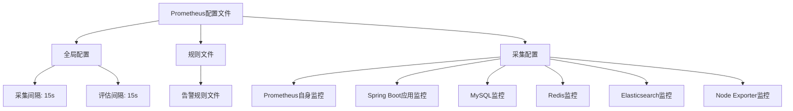
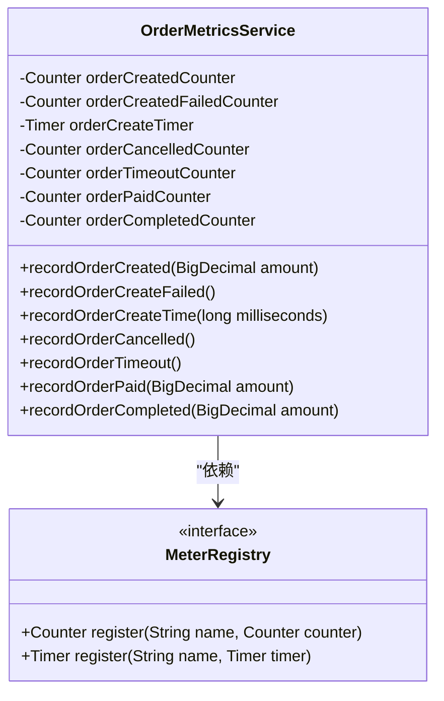
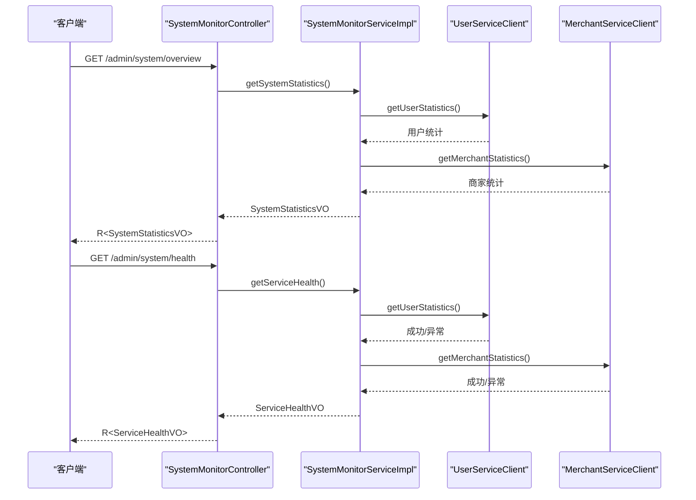

# 监控系统

<cite>
**Referenced Files in This Document**   
- [prometheus.yml](file://config/prometheus.yml)
- [docker-compose.yml](file://docker-compose.yml)
- [SystemMonitorController.java](file://backend/admin-service/src/main/java/com/mall/admin/controller/SystemMonitorController.java)
- [SystemMonitorServiceImpl.java](file://backend/admin-service/src/main/java/com/mall/admin/service/impl/SystemMonitorServiceImpl.java)
- [OrderMetricsService.java](file://backend/order-service/src/main/java/com/mall/order/metrics/OrderMetricsService.java)
- [系统实现报告.md](file://系统实现报告.md)
</cite>

## 目录
1. [简介](#简介)
2. [Prometheus配置解析](#prometheus配置解析)
3. [Spring Boot应用指标暴露](#spring-boot应用指标暴露)
4. [自定义业务指标实现](#自定义业务指标实现)
5. [Grafana可视化配置](#grafana可视化配置)
6. [应用层监控与健康检查](#应用层监控与健康检查)
7. [监控告警规则](#监控告警规则)
8. [性能瓶颈识别](#性能瓶颈识别)
9. [监控数据存储与保留](#监控数据存储与保留)
10. [总结](#总结)

## 简介

本项目构建了一个全面的监控体系，基于Prometheus和Grafana技术栈，实现了对Spring Cloud微服务架构的全方位监控。监控系统覆盖了基础设施层（MySQL、Redis、Node Exporter等）、应用层（Spring Boot应用）以及业务层（自定义业务指标）的监控需求。通过Prometheus配置文件定义了多个scrape_configs，实现了对不同目标的指标采集。Spring Boot应用通过Micrometer框架暴露JVM内存、线程、HTTP请求等标准指标，并实现了自定义业务指标的埋点。Grafana作为可视化平台，连接Prometheus数据源，创建了系统性能、服务健康度和业务指标的监控仪表板。应用层通过SystemMonitorController提供的健康检查API，实现了与基础设施监控的整合。

## Prometheus配置解析

Prometheus配置文件`config/prometheus.yml`定义了全局配置和多个scrape_configs，用于采集不同目标的监控指标。



**Diagram sources**
- [prometheus.yml](file://config/prometheus.yml#L1-L45)

**Section sources**
- [prometheus.yml](file://config/prometheus.yml#L1-L45)

### 全局配置

全局配置定义了Prometheus的基本行为参数：

- `scrape_interval`: 采集间隔为15秒，控制Prometheus从目标端点拉取指标的频率
- `evaluation_interval`: 评估间隔为15秒，控制Prometheus评估告警规则的频率

### 采集配置

采集配置`scrape_configs`定义了多个job，每个job负责采集特定类型目标的指标：

#### Prometheus自身监控

```yaml
- job_name: 'prometheus'
  static_configs:
    - targets: ['localhost:9090']
```

该配置用于监控Prometheus自身的运行状态，采集Prometheus服务器的性能指标，如内存使用、CPU占用、采集任务状态等，确保监控系统自身的健康。

#### Spring Boot应用监控

```yaml
- job_name: 'spring-boot-apps'
  metrics_path: '/actuator/prometheus'
  static_configs:
    - targets: 
      - 'host.docker.internal:8080'  # Gateway
      - 'host.docker.internal:8081'  # User Service
      - 'host.docker.internal:8082'  # Product Service
      - 'host.docker.internal:8083'  # Order Service
      - 'host.docker.internal:8084'  # Payment Service
```

该配置用于监控所有Spring Boot微服务应用。通过`metrics_path`指定为`/actuator/prometheus`，Prometheus会定期从这些应用的Actuator端点拉取指标。目标地址使用`host.docker.internal`，这是Docker容器内访问宿主机的特殊域名，确保在容器化环境中能够正确访问运行在宿主机上的微服务。

#### MySQL监控

```yaml
- job_name: 'mysql'
  static_configs:
    - targets: ['mysql-exporter:9104']
```

该配置用于监控MySQL数据库。需要部署mysql_exporter服务，它会暴露MySQL的性能指标（如连接数、查询速率、缓冲池使用率等），Prometheus通过9104端口从mysql_exporter采集这些指标。

#### Redis监控

```yaml
- job_name: 'redis'
  static_configs:
    - targets: ['redis-exporter:9121']
```

该配置用于监控Redis缓存。需要部署redis_exporter服务，它会暴露Redis的性能指标（如内存使用、命中率、连接数等），Prometheus通过9121端口从redis_exporter采集这些指标。

#### Elasticsearch监控

```yaml
- job_name: 'elasticsearch'
  static_configs:
    - targets: ['elasticsearch:9200']
```

该配置用于监控Elasticsearch搜索引擎。Prometheus直接从Elasticsearch的9200端口采集其内置的性能指标，如索引速率、搜索延迟、JVM内存使用等。

#### Node Exporter监控

```yaml
- job_name: 'node'
  static_configs:
    - targets: ['node-exporter:9100']
```

该配置用于监控主机系统级别的性能指标。Node Exporter是一个运行在主机上的代理，它会暴露CPU、内存、磁盘、网络等系统资源的使用情况，Prometheus通过9100端口从Node Exporter采集这些指标。

## Spring Boot应用指标暴露

Spring Boot应用通过Micrometer框架和Actuator模块暴露监控指标。在`系统实现报告.md`文件中，明确指出了相关的配置：

```yaml
management:
  endpoints:
    web:
      exposure:
        include: health,info,metrics,prometheus
  endpoint:
    health:
      show-details: always
  metrics:
    export:
      prometheus:
        enabled: true
```

**Section sources**
- [系统实现报告.md](file://系统实现报告.md#L694-L713)

### Micrometer集成

Micrometer是Java应用的度量门面，它提供了一个统一的API来收集应用的性能指标，并支持多种监控系统后端，包括Prometheus。在Spring Boot应用中，只需引入`micrometer-registry-prometheus`依赖，即可自动将指标暴露为Prometheus格式。

### Actuator端点配置

Spring Boot Actuator提供了多个生产就绪的端点，其中`/actuator/prometheus`端点专门用于暴露Prometheus格式的指标。通过`management.endpoints.web.exposure.include`配置，显式启用了`prometheus`端点，使得Prometheus能够从该路径拉取指标。

### 暴露的指标类型

Spring Boot应用通过Micrometer自动暴露了多种标准指标：

- **JVM指标**: 包括内存使用（heap、non-heap）、垃圾回收次数和时间、线程数、类加载数等
- **HTTP请求指标**: 包括请求次数、响应时间、错误率等，按URL路径和HTTP方法进行维度划分
- **系统指标**: 包括CPU使用率、文件描述符使用等
- **Tomcat指标**: 如果使用内嵌Tomcat，还包括线程池状态、请求处理时间等

## 自定义业务指标实现

除了标准指标外，系统还实现了自定义业务指标的埋点，以监控关键业务流程的性能和状态。以订单服务为例，`OrderMetricsService`类实现了对订单相关业务指标的记录。



**Diagram sources**
- [OrderMetricsService.java](file://backend/order-service/src/main/java/com/mall/order/metrics/OrderMetricsService.java#L11-L151)

**Section sources**
- [OrderMetricsService.java](file://backend/order-service/src/main/java/com/mall/order/metrics/OrderMetricsService.java#L1-L153)

### 指标类型

`OrderMetricsService`使用了Micrometer提供的三种核心指标类型：

- **Counter (计数器)**: 用于记录单调递增的数值，如`orderCreatedCounter`记录订单创建总数，`orderCreatedFailedCounter`记录创建失败数。
- **Timer (计时器)**: 用于记录事件的持续时间，如`orderCreateTimer`记录订单创建的耗时。
- **Gauge (仪表)**: 虽然代码中未直接使用，但可用于记录瞬时值，如当前待处理订单数。

### 指标注册

在`OrderMetricsService`的构造函数中，通过`MeterRegistry`注册了各个指标。`MeterRegistry`是Micrometer的核心组件，负责管理所有指标的生命周期。每个指标都通过`builder`模式创建，设置了名称和描述，然后注册到`MeterRegistry`中。

### 指标使用

在业务逻辑中，通过调用`OrderMetricsService`的方法来记录指标。例如，在订单创建成功后，调用`recordOrderCreated`方法递增计数器；在订单创建完成后，调用`recordOrderCreateTime`方法记录耗时。这些指标最终会通过`/actuator/prometheus`端点暴露给Prometheus。

## Grafana可视化配置

Grafana作为监控数据的可视化平台，通过`docker-compose.yml`文件中的配置与Prometheus集成：

```yaml
  grafana:
    image: grafana/grafana:latest
    container_name: mall-grafana
    restart: always
    ports:
      - "3001:3000"
    environment:
      GF_SECURITY_ADMIN_USER: admin
      GF_SECURITY_ADMIN_PASSWORD: admin
    volumes:
      - grafana_data:/var/lib/grafana
    depends_on:
      - prometheus
    networks:
      - mall-network
```

**Section sources**
- [docker-compose.yml](file://docker-compose.yml#L196-L211)

### 数据源配置

Grafana启动后，需要配置Prometheus作为数据源。数据源的URL应指向Prometheus服务的地址，即`http://prometheus:9090`（在容器网络中）或`http://localhost:9090`（在宿主机访问）。

### 仪表板创建

Grafana可以创建多个仪表板来展示不同维度的监控数据：

#### 系统性能仪表板

- **CPU使用率**: 使用`node_cpu_seconds_total`指标，通过`rate()`函数计算CPU使用率
- **内存使用率**: 使用`node_memory_MemTotal_bytes`和`node_memory_MemAvailable_bytes`计算内存使用率
- **磁盘I/O**: 使用`node_disk_read_bytes_total`和`node_disk_written_bytes_total`监控磁盘读写
- **网络流量**: 使用`node_network_receive_bytes_total`和`node_network_transmit_bytes_total`监控网络吞吐量

#### 服务健康度仪表板

- **应用健康状态**: 使用`http_server_requests_seconds_count`和`http_server_requests_seconds_max`监控各微服务的请求量和响应时间
- **JVM内存**: 使用`jvm_memory_used_bytes`监控堆内存和非堆内存使用情况
- **线程状态**: 使用`jvm_threads_live`监控活跃线程数
- **服务可用性**: 结合应用层健康检查API的结果，展示服务的UP/DOWN状态

#### 业务指标仪表板

- **订单创建成功率**: 计算`order_created_count`与`order_created_failed_count`的比例
- **订单平均创建耗时**: 使用`order_create_time_seconds`的平均值或P95/P99分位数
- **支付成功率**: 监控支付相关指标，评估支付流程的健康度
- **系统概览**: 展示用户总数、活跃用户数、商家总数等业务统计数据

## 应用层监控与健康检查

应用层监控通过`SystemMonitorController`和`SystemMonitorServiceImpl`实现，提供了系统健康检查和统计信息的API。



**Diagram sources**
- [SystemMonitorController.java](file://backend/admin-service/src/main/java/com/mall/admin/controller/SystemMonitorController.java#L12-L43)
- [SystemMonitorServiceImpl.java](file://backend/admin-service/src/main/java/com/mall/admin/service/impl/SystemMonitorServiceImpl.java#L15-L94)

**Section sources**
- [SystemMonitorController.java](file://backend/admin-service/src/main/java/com/mall/admin/controller/SystemMonitorController.java#L1-L43)
- [SystemMonitorServiceImpl.java](file://backend/admin-service/src/main/java/com/mall/admin/service/impl/SystemMonitorServiceImpl.java#L1-L96)

### 系统概览统计

`getSystemOverview`接口通过`SystemMonitorServiceImpl.getSystemStatistics()`方法获取系统概览统计信息。该方法通过Feign客户端调用`UserServiceClient`和`MerchantServiceClient`，分别获取用户和商家的统计信息，然后整合成`SystemStatisticsVO`对象返回。

### 服务健康检查

`getServiceHealth`接口通过`SystemMonitorServiceImpl.getServiceHealth()`方法获取服务健康状态。该方法通过尝试调用`UserServiceClient`和`MerchantServiceClient`的接口来检查服务的可用性。如果调用成功，则标记服务为"UP"；如果抛出异常，则标记为"DOWN"。这种方法实现了对下游服务的主动健康检查。

### 与基础设施监控的整合

应用层的健康检查API可以与Prometheus的黑盒监控（Blackbox Exporter）结合使用。Prometheus可以定期调用`/admin/system/health`端点，将应用层的健康状态作为指标采集，从而实现应用逻辑层面的健康监控，与基础设施层面的监控形成互补。

## 监控告警规则

Prometheus的告警规则配置在`prometheus.yml`文件中通过`rule_files`字段指定：

```yaml
rule_files:
  # - "first_rules.yml"
  # - "second_rules.yml"
```

**Section sources**
- [prometheus.yml](file://config/prometheus.yml#L6-L8)

虽然具体的规则文件未在代码库中提供，但可以根据常见的监控需求设计告警规则。告警规则通常定义在独立的`.rules.yml`文件中，并通过`rule_files`引入。

### 告警规则示例

以下是一些可能的告警规则示例：

#### 系统资源告警

```yaml
groups:
- name: system_alerts
  rules:
  - alert: HighCPUUsage
    expr: 100 - (avg by(instance) (rate(node_cpu_seconds_total{mode="idle"}[5m])) * 100) > 85
    for: 5m
    labels:
      severity: warning
    annotations:
      summary: "High CPU usage on {{ $labels.instance }}"
      description: "CPU usage is above 85% for more than 5 minutes"
  
  - alert: HighMemoryUsage
    expr: (node_memory_MemTotal_bytes - node_memory_MemAvailable_bytes) / node_memory_MemTotal_bytes * 100 > 80
    for: 5m
    labels:
      severity: warning
    annotations:
      summary: "High memory usage on {{ $labels.instance }}"
      description: "Memory usage is above 80% for more than 5 minutes"
```

#### 应用性能告警

```yaml
  - alert: HighRequestLatency
    expr: histogram_quantile(0.95, sum(rate(http_server_requests_seconds_bucket[5m])) by (le, uri)) > 2
    for: 10m
    labels:
      severity: warning
    annotations:
      summary: "High request latency for {{ $labels.uri }}"
      description: "95% of requests to {{ $labels.uri }} are taking more than 2 seconds"
  
  - alert: HighErrorRate
    expr: sum(rate(http_server_requests_seconds_count{status=~"5.."}[5m])) by (uri) / sum(rate(http_server_requests_seconds_count[5m])) by (uri) > 0.05
    for: 10m
    labels:
      severity: critical
    annotations:
      summary: "High error rate for {{ $labels.uri }}"
      description: "Error rate for {{ $labels.uri }} is above 5% for more than 10 minutes"
```

#### 业务指标告警

```yaml
  - alert: LowOrderSuccessRate
    expr: sum(rate(order_created_failed_count[1h])) / sum(rate(order_created_count[1h])) > 0.05
    for: 30m
    labels:
      severity: critical
    annotations:
      summary: "Low order success rate"
      description: "Order creation failure rate is above 5% for the last 30 minutes"
```

这些告警规则会由Prometheus的规则评估器定期评估，当条件满足时，会触发告警并发送到Alertmanager进行处理。

## 性能瓶颈识别

通过分析Prometheus采集的指标，可以识别系统中的性能瓶颈。

### 常见性能瓶颈

#### CPU瓶颈

- **识别**: `node_cpu_seconds_total`指标显示CPU使用率持续高于80%
- **分析**: 结合`process_cpu_seconds_total`指标，确定是哪个Java进程消耗了大量CPU
- **解决**: 使用JVM分析工具（如JProfiler）进行CPU采样，找出热点方法

#### 内存瓶颈

- **识别**: `jvm_memory_used_bytes`显示堆内存使用率持续升高，GC频繁
- **分析**: 观察`jvm_gc_pause_seconds`指标，分析GC停顿时间和频率
- **解决**: 进行堆内存分析（Heap Dump），查找内存泄漏或优化对象创建

#### 数据库瓶颈

- **识别**: `mysql_global_status_threads_connected`显示连接数过高，`mysql_info_schema_table_rows`显示慢查询增多
- **分析**: 结合应用层的`jdbc_connections_max`和`jdbc_connections_active`指标
- **解决**: 优化数据库查询，增加连接池大小，或进行读写分离

#### 网络瓶颈

- **识别**: `node_network_receive_bytes_total`和`node_network_transmit_bytes_total`显示网络吞吐量达到瓶颈
- **分析**: 检查微服务间的调用频率和数据量
- **解决**: 优化API设计，减少不必要的调用，或使用消息队列异步化

### 诊断工具

- **Prometheus**: 提供实时的指标查询和图表展示
- **Grafana**: 提供综合的仪表板，便于多维度分析
- **JVM工具**: 如`jstat`、`jstack`、`jmap`，用于深入分析JVM状态
- **日志分析**: 结合ELK（Elasticsearch, Logstash, Kibana）栈分析应用日志

## 监控数据存储与保留

监控数据的存储和保留策略在`docker-compose.yml`文件中通过Prometheus的启动参数配置：

```yaml
  prometheus:
    command:
      - '--config.file=/etc/prometheus/prometheus.yml'
      - '--storage.tsdb.path=/prometheus'
      - '--web.console.libraries=/etc/prometheus/console_libraries'
      - '--web.console.templates=/etc/prometheus/consoles'
      - '--storage.tsdb.retention.time=200h'
      - '--web.enable-lifecycle'
```

**Section sources**
- [docker-compose.yml](file://docker-compose.yml#L186-L192)

### 存储路径

`--storage.tsdb.path=/prometheus`指定了Prometheus数据的存储路径。在Docker环境中，该路径通过卷挂载`prometheus_data:/prometheus`持久化，确保容器重启后数据不丢失。

### 保留策略

`--storage.tsdb.retention.time=200h`设置了数据保留时间为200小时（约8.3天）。超过此时间的旧数据将被自动删除，以控制磁盘使用量。这个策略平衡了历史数据的可用性和存储成本。

### 数据生命周期管理

Prometheus使用TSDB（Time Series Database）存储数据，它会自动管理数据的生命周期：
- **Head Block**: 最近2小时的数据存储在内存中，可快速查询
- **Persistent Blocks**: 超过2小时的数据被压缩并写入磁盘，每个Block包含2小时的数据
- **Compaction**: 定期将小的Block合并为更大的Block，提高查询效率
- **Retention**: 根据`retention.time`删除过期的Block

## 总结

本项目的监控系统通过Prometheus、Grafana和Micrometer的组合，构建了一个完整的可观测性体系。Prometheus配置文件`prometheus.yml`定义了对Prometheus自身、Spring Boot应用、MySQL、Redis、Elasticsearch和Node Exporter的全面监控。Spring Boot应用通过Actuator和Micrometer暴露了丰富的JVM和HTTP指标，并通过`OrderMetricsService`等组件实现了自定义业务指标的埋点。Grafana作为可视化平台，通过连接Prometheus数据源，创建了系统性能、服务健康度和业务指标的仪表板。应用层通过`SystemMonitorController`提供的API，实现了与基础设施监控的整合。监控告警规则虽然未在代码库中提供，但可以通过独立的规则文件进行配置。性能瓶颈的识别依赖于对Prometheus指标的深入分析。监控数据的存储和保留策略通过Prometheus的启动参数进行配置，确保了数据的持久化和合理的存储周期。整个监控体系为系统的稳定运行和性能优化提供了有力支持。