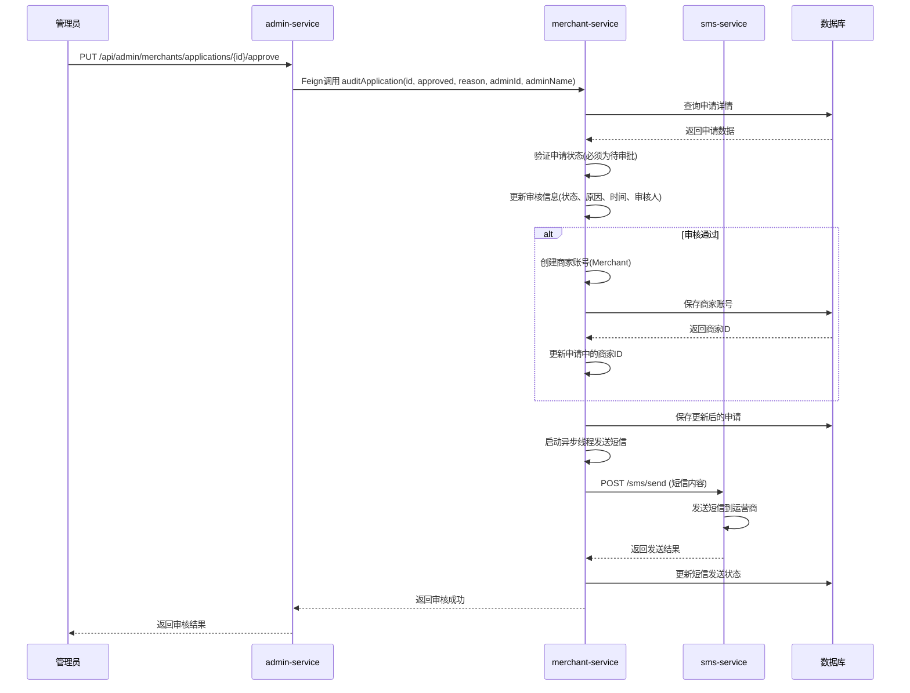
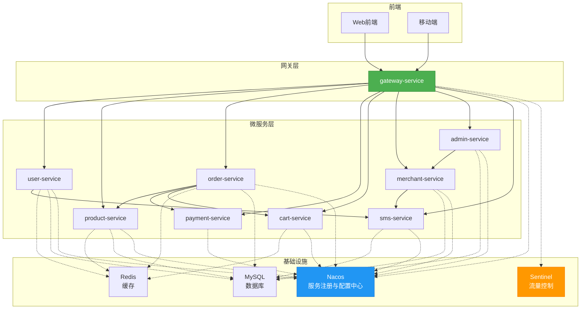

# 微服务架构

<cite>
**本文档引用文件**   
- [GatewayApplication.java](file://backend/gateway-service/src/main/java/com/mall/gateway/GatewayApplication.java)
- [MerchantApplicationService.java](file://backend/merchant-service/src/main/java/com/mall/merchant/service/MerchantApplicationService.java)
- [MerchantApplicationServiceImpl.java](file://backend/merchant-service/src/main/java/com/mall/merchant/service/impl/MerchantApplicationServiceImpl.java)
- [MerchantApplicationController.java](file://backend/merchant-service/src/main/java/com/mall/merchant/controller/MerchantApplicationController.java)
- [application.yml](file://backend/gateway-service/src/main/resources/application.yml)
- [application-simple.yml](file://backend/gateway-service/src/main/resources/application-simple.yml)
- [SecurityConfig.java](file://backend/user-service/src/main/java/com/mall/user/config/SecurityConfig.java)
- [JwtAuthenticationFilter.java](file://backend/user-service/src/main/java/com/mall/user/security/JwtAuthenticationFilter.java)
- [MerchantServiceClient.java](file://backend/admin-service/src/main/java/com/mall/admin/client/MerchantServiceClient.java)
- [MerchantApplicationRepository.java](file://backend/merchant-service/src/main/java/com/mall/merchant/repository/MerchantApplicationRepository.java)
- [MerchantApplicationDTO.java](file://backend/merchant-service/src/main/java/com/mall/merchant/domain/dto/MerchantApplicationDTO.java)
- [MerchantApplicationVO.java](file://backend/merchant-service/src/main/java/com/mall/merchant/domain/vo/MerchantApplicationVO.java)
- [MerchantApplication.java](file://backend/merchant-service/src/main/java/com/mall/merchant/domain/entity/MerchantApplication.java)
</cite>

## 目录
1. [微服务划分与职责边界](#微服务划分与职责边界)
2. [Nacos服务注册与配置中心](#nacos服务注册与配置中心)
3. [Spring Cloud Gateway路由与鉴权](#spring-cloud-gateway路由与鉴权)
4. [Feign服务间调用机制](#feign服务间调用机制)
5. [商家入驻申请服务调用序列图](#商家入驻申请服务调用序列图)
6. [系统服务拓扑结构图](#系统服务拓扑结构图)

## 微服务划分与职责边界

在springcloud-mall系统中，微服务被清晰地划分为多个独立的业务单元，每个服务都有明确的职责边界，遵循单一职责原则。

- **gateway-service**：作为系统的统一入口，负责请求路由、负载均衡、安全过滤、限流熔断等网关功能。所有外部请求首先经过网关，由其转发至相应的后端微服务。
- **user-service**：负责用户账户管理，包括用户注册、登录、信息维护、权限管理等核心用户相关功能。
- **product-service**：管理商品信息，包括商品的增删改查、分类管理、库存管理、价格管理等。
- **order-service**：处理订单生命周期，包括创建订单、查询订单、订单状态管理、订单支付状态同步等。
- **payment-service**：负责支付流程，包括支付订单创建、支付状态查询、退款处理、支付回调等。
- **cart-service**：管理用户的购物车数据，支持商品添加、删除、修改数量、清空购物车等操作。
- **merchant-service**：处理商家相关业务，包括商家入驻申请、商家信息管理、商家审核、商家商品管理等。
- **admin-service**：为平台管理员提供后台管理功能，包括用户管理、商家管理、商品审核、订单管理、系统监控等。
- **sms-service**：提供短信发送服务，用于验证码发送、业务通知等场景。

这些服务通过RESTful API或Feign客户端进行通信，实现了业务逻辑的解耦和高内聚。

**本文档引用文件**   
- [GatewayApplication.java](file://backend/gateway-service/src/main/java/com/mall/gateway/GatewayApplication.java)

## Nacos服务注册与配置中心

Nacos在本系统中扮演着服务注册与发现中心以及动态配置中心的双重角色。

### 服务发现与健康检查
各微服务在启动时会自动向Nacos注册自己的服务实例信息（包括IP、端口、服务名等）。例如，`gateway-service`、`user-service`等服务的启动类均使用了`@EnableDiscoveryClient`注解来启用服务发现功能。

Nacos通过心跳机制（Heartbeat）定期检查服务实例的健康状态。服务实例会定期向Nacos发送心跳包，如果Nacos在一定时间内未收到心跳，则会将该实例标记为不健康并从服务列表中移除，从而实现故障实例的自动剔除。

### 配置推送机制
Nacos Config模块实现了配置的集中管理和动态推送。微服务通过`spring-cloud-starter-alibaba-nacos-config`依赖连接到Nacos配置中心。当在Nacos控制台修改了某个服务的配置文件（如`application.yml`）后，Nacos会通过长轮询（Long Polling）机制将最新的配置推送到所有订阅了该配置的服务实例，服务实例接收到新配置后可以动态刷新（结合`@RefreshScope`注解），无需重启服务。

例如，`gateway-service`的`application.yml`中配置了Nacos Config的地址和命名空间，使得网关服务能够从Nacos获取其路由规则等配置。

**本文档引用文件**   
- [application.yml](file://backend/gateway-service/src/main/resources/application.yml)
- [application-simple.yml](file://backend/gateway-service/src/main/resources/application-simple.yml)

## Spring Cloud Gateway路由与鉴权

Spring Cloud Gateway是本系统的API网关，负责处理所有进入系统的HTTP请求。

### 路由配置
网关的核心是路由（Route）配置。在`gateway-service`的`application.yml`中，定义了多个路由规则，将不同的请求路径转发到对应的服务。例如：
- `/api/users/**` 路径的请求被路由到 `user-service`。
- `/api/product/**` 路径的请求被路由到 `product-service`。
- `/api/merchants/**` 路径的请求被路由到 `merchant-service`。

每个路由都配置了`StripPrefix`过滤器，用于在转发前剥离指定数量的路径前缀。例如，`StripPrefix=1`会将`/api/users/test`转换为`/users/test`再转发给`user-service`，确保后端服务能正确处理请求。

### 鉴权过滤器
网关本身不直接处理复杂的鉴权逻辑，而是将鉴权职责下放给各个微服务。然而，它可以通过全局过滤器（Global Filter）或路由过滤器（Gateway Filter）进行初步的安全控制，如CORS配置、请求日志记录等。真正的JWT令牌验证和用户身份认证由各个微服务内部的安全框架（如Spring Security）完成。

例如，`user-service`中的`JwtAuthenticationFilter`会检查请求头中的`Authorization`字段，验证JWT令牌的有效性，并将用户信息放入安全上下文中。

### 限流规则
网关集成了Sentinel进行限流和熔断。在`application.yml`中配置了Sentinel Dashboard的地址，使得网关的流量规则可以在Sentinel控制台进行可视化配置和管理，有效防止系统因突发流量而崩溃。

**本文档引用文件**   
- [application.yml](file://backend/gateway-service/src/main/resources/application.yml)
- [SecurityConfig.java](file://backend/user-service/src/main/java/com/mall/user/config/SecurityConfig.java)
- [JwtAuthenticationFilter.java](file://backend/user-service/src/main/java/com/mall/user/security/JwtAuthenticationFilter.java)

## Feign服务间调用机制

Feign是本系统中实现微服务间声明式REST调用的核心组件。

### 实现方式
服务间调用通过定义Feign客户端接口来实现。例如，`admin-service`需要调用`merchant-service`的商家管理接口，它在`admin-service`中定义了`MerchantServiceClient`接口：

```java
@FeignClient(name = "merchant-service", path = "/merchants")
public interface MerchantServiceClient {
    @GetMapping("/applications")
    R<Map<String, Object>> getApplicationList(...);
    // 其他方法...
}
```

`@FeignClient`注解指定了目标服务名（`merchant-service`），Feign会结合Ribbon实现客户端负载均衡，自动从Nacos获取该服务的所有实例并选择一个进行调用。

### 最佳实践
1. **接口抽象**：将远程调用封装在接口中，使调用方代码更简洁，如同调用本地方法。
2. **路径前缀**：使用`path`属性统一管理API路径前缀，减少重复配置。
3. **错误处理**：通过实现`FallbackFactory`或`Fallback`来处理服务不可用或超时的情况，提供降级逻辑，保证系统整体的稳定性。
4. **集成断路器**：通常与Hystrix或Sentinel集成，当某个服务调用失败率达到阈值时，自动开启断路器，快速失败，避免雪崩效应。

例如，`order-service`通过`ProductClient`和`PaymentClient`分别调用`product-service`和`payment-service`，以完成创建订单时的库存检查和支付创建。

**本文档引用文件**   
- [MerchantServiceClient.java](file://backend/admin-service/src/main/java/com/mall/admin/client/MerchantServiceClient.java)

## 商家入驻申请服务调用序列图

该序列图描述了管理员在后台审核商家入驻申请的完整流程，涉及`admin-service`、`merchant-service`和`sms-service`三个服务的交互。



**图示来源**
- [MerchantApplicationController.java](file://backend/admin-service/src/main/java/com/mall/admin/controller/MerchantApplicationController.java#L71-L90)
- [MerchantApplicationServiceImpl.java](file://backend/merchant-service/src/main/java/com/mall/merchant/service/impl/MerchantApplicationServiceImpl.java#L136-L166)
- [MerchantApplicationServiceImpl.java](file://backend/merchant-service/src/main/java/com/mall/merchant/service/impl/MerchantApplicationServiceImpl.java#L269-L338)

## 系统服务拓扑结构图

该图展示了springcloud-mall系统中主要微服务的拓扑结构和依赖关系。



**图示来源**
- [GatewayApplication.java](file://backend/gateway-service/src/main/java/com/mall/gateway/GatewayApplication.java)
- [application.yml](file://backend/gateway-service/src/main/resources/application.yml)
- [MerchantApplicationService.java](file://backend/merchant-service/src/main/java/com/mall/merchant/service/MerchantApplicationService.java)