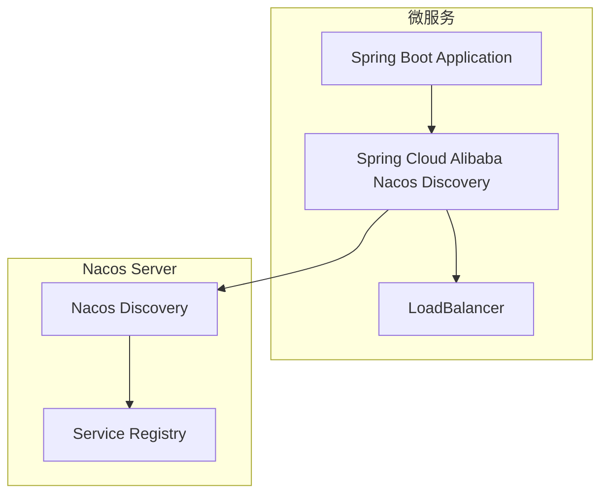
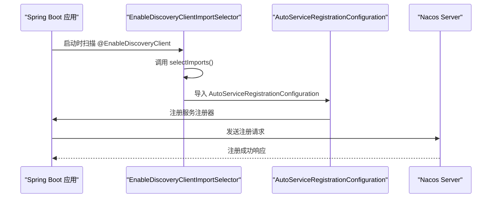
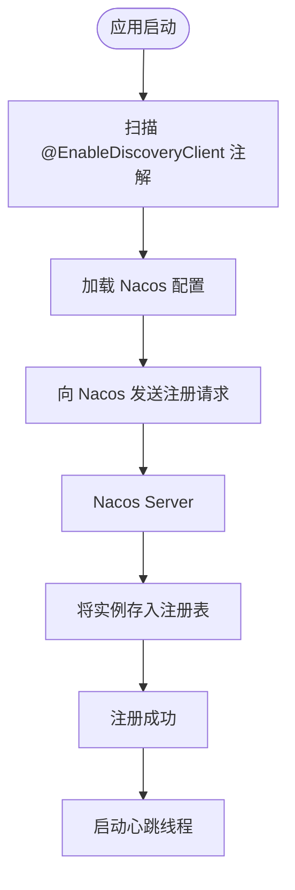
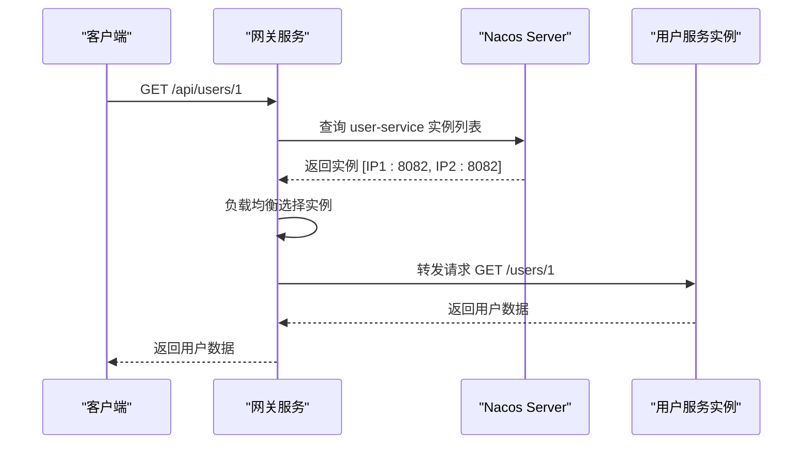

# 服务注册与发现

<cite>
**本文档引用文件**  
- [UserApplication.java](file://backend/user-service/src/main/java/com/mall/user/UserApplication.java)
- [MerchantApplication.java](file://backend/merchant-service/src/main/java/com/mall/merchant/MerchantApplication.java)
- [application.yml](file://backend/user-service/src/main/resources/application.yml)
- [application.yml](file://backend/merchant-service/src/main/resources/application.yml)
- [application.yml](file://backend/gateway-service/src/main/resources/application.yml)
- [pom.xml](file://backend/user-service/pom.xml)
- [pom.xml](file://backend/merchant-service/pom.xml)
- [pom.xml](file://backend/gateway-service/pom.xml)
</cite>

## 目录
1. [简介](#简介)
2. [核心组件与依赖](#核心组件与依赖)
3. [@EnableDiscoveryClient 注解机制](#enablediscoveryclient-注解机制)
4. [服务注册配置](#服务注册配置)
5. [服务注册流程](#服务注册流程)
6. [心跳检测与健康检查](#心跳检测与健康检查)
7. [网关服务发现与负载均衡](#网关服务发现与负载均衡)
8. [Nacos 控制台状态分析](#nacos-控制台状态分析)
9. [服务动态感知机制](#服务动态感知机制)
10. [容错与故障处理](#容错与故障处理)

## 简介
本文档详细阐述了在 `springcloud-mall` 项目中基于 Nacos 实现的服务注册与发现机制。重点分析了微服务如何通过 Spring Cloud Alibaba Nacos Discovery 组件实现自动注册、心跳维持、健康检查以及服务发现。文档涵盖 `user-service`、`merchant-service`、`gateway-service` 等关键微服务的配置与实现，解释了从服务启动到被网关调用的完整生命周期。

## 核心组件与依赖
项目中的所有微服务均通过引入 `spring-cloud-starter-alibaba-nacos-discovery` 依赖来实现服务注册与发现功能。该依赖是 Spring Cloud Alibaba 生态的核心组件，它封装了与 Nacos 服务器通信的底层逻辑。



**图示来源**  
- [pom.xml](file://backend/user-service/pom.xml#L27-L30)
- [pom.xml](file://backend/merchant-service/pom.xml#L33-L36)
- [pom.xml](file://backend/gateway-service/pom.xml#L27-L30)

## @EnableDiscoveryClient 注解机制
`@EnableDiscoveryClient` 是启用服务发现功能的核心注解。当在 Spring Boot 主启动类上添加此注解后，应用在启动时会自动向配置的 Nacos 服务器注册自身信息，并开始定期发送心跳以维持服务的“存活”状态。

该注解通过 `@Import(EnableDiscoveryClientImportSelector.class)` 导入了特定的配置选择器，根据环境自动配置服务注册与发现的相关 Bean。其 `autoRegister` 属性默认为 `true`，表示服务启动后自动注册。



**图示来源**  
- [UserApplication.java](file://backend/user-service/src/main/java/com/mall/user/UserApplication.java#L17)
- [MerchantApplication.java](file://backend/merchant-service/src/main/java/com/mall/merchant/MerchantApplication.java#L17)

**本节来源**  
- [UserApplication.java](file://backend/user-service/src/main/java/com/mall/user/UserApplication.java#L8-L9)
- [spring-cloud-commons-4.0.4.jar\org.springframework.cloud.client.discovery\EnableDiscoveryClient.class](file://)

## 服务注册配置
各微服务通过 `application.yml` 文件中的 `spring.cloud.nacos.discovery` 配置项来定义其注册行为。关键配置包括服务地址、命名空间、分组和服务元数据。

### 用户服务 (user-service)
```yaml
spring:
  application:
    name: user-service
  cloud:
    nacos:
      discovery:
        server-addr: localhost:8848
        namespace: simple
        group: DEFAULT_GROUP
```

### 商家服务 (merchant-service)
```yaml
spring:
  application:
    name: merchant-service
  cloud:
    nacos:
      discovery:
        server-addr: 127.0.0.1:8848
        namespace: ${spring.profiles.active}
```

### 网关服务 (gateway-service)
```yaml
spring:
  application:
    name: gateway-service
  cloud:
    nacos:
      discovery:
        server-addr: localhost:8848
        namespace: ${spring.profiles.active}
```

**本节来源**  
- [application.yml](file://backend/user-service/src/main/resources/application.yml#L5-L40)
- [application.yml](file://backend/merchant-service/src/main/resources/application.yml#L6-L40)
- [application.yml](file://backend/gateway-service/src/main/resources/application.yml#L8-L18)

## 服务注册流程
服务注册流程始于微服务的启动。以下是 `user-service` 的注册流程：

1.  **启动与注解扫描**：Spring Boot 启动 `UserApplication`，扫描到 `@EnableDiscoveryClient` 注解。
2.  **配置加载**：从 `application.yml` 加载 Nacos 服务器地址 (`localhost:8848`)、命名空间 (`simple`) 和服务名 (`user-service`)。
3.  **注册请求**：应用通过 Nacos Discovery Client 向 Nacos 服务器的 `/nacos/v1/ns/instance` 接口发送 HTTP PUT 请求，注册自身。
4.  **注册信息**：请求体包含服务实例的 IP、端口 (8082)、健康状态、权重等元数据。
5.  **注册成功**：Nacos 服务器将该实例信息存入注册表，并返回成功响应。



**图示来源**  
- [UserApplication.java](file://backend/user-service/src/main/java/com/mall/user/UserApplication.java#L23)
- [application.yml](file://backend/user-service/src/main/resources/application.yml#L36-L40)

## 心跳检测与健康检查
为了确保服务列表的实时性，Nacos 采用客户端心跳机制。

*   **心跳机制**：注册成功后，微服务会启动一个后台线程，每隔 5 秒向 Nacos 服务器发送一次心跳（HTTP GET 请求到 `/nacos/v1/ns/instance/beat`）。这表明该服务实例仍然健康。
*   **健康检查**：Nacos 服务器负责监控心跳。如果在 15 秒内（默认超时时间）未收到某个实例的心跳，Nacos 会将该实例标记为不健康。如果连续 30 秒未收到心跳，该实例将被从服务列表中移除。
*   **配置**：心跳周期和超时时间通常在 Nacos 服务器端配置，客户端通过 `register-enabled` 和 `instance-enabled` 等属性可以控制注册和实例的启用状态。

**本节来源**  
- [application.yml](file://backend/user-service/src/main/resources/application.yml#L36-L40)
- [application.yml](file://backend/merchant-service/src/main/resources/application.yml#L36-L40)

## 网关服务发现与负载均衡
`gateway-service` 不仅是一个服务提供者，更是一个服务消费者和流量入口。它通过服务发现和负载均衡机制调用其他微服务。

1.  **服务发现**：`gateway-service` 同样注册到 Nacos，并通过 `spring.cloud.gateway.discovery.locator.enabled: true` 配置，使其能够从 Nacos 获取所有已注册服务的实例列表。
2.  **路由配置**：在 `application.yml` 中，`gateway-service` 定义了路由规则。例如，`uri: lb://user-service` 中的 `lb` 前缀表示使用负载均衡。
3.  **负载均衡调用**：当外部请求到达网关（如 `/api/users/**`），网关会：
    *   根据路由规则匹配到 `user-service`。
    *   从 Nacos 获取 `user-service` 的所有健康实例列表。
    *   使用负载均衡策略（如轮询）选择一个实例。
    *   将请求转发到选中的实例。



**图示来源**  
- [application.yml](file://backend/gateway-service/src/main/resources/application.yml#L23-L35)
- [pom.xml](file://backend/gateway-service/pom.xml#L57-L59)

**本节来源**  
- [application.yml](file://backend/gateway-service/src/main/resources/application.yml#L23-L112)

## Nacos 控制台状态分析
在 Nacos 控制台的“服务管理” -> “服务列表”中，可以观察到以下状态：

*   **服务名**：显示为 `user-service`、`merchant-service`、`gateway-service`，与 `spring.application.name` 一致。
*   **集群数量**：每个服务通常对应一个集群（如 `DEFAULT`）。
*   **实例数量**：显示当前健康实例的数量。正常情况下，每个服务应有 1 个或多个实例。
*   **健康状态**：实例的“健康”列应为“健康”。如果服务停止或心跳中断，状态会变为“不健康”并最终消失。
*   **元数据**：可以查看每个实例的 IP、端口、权重、命名空间等详细信息。

通过监控此控制台，可以实时掌握整个系统的服务拓扑和健康状况。

**本节来源**  
- [application.yml](file://backend/user-service/src/main/resources/application.yml#L5-L6)
- [application.yml](file://backend/merchant-service/src/main/resources/application.yml#L6)
- [application.yml](file://backend/gateway-service/src/main/resources/application.yml#L8)

## 服务动态感知机制
系统实现了服务的动态上下线感知。

*   **服务上线**：当一个新的 `user-service` 实例启动并成功注册后，`gateway-service` 会通过 Nacos 的长轮询机制在几秒内感知到新实例的加入，并将其纳入负载均衡池。
*   **服务下线**：当一个 `user-service` 实例正常关闭时，它会向 Nacos 发送注销请求，Nacos 立即将其从列表中移除。`gateway-service` 会同步更新其本地服务列表，后续请求将不再转发到已下线的实例。
*   **服务故障**：如果 `user-service` 实例因崩溃而无法发送心跳，Nacos 会在超时后将其标记为不健康并移除，`gateway-service` 会自动将流量路由到其他健康实例，实现了故障转移。

**本节来源**  
- [UserApplication.java](file://backend/user-service/src/main/java/com/mall/user/UserApplication.java#L23)
- [application.yml](file://backend/gateway-service/src/main/resources/application.yml#L26)

## 容错与故障处理
系统通过多层机制保障在服务故障时的容错能力：

1.  **负载均衡重试**：`gateway-service` 集成了 `spring-cloud-starter-loadbalancer`，当调用某个实例失败时，可以自动重试其他健康实例。
2.  **服务降级**：虽然当前配置未显式启用，但可通过集成 Sentinel 等熔断器实现。当 `user-service` 故障率过高时，`gateway-service` 可以返回预设的降级响应（如缓存数据或友好提示），避免级联故障。
3.  **健康检查隔离**：Nacos 的健康检查机制确保了故障实例不会被纳入服务列表，从源头上防止了流量被错误路由。

**本节来源**  
- [pom.xml](file://backend/gateway-service/pom.xml#L61-L65)
- [application.yml](file://backend/gateway-service/src/main/resources/application.yml#L122-L133)