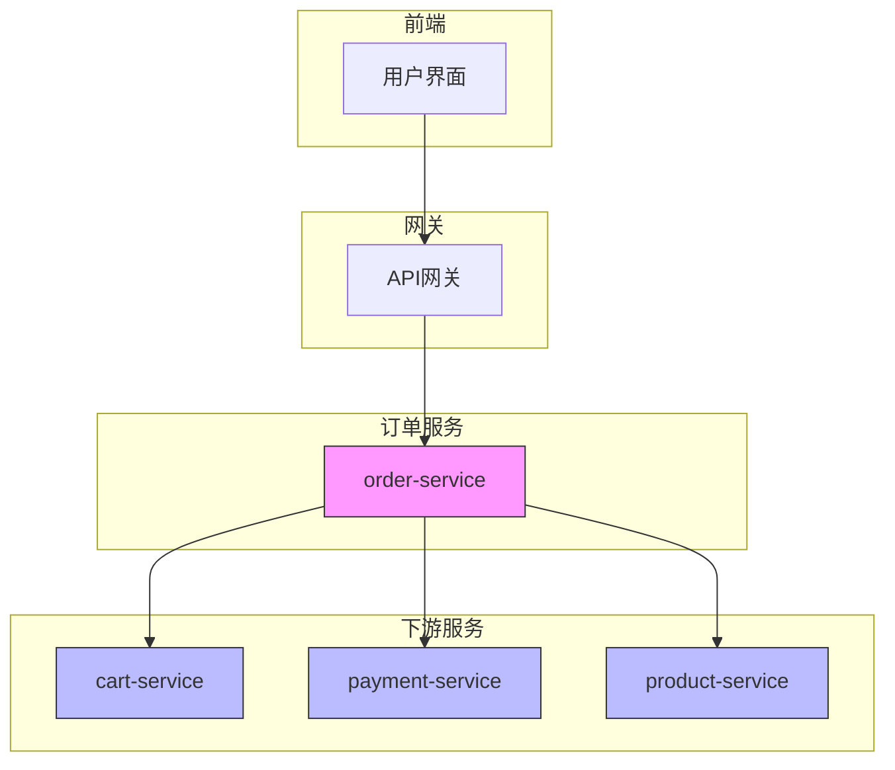
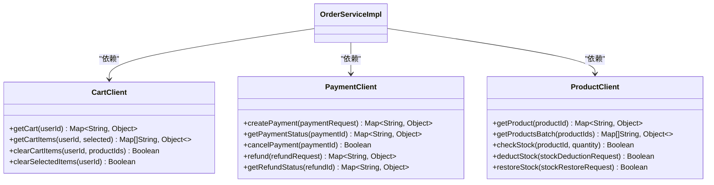
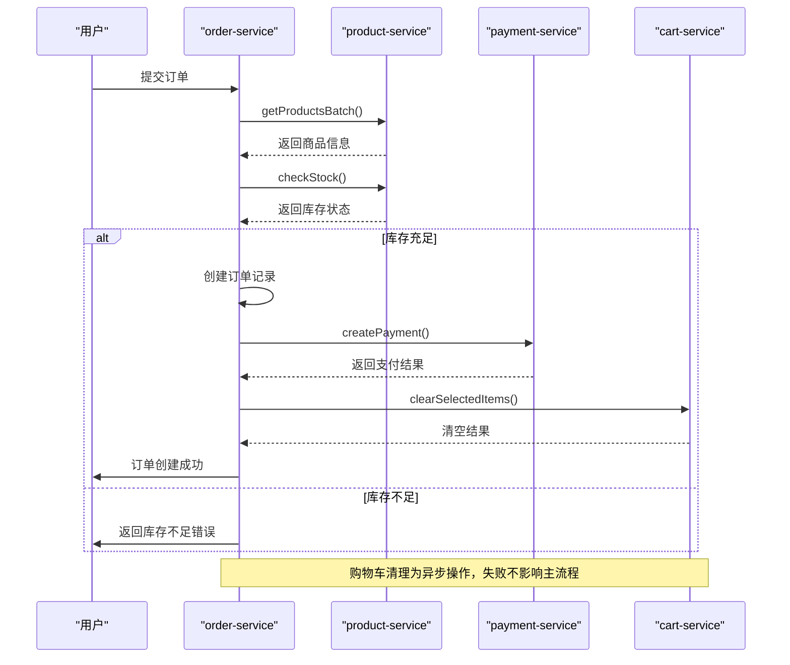
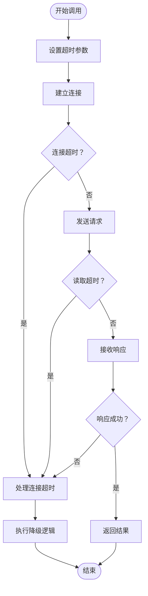

# 服务间通信

<cite>
**本文档引用文件**   
- [CartClient.java](file://backend/order-service/src/main/java/com/mall/order/client/CartClient.java)
- [PaymentClient.java](file://backend/order-service/src/main/java/com/mall/order/client/PaymentClient.java)
- [ProductClient.java](file://backend/order-service/src/main/java/com/mall/order/client/ProductClient.java)
- [OrderServiceImpl.java](file://backend/order-service/src/main/java/com/mall/order/service/impl/OrderServiceImpl.java)
- [application-docker.yml](file://backend/order-service/src/main/resources/application-docker.yml)
- [FeignClientException.java](file://backend/order-service/src/main/java/com/mall/order/exception/FeignClientException.java)
</cite>

## 目录
1. [引言](#引言)
2. [Feign客户端接口定义](#feign客户端接口定义)
3. [服务调用流程分析](#服务调用流程分析)
4. [超时与熔断配置](#超时与熔断配置)
5. [负载均衡机制](#负载均衡机制)
6. [性能优化建议](#性能优化建议)
7. [高并发调用稳定性保障](#高并发调用稳定性保障)
8. [异常处理与降级策略](#异常处理与降级策略)
9. [总结](#总结)

## 引言

在分布式微服务架构中，服务间的通信是系统稳定运行的关键环节。本项目采用Spring Cloud OpenFeign作为服务间同步调用的核心组件，实现了order-service对cart-service和payment-service的高效、可靠调用。通过Feign声明式接口，开发者可以像调用本地方法一样进行远程服务调用，极大地简化了开发复杂度。

系统整体架构中，order-service作为订单处理中心，需要与多个下游服务进行交互。其中，与cart-service的交互主要用于获取用户购物车信息并清空已下单商品；与payment-service的交互则用于创建支付订单、查询支付状态及处理退款等核心支付流程。这些调用均通过Feign客户端实现，结合Nacos服务发现、Ribbon负载均衡和Hystrix熔断机制，构建了高可用的服务调用体系。

**图示来源**  
- [CartClient.java](file://backend/order-service/src/main/java/com/mall/order/client/CartClient.java)
- [PaymentClient.java](file://backend/order-service/src/main/java/com/mall/order/client/PaymentClient.java)
- [ProductClient.java](file://backend/order-service/src/main/java/com/mall/order/client/ProductClient.java)

## Feign客户端接口定义

在Spring Cloud体系中，Feign客户端通过接口定义的方式实现声明式REST调用。order-service通过定义多个Feign客户端接口，实现了对下游服务的统一调用管理。每个客户端接口使用`@FeignClient`注解进行标识，该注解的`name`属性指定目标服务的注册名称，`path`属性定义基础请求路径。

以购物车服务为例，CartClient接口定义了获取购物车信息、获取选中商品项、清空指定商品等操作。接口方法使用标准的Spring MVC注解（如`@GetMapping`、`@PostMapping`、`@DeleteMapping`）来映射HTTP请求。参数传递通过`@PathVariable`、`@RequestParam`和`@RequestBody`等注解实现，确保了请求参数的准确绑定。

**图示来源**  
- [CartClient.java](file://backend/order-service/src/main/java/com/mall/order/client/CartClient.java#L11-L60)
- [PaymentClient.java](file://backend/order-service/src/main/java/com/mall/order/client/PaymentClient.java#L10-L65)
- [ProductClient.java](file://backend/order-service/src/main/java/com/mall/order/client/ProductClient.java#L12-L68)

**代码来源**  
- [CartClient.java](file://backend/order-service/src/main/java/com/mall/order/client/CartClient.java)
- [PaymentClient.java](file://backend/order-service/src/main/java/com/mall/order/client/PaymentClient.java)
- [ProductClient.java](file://backend/order-service/src/main/java/com/mall/order/client/ProductClient.java)

## 服务调用流程分析

order-service在创建订单的核心业务流程中，完整展示了Feign调用的典型应用场景。当用户提交订单时，系统首先通过ProductClient批量获取商品信息并验证库存，确保商品存在且库存充足。这一过程通过`getProductsBatch`和`checkStock`两个Feign调用完成，体现了对product-service的依赖。

在订单信息验证通过后，系统进入支付环节。通过PaymentClient的`createPayment`方法，order-service向payment-service发起支付订单创建请求。该请求包含订单号、支付金额、支付方式等关键信息，以Map形式作为请求体传递。payment-service处理完成后返回支付结果，包括支付ID、支付链接等信息，完成支付流程的初始化。

订单创建成功后，系统通过CartClient的`clearSelectedItems`方法清空用户购物车中的已下单商品。这是一个典型的异步清理操作，即使清空失败也不会影响主订单流程，体现了服务调用的容错设计。整个调用流程通过分布式锁保证了操作的原子性，防止了重复下单等并发问题。

**图示来源**  
- [OrderServiceImpl.java](file://backend/order-service/src/main/java/com/mall/order/service/impl/OrderServiceImpl.java#L73-L211)
- [ProductClient.java](file://backend/order-service/src/main/java/com/mall/order/client/ProductClient.java)
- [PaymentClient.java](file://backend/order-service/src/main/java/com/mall/order/client/PaymentClient.java)
- [CartClient.java](file://backend/order-service/src/main/java/com/mall/order/client/CartClient.java)

**代码来源**  
- [OrderServiceImpl.java](file://backend/order-service/src/main/java/com/mall/order/service/impl/OrderServiceImpl.java)

## 超时与熔断配置

Feign客户端的超时配置是保障服务调用稳定性的关键因素。在`application-docker.yml`配置文件中，系统对Feign调用设置了精细化的超时参数。全局默认配置为连接超时5秒、读取超时10秒，同时针对不同服务设置了个性化的超时策略：cart-service设置为2秒连接超时和3秒读取超时，payment-service则保持与默认值相同的5秒和10秒。

熔断机制通过Hystrix实现，配置文件中`feign.hystrix.enabled: true`开启了Hystrix支持。当服务调用出现超时或异常时，Hystrix会触发熔断，防止故障扩散。系统通过定义FeignClientException异常类，统一封装了远程调用失败的异常信息，包括服务名称、方法名和错误详情，便于问题定位和日志追踪。

**图示来源**  
- [application-docker.yml](file://backend/order-service/src/main/resources/application-docker.yml#L60-L78)
- [FeignClientException.java](file://backend/order-service/src/main/java/com/mall/order/exception/FeignClientException.java)

**代码来源**  
- [application-docker.yml](file://backend/order-service/src/main/resources/application-docker.yml)
- [FeignClientException.java](file://backend/order-service/src/main/java/com/mall/order/exception/FeignClientException.java)

## 负载均衡机制

Feign与Ribbon的集成实现了客户端负载均衡。当order-service通过Feign调用cart-service或payment-service时，Ribbon会从Nacos服务注册中心获取目标服务的实例列表，并根据负载均衡策略选择一个实例进行调用。这种客户端负载均衡模式避免了传统服务端负载均衡的单点瓶颈问题。

系统通过在启动类上添加`@EnableFeignClients`注解，自动启用了Feign客户端功能。Feign底层集成了Ribbon，因此无需额外配置即可实现负载均衡。当目标服务有多个实例时，Ribbon默认采用轮询策略分配请求，确保各实例的负载均衡。同时，Ribbon会定期检查实例的健康状态，自动剔除不可用实例，保证了调用的可靠性。

## 性能优化建议

为提升服务调用性能，建议实施以下优化措施：首先，配置HTTP连接池，复用TCP连接，减少连接建立的开销。其次，启用GZIP压缩，在application.yml中配置`feign.compression.request.enabled: true`，对请求体进行压缩，减少网络传输数据量。

此外，建议对频繁调用的接口实施缓存策略。例如，商品信息查询结果可以在order-service本地缓存一段时间，减少对product-service的直接调用。对于支付状态查询等操作，可以采用异步轮询机制，避免长时间占用服务线程。最后，合理设置线程池参数，确保在高并发场景下有足够的线程处理调用请求。

## 高并发调用稳定性保障

在高并发场景下，保障服务调用稳定性需要多维度的防护措施。首先，通过分布式锁（如Redis分布式锁）控制关键业务流程的并发访问，防止超卖等业务问题。其次，合理设置Hystrix的线程池大小和信号量，避免因资源耗尽导致的服务雪崩。

建议实施请求限流，在网关层或服务层对API调用频率进行限制，防止恶意请求或突发流量冲击系统。同时，完善监控告警体系，对服务调用的延迟、错误率等关键指标进行实时监控，及时发现并处理异常。最后，定期进行压力测试，验证系统在高并发下的稳定性和性能表现，持续优化调用参数和资源配置。

## 异常处理与降级策略

系统的异常处理机制分为多个层次。在Feign调用层面，通过Hystrix实现熔断和降级；在业务逻辑层面，通过自定义异常类（如FeignClientException）进行异常封装和处理。当远程调用失败时，系统会记录详细的错误日志，包括服务名称、方法名和错误信息，便于问题追踪。

降级策略根据业务场景有所不同：对于非核心操作（如清空购物车），采用"失败静默"策略，即调用失败时不中断主流程；对于核心操作（如创建支付订单），则采用"快速失败"策略，立即向用户返回错误信息，避免长时间等待。同时，系统通过事件机制解耦核心流程，将非关键操作（如发送通知）放入异步队列处理，提升主流程的响应速度。

**代码来源**  
- [FeignClientException.java](file://backend/order-service/src/main/java/com/mall/order/exception/FeignClientException.java)
- [OrderServiceImpl.java](file://backend/order-service/src/main/java/com/mall/order/service/impl/OrderServiceImpl.java)

## 总结

基于Spring Cloud OpenFeign的服务间通信机制，为系统提供了高效、可靠的同步调用能力。通过合理的客户端定义、超时熔断配置、负载均衡策略和性能优化措施，系统能够在高并发场景下保持稳定运行。未来可进一步探索响应式编程模型，将部分同步调用改造为异步非阻塞调用，进一步提升系统吞吐量和响应性能。