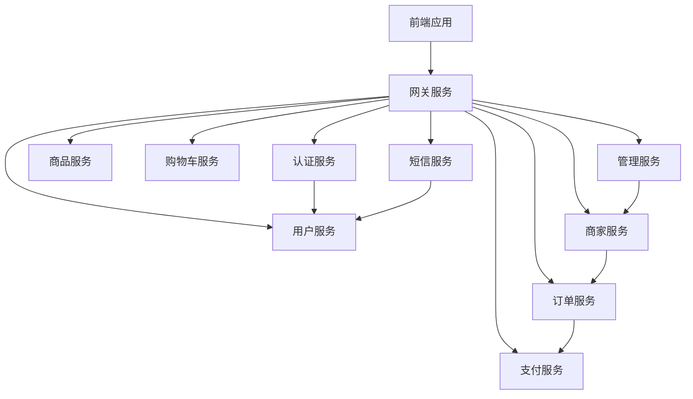
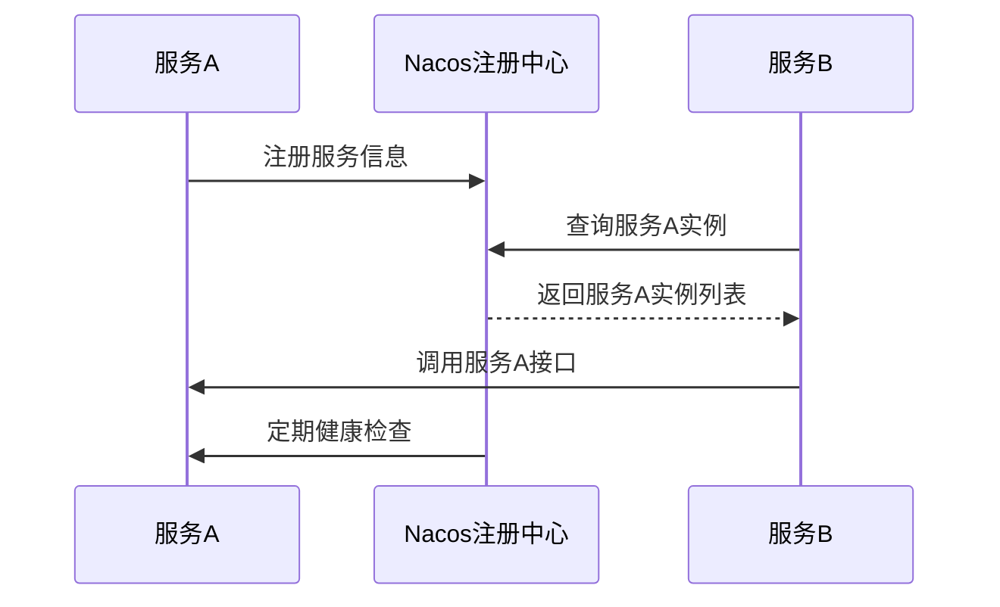
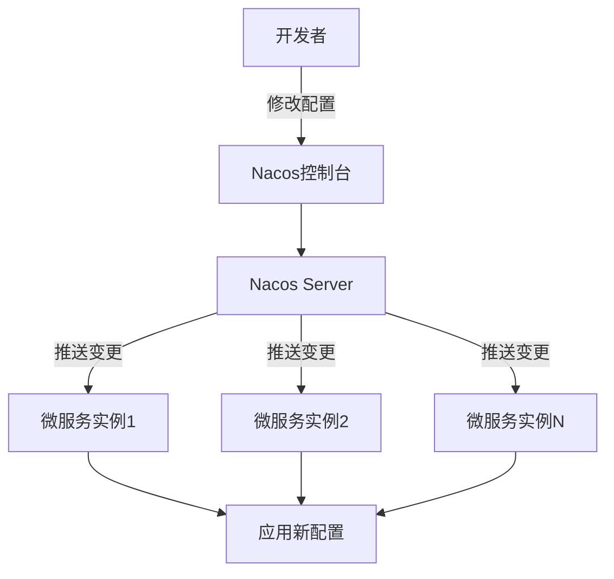
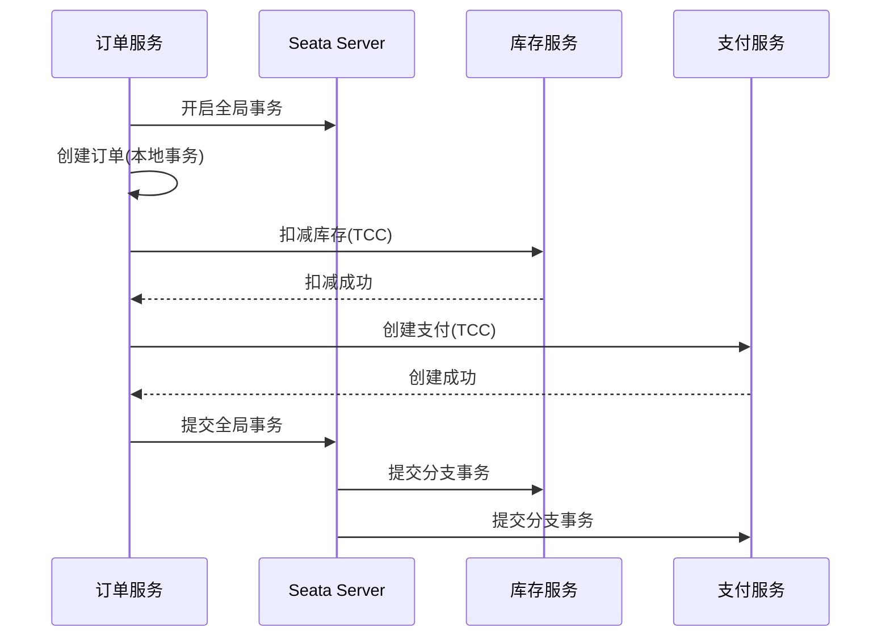
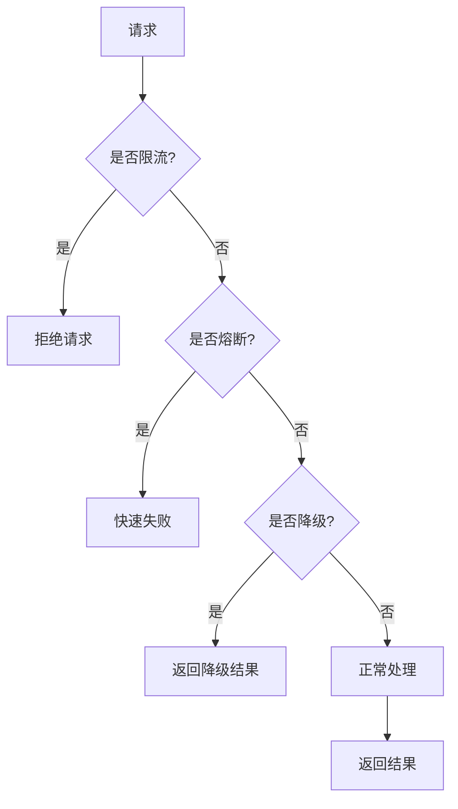
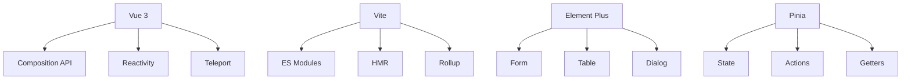
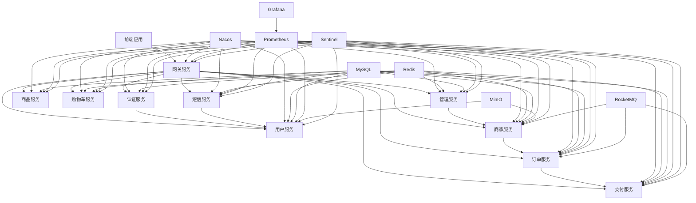
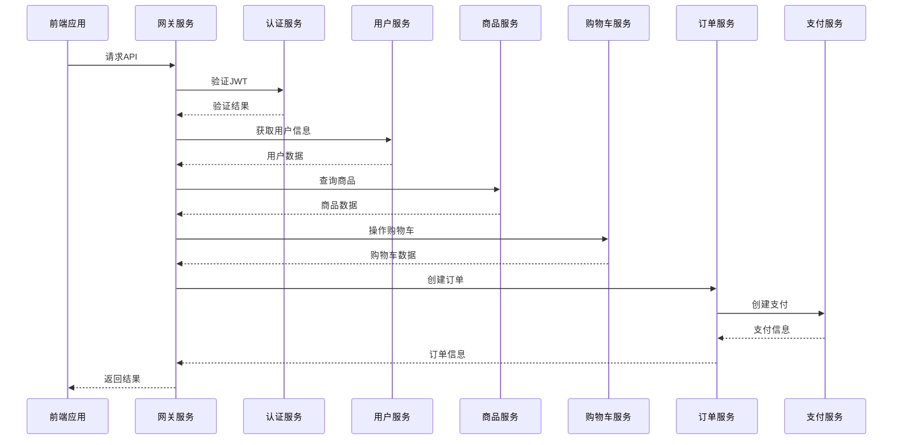
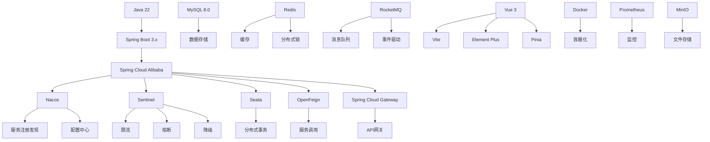

# 技术架构

<cite>
**本文档引用文件**   
- [README.md](file://README.md)
- [技术栈设计.md](file://技术栈设计.md)
- [docker-compose.yml](file://docker-compose.yml)
- [prometheus.yml](file://config/prometheus.yml)
- [pom.xml](file://backend/pom.xml)
- [gateway-service](file://backend/gateway-service)
- [user-service](file://backend/user-service)
- [product-service](file://backend/product-service)
- [order-service](file://backend/order-service)
- [payment-service](file://backend/payment-service)
- [merchant-service](file://backend/merchant-service)
- [cart-service](file://backend/cart-service)
- [sms-service](file://backend/sms-service)
- [admin-service](file://backend/admin-service)
- [auth-service](file://backend/auth-service)
- [frontend](file://frontend)
</cite>

## 目录
1. [系统架构概览](#系统架构概览)
2. [微服务划分与职责](#微服务划分与职责)
3. [核心技术集成](#核心技术集成)
4. [服务注册与发现机制](#服务注册与发现机制)
5. [配置中心管理](#配置中心管理)
6. [分布式事务处理](#分布式事务处理)
7. [熔断降级与限流策略](#熔断降级与限流策略)
8. [前端技术选型](#前端技术选型)
9. [基础设施集成](#基础设施集成)
10. [系统架构图](#系统架构图)
11. [组件交互图](#组件交互图)
12. [技术栈依赖关系图](#技术栈依赖关系图)

## 系统架构概览

本系统采用基于Spring Cloud Alibaba的微服务架构，实现了前后端分离的设计模式。系统集成了自动服务发现与启动功能，支持动态服务管理，简化了开发和部署流程。整体架构采用容器化部署，通过Docker Compose进行服务编排，实现了基础设施的统一管理。

系统采用Java 22 + Spring Boot 3.x作为核心框架，结合Spring Cloud Alibaba生态组件，构建了完整的微服务解决方案。前端采用Vue 3 + Vite + Element Plus的技术栈，实现了现代化的用户界面。系统支持dev/test/prod三套环境，配置与开关集中托管于Nacos配置中心。

**Section sources**
- [README.md](file://README.md#L1-L653)
- [技术栈设计.md](file://技术栈设计.md#L1-L94)

## 微服务划分与职责

系统按照业务域进行了微服务划分，每个服务都有明确的职责边界：



**Diagram sources**
- [README.md](file://README.md#L50-L69)

### 微服务职责说明

| 服务名称 | 端口 | 主要职责 |
|---------|------|---------|
| 网关服务 | 8080 | 统一入口、鉴权、限流、灰度 |
| 认证服务 | 8081 | 统一身份认证、令牌管理 |
| 用户服务 | 8082 | 用户账号、资料、地址管理 |
| 商品服务 | 8083 | 商品SPU/SKU、类目、上架管理 |
| 购物车服务 | 8088 | 购物车管理 |
| 订单服务 | 8084 | 订单创建、查询、状态管理 |
| 支付服务 | 8085 | 支付功能、支付回调处理 |
| 商家服务 | 8087 | 商家入驻、店铺、商品管理 |
| 管理服务 | 8086 | 系统监控、用户管理、商家审核 |
| 短信服务 | 8089 | 短信验证码发送与验证 |

**Section sources**
- [README.md](file://README.md#L50-L69)
- [技术栈设计.md](file://技术栈设计.md#L41-L54)

## 核心技术集成

### Spring Boot 3.x 集成

系统采用Spring Boot 3.x作为基础框架，充分利用了其现代化的特性：

- 基于Java 17+的新特性，提升了开发效率和运行性能
- 内置了自动配置机制，简化了应用配置
- 提供了丰富的Starter依赖，快速集成常用功能
- 内嵌了Tomcat服务器，简化了部署流程

### Spring Cloud Alibaba 集成

系统全面集成了Spring Cloud Alibaba生态组件，构建了完整的微服务解决方案：

- **Nacos**: 作为服务注册中心和配置中心
- **Sentinel**: 提供熔断、限流、降级等流量控制功能
- **Seata**: 支持分布式事务处理
- **RocketMQ**: 作为消息队列，实现异步通信和事件驱动
- **OpenFeign**: 实现服务间的声明式调用

### Nacos 集成

Nacos在系统中扮演着双重角色：

1. **服务注册与发现中心**：所有微服务启动时向Nacos注册自己的信息，其他服务通过Nacos发现并调用目标服务。
2. **配置中心**：集中管理所有微服务的配置信息，支持多环境、多命名空间的配置管理。

Nacos配置了dev/test/prod三套环境，通过命名空间进行隔离，确保了不同环境的配置独立性。

### Sentinel 集成

Sentinel提供了全面的流量控制能力：

- **限流**：防止系统被突发流量冲垮
- **熔断**：当依赖服务出现故障时，快速失败，避免雪崩效应
- **降级**：在系统压力过大时，关闭非核心功能，保证核心功能可用
- **系统保护**：基于系统负载自动调整流量

Sentinel控制台部署在8858端口，可以实时监控各服务的流量情况，并动态调整规则。

### Seata 集成

Seata用于处理跨服务的分布式事务，确保数据一致性：

- 采用AT模式，对业务代码侵入性小
- 支持TCC、Saga等模式，满足不同业务场景需求
- 与Spring Cloud生态无缝集成

在订单创建场景中，Seata确保了订单、库存、支付等操作的原子性。

### RocketMQ 集成

RocketMQ作为消息中间件，实现了系统的异步通信：

- **事务消息**：确保消息发送与本地事务的一致性
- **事件总线**：实现下单→库存、支付回调、退款等业务流程
- **解耦**：降低服务间的直接依赖，提高系统可维护性

RocketMQ部署了NameServer和Broker，提供了高可用的消息服务。

**Section sources**
- [README.md](file://README.md#L22-L37)
- [技术栈设计.md](file://技术栈设计.md#L14-L22)

## 服务注册与发现机制

系统采用Nacos作为服务注册与发现中心，实现了服务的动态管理。

### 服务注册流程

当微服务启动时，会自动向Nacos注册中心注册自己的信息，包括：

- 服务名称
- IP地址和端口
- 健康检查路径
- 元数据信息

注册信息以JSON格式存储在Nacos中，其他服务可以通过服务名称发现目标服务。

### 服务发现机制

服务间调用通过Spring Cloud LoadBalancer实现：

1. 调用方通过服务名称（如"user-service"）发起调用
2. LoadBalancer从Nacos获取该服务的所有实例
3. 根据负载均衡策略（默认轮询）选择一个实例
4. 向选中的实例发起HTTP请求

这种机制实现了服务的透明调用，调用方无需关心具体的服务地址。

### 健康检查

Nacos通过以下方式检查服务健康状态：

- **HTTP检查**：定期访问服务的/actuator/health端点
- **TCP检查**：检查服务端口是否可连接
- **PING检查**：检查主机是否可达

当服务实例健康检查失败时，Nacos会将其从服务列表中移除，避免流量转发到故障实例。



**Diagram sources**
- [docker-compose.yml](file://docker-compose.yml#L40-L63)
- [pom.xml](file://backend/pom.xml#L25-L28)

## 配置中心管理

系统采用Nacos作为配置中心，实现了配置的集中管理和动态更新。

### 配置结构

Nacos配置采用分层结构：

- **命名空间**：隔离dev/test/prod环境
- **Group**：按服务分组，默认为DEFAULT_GROUP
- **Data ID**：配置文件名称，通常为{service-name}.yml

### 配置内容

各服务的配置文件包含以下内容：

- 数据库连接信息
- Redis连接信息
- 第三方服务密钥
- 业务开关和阈值
- 限流降级规则

### 动态配置更新

系统实现了配置的热更新：

1. 开发者在Nacos控制台修改配置
2. Nacos推送配置变更事件
3. 微服务监听配置变更，自动刷新配置
4. 无需重启服务即可生效

这种机制大大提高了运维效率，降低了配置变更的风险。

### 配置安全

为保障配置安全，系统采取了以下措施：

- 敏感信息（如数据库密码）不直接存储，而是通过环境变量注入
- 使用K8s Secret管理密钥
- 配置中心访问需要认证授权



**Diagram sources**
- [技术栈设计.md](file://技术栈设计.md#L65-L68)
- [pom.xml](file://backend/pom.xml#L25-L28)

## 分布式事务处理

系统采用Seata和事件驱动相结合的方式处理分布式事务。

### Seata AT模式

对于需要强一致性的场景，采用Seata AT模式：

1. **一阶段**：业务数据和回滚日志在同一本地事务中提交
2. **二阶段**：
   - 成功：删除回滚日志
   - 失败：根据回滚日志进行补偿

AT模式对业务代码侵入性小，只需添加@GlobalTransactional注解即可。

### 事件驱动最终一致性

对于允许最终一致性的场景，采用事件驱动模式：

- 下单成功后发布"订单创建"事件
- 库存服务监听事件，扣减库存
- 支付服务监听事件，创建支付订单
- 各服务独立处理，通过消息队列保证最终一致性

这种方式提高了系统吞吐量，降低了服务间耦合。

### 事务消息

RocketMQ的事务消息确保了本地事务与消息发送的一致性：

1. 发送半消息到MQ
2. 执行本地事务
3. 根据事务结果提交或回滚消息
4. MQ投递消息给消费者

这种机制避免了消息丢失或重复，保证了业务的可靠性。



**Diagram sources**
- [技术栈设计.md](file://技术栈设计.md#L21-L22)
- [pom.xml](file://backend/pom.xml#L28-L29)

## 熔断降级与限流策略

系统采用Sentinel实现全面的流量控制，保障系统稳定性。

### 限流策略

基于QPS的限流规则：

- **资源粒度**：可以针对URL、服务、方法等维度设置
- **流控模式**：直接、关联、链路
- **流控效果**：快速失败、Warm Up、排队等待

例如，订单创建接口设置QPS=100，超过则直接拒绝。

### 熔断降级

基于异常比例或RT的熔断策略：

- 当异常比例超过阈值（如50%）时，触发熔断
- 熔断期间，请求直接失败，不调用下游服务
- 经过冷却时间后，进入半开状态，试探性恢复

这种机制防止了雪崩效应，保护了下游服务。

### 系统保护

基于系统负载的自适应保护：

- 当系统load、CPU使用率等指标过高时，自动限流
- 优先保障核心接口的可用性
- 非核心功能自动降级

### 黑白名单

支持基于IP、用户等维度的黑白名单控制：

- 黑名单：拒绝特定IP或用户的请求
- 白名单：优先处理特定IP或用户的请求



**Diagram sources**
- [README.md](file://README.md#L29-L30)
- [技术栈设计.md](file://技术栈设计.md#L20-L21)

## 前端技术选型

前端采用现代化的技术栈，提供了优秀的用户体验。

### Vue 3 优势

选择Vue 3的主要原因：

- **Composition API**：更好的逻辑复用和代码组织
- **性能提升**：更快的渲染速度和更小的包体积
- **TypeScript支持**：更好的类型安全和开发体验
- **响应式系统重构**：更高效的依赖追踪

### Vite 构建工具

Vite作为构建工具的优势：

- **极速启动**：利用ES模块原生支持，无需打包即可启动
- **热更新快**：基于文件系统的HMR，更新速度极快
- **生产构建**：基于Rollup，输出优化的静态资源
- **开发体验好**：支持JSX、TSX、Vue SFC等多种格式

### Element Plus UI组件库

Element Plus作为UI组件库的优势：

- **丰富的组件**：提供了完整的UI组件体系
- **主题定制**：支持深度主题定制
- **国际化**：内置多语言支持
- **无障碍**：符合WCAG标准

### 其他技术选型

- **Pinia**：状态管理，替代Vuex，更简洁的API
- **Vue Router 4**：路由管理，支持动态路由、懒加载
- **Axios**：HTTP客户端，支持拦截器、取消请求
- **VueUse**：实用工具函数库，提高开发效率



**Diagram sources**
- [README.md](file://README.md#L39-L46)
- [frontend/package.json](file://frontend/package.json#L1-L43)

## 基础设施集成

系统集成了多种基础设施，提供了完整的运行环境。

### Docker 容器化部署

所有服务均容器化部署，通过docker-compose.yml统一管理：

- **基础设施**：MySQL、Redis、Nacos、Sentinel等
- **业务服务**：各微服务以JAR包形式运行
- **前端应用**：Vite开发服务器

容器化部署的优势：

- 环境一致性：开发、测试、生产环境一致
- 快速部署：一键启动所有服务
- 资源隔离：各服务独立运行，互不影响
- 弹性伸缩：易于水平扩展

### Prometheus 监控

Prometheus作为监控系统，收集和存储指标数据：

- **数据采集**：通过HTTP拉取各服务的/metrics端点
- **数据存储**：时序数据库，高效存储监控数据
- **告警**：基于PromQL查询，触发告警规则
- **可视化**：与Grafana集成，展示监控面板

监控指标包括：

- JVM指标：内存、GC、线程等
- HTTP指标：请求量、响应时间、错误率
- 业务指标：订单量、支付成功率等

### MinIO 文件存储

MinIO作为对象存储服务，用于存储文件：

- **S3兼容**：支持标准的S3 API
- **高可用**：支持分布式部署
- **安全性**：支持访问控制、加密
- **易用性**：提供Web控制台

用于存储商品图片、用户头像等静态资源。

```mermaid
graph TD
A[微服务] --> |暴露指标| B[/actuator/prometheus]
B --> C[Prometheus]
C --> D[Grafana]
D --> E[监控面板]
F[前端] --> |上传文件| G[MinIO]
G --> H[对象存储]
I[Docker] --> J[MySQL]
I --> K[Redis]
I --> L[Nacos]
I --> M[各微服务]
```

**Diagram sources**
- [docker-compose.yml](file://docker-compose.yml#L1-L485)
- [config/prometheus.yml](file://config/prometheus.yml#L1-L45)

## 系统架构图



**Diagram sources**
- [docker-compose.yml](file://docker-compose.yml#L1-L485)
- [README.md](file://README.md#L48-L70)

## 组件交互图



**Diagram sources**
- [技术栈设计.md](file://技术栈设计.md#L51-L54)
- [pom.xml](file://backend/pom.xml#L49-L59)

## 技术栈依赖关系图



**Diagram sources**
- [README.md](file://README.md#L22-L46)
- [技术栈设计.md](file://技术栈设计.md#L14-L40)