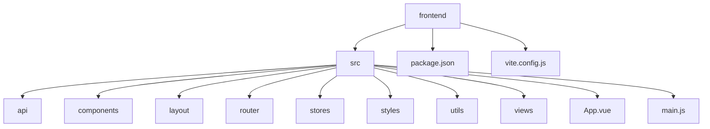
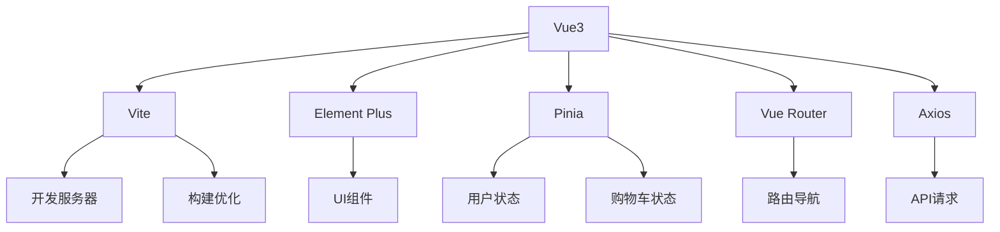
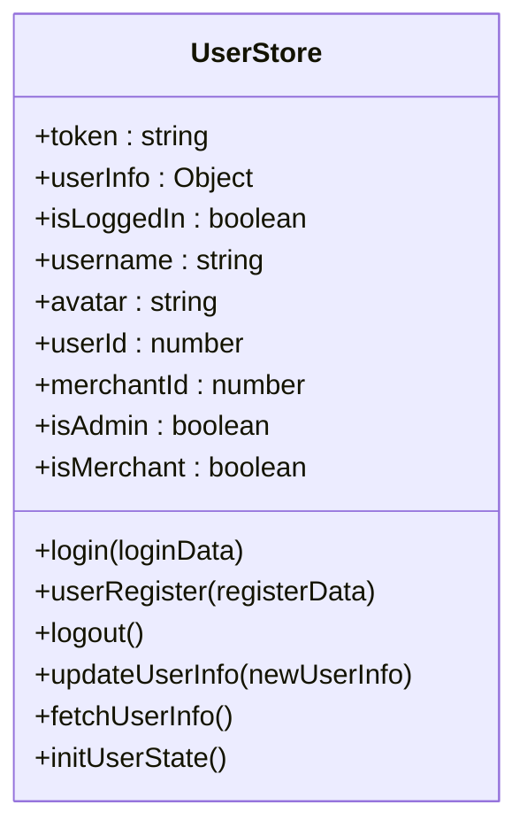
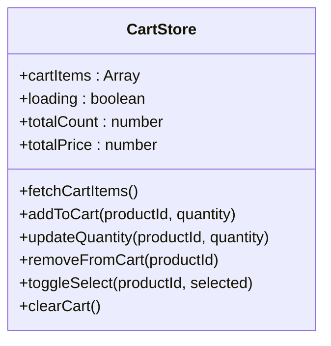
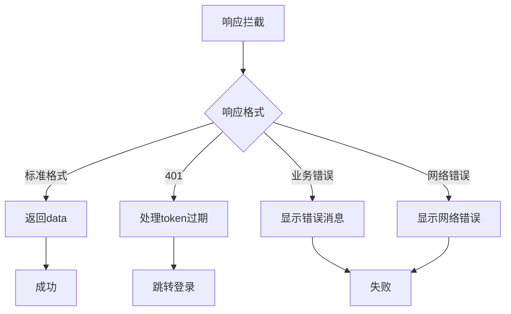

# 前端技术栈

<cite>
**本文档引用文件**  
- [package.json](file://frontend/package.json)
- [vite.config.js](file://frontend/vite.config.js)
- [main.js](file://frontend/src/main.js)
- [router/index.js](file://frontend/src/router/index.js)
- [stores/user.js](file://frontend/src/stores/user.js)
- [stores/cart.js](file://frontend/src/stores/cart.js)
- [utils/request.js](file://frontend/src/utils/request.js)
- [api/auth.js](file://frontend/src/api/auth.js)
</cite>

## 目录
1. [项目结构](#项目结构)
2. [核心框架集成](#核心框架集成)
3. [Vite构建工具配置](#vite构建工具配置)
4. [Element Plus组件库集成](#element-plus组件库集成)
5. [Pinia状态管理](#pinia状态管理)
6. [Axios网络请求封装](#axios网络请求封装)
7. [依赖关系分析](#依赖关系分析)

## 项目结构

springcloud-mall项目的前端部分位于`frontend`目录下，采用Vue3 + Vite的现代前端架构。项目结构清晰，遵循功能模块化组织原则。



**Diagram sources**
- [frontend/package.json](file://frontend/package.json)
- [frontend/vite.config.js](file://frontend/vite.config.js)

## 核心框架集成

项目采用Vue3作为核心框架，结合Vite构建工具，集成Element Plus作为UI组件库，Pinia进行状态管理，Vue Router实现路由控制。



**Diagram sources**
- [frontend/src/main.js](file://frontend/src/main.js)
- [frontend/package.json](file://frontend/package.json)

## Vite构建工具配置

Vite配置文件`vite.config.js`包含了开发服务器、代理设置和构建优化等关键配置。

### 开发服务器配置
- 端口：5173
- host：true（允许外部访问）
- 别名：`@` 指向 `src` 目录

### 代理设置
配置了API网关代理，将前端请求转发到后端微服务：

```javascript
proxy: {
  '/api': {
    target: 'http://localhost:8080', // API网关
    changeOrigin: true
  },
  '/api/sms': {
    target: 'http://localhost:8083', // 短信服务直连
    changeOrigin: true,
    rewrite: (path) => path.replace(/^\/api\/sms/, '/sms')
  }
}
```

### 构建优化
通过`optimizeDeps`预构建常用依赖，提升开发服务器启动速度：

```javascript
optimizeDeps: {
  include: [
    'dayjs',
    'dayjs/plugin/advancedFormat',
    'dayjs/plugin/customParseFormat',
    'dayjs/plugin/localeData',
    'dayjs/plugin/dayOfYear'
  ]
}
```

**Section sources**
- [frontend/vite.config.js](file://frontend/vite.config.js#L1-L73)

## Element Plus组件库集成

Element Plus作为UI组件库，通过自动导入插件实现按需加载和图标注册。

### 自动导入配置
使用`unplugin-auto-import`和`unplugin-vue-components`实现自动导入：

```javascript
plugins: [
  AutoImport({
    resolvers: [ElementPlusResolver()],
    imports: ['vue', 'vue-router', 'pinia'],
    dts: true
  }),
  Components({
    resolvers: [ElementPlusResolver()],
    dts: true
  })
]
```

### 全局注册
在`main.js`中全局注册Element Plus及其图标：

```javascript
import ElementPlus from 'element-plus'
import '@element-plus/icons-vue'
import zhCn from 'element-plus/dist/locale/zh-cn.mjs'

app.use(ElementPlus, {
  locale: zhCn,
})
```

### 图标注册
遍历导入所有Element Plus图标并注册为全局组件：

```javascript
for (const [key, component] of Object.entries(ElementPlusIconsVue)) {
  app.component(key, component)
}
```

**Section sources**
- [frontend/src/main.js](file://frontend/src/main.js#L1-L56)
- [frontend/vite.config.js](file://frontend/vite.config.js#L4-L6)

## Pinia状态管理

Pinia用于管理应用的全局状态，包括用户状态和购物车状态。

### 用户状态管理
`stores/user.js`管理用户登录状态、用户信息等：



**Diagram sources**
- [frontend/src/stores/user.js](file://frontend/src/stores/user.js#L1-L259)

### 购物车状态管理
`stores/cart.js`管理购物车相关状态：



**Diagram sources**
- [frontend/src/stores/cart.js](file://frontend/src/stores/cart.js#L1-L127)

### 持久化配置
用户状态通过`pinia-plugin-persistedstate`实现本地存储持久化：

```javascript
persist: {
  key: 'user-store',
  storage: localStorage,
  paths: ['token', 'userInfo']
}
```

**Section sources**
- [frontend/src/main.js](file://frontend/src/main.js#L2-L3)
- [frontend/src/stores/user.js](file://frontend/src/stores/user.js#L253-L258)

## Axios网络请求封装

`utils/request.js`封装了Axios实例，包含请求/响应拦截器和错误处理。

### 请求拦截器
- 添加Authorization头（Bearer Token）
- 注入CSRF令牌
- 添加请求ID用于追踪
- 处理公开路径（无需认证）

```javascript
service.interceptors.request.use(
  config => {
    const userStore = useUserStore()
    
    // 公开路径列表
    const publicPaths = [
      '/users/register',
      '/users/login',
      '/merchant/login',
      '/merchant/register',
      '/sms/send'
    ]
    
    // 非公开路径且有token时添加Authorization头
    if (!isPublicPath && userStore.token) {
      config.headers.Authorization = `Bearer ${userStore.token}`
    }
    
    // CSRF防护
    if (unsafeMethods.includes(config.method.toLowerCase())) {
      const csrfToken = getCsrfTokenFromCookie()
      if (csrfToken) {
        config.headers['X-CSRF-TOKEN'] = csrfToken
        config.headers['X-XSRF-TOKEN'] = csrfToken
      }
    }
    
    return config
  }
)
```

### 响应拦截器
- 统一处理成功响应（code: 200 或 success: true）
- 处理token过期（401状态码）
- 错误提示（Element Plus Message组件）
- 网络错误处理



**Diagram sources**
- [frontend/src/utils/request.js](file://frontend/src/utils/request.js#L119-L254)

### 文件上传下载
提供专门的文件上传和下载方法：

```javascript
export function uploadFile(file, onProgress) {
  const formData = new FormData()
  formData.append('file', file)
  
  return service({
    url: '/upload',
    method: 'post',
    data: formData,
    headers: {
      'Content-Type': 'multipart/form-data'
    },
    onUploadProgress: (progressEvent) => {
      if (onProgress) {
        const percentCompleted = Math.round(
          (progressEvent.loaded * 100) / progressEvent.total
        )
        onProgress(percentCompleted)
      }
    }
  })
}
```

**Section sources**
- [frontend/src/utils/request.js](file://frontend/src/utils/request.js#L1-L353)

## 依赖关系分析

`package.json`文件定义了项目的所有依赖关系。

### 核心依赖
```json
"dependencies": {
  "vue": "^3.5.12",
  "vue-router": "^4.2.5",
  "pinia": "^2.1.7",
  "element-plus": "^2.4.2",
  "axios": "^1.6.0",
  "js-cookie": "^3.0.5",
  "nprogress": "^0.2.0",
  "pinia-plugin-persistedstate": "^3.2.0"
}
```

### 开发依赖
```json
"devDependencies": {
  "vite": "^5.4.10",
  "@vitejs/plugin-vue": "^5.2.0",
  "unplugin-auto-import": "^0.16.7",
  "unplugin-vue-components": "^0.25.2",
  "sass": "^1.69.5",
  "prettier": "^3.1.0",
  "eslint": "^8.53.0"
}
```

### 脚本命令
```json
"scripts": {
  "dev": "vite",
  "build": "vite build",
  "preview": "vite preview",
  "lint": "eslint . --ext .vue,.js,.jsx,.cjs,.mjs,.ts,.tsx,.cts,.mts --fix --ignore-path .gitignore",
  "format": "prettier --write src/"
}
```

**Section sources**
- [frontend/package.json](file://frontend/package.json#L1-L43)