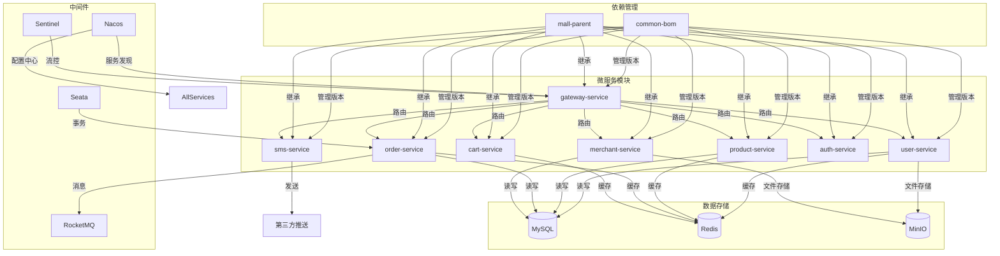

# 后端技术栈

<cite>
**本文档引用的文件**   
- [common-bom/pom.xml](file://backend/common-bom/pom.xml)
- [user-service/pom.xml](file://backend/user-service/pom.xml)
- [product-service/pom.xml](file://backend/product-service/pom.xml)
- [order-service/pom.xml](file://backend/order-service/pom.xml)
- [merchant-service/pom.xml](file://backend/merchant-service/pom.xml)
- [cart-service/pom.xml](file://backend/cart-service/pom.xml)
- [gateway-service/pom.xml](file://backend/gateway-service/pom.xml)
- [auth-service/pom.xml](file://backend/auth-service/pom.xml)
- [sms-service/pom.xml](file://backend/sms-service/pom.xml)
- [mall-parent/pom.xml](file://backend/pom.xml)
- [user-service/src/main/resources/application.yml](file://backend/user-service/src/main/resources/application.yml)
- [product-service/src/main/resources/application.yml](file://backend/product-service/src/main/resources/application.yml)
- [order-service/src/main/resources/application.yml](file://backend/order-service/src/main/resources/application.yml)
- [merchant-service/src/main/resources/application.yml](file://backend/merchant-service/src/main/resources/application.yml)
- [cart-service/src/main/resources/application.yml](file://backend/cart-service/src/main/resources/application.yml)
- [gateway-service/src/main/resources/application.yml](file://backend/gateway-service/src/main/resources/application.yml)
- [auth-service/src/main/resources/application.yml](file://backend/auth-service/src/main/resources/application.yml)
- [sms-service/src/main/resources/application.yml](file://backend/sms-service/src/main/resources/application.yml)
- [user-service/src/main/java/com/mall/user/config/MybatisPlusConfig.java](file://backend/user-service/src/main/java/com/mall/user/config/MybatisPlusConfig.java)
- [user-service/src/main/java/com/mall/user/config/MinioConfig.java](file://backend/user-service/src/main/java/com/mall/user/config/MinioConfig.java)
- [order-service/src/main/java/com/mall/order/config/RedisConfig.java](file://backend/order-service/src/main/java/com/mall/order/config/RedisConfig.java)
- [order-service/src/main/java/com/mall/order/config/RabbitMQConfig.java](file://backend/order-service/src/main/java/com/mall/order/config/RabbitMQConfig.java)
- [order-service/src/main/java/com/mall/order/service/impl/OrderServiceImpl.java](file://backend/order-service/src/main/java/com/mall/order/service/impl/OrderServiceImpl.java)
- [admin-service/src/main/java/com/mall/admin/config/MyBatisPlusConfig.java](file://backend/admin-service/src/main/java/com/mall/admin/config/MyBatisPlusConfig.java)
- [admin-service/src/main/java/com/mall/admin/config/RedisConfig.java](file://backend/admin-service/src/main/java/com/mall/admin/config/RedisConfig.java)
- [admin-service/src/main/java/com/mall/admin/config/WebMvcConfig.java](file://backend/admin-service/src/main/java/com/mall/admin/config/WebMvcConfig.java)
- [admin-service/src/main/java/com/mall/admin/config/RestTemplateConfig.java](file://backend/admin-service/src/main/java/com/mall/admin/config/RestTemplateConfig.java)
- [merchant-service/src/main/java/com/mall/merchant/config/MinioConfig.java](file://backend/merchant-service/src/main/java/com/mall/merchant/config/MinioConfig.java)
- [merchant-service/src/main/java/com/mall/merchant/config/RestTemplateConfig.java](file://backend/merchant-service/src/main/java/com/mall/merchant/config/RestTemplateConfig.java)
- [cart-service/src/main/java/com/mall/cart/config/RedisConfig.java](file://backend/cart-service/src/main/java/com/mall/cart/config/RedisConfig.java)
- [cart-service/src/main/java/com/mall/cart/config/SecurityConfig.java](file://backend/cart-service/src/main/java/com/mall/cart/config/SecurityConfig.java)
- [payment-service/src/main/java/com/mall/payment/config/SecurityConfig.java](file://backend/payment-service/src/main/java/com/mall/payment/config/SecurityConfig.java)
- [config/broker.conf](file://config/broker.conf)
- [system实现报告.md](file://系统实现报告.md)
</cite>

## 目录
1. [技术架构概览](#技术架构概览)
2. [核心框架集成与作用](#核心框架集成与作用)
3. [依赖管理机制](#依赖管理机制)
4. [数据层技术配置](#数据层技术配置)
5. [微服务模块配置](#微服务模块配置)
6. [中间件配置](#中间件配置)
7. [依赖关系图](#依赖关系图)

## 技术架构概览

本项目采用基于Spring Cloud Alibaba的微服务架构，以Spring Boot 3.x为基础构建。整体架构包含多个独立部署的微服务模块，通过Nacos实现服务注册与发现，利用Sentinel进行流量控制与熔断降级，Seata保障分布式事务一致性，RocketMQ实现异步消息通信。网关服务统一入口，各微服务通过OpenFeign进行服务间调用，形成高内聚、低耦合的分布式系统。

**Section sources**
- [gateway-service/pom.xml](file://backend/gateway-service/pom.xml)
- [mall-parent/pom.xml](file://backend/pom.xml)
- [system实现报告.md](file://系统实现报告.md)

## 核心框架集成与作用

### Spring Boot 3.x
作为基础框架，提供自动配置、起步依赖、嵌入式服务器等特性，简化微服务开发。项目中使用版本为3.1.12，支持Java 17，提升性能与安全性。

### Spring Cloud Alibaba
集成阿里巴巴开源组件，提供完整的微服务解决方案。通过`spring-cloud-alibaba-dependencies` BOM统一管理版本，确保组件兼容性。

### Nacos
作为服务注册中心和配置中心，实现服务的动态发现与配置管理。各微服务启动时向Nacos注册实例，并从Nacos获取配置信息，支持动态刷新。

### Sentinel
实现流量控制、熔断降级、系统负载保护。通过Nacos持久化流控规则，网关服务配置了基于Nacos的数据源，实现规则的集中管理。

### Seata
解决分布式事务问题，采用AT模式实现自动补偿。在订单创建等跨服务操作中保证数据一致性，配置了Nacos作为配置和注册中心。

### RocketMQ
作为消息中间件，实现服务解耦与异步处理。订单服务通过RabbitMQ（项目中实际使用）发送订单事件，其他服务订阅处理，确保最终一致性。

**Section sources**
- [mall-parent/pom.xml](file://backend/pom.xml)
- [system实现报告.md](file://系统实现报告.md)
- [config/broker.conf](file://config/broker.conf)
- [gateway-service/src/main/resources/application.yml](file://backend/gateway-service/src/main/resources/application.yml)

## 依赖管理机制

### common-bom依赖管理
`common-bom`模块作为依赖管理中枢，采用Maven BOM（Bill of Materials）机制统一管理所有微服务的依赖版本。其`pom.xml`中通过`dependencyManagement`定义内部模块版本，避免版本冲突。

```xml
<dependencyManagement>
    <dependencies>
        <dependency>
            <groupId>com.mall</groupId>
            <artifactId>common-core</artifactId>
            <version>${project.version}</version>
        </dependency>
        <!-- 其他内部模块 -->
    </dependencies>
</dependencyManagement>
```

### 微服务继承与依赖引入
各微服务模块通过继承`mall-parent`并导入`common-bom`来统一依赖版本。例如`user-service`的`pom.xml`：

```xml
<parent>
    <groupId>com.mall</groupId>
    <artifactId>mall-parent</artifactId>
    <version>1.0.0</version>
</parent>

<dependencies>
    <dependency>
        <groupId>com.mall</groupId>
        <artifactId>common-core</artifactId>
    </dependency>
    <!-- 其他特定依赖 -->
</dependencies>
```

通过这种方式，所有微服务共享一致的依赖版本，简化了依赖管理。

**Section sources**
- [common-bom/pom.xml](file://backend/common-bom/pom.xml)
- [user-service/pom.xml](file://backend/user-service/pom.xml)
- [mall-parent/pom.xml](file://backend/pom.xml)

## 数据层技术配置

### MyBatis-Plus
作为持久层框架，简化数据库操作。各服务通过`MybatisPlusConfig`配置分页插件，统一数据库类型为MySQL。

```java
@Bean
public MybatisPlusInterceptor mybatisPlusInterceptor() {
    MybatisPlusInterceptor interceptor = new MybatisPlusInterceptor();
    interceptor.addInnerInterceptor(new PaginationInnerInterceptor(DbType.MYSQL));
    return interceptor;
}
```

### Redis
用于缓存、会话存储和分布式锁。配置`RedisTemplate`使用JSON序列化，确保对象存储的可读性与兼容性。`order-service`中配置了缓存管理器，设置默认过期时间。

### MySQL
作为主要关系型数据库，各服务配置独立的数据源，使用HikariCP连接池优化性能。通过`application.yml`配置连接参数、驱动类和连接池大小。

### MinIO
作为对象存储服务，用于存储用户头像、商品图片等文件。通过`MinioConfig`配置客户端并自动创建存储桶，设置公开读权限以便前端访问。

**Section sources**
- [user-service/src/main/java/com/mall/user/config/MybatisPlusConfig.java](file://backend/user-service/src/main/java/com/mall/user/config/MybatisPlusConfig.java)
- [order-service/src/main/java/com/mall/order/config/RedisConfig.java](file://backend/order-service/src/main/java/com/mall/order/config/RedisConfig.java)
- [user-service/src/main/java/com/mall/user/config/MinioConfig.java](file://backend/user-service/src/main/java/com/mall/user/config/MinioConfig.java)
- [user-service/src/main/resources/application.yml](file://backend/user-service/src/main/resources/application.yml)

## 微服务模块配置

### user-service
用户服务，负责用户管理与认证。依赖`common-core`、MyBatis-Plus、MySQL、JWT等。配置了Nacos服务发现，MyBatis-Plus分页插件和MinIO客户端。

### product-service
商品服务，管理商品信息。集成Nacos、OpenFeign、MyBatis-Plus、Redis等，支持服务间调用与缓存。

### order-service
订单服务，核心业务模块。使用JPA进行数据访问，集成RabbitMQ实现订单事件发布，通过Redis实现分布式锁防止重复下单。

### merchant-service
商家服务，管理商家入驻与运营。使用JPA持久化，集成MinIO处理商家资质文件上传，通过RestTemplate调用SMS服务。

### cart-service
购物车服务，基于Redis存储购物车数据。配置了安全过滤器链，开发模式下可禁用JWT认证。

### gateway-service
网关服务，统一入口。配置路由规则、CORS、Sentinel流控，实现请求转发与安全控制。

### auth-service
认证服务，处理登录与令牌管理。使用Redis存储令牌黑名单，集成Nacos服务发现。

### sms-service
短信服务，发送验证码。使用MySQL存储日志，Redis缓存验证码，集成第三方推送服务。

**Section sources**
- [user-service/pom.xml](file://backend/user-service/pom.xml)
- [product-service/pom.xml](file://backend/product-service/pom.xml)
- [order-service/pom.xml](file://backend/order-service/pom.xml)
- [merchant-service/pom.xml](file://backend/merchant-service/pom.xml)
- [cart-service/pom.xml](file://backend/cart-service/pom.xml)
- [gateway-service/pom.xml](file://backend/gateway-service/pom.xml)
- [auth-service/pom.xml](file://backend/auth-service/pom.xml)
- [sms-service/pom.xml](file://backend/sms-service/pom.xml)

## 中间件配置

### RabbitMQ配置
订单服务配置了Topic Exchange和多个队列，实现订单事件的发布订阅模式。

```java
@Bean
public TopicExchange orderExchange() {
    return new TopicExchange(ORDER_EXCHANGE, true, false);
}

@Bean
public Queue orderCreatedQueue() {
    return new Queue(ORDER_CREATED_QUEUE, true);
}
```

### 分布式锁实现
订单服务在创建订单时使用分布式锁，防止同一用户并发创建订单。

```java
String[] lockInfo = distributedLockService.getOrderCreateLock(request.getUserId());
return distributedLockService.executeWithLock(lockKey, lockValue, 10L, () -> doCreateOrder(request));
```

### 安全配置
各服务根据需求配置安全策略。`cart-service`和`payment-service`通过`SecurityConfig`配置JWT认证、CORS和权限控制。

```java
http.authorizeHttpRequests(authz -> authz
    .requestMatchers("/actuator/**", "/swagger-ui/**").permitAll()
    .anyRequest().authenticated());
```

**Section sources**
- [order-service/src/main/java/com/mall/order/config/RabbitMQConfig.java](file://backend/order-service/src/main/java/com/mall/order/config/RabbitMQConfig.java)
- [order-service/src/main/java/com/mall/order/service/impl/OrderServiceImpl.java](file://backend/order-service/src/main/java/com/mall/order/service/impl/OrderServiceImpl.java)
- [cart-service/src/main/java/com/mall/cart/config/SecurityConfig.java](file://backend/cart-service/src/main/java/com/mall/cart/config/SecurityConfig.java)
- [payment-service/src/main/java/com/mall/payment/config/SecurityConfig.java](file://backend/payment-service/src/main/java/com/mall/payment/config/SecurityConfig.java)

## 依赖关系图



**Diagram sources **
- [common-bom/pom.xml](file://backend/common-bom/pom.xml)
- [mall-parent/pom.xml](file://backend/pom.xml)
- [user-service/pom.xml](file://backend/user-service/pom.xml)
- [product-service/pom.xml](file://backend/product-service/pom.xml)
- [order-service/pom.xml](file://backend/order-service/pom.xml)
- [merchant-service/pom.xml](file://backend/merchant-service/pom.xml)
- [cart-service/pom.xml](file://backend/cart-service/pom.xml)
- [gateway-service/pom.xml](file://backend/gateway-service/pom.xml)
- [auth-service/pom.xml](file://backend/auth-service/pom.xml)
- [sms-service/pom.xml](file://backend/sms-service/pom.xml)

**Section sources**
- [common-bom/pom.xml](file://backend/common-bom/pom.xml)
- [mall-parent/pom.xml](file://backend/pom.xml)