# 技术栈

<cite>
**本文档引用的文件**
- [README.md](file://README.md)
- [技术栈设计.md](file://技术栈设计.md)
- [frontend/package.json](file://frontend/package.json)
- [backend/common-bom/pom.xml](file://backend/common-bom/pom.xml)
- [backend/admin-service/pom.xml](file://backend/admin-service/pom.xml)
- [backend/auth-service/pom.xml](file://backend/auth-service/pom.xml)
- [backend/cart-service/pom.xml](file://backend/cart-service/pom.xml)
- [backend/gateway-service/pom.xml](file://backend/gateway-service/pom.xml)
- [backend/merchant-service/pom.xml](file://backend/merchant-service/pom.xml)
- [backend/order-service/pom.xml](file://backend/order-service/pom.xml)
- [backend/payment-service/pom.xml](file://backend/payment-service/pom.xml)
- [backend/product-service/pom.xml](file://backend/product-service/pom.xml)
- [backend/sms-service/pom.xml](file://backend/sms-service/pom.xml)
- [backend/user-service/pom.xml](file://backend/user-service/pom.xml)
</cite>

## 目录
1. [项目简介](#项目简介)
2. [后端技术栈](#后端技术栈)
   - [Spring Boot 与 Spring Cloud Alibaba](#spring-boot-与-spring-cloud-alibaba)
   - [服务注册与配置中心 Nacos](#服务注册与配置中心-nacos)
   - [服务网关 Gateway](#服务网关-gateway)
   - [熔断限流 Sentinel](#熔断限流-sentinel)
   - [分布式事务 Seata](#分布式事务-seata)
   - [消息队列 RocketMQ](#消息队列-rocketmq)
3. [前端技术栈](#前端技术栈)
4. [数据层技术](#数据层技术)
   - [MyBatis-Plus](#mybatis-plus)
   - [Redis](#redis)
   - [MySQL](#mysql)
   - [MinIO](#minio)
5. [依赖管理机制](#依赖管理机制)
   - [common-bom 统一版本管理](#common-bom-统一版本管理)
   - [各服务依赖关系图](#各服务依赖关系图)

## 项目简介

本项目是一个基于 Spring Cloud Alibaba 的微服务架构在线商城系统，采用前后端分离设计。系统集成了自动服务发现、智能依赖管理、实时状态监控等核心特性，支持灵活扩展和零配置集成新服务。项目采用 Java 22 + Spring Boot 3.x 作为核心框架，结合 Vue3 + Vite 构建现代化前端应用，实现了完整的电商功能体系，包括用户端、商家端和管理端三大业务场景。

**Section sources**
- [README.md](file://README.md#L1-L653)
- [技术栈设计.md](file://技术栈设计.md#L1-L94)

## 后端技术栈

### Spring Boot 与 Spring Cloud Alibaba

项目采用 Spring Boot 3.x 作为基础框架，结合 Spring Cloud Alibaba 2022.0.0.0 版本构建微服务体系。Spring Boot 提供了自动配置、起步依赖等特性，极大简化了应用开发和部署流程。Spring Cloud Alibaba 集成了阿里巴巴开源的中间件解决方案，包括 Nacos、Sentinel、Seata 等组件，为微服务架构提供了完整的基础设施支持。

各微服务模块均基于 Spring Boot 构建，通过 `spring-boot-starter-web` 提供 RESTful API 接口，使用 `spring-boot-starter-actuator` 实现健康检查和监控功能。项目中的 admin-service、order-service、product-service 等核心服务均依赖 Spring Boot 的核心特性，确保了服务的稳定性和可维护性。

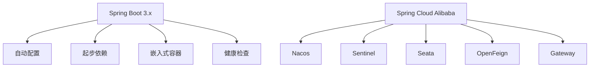

**Diagram sources**
- [README.md](file://README.md#L24-L38)
- [技术栈设计.md](file://技术栈设计.md#L8-L22)

### 服务注册与配置中心 Nacos

Nacos 2.3.0 作为服务注册与发现中心以及配置管理中心，为系统提供了动态服务管理和集中化配置能力。所有微服务在启动时会自动向 Nacos 注册自身实例信息，包括服务名称、IP 地址和端口号。服务消费者通过 Nacos 发现服务提供者，实现服务间的动态调用。

在配置管理方面，Nacos 支持多环境（dev/stage/prod）的配置隔离，通过命名空间实现不同环境的配置分离。各服务的配置文件如 `application.yml` 中通过 `spring.cloud.nacos.config.server-addr` 指定 Nacos 服务器地址，实现配置的动态获取和更新。

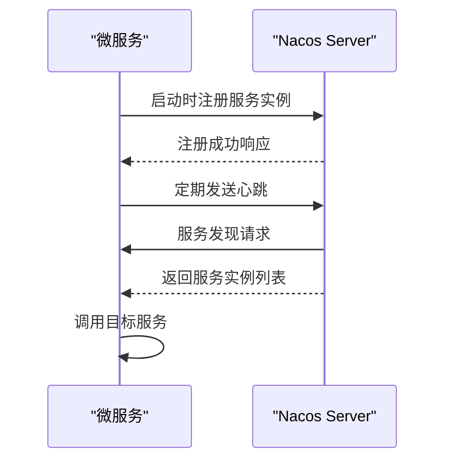

**Diagram sources**
- [README.md](file://README.md#L25-L26)
- [技术栈设计.md](file://技术栈设计.md#L17-L18)
- [backend/admin-service/pom.xml](file://backend/admin-service/pom.xml#L54-L58)

### 服务网关 Gateway

Spring Cloud Gateway 作为系统的统一入口，负责请求路由、鉴权、限流和灰度发布等功能。网关服务（gateway-service）拦截所有外部请求，根据预定义的路由规则将请求转发到相应的后端微服务。通过集成 Sentinel 实现网关级别的流量控制和熔断保护。

网关还承担了统一的认证鉴权职责，验证 JWT Token 的有效性，并根据用户角色和权限进行访问控制。同时，网关支持跨域配置、请求日志记录和响应头修改等通用功能，减轻了后端服务的负担。

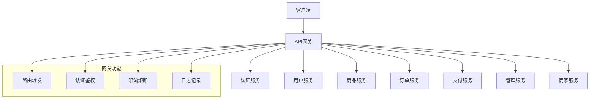

**Diagram sources**
- [README.md](file://README.md#L27-L28)
- [技术栈设计.md](file://技术栈设计.md#L18-L19)
- [backend/gateway-service/pom.xml](file://backend/gateway-service/pom.xml#L20-L24)

### 熔断限流 Sentinel

Sentinel 1.8.6 作为系统的流量防护组件，提供了丰富的流量控制、熔断降级和系统保护功能。通过与 Nacos 集成，实现了规则的动态配置和持久化存储。Sentinel 的流量控制功能可以防止突发流量导致系统崩溃，熔断降级机制则在依赖服务出现故障时快速失败，避免雪崩效应。

在网关服务中，Sentinel 被用于保护核心接口，设置 QPS 限流阈值和并发线程数限制。当某个接口的请求量超过预设阈值时，Sentinel 会自动拒绝多余的请求，返回预设的降级响应，确保系统的稳定性。

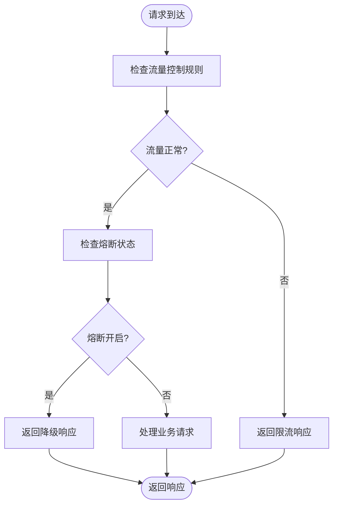

**Diagram sources**
- [README.md](file://README.md#L29)
- [技术栈设计.md](file://技术栈设计.md#L20)
- [backend/gateway-service/pom.xml](file://backend/gateway-service/pom.xml#L38-L47)

### 分布式事务 Seata

Seata 1.7.0 为系统提供了分布式事务解决方案，支持 AT、TCC 和 Saga 三种模式。在电商场景中，下单操作涉及订单服务、库存服务和支付服务等多个微服务的协同工作，需要保证数据的一致性。Seata 通过全局事务管理器协调各个分支事务，确保要么全部成功提交，要么全部回滚。

项目采用 AT 模式实现分布式事务，该模式对业务代码侵入性小，通过代理数据源自动记录事务日志。当业务操作完成后，Seata 会根据全局事务的状态决定提交或回滚所有分支事务，保证了跨服务操作的原子性。

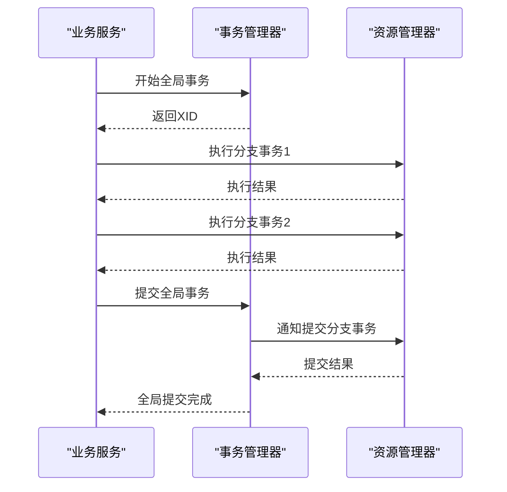

**Diagram sources**
- [README.md](file://README.md#L30)
- [技术栈设计.md](file://技术栈设计.md#L21)
- [backend/order-service/pom.xml](file://backend/order-service/pom.xml#L42-L46)

### 消息队列 RocketMQ

RocketMQ 2.2.3 作为系统的异步通信中间件，实现了服务解耦和流量削峰。在订单创建、支付回调、库存更新等关键业务流程中，通过发送事务消息确保最终一致性。例如，当用户下单成功后，订单服务会发送一条"订单创建"消息，库存服务消费该消息并扣减库存，支付服务则创建支付订单。

RocketMQ 的事务消息机制保证了本地事务和消息发送的原子性：只有当本地数据库操作成功时，消息才会被提交；如果本地事务失败，消息将被回滚。这种机制有效避免了数据不一致的问题。

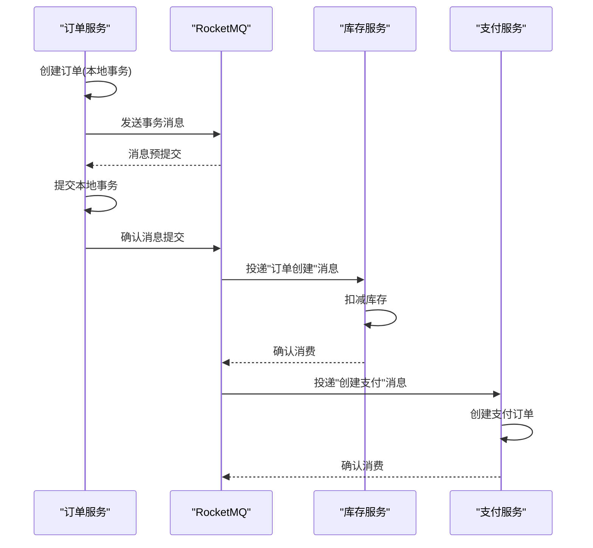

**Diagram sources**
- [README.md](file://README.md#L31)
- [技术栈设计.md](file://技术栈设计.md#L22)
- [backend/order-service/pom.xml](file://backend/order-service/pom.xml#L122-L126)

## 前端技术栈

前端采用 Vue3 + Vite 技术栈构建现代化单页应用。Vue3 的 Composition API 提供了更灵活的逻辑组织方式，配合 TypeScript 实现类型安全的开发体验。Vite 作为新一代前端构建工具，利用浏览器原生 ES 模块支持，实现了极速的开发服务器启动和热更新。

UI 组件库选用 Element Plus，提供了丰富的高质量组件，确保了界面的一致性和用户体验。状态管理采用 Pinia，相比 Vuex 更加简洁直观，支持 TypeScript 类型推断，并可通过 pinia-plugin-persistedstate 插件实现状态的持久化存储。

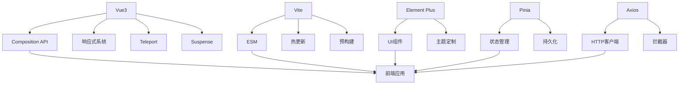

**Diagram sources**
- [README.md](file://README.md#L41-L47)
- [技术栈设计.md](file://技术栈设计.md#L57-L63)
- [frontend/package.json](file://frontend/package.json#L1-L43)

## 数据层技术

### MyBatis-Plus

MyBatis-Plus 3.5.7 作为持久层框架，在 MyBatis 的基础上提供了增强功能，极大地简化了数据库操作。通过通用 CRUD 接口和条件构造器，减少了大量重复的 SQL 映射代码。在 sms-service 的 pom.xml 中明确指定了 MyBatis-Plus 3.5.7 版本，以解决与 Spring Boot 3.x 的兼容性问题。

MyBatis-Plus 提供了分页插件、性能分析插件、乐观锁插件等实用功能。分页插件可以自动将内存分页转换为物理分页，提高查询效率；性能分析插件能够输出 SQL 执行时间，帮助识别慢查询；乐观锁插件通过版本号机制解决并发更新问题。

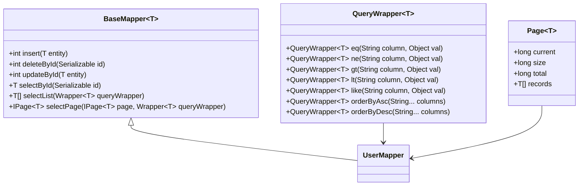

**Diagram sources**
- [backend/sms-service/pom.xml](file://backend/sms-service/pom.xml#L38-L43)
- [backend/admin-service/pom.xml](file://backend/admin-service/pom.xml#L48-L53)

### Redis

Redis 3.2.0 作为分布式缓存和共享存储，广泛应用于会话管理、分布式锁、限流计数等场景。各微服务通过 `spring-boot-starter-data-redis` 依赖集成 Redis 客户端，使用 RedisTemplate 或 StringRedisTemplate 进行数据操作。

在用户认证场景中，Redis 存储 JWT Token 的黑名单，实现 Token 的主动失效；在购物车服务中，Redis 作为高性能缓存存储用户的购物车数据，减少数据库访问压力；在短信服务中，Redis 用于存储验证码和发送频率限制，防止恶意刷单。

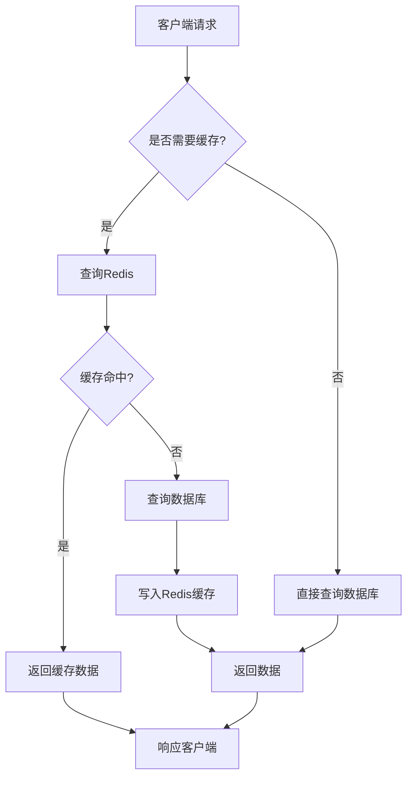

**Diagram sources**
- [README.md](file://README.md#L33)
- [技术栈设计.md](file://技术栈设计.md#L25)
- [backend/admin-service/pom.xml](file://backend/admin-service/pom.xml#L42-L47)

### MySQL

MySQL 8.3.0 作为主关系型数据库，存储系统的核心业务数据。项目采用按业务域分库的设计理念，包括 `mall_user`、`mall_product`、`mall_order`、`mall_merchant` 等多个数据库实例，支持未来的读写分离和分库分表扩展。

在数据访问层，项目结合 MyBatis-Plus 和 JPA 两种持久化方案。admin-service、cart-service 等服务使用 MyBatis-Plus 实现灵活的 SQL 控制，而 order-service、payment-service 则采用 JPA 实现领域驱动设计。所有服务均通过 `mysql-connector-j` 8.3.0 驱动连接数据库，确保了与 MySQL 8.x 版本的最佳兼容性。

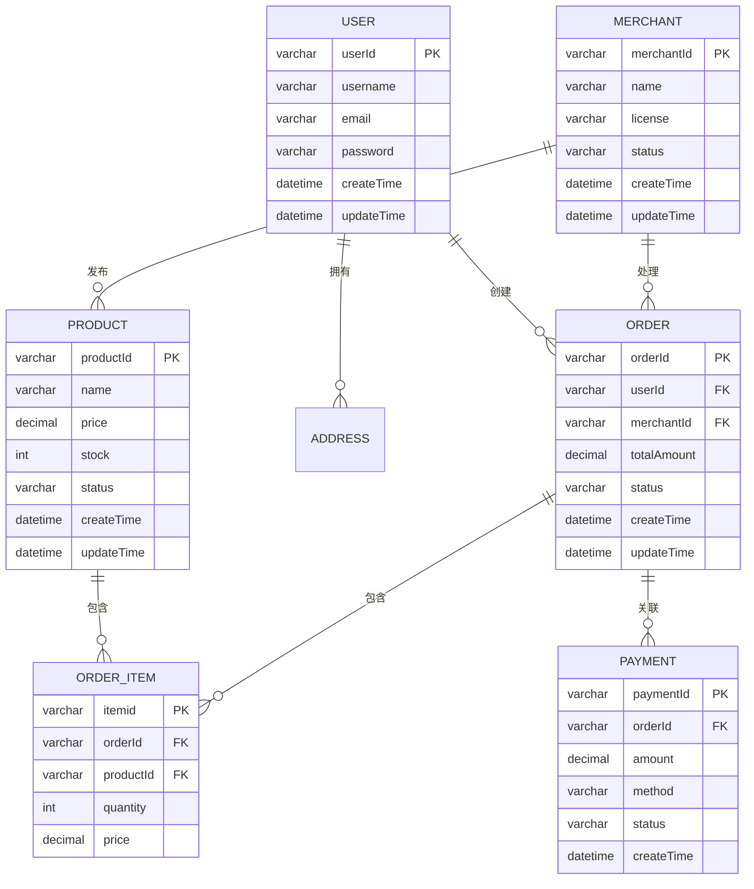

**Diagram sources**
- [README.md](file://README.md#L74-L78)
- [backend/admin-service/pom.xml](file://backend/admin-service/pom.xml#L73-L78)
- [backend/order-service/pom.xml](file://backend/order-service/pom.xml#L67-L71)

### MinIO

MinIO 8.5.12 作为对象存储服务，用于存储用户头像、商品图片、商家资质等非结构化数据。merchant-service 和 user-service 均集成了 MinIO 客户端，通过 `minio` 8.5.7 依赖实现文件的上传、下载和管理功能。

MinIO 提供了与 Amazon S3 兼容的 API，支持分片上传、断点续传、预签名 URL 等特性。在生产环境中，可以无缝切换到云服务商的对象存储服务（如阿里云 OSS、AWS S3），而无需修改业务代码。系统通过 MinIO 实现了文件存储的高可用性和可扩展性。

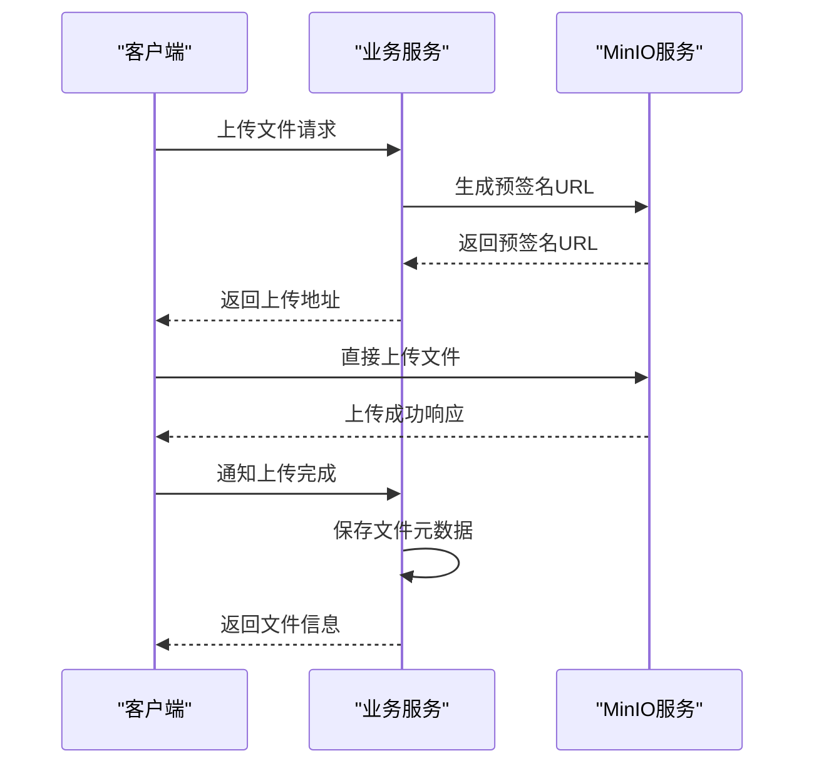

**Diagram sources**
- [README.md](file://README.md#L35)
- [技术栈设计.md](file://技术栈设计.md#L27)
- [backend/merchant-service/pom.xml](file://backend/merchant-service/pom.xml#L127-L132)

## 依赖管理机制

### common-bom 统一版本管理

common-bom 模块作为项目的依赖管理中枢，通过 Maven 的 `<dependencyManagement>` 机制统一管理所有公共依赖的版本号，有效避免了版本冲突问题。该模块采用 BOM（Bill of Materials）模式，定义了项目中使用的各个组件的版本，其他服务模块通过 `<dependency>` 引用这些依赖时无需指定版本号。

在 common-bom/pom.xml 中，定义了 common-core、common-security、common-redis、common-web 等内部模块的版本管理。当需要升级某个公共组件时，只需在 common-bom 中修改版本号，所有依赖该组件的服务都会自动使用新版本，确保了版本的一致性。

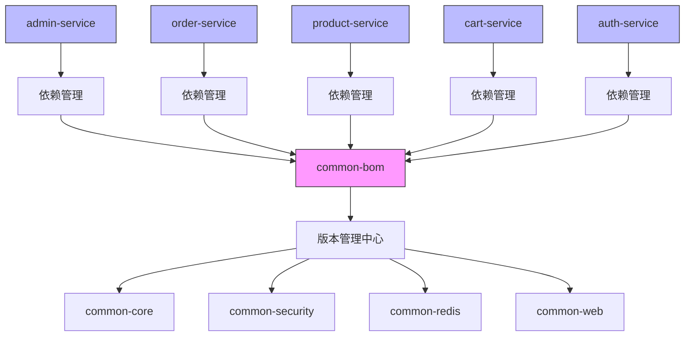

**Diagram sources**
- [backend/common-bom/pom.xml](file://backend/common-bom/pom.xml#L1-L45)
- [backend/admin-service/pom.xml](file://backend/admin-service/pom.xml#L112-L117)

### 各服务依赖关系图

各微服务通过继承父 POM 和引用 common-bom 实现依赖管理。每个服务的 pom.xml 文件中声明了具体的依赖项，包括 Spring Boot 起步依赖、Spring Cloud 组件、数据库驱动、工具库等。通过这种分层依赖管理机制，既保证了版本一致性，又允许各服务根据需要引入特定依赖。

```mermaid
graph TD
A[父POM] --> B[Spring Boot版本]
A --> C[Spring Cloud版本]
A --> D[Java版本]
E[common-bom] --> F[公共模块版本]
E --> G[第三方库版本]
H[admin-service] --> I[Web]
H --> J[MyBatis-Plus]
H --> K[Nacos]
H --> L[OpenFeign]
H --> M[Redis]
H --> N[MySQL]
H --> O[common-core]
H --> A
H --> E
P[order-service] --> Q[Web]
P --> R[JPA]
P --> S[Nacos]
P --> T[OpenFeign]
P --> U[Redis]
P --> V[MySQL]
P --> W[common-core]
P --> A
P --> E
X[product-service] --> Y[Web]
X --> Z[MyBatis-Plus]
X --> AA[Nacos]
X --> AB[OpenFeign]
X --> AC[Redis]
X --> AD[MySQL]
X --> AE[common-core]
X --> A
X --> E
style H fill:#f96,stroke:#333
style P fill:#f96,stroke:#333
style X fill:#f96,stroke:#333
```

**Diagram sources**
- [backend/admin-service/pom.xml](file://backend/admin-service/pom.xml#L1-L157)
- [backend/order-service/pom.xml](file://backend/order-service/pom.xml#L1-L165)
- [backend/product-service/pom.xml](file://backend/product-service/pom.xml#L1-L161)
- [backend/cart-service/pom.xml](file://backend/cart-service/pom.xml#L1-L150)
- [backend/auth-service/pom.xml](file://backend/auth-service/pom.xml#L1-L110)