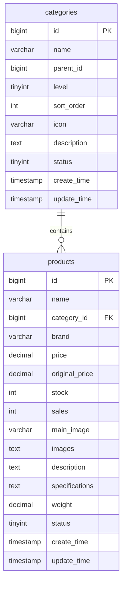
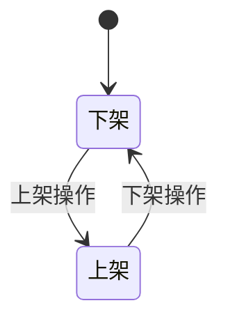
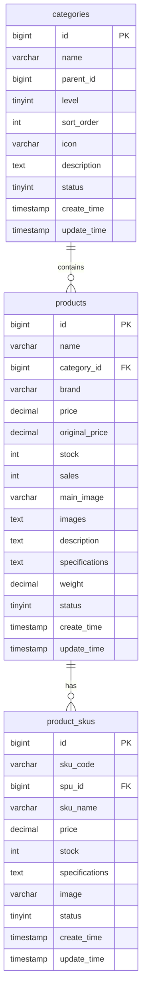

# 商品模型

<cite>
**Referenced Files in This Document**   
- [Product.java](file://backend/product-service/src/main/java/com/mall/product/domain/entity/Product.java)
- [Category.java](file://backend/product-service/src/main/java/com/mall/product/domain/entity/Category.java)
- [data_dictionary.md](file://data_dictionary.md)
- [ProductController.java](file://backend/product-service/src/main/java/com/mall/product/controller/ProductController.java)
- [CategoryController.java](file://backend/product-service/src/main/java/com/mall/product/controller/CategoryController.java)
- [ProductService.java](file://backend/product-service/src/main/java/com/mall/product/service/ProductService.java)
</cite>

## 目录
1. [商品模型](#商品模型)
2. [核心数据结构](#核心数据结构)
3. [商品表字段详解](#商品表字段详解)
4. [分类表字段详解](#分类表字段详解)
5. [外键关联与数据关系](#外键关联与数据关系)
6. [JSON字段存储与解析](#json字段存储与解析)
7. [商品状态机与生命周期](#商品状态机与生命周期)
8. [ER图](#er图)

## 商品模型

本文档详细描述了基于数据字典和实体类的商品模型，全面阐述了商品表(products)和分类表(categories)的字段定义、数据类型、约束条件和业务含义。重点说明了商品价格、库存、状态（上架/下架）、分类层级结构（parent_id, level）等关键字段的设计。文档还解释了商品与分类之间的外键关联，以及规格、图片等JSON字段的存储与解析方式，并提供了ER图来展示商品、分类、SKU之间的关系，同时说明了商品状态机和生命周期管理策略。

**Section sources**
- [data_dictionary.md](file://data_dictionary.md#L85-L137)

## 核心数据结构

商品模型的核心由两个主要的实体类构成：`Product`（商品）和`Category`（分类）。这两个实体类分别对应数据库中的`products`表和`categories`表，是整个商品管理模块的基础。

`Product`实体类继承自`BaseEntity`，包含了商品的核心信息，如名称、价格、库存、状态等。`Category`实体类同样继承自`BaseEntity`，用于管理商品的分类层级结构。两个实体类都遵循了统一的公共字段规范，包括`id`、`create_time`和`update_time`。

**Section sources**
- [Product.java](file://backend/product-service/src/main/java/com/mall/product/domain/entity/Product.java#L11-L183)
- [Category.java](file://backend/product-service/src/main/java/com/mall/product/domain/entity/Category.java#L10-L62)

## 商品表字段详解

商品表（products）存储了商品的核心数据，其字段设计如下：

| 字段名 | 数据类型 | 是否为空 | 默认值 | 主键 | 外键 | 索引 | 描述 |
| :--- | :--- | :--- | :--- | :--- | :--- | :--- | :--- |
| id | BIGINT | NOT NULL | AUTO_INCREMENT | ✓ | - | PRIMARY | 商品唯一标识 ID |
| name | VARCHAR(255) | NOT NULL | - | - | - | INDEX | 商品名称 |
| category_id | BIGINT | NOT NULL | - | - | ✓ | INDEX | 分类 ID，关联 categories 表 |
| brand | VARCHAR(100) | NULL | - | - | - | INDEX | 商品品牌 |
| price | DECIMAL(10,2) | NOT NULL | - | - | - | INDEX | 商品价格 |
| original_price | DECIMAL(10,2) | NULL | - | - | - | - | 原价 |
| stock | INT | NOT NULL | 0 | - | - | INDEX | 库存数量 |
| sales | INT | NOT NULL | 0 | - | - | INDEX | 销量 |
| main_image | VARCHAR(255) | NULL | - | - | - | - | 主图 URL |
| images | TEXT | NULL | - | - | - | - | 商品图片 JSON 数组 |
| description | TEXT | NULL | - | - | - | - | 商品描述 |
| specifications | TEXT | NULL | - | - | - | - | 商品规格 JSON |
| weight | DECIMAL(8,2) | NULL | - | - | - | - | 商品重量(kg) |
| status | TINYINT | NOT NULL | 1 | - | - | INDEX | 状态：0-下架，1-上架 |
| create_time | TIMESTAMP | NOT NULL | CURRENT_TIMESTAMP | - | - | INDEX | 创建时间 |
| update_time | TIMESTAMP | NOT NULL | CURRENT_TIMESTAMP ON UPDATE | - | - | - | 更新时间 |

**关键字段说明：**
- **price**: 商品价格，数据类型为DECIMAL(10,2)，确保了价格计算的精确性。
- **stock**: 商品库存，数据类型为INT，初始值为0，表示无库存。
- **status**: 商品状态，TINYINT类型，0表示下架，1表示上架，是控制商品是否可售的关键字段。
- **specifications**: 商品规格，以JSON格式存储，支持灵活的规格定义。
- **images**: 商品图片，以JSON数组格式存储，支持多张图片。

**Section sources**
- [data_dictionary.md](file://data_dictionary.md#L113-L137)
- [Product.java](file://backend/product-service/src/main/java/com/mall/product/domain/entity/Product.java#L38-L43)

## 分类表字段详解

分类表（categories）用于存储商品的分类层级结构，其字段设计如下：

| 字段名 | 数据类型 | 是否为空 | 默认值 | 主键 | 外键 | 索引 | 描述 |
| :--- | :--- | :--- | :--- | :--- | :--- | :--- | :--- |
| id | BIGINT | NOT NULL | AUTO_INCREMENT | ✓ | - | PRIMARY | 分类唯一标识 ID |
| name | VARCHAR(100) | NOT NULL | - | - | - | INDEX | 分类名称 |
| parent_id | BIGINT | NULL | 0 | - | - | INDEX | 父分类 ID，0 表示顶级分类 |
| level | TINYINT | NOT NULL | 1 | - | - | INDEX | 分类层级：1-一级，2-二级，3-三级 |
| sort_order | INT | NOT NULL | 0 | - | - | - | 排序顺序 |
| icon | VARCHAR(255) | NULL | - | - | - | - | 分类图标 URL |
| description | TEXT | NULL | - | - | - | - | 分类描述 |
| status | TINYINT | NOT NULL | 1 | - | - | INDEX | 状态：0-禁用，1-启用 |
| create_time | TIMESTAMP | NOT NULL | CURRENT_TIMESTAMP | - | - | - | 创建时间 |
| update_time | TIMESTAMP | NOT NULL | CURRENT_TIMESTAMP ON UPDATE | - | - | - | 更新时间 |

**关键字段说明：**
- **parent_id**: 父分类ID，BIGINT类型，0表示顶级分类，通过此字段构建分类的树形结构。
- **level**: 分类层级，TINYINT类型，1表示一级分类，2表示二级分类，3表示三级分类，用于限制分类层级深度。
- **status**: 分类状态，TINYINT类型，0表示禁用，1表示启用，用于控制分类是否可用。

**Section sources**
- [data_dictionary.md](file://data_dictionary.md#L91-L108)
- [Category.java](file://backend/product-service/src/main/java/com/mall/product/domain/entity/Category.java#L31-L36)

## 外键关联与数据关系

商品表（products）与分类表（categories）之间通过外键`category_id`建立关联。`products`表中的`category_id`字段是`categories`表中`id`字段的外键，这种设计确保了数据的完整性和一致性。

当一个商品被创建时，必须指定其所属的分类。如果尝试删除一个被商品引用的分类，数据库会阻止此操作，从而防止出现“孤儿”商品。这种外键约束保证了商品与分类之间的引用完整性。

**Diagram sources**
- [data_dictionary.md](file://data_dictionary.md#L91-L137)
- [Product.java](file://backend/product-service/src/main/java/com/mall/product/domain/entity/Product.java#L48-L48)
- [Category.java](file://backend/product-service/src/main/java/com/mall/product/domain/entity/Category.java#L31-L31)

## JSON字段存储与解析

商品模型中使用了JSON格式来存储复杂的数据结构，主要体现在`images`和`specifications`两个字段。

- **images**: 该字段以JSON数组的形式存储商品的多张图片URL。例如：`["https://example.com/image1.jpg", "https://example.com/image2.jpg"]`。在Java实体类中，该字段被定义为`String`类型，但在业务逻辑中需要通过JSON库（如Jackson）进行序列化和反序列化。
- **specifications**: 该字段以JSON对象的形式存储商品的规格参数。例如：`{"颜色": "红色", "尺寸": "L"}`。同样，在Java中通过`String`类型存储，但在使用时需要解析为具体的对象。

这种设计提供了极大的灵活性，允许商品拥有任意数量和类型的图片和规格，而无需修改数据库表结构。

**Section sources**
- [Product.java](file://backend/product-service/src/main/java/com/mall/product/domain/entity/Product.java#L63-L83)

## 商品状态机与生命周期

商品的状态管理是通过`status`字段实现的，该字段是一个简单的状态机，包含两个状态：0（下架）和1（上架）。

商品的生命周期管理主要通过`ProductController`中的`updateProductStatus`方法来实现。该方法接收商品ID和目标状态作为参数，调用`ProductService`中的`updateProductStatus`服务来更新商品状态。

**Diagram sources**
- [ProductController.java](file://backend/product-service/src/main/java/com/mall/product/controller/ProductController.java#L315-L332)
- [ProductService.java](file://backend/product-service/src/main/java/com/mall/product/service/ProductService.java#L126-L126)

## ER图

以下ER图展示了商品、分类和SKU之间的关系。

**Diagram sources**
- [data_dictionary.md](file://data_dictionary.md#L91-L108)
- [Product.java](file://backend/product-service/src/main/java/com/mall/product/domain/entity/Product.java#L48-L48)
- [Category.java](file://backend/product-service/src/main/java/com/mall/product/domain/entity/Category.java#L31-L31)