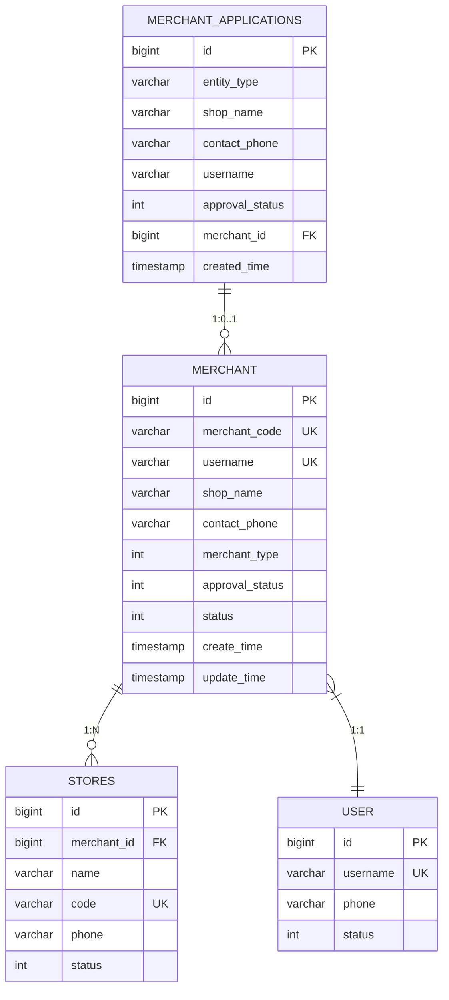

# 商家模型

<cite>
**本文档引用文件**   
- [Merchant.java](file://backend/merchant-service/src/main/java/com/mall/merchant/domain/entity/Merchant.java)
- [MerchantApplication.java](file://backend/merchant-service/src/main/java/com/mall/merchant/domain/entity/MerchantApplication.java)
- [数据字典.md](file://数据字典.md)
- [MerchantApplicationServiceImpl.java](file://backend/merchant-service/src/main/java/com/mall/merchant/service/impl/MerchantApplicationServiceImpl.java)
- [商家审核系统-完整实现报告.md](file://商家审核系统-完整实现报告.md)
</cite>

## 目录
1. [引言](#引言)
2. [核心实体与数据表](#核心实体与数据表)
3. [商家表(merchants)字段详解](#商家表merchants字段详解)
4. [商家申请表(merchant_applications)字段详解](#商家申请表merchant_applications字段详解)
5. [核心字段设计说明](#核心字段设计说明)
6. [商家申请与审核流程](#商家申请与审核流程)
7. [数据模型关系图](#数据模型关系图)
8. [商家数据与用户账号绑定策略](#商家数据与用户账号绑定策略)
9. [结论](#结论)

## 引言
本文档旨在全面阐述在线商城系统中商家模型的数据结构设计。基于系统数据字典和核心实体类 `Merchant` 与 `MerchantApplication`，本文将详细解析商家表(merchants)和商家申请表(merchant_applications)的字段定义、数据类型、约束条件及业务含义。重点说明商家编码的唯一性、联系信息、营业执照存储、状态管理等核心设计，并解释商家申请流程与商家表的关联机制以及审核状态的流转过程。

**Section sources**
- [数据字典.md](file://数据字典.md#L223-L274)

## 核心实体与数据表
商家模型的核心由两个主要实体构成：`Merchant`（商家）和 `MerchantApplication`（商家申请）。这两个实体分别对应数据库中的 `merchants` 表和 `merchant_applications` 表，共同支撑商家的入驻、审核和运营全生命周期管理。

`Merchant` 实体是商家在系统中的正式身份，包含了商家运营所需的所有核心信息，如店铺名称、联系人、状态等。而 `MerchantApplication` 实体则记录了商家从申请入驻到审核完成的全过程，是一个临时性的、用于审批流程的记录。

**Section sources**
- [Merchant.java](file://backend/merchant-service/src/main/java/com/mall/merchant/domain/entity/Merchant.java#L10-L606)
- [MerchantApplication.java](file://backend/merchant-service/src/main/java/com/mall/merchant/domain/entity/MerchantApplication.java#L9-L187)

## 商家表(merchants)字段详解
商家表(merchants)存储了所有已通过审核并正式运营的商家信息。其核心字段定义如下：

| 字段名 | 数据类型 | 长度 | 是否为空 | 默认值 | 主键 | 外键 | 索引 | 描述 |
| :--- | :--- | :--- | :--- | :--- | :--- | :--- | :--- | :--- |
| id | BIGINT | - | NOT NULL | AUTO_INCREMENT | ✓ | - | PRIMARY | 商家唯一标识 ID |
| merchant_code | VARCHAR | 32 | NOT NULL | - | - | - | UNIQUE | 商家编码，系统自动生成，全局唯一 |
| username | VARCHAR | 50 | NOT NULL | - | - | - | UNIQUE | 商家登录用户名 |
| password | VARCHAR | 100 | NOT NULL | - | - | - | - | 加密后的登录密码 |
| shop_name | VARCHAR | 100 | NOT NULL | - | - | - | INDEX | 店铺名称 |
| company_name | VARCHAR | 100 | NOT NULL | - | - | - | - | 公司名称（企业商家必填） |
| merchant_type | TINYINT | - | NOT NULL | - | - | - | - | 商家类型：1-个人商家，2-企业商家 |
| contact_name | VARCHAR | 50 | NOT NULL | - | - | - | - | 联系人姓名 |
| contact_phone | VARCHAR | 20 | NOT NULL | - | - | - | INDEX | 联系人手机号 |
| contact_email | VARCHAR | 100 | NULL | - | - | - | - | 联系人邮箱 |
| id_number | VARCHAR | 50 | NOT NULL | - | - | - | - | 身份证号或营业执照号 |
| id_front_image | VARCHAR | 200 | NULL | - | - | - | - | 身份证正面照或营业执照照片 |
| id_back_image | VARCHAR | 200 | NULL | - | - | - | - | 身份证反面照 |
| bank_card_number | VARCHAR | 30 | NULL | - | - | - | - | 银行卡号 |
| bank_name | VARCHAR | 100 | NULL | - | - | - | - | 开户银行 |
| bank_account_name | VARCHAR | 50 | NULL | - | - | - | - | 开户人姓名 |
| shop_description | VARCHAR | 500 | NULL | - | - | - | - | 店铺描述 |
| shop_logo | VARCHAR | 200 | NULL | - | - | - | - | 店铺logo |
| business_category | VARCHAR | 100 | NULL | - | - | - | - | 经营类目 |
| address | VARCHAR | 200 | NULL | - | - | - | - | 详细地址 |
| province | VARCHAR | 50 | NULL | - | - | - | - | 省份 |
| city | VARCHAR | 50 | NULL | - | - | - | - | 城市 |
| district | VARCHAR | 50 | NULL | - | - | - | - | 区县 |
| approval_status | TINYINT | - | NOT NULL | 0 | - | - | - | 审核状态：0-待审核，1-审核通过，2-审核拒绝 |
| approval_reason | VARCHAR | 200 | NULL | - | - | - | - | 审核意见 |
| approval_time | DATETIME | - | NULL | - | - | - | - | 审核时间 |
| approval_by | BIGINT | - | NULL | - | - | - | - | 审核人ID |
| status | TINYINT | - | NOT NULL | 1 | - | - | INDEX | 商家状态：0-禁用，1-正常 |
| deposit_amount | DECIMAL | 10,2 | NULL | - | - | - | - | 保证金金额 |
| deposit_paid | TINYINT | - | NOT NULL | 0 | - | - | - | 是否已缴纳保证金：0-未缴纳，1-已缴纳 |
| last_login_time | DATETIME | - | NULL | - | - | - | - | 最后登录时间 |
| last_login_ip | VARCHAR | 50 | NULL | - | - | - | - | 最后登录IP |
| login_count | INT | - | NOT NULL | 0 | - | - | - | 登录次数 |
| create_time | TIMESTAMP | - | NOT NULL | CURRENT_TIMESTAMP | - | - | INDEX | 创建时间 |
| update_time | TIMESTAMP | - | NOT NULL | CURRENT_TIMESTAMP ON UPDATE | - | - | - | 更新时间 |

**Section sources**
- [数据字典.md](file://数据字典.md#L223-L274)
- [Merchant.java](file://backend/merchant-service/src/main/java/com/mall/merchant/domain/entity/Merchant.java#L10-L606)

## 商家申请表(merchant_applications)字段详解
商家申请表(merchant_applications)用于存储商家在入驻过程中的申请信息，是审核流程的数据基础。其核心字段定义如下：

| 字段名 | 数据类型 | 长度 | 是否为空 | 默认值 | 主键 | 外键 | 索引 | 描述 |
| :--- | :--- | :--- | :--- | :--- | :--- | :--- | :--- | :--- |
| id | BIGINT | - | NOT NULL | AUTO_INCREMENT | ✓ | - | PRIMARY | 申请记录唯一标识 ID |
| entity_type | VARCHAR | 20 | NOT NULL | - | - | - | - | 主体类型：enterprise-企业, individual-个体, personal-个人 |
| shop_type | VARCHAR | 20 | NULL | - | - | - | - | 店铺类型 |
| shop_name | VARCHAR | 100 | NOT NULL | - | - | - | INDEX | 店铺名称 |
| contact_name | VARCHAR | 50 | NOT NULL | - | - | - | - | 联系人姓名 |
| contact_phone | VARCHAR | 20 | NOT NULL | - | - | - | INDEX | 联系电话 |
| email | VARCHAR | 100 | NULL | - | - | - | - | 邮箱地址 |
| company_name | VARCHAR | 100 | NULL | - | - | - | - | 公司名称 |
| credit_code | VARCHAR | 18 | NULL | - | - | - | - | 统一社会信用代码 |
| legal_person | VARCHAR | 50 | NULL | - | - | - | - | 法人代表 |
| business_license | VARCHAR | 500 | NULL | - | - | - | - | 营业执照图片URL |
| id_card | VARCHAR | 18 | NULL | - | - | - | - | 身份证号 |
| id_card_front | VARCHAR | 500 | NULL | - | - | - | - | 身份证正面照片URL |
| id_card_back | VARCHAR | 500 | NULL | - | - | - | - | 身份证反面照片URL |
| username | VARCHAR | 50 | NOT NULL | - | - | - | UNIQUE | 登录账号 |
| password | VARCHAR | 255 | NOT NULL | - | - | - | - | 登录密码（加密） |
| approval_status | TINYINT | - | NULL | 0 | - | - | INDEX | 审批状态：0-待审批，1-已通过，2-已拒绝 |
| approval_reason | TEXT | - | NULL | - | - | - | - | 审批备注 |
| approval_time | DATETIME | - | NULL | - | - | - | - | 审批时间 |
| approval_by | BIGINT | - | NULL | - | - | - | - | 审批人ID |
| approval_by_name | VARCHAR | 50 | NULL | - | - | - | - | 审批人用户名 |
| merchant_id | BIGINT | - | NULL | - | - | - | INDEX | 关联的商家ID（审批通过后创建） |
| sms_sent | BOOLEAN | - | NULL | false | - | - | - | 短信是否已发送 |
| sms_sent_time | DATETIME | - | NULL | - | - | - | - | 短信发送时间 |
| sms_retry_count | INT | - | NULL | 0 | - | - | - | 短信重试次数 |
| remark | VARCHAR | 500 | NULL | - | - | - | - | 备注 |
| created_time | TIMESTAMP | - | NOT NULL | CURRENT_TIMESTAMP | - | - | - | 创建时间 |
| updated_time | TIMESTAMP | - | NOT NULL | CURRENT_TIMESTAMP ON UPDATE | - | - | - | 更新时间 |

**Section sources**
- [数据字典.md](file://数据字典.md#L223-L274)
- [MerchantApplication.java](file://backend/merchant-service/src/main/java/com/mall/merchant/domain/entity/MerchantApplication.java#L9-L187)

## 核心字段设计说明
### 商家编码(merchant_code)的唯一性
商家编码(`merchant_code`) 是商家在系统中的全局唯一标识，其设计确保了绝对的唯一性。该字段在数据库层面被定义为 `UNIQUE` 唯一索引，防止任何重复值的插入。编码的生成策略在 `MerchantApplicationServiceImpl` 服务中实现：当商家申请审核通过后，系统会创建 `Merchant` 实体，并生成一个由前缀 "MER"、商家ID和时间戳后六位组成的正式编码（例如：MER1234567890123456）。这种设计结合了业务可读性与技术唯一性，确保了每个商家都有一个永不重复的编码。

### 联系信息
联系信息是商家沟通的核心，主要包含 `contact_name`（联系人姓名）、`contact_phone`（联系人手机号）和 `contact_email`（联系人邮箱）。这些字段在 `Merchant` 实体中均为必填项（`NOT NULL`），确保了商家信息的完整性。`contact_phone` 字段建立了数据库索引，以支持基于手机号的快速查询。

### 营业执照存储
营业执照信息的存储根据商家类型有所不同：
*   **企业商家**：使用 `id_front_image` 字段存储营业执照照片的URL，`id_number` 字段存储统一社会信用代码。
*   **个人商家**：使用 `id_front_image` 和 `id_back_image` 字段分别存储身份证正反面照片的URL，`id_number` 字段存储身份证号。
所有图片字段均存储为文件服务器（如MinIO）上的URL链接，而非二进制数据，保证了数据库的高效性和可扩展性。

### 状态管理（启用/禁用）
状态管理是商家模型的关键，涉及两个独立的状态字段：
1.  **审核状态 (`approval_status`)**：定义商家的审核流程，值为 `0`（待审核）、`1`（审核通过）或 `2`（审核拒绝）。只有当此状态为 `1` 时，商家才能进行登录和运营。
2.  **商家状态 (`status`)**：定义商家的运营状态，值为 `0`（禁用）或 `1`（正常）。此状态由管理员控制，用于临时或永久关闭商家的运营权限，即使其已通过审核。

这两个状态的分离设计，使得审核流程与日常运营管理可以独立进行，提供了更灵活的权限控制。

**Section sources**
- [Merchant.java](file://backend/merchant-service/src/main/java/com/mall/merchant/domain/entity/Merchant.java#L158-L185)
- [MerchantApplicationServiceImpl.java](file://backend/merchant-service/src/main/java/com/mall/merchant/service/impl/MerchantApplicationServiceImpl.java#L155-L216)

## 商家申请与审核流程
商家申请与审核流程是一个清晰的、状态驱动的业务过程，其核心机制如下：

1.  **申请提交**：商家通过前端填写入驻表单，提交申请。系统会创建一条 `merchant_applications` 记录，其 `approval_status` 初始值为 `0`（待审批）。
2.  **管理员审核**：管理员在后台查看待审批的申请列表，审查商家提交的资料（如营业执照、身份证等）。
3.  **审批决策**：
    *   **通过**：管理员确认通过，系统执行 `auditApplication` 方法。该方法会将申请记录的 `approval_status` 更新为 `1`，并调用 `createMerchantAccount` 方法。此方法会基于申请信息创建一个新的 `Merchant` 实体，将其 `approval_status` 设为 `1`，`status` 设为 `1`，并生成唯一的 `merchant_code`。最后，新创建的商家ID会回填到申请记录的 `merchant_id` 字段中，建立关联。
    *   **拒绝**：管理员填写拒绝原因，系统将申请记录的 `approval_status` 更新为 `2`，并记录 `approval_reason`。
4.  **结果通知**：无论通过还是拒绝，系统都会异步发送短信通知给申请人。

此流程确保了从申请到正式运营的平滑过渡，并通过 `merchant_id` 字段将申请记录与最终的商家账号永久关联，支持完整的审计追溯。

**Section sources**
- [商家审核系统-完整实现报告.md](file://商家审核系统-完整实现报告.md#L461-L510)
- [MerchantApplicationServiceImpl.java](file://backend/merchant-service/src/main/java/com/mall/merchant/service/impl/MerchantApplicationServiceImpl.java#L136-L166)

## 数据模型关系图

**Diagram sources**
- [Merchant.java](file://backend/merchant-service/src/main/java/com/mall/merchant/domain/entity/Merchant.java#L10-L606)
- [MerchantApplication.java](file://backend/merchant-service/src/main/java/com/mall/merchant/domain/entity/MerchantApplication.java#L9-L187)

## 商家数据与用户账号绑定策略
在当前系统设计中，商家数据与用户账号的绑定策略是**隐式且独立的**。`Merchant` 实体拥有自己的 `username` 和 `password` 字段，用于商家后台的独立登录认证。这表明商家账号体系是独立于普通用户(`users`表)账号体系的。

然而，从数据模型关系图中可以看出，`MERCHANT` 与 `USER` 之间存在一个 `1:1` 的关联。这暗示了未来可能的集成策略：当一个普通用户申请成为商家时，系统可以将其 `users` 表中的记录与新创建的 `merchants` 表记录进行关联。这种设计既保持了商家业务的独立性，又为未来实现用户与商家身份的统一管理（例如，一个用户可以既是买家又是商家）预留了扩展空间。目前，这种关联可能通过共享的用户ID或手机号来实现。

**Section sources**
- [Merchant.java](file://backend/merchant-service/src/main/java/com/mall/merchant/domain/entity/Merchant.java#L34-L41)
- [数据字典.md](file://数据字典.md#L37-L50)

## 结论
本文档详细解析了在线商城系统中商家模型的数据结构。商家表(merchants)和商家申请表(merchant_applications)通过精心设计的字段和状态机，共同实现了商家从申请、审核到正式运营的全生命周期管理。商家编码的唯一性、联系信息的完整性、营业执照的安全存储以及启用/禁用的双重状态管理，构成了一个健壮、安全且易于维护的商家数据模型。该模型不仅满足了当前业务需求，也为未来的功能扩展（如多门店管理、用户与商家身份融合）奠定了坚实的基础。