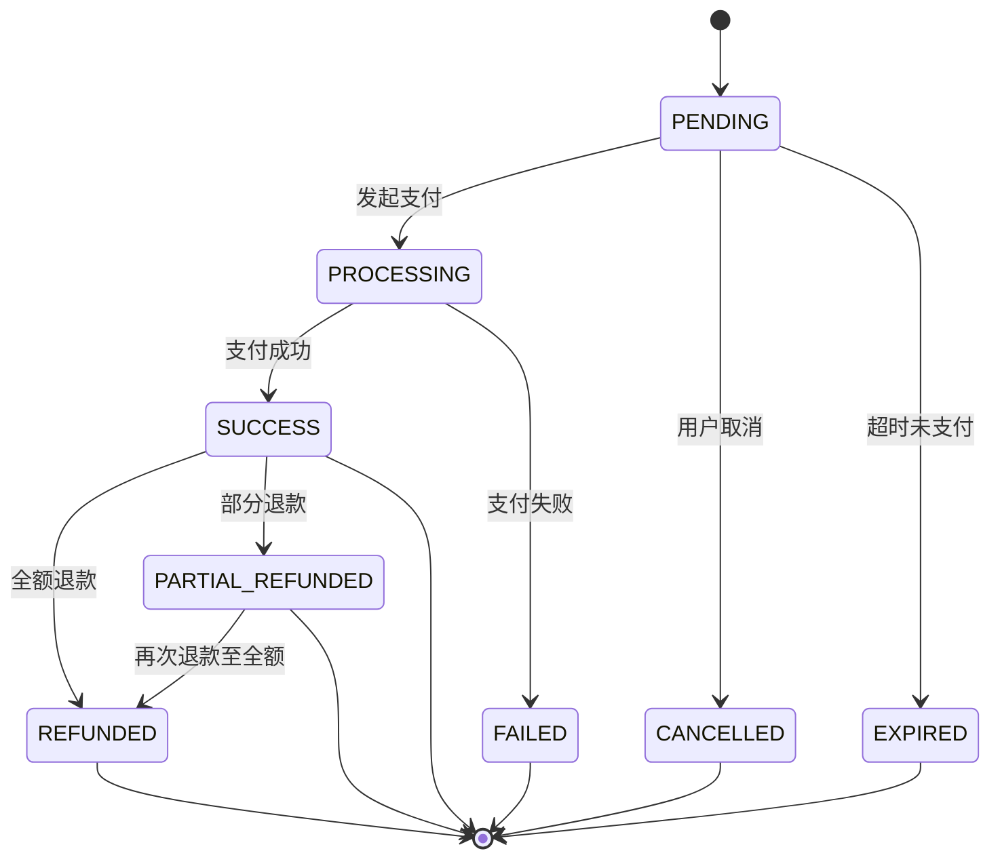
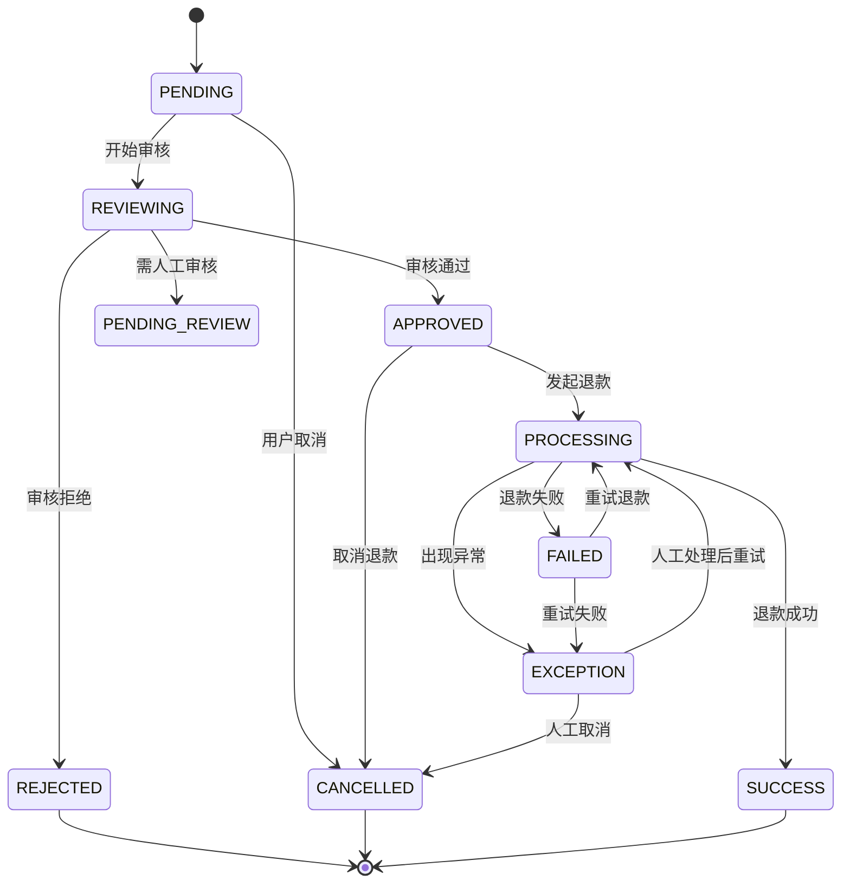
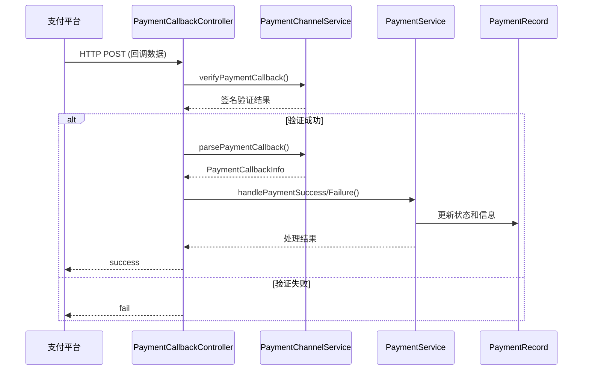
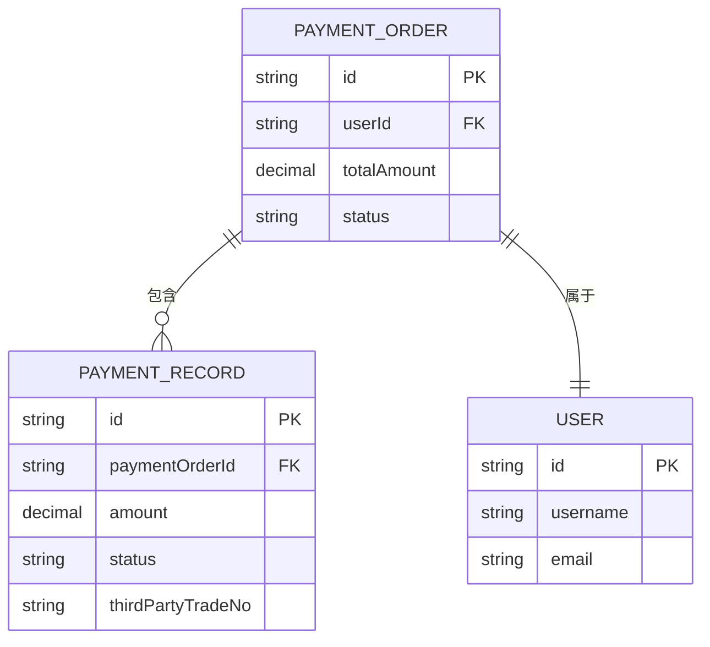
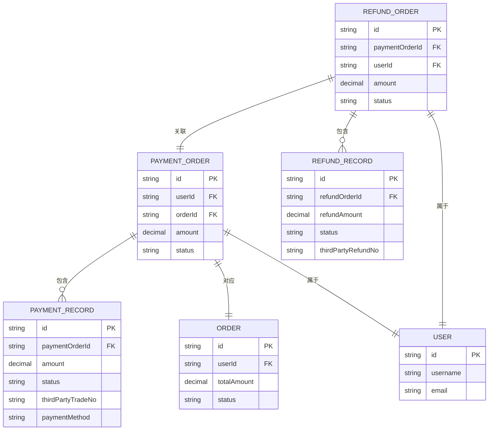

# 支付模型

<cite>
**本文档引用文件**   
- [PaymentRecord.java](file://backend/payment-service/src/main/java/com/mall/payment/entity/PaymentRecord.java)
- [RefundRecord.java](file://backend/payment-service/src/main/java/com/mall/payment/entity/RefundRecord.java)
- [PaymentStatus.java](file://backend/payment-service/src/main/java/com/mall/payment/enums/PaymentStatus.java)
- [RefundStatus.java](file://backend/payment-service/src/main/java/com/mall/payment/enums/RefundStatus.java)
- [数据字典.md](file://数据字典.md)
- [PaymentCallbackController.java](file://backend/payment-service/src/main/java/com/mall/payment/controller/PaymentCallbackController.java)
</cite>

## 目录
1. [引言](#引言)
2. [支付记录表结构](#支付记录表结构)
3. [退款记录表结构](#退款记录表结构)
4. [支付状态机](#支付状态机)
5. [退款状态机](#退款状态机)
6. [支付流水号唯一性](#支付流水号唯一性)
7. [支付方式](#支付方式)
8. [第三方流水号](#第三方流水号)
9. [异步回调信息存储](#异步回调信息存储)
10. [支付与订单、用户关联关系](#支付与订单用户关联关系)
11. [支付对账机制](#支付对账机制)
12. [异常处理机制](#异常处理机制)
13. [实体关系图](#实体关系图)

## 引言

本文档旨在全面描述支付系统中的核心数据模型，基于 `PaymentRecord` 和 `RefundRecord` 实体类以及项目中的数据字典，详细说明支付记录表（payment_records）和退款记录表（refund_records）的字段定义、数据类型、约束条件和业务含义。文档重点阐述了支付流水号的唯一性、支付金额、支付方式、第三方流水号、支付状态机和退款状态机的流转规则，解释了支付记录与订单、用户的关联关系，以及异步回调信息的存储方式。同时，文档还说明了支付对账和异常处理机制，并通过ER图展示了支付、退款、订单之间的关系。

## 支付记录表结构

支付记录表（payment_records）用于存储每次支付操作的详细信息，包括支付请求、响应、状态变更等。一个支付订单可能对应多条支付记录，适用于重试、部分支付等场景。

| 字段名 | 数据类型 | 长度 | 是否为空 | 默认值 | 主键 | 外键 | 索引 | 描述 |
| :--- | :--- | :--- | :--- | :--- | :--- | :--- | :--- | :--- |
| id | VARCHAR | 36 | NOT NULL | - | ✓ | - | PRIMARY | 支付记录唯一标识ID，使用UUID生成 |
| paymentOrderId | VARCHAR | 36 | NOT NULL | - | - | - | INDEX | 关联的支付订单ID |
| paymentMethod | VARCHAR | 20 | NOT NULL | - | - | - | - | 支付方式：ALIPAY(支付宝)、WECHAT(微信)、BANK_CARD(银行卡)、BALANCE(余额) |
| amount | DECIMAL | 15,2 | NOT NULL | - | - | - | - | 本次支付的金额 |
| status | VARCHAR | 20 | NOT NULL | PENDING | - | - | INDEX | 支付状态：PENDING(待支付)、PROCESSING(支付中)、SUCCESS(支付成功)、FAILED(支付失败)、CANCELLED(已取消)、EXPIRED(已过期)、REFUNDED(已退款)、PARTIAL_REFUNDED(部分退款) |
| thirdPartyTradeNo | VARCHAR | 64 | NULL | - | - | - | INDEX | 第三方交易号，支付渠道返回的交易流水号 |
| paymentChannel | VARCHAR | 50 | NULL | - | - | - | - | 支付渠道，具体的支付渠道标识 |
| requestParams | TEXT | - | NULL | - | - | - | - | 支付请求参数，JSON格式存储发送给第三方的请求参数 |
| responseData | TEXT | - | NULL | - | - | - | - | 支付响应数据，JSON格式存储第三方返回的响应数据 |
| payTime | TIMESTAMP | - | NULL | - | - | - | INDEX | 支付完成时间，第三方确认支付成功的时间 |
| feeAmount | DECIMAL | 15,2 | NULL | - | - | - | - | 本次支付产生的手续费 |
| errorCode | VARCHAR | 50 | NULL | - | - | - | - | 支付失败时的错误代码 |
| errorMessage | VARCHAR | 500 | NULL | - | - | - | - | 支付失败时的详细错误信息 |
| retryCount | INTEGER | - | NULL | 0 | - | - | - | 当前记录的重试次数 |
| clientIp | VARCHAR | 45 | NULL | - | - | - | - | 发起支付的客户端IP地址 |
| userAgent | VARCHAR | 500 | NULL | - | - | - | - | 客户端浏览器信息 |
| deviceInfo | VARCHAR | 200 | NULL | - | - | - | - | 支付设备的相关信息 |
| action | VARCHAR | 100 | NULL | - | - | - | - | 记录本次支付记录的操作类型 |
| description | VARCHAR | 500 | NULL | - | - | - | - | 记录本次支付记录的详细描述 |
| remark | VARCHAR | 500 | NULL | - | - | - | - | 额外的备注说明 |
| createdAt | TIMESTAMP | - | NOT NULL | - | - | - | INDEX | 创建时间，自动设置 |
| updatedAt | TIMESTAMP | - | NOT NULL | - | - | - | - | 更新时间，自动更新 |

**索引信息**:
- PRIMARY KEY: `id`
- INDEX: `idx_payment_order_id` (paymentOrderId), `idx_third_party_trade_no` (thirdPartyTradeNo), `idx_status` (status), `idx_created_at` (createdAt)

**Section sources**
- [PaymentRecord.java](file://backend/payment-service/src/main/java/com/mall/payment/entity/PaymentRecord.java#L60-L325)
- [数据字典.md](file://数据字典.md#L279-L307)

## 退款记录表结构

退款记录表（refund_records）用于存储每次退款操作的详细信息，包括退款请求、响应、状态变更等。一个退款订单可能对应多条退款记录，适用于重试、部分退款等场景。

| 字段名 | 数据类型 | 长度 | 是否为空 | 默认值 | 主键 | 外键 | 索引 | 描述 |
| :--- | :--- | :--- | :--- | :--- | :--- | :--- | :--- | :--- |
| id | VARCHAR | 36 | NOT NULL | - | ✓ | - | PRIMARY | 退款记录唯一标识ID，使用UUID生成 |
| refundOrderId | VARCHAR | 36 | NOT NULL | - | - | - | INDEX | 关联的退款订单ID |
| refundAmount | DECIMAL | 15,2 | NOT NULL | - | - | - | - | 本次退款操作的金额 |
| status | VARCHAR | 20 | NOT NULL | PROCESSING | - | - | INDEX | 退款状态：PENDING(待审核)、REVIEWING(审核中)、PENDING_REVIEW(待人工审核)、APPROVED(审核通过)、REJECTED(审核拒绝)、PROCESSING(处理中)、SUCCESS(退款成功)、FAILED(退款失败)、CANCELLED(已取消)、EXCEPTION(异常) |
| thirdPartyRefundNo | VARCHAR | 64 | NULL | - | - | - | INDEX | 第三方退款单号，支付渠道返回的退款流水号 |
| refundChannel | VARCHAR | 50 | NULL | - | - | - | - | 退款渠道，具体的退款渠道标识 |
| requestParams | TEXT | - | NULL | - | - | - | - | 退款请求参数，JSON格式存储发送给第三方的请求参数 |
| responseData | TEXT | - | NULL | - | - | - | - | 退款响应数据，JSON格式存储第三方返回的响应数据 |
| refundTime | TIMESTAMP | - | NULL | - | - | - | INDEX | 退款完成时间，第三方确认退款成功的时间 |
| actualRefundAmount | DECIMAL | 15,2 | NULL | - | - | - | - | 实际到账的退款金额 |
| refundFee | DECIMAL | 15,2 | NULL | - | - | - | - | 本次退款产生的手续费 |
| errorCode | VARCHAR | 50 | NULL | - | - | - | - | 退款失败时的错误代码 |
| errorMessage | VARCHAR | 500 | NULL | - | - | - | - | 退款失败时的详细错误信息 |
| retryCount | INTEGER | - | NULL | 0 | - | - | - | 当前记录的重试次数 |
| operatorId | VARCHAR | 36 | NULL | - | - | - | - | 执行退款操作的用户ID（系统或管理员） |
| operatorType | INTEGER | - | NULL | 1 | - | - | - | 操作人类型：1(系统自动)、2(管理员手动)、3(用户申请) |
| expectedArrivalTime | TIMESTAMP | - | NULL | - | - | - | - | 退款预计到账的时间 |
| refundVoucher | VARCHAR | 500 | NULL | - | - | - | - | 退款凭证文件路径或URL |
| remark | VARCHAR | 500 | NULL | - | - | - | - | 额外的备注说明 |
| createdAt | TIMESTAMP | - | NOT NULL | - | - | - | INDEX | 创建时间，自动设置 |
| updatedAt | TIMESTAMP | - | NOT NULL | - | - | - | - | 更新时间，自动更新 |

**索引信息**:
- PRIMARY KEY: `id`
- INDEX: `idx_refund_order_id` (refundOrderId), `idx_third_party_refund_no` (thirdPartyRefundNo), `idx_status` (status), `idx_created_at` (createdAt)

**Section sources**
- [RefundRecord.java](file://backend/payment-service/src/main/java/com/mall/payment/entity/RefundRecord.java#L23-L417)

## 支付状态机

支付状态机定义了支付订单在整个生命周期中的状态流转规则。状态流转是单向的，一旦进入终态状态，将不再改变。



**状态说明**:
- **PENDING (待支付)**: 支付订单已创建，等待用户支付。
- **PROCESSING (支付中)**: 用户已发起支付，正在处理中。
- **SUCCESS (支付成功)**: 支付已完成，资金已到账。
- **FAILED (支付失败)**: 支付处理失败，需要重新支付或处理。
- **CANCELLED (已取消)**: 支付订单被用户或系统取消。
- **EXPIRED (已过期)**: 支付订单超过有效期，自动失效。
- **REFUNDED (已退款)**: 支付成功后发生全额退款。
- **PARTIAL_REFUNDED (部分退款)**: 支付成功后发生部分退款。

**终态状态**: SUCCESS, FAILED, CANCELLED, EXPIRED, REFUNDED, PARTIAL_REFUNDED。一旦进入终态，状态不再改变。

**可退款状态**: 只有 `SUCCESS` 和 `PARTIAL_REFUNDED` 状态的支付订单可以发起退款。

**Diagram sources**
- [PaymentStatus.java](file://backend/payment-service/src/main/java/com/mall/payment/enums/PaymentStatus.java#L34-L161)

## 退款状态机

退款状态机定义了退款订单在整个生命周期中的状态流转规则，包括审核、处理和异常处理流程。



**状态说明**:
- **PENDING (待审核)**: 退款申请已提交，等待审核。
- **REVIEWING (审核中)**: 退款申请正在审核中。
- **PENDING_REVIEW (待人工审核)**: 需要人工介入审核的退款申请。
- **APPROVED (审核通过)**: 退款申请审核通过，准备处理。
- **REJECTED (审核拒绝)**: 退款申请被拒绝。
- **PROCESSING (处理中)**: 退款正在处理中，已向第三方发起退款。
- **SUCCESS (退款成功)**: 退款已成功，资金已退回。
- **FAILED (退款失败)**: 退款处理失败。
- **CANCELLED (已取消)**: 退款申请被取消。
- **EXCEPTION (异常)**: 退款过程中出现异常，需要人工处理。

**可取消状态**: `PENDING`, `REVIEWING`, `APPROVED` 状态的退款申请可以被取消。

**异常处理状态**: `FAILED` 和 `EXCEPTION` 状态需要人工介入处理，可以重试或取消。

**Diagram sources**
- [RefundStatus.java](file://backend/payment-service/src/main/java/com/mall/payment/enums/RefundStatus.java#L37-L206)

## 支付流水号唯一性

支付流水号（payment_no）是支付系统中的核心业务标识，用于在商户系统、支付平台和银行系统之间进行对账和追踪。在本系统中，支付流水号的唯一性通过数据库的唯一索引（UNIQUE KEY）来保证。

根据数据字典，`payment_records` 表中的 `payment_no` 字段具有 `UNIQUE` 约束。这意味着任何尝试插入具有重复 `payment_no` 值的记录都将被数据库拒绝，从而确保了全局唯一性。

```sql
-- 数据字典中定义的索引
UNIQUE KEY: `payment_no`
```

**Section sources**
- [数据字典.md](file://数据字典.md#L279-L307)

## 支付方式

系统支持多种支付方式，每种方式都有其特定的业务逻辑和处理流程。

| 支付方式 | 代码 | 描述 |
| :--- | :--- | :--- |
| 支付宝 | ALIPAY | 使用支付宝进行支付 |
| 微信支付 | WECHAT | 使用微信支付进行支付 |
| 银行卡 | BANK_CARD | 使用银行卡进行支付 |
| 余额支付 | BALANCE | 使用用户账户余额进行支付 |

支付方式在 `PaymentMethod` 枚举中定义，并在 `PaymentRecord` 实体的 `paymentMethod` 字段中存储。系统通过策略模式或工厂模式，根据不同的支付方式调用相应的支付渠道服务（如 `AlipayChannelService`, `WechatChannelService`）来处理支付请求。

**Section sources**
- [PaymentRecord.java](file://backend/payment-service/src/main/java/com/mall/payment/entity/PaymentRecord.java#L98-L100)

## 第三方流水号

第三方流水号（third_party_no）是支付平台（如支付宝、微信支付）为每一笔交易生成的唯一标识。它在支付和退款流程中起着至关重要的作用。

- **在支付记录中**: 字段名为 `thirdPartyTradeNo`，用于存储支付平台返回的交易流水号。该字段在 `payment_records` 表中建立了索引，便于通过第三方流水号快速查询支付记录。
- **在退款记录中**: 字段名为 `thirdPartyRefundNo`，用于存储支付平台返回的退款流水号。

第三方流水号是与支付平台进行对账的核心依据。系统在处理支付或退款的异步回调时，会使用第三方流水号来验证交易的合法性，并更新本地订单状态。

**Section sources**
- [PaymentRecord.java](file://backend/payment-service/src/main/java/com/mall/payment/entity/PaymentRecord.java#L118-L119)
- [RefundRecord.java](file://backend/payment-service/src/main/java/com/mall/payment/entity/RefundRecord.java#L74-L75)

## 异步回调信息存储

当用户在第三方支付平台完成支付或退款操作后，支付平台会通过异步HTTP回调通知商户系统。系统通过 `PaymentCallbackController` 接收这些回调。

回调信息的存储和处理流程如下：
1.  **接收回调**: `PaymentCallbackController` 的特定端点（如 `/api/callback/alipay/payment`）接收来自支付宝、微信等平台的回调请求。
2.  **提取参数**: 从HTTP请求中提取所有参数，包括业务数据和签名。
3.  **验证签名**: 调用 `PaymentChannelService` 的 `verifyPaymentCallback` 方法，使用商户密钥验证回调数据的签名，确保请求的合法性。
4.  **解析数据**: 调用 `PaymentChannelService` 的 `parsePaymentCallback` 方法，将不同平台的回调数据（如支付宝的表单、微信的XML）解析为统一的 `PaymentCallbackInfo` 对象。
5.  **存储信息**: 将原始的回调数据（`rawData`）和解析后的关键信息（如状态、金额、第三方流水号）分别存储在 `PaymentRecord` 的 `responseData` 和相应字段中。
6.  **更新状态**: 根据解析出的状态，调用 `PaymentService` 更新支付订单的状态。



**Diagram sources**
- [PaymentCallbackController.java](file://backend/payment-service/src/main/java/com/mall/payment/controller/PaymentCallbackController.java#L65-L576)

## 支付与订单、用户关联关系

支付记录与订单和用户之间存在明确的关联关系。

- **与订单关联**: `PaymentRecord` 实体通过 `paymentOrderId` 字段与 `PaymentOrder`（支付订单）建立多对一（Many-to-One）关系。一个支付订单可以有多个支付记录（例如，第一次支付失败后重试）。这种关联通过数据库外键和JPA的 `@ManyToOne` 注解实现。
- **与用户关联**: 支付记录本身不直接存储用户ID。用户信息是通过关联的 `PaymentOrder` 间接获取的。`PaymentOrder` 会记录发起支付的用户ID（`userId`），从而建立起支付与用户的联系。



**Diagram sources**
- [PaymentRecord.java](file://backend/payment-service/src/main/java/com/mall/payment/entity/PaymentRecord.java#L85-L93)

## 支付对账机制

支付对账是确保商户系统与支付平台交易数据一致性的关键流程。本系统通过以下机制支持对账：

1.  **核心对账字段**: `thirdPartyTradeNo`（第三方交易号）是进行对账的核心字段。系统和支付平台都以此为唯一标识来核对每一笔交易。
2.  **状态同步**: 通过异步回调机制，实时或准实时地将支付平台的交易状态同步到本地 `PaymentRecord` 中，确保状态一致性。
3.  **数据完整性**: 存储完整的 `requestParams` 和 `responseData`，保留了与支付平台交互的原始证据，便于在出现差异时进行排查。
4.  **时间戳**: `createdAt` 和 `payTime` 字段提供了精确的时间信息，用于按时间范围对账。
5.  **对账任务**: 系统可以定期（如每日）运行对账任务，从支付平台拉取指定时间段内的交易流水，并与本地 `payment_records` 表中的数据进行比对，找出差异（如漏单、状态不一致）并进行人工干预。

**Section sources**
- [PaymentRecord.java](file://backend/payment-service/src/main/java/com/mall/payment/entity/PaymentRecord.java#L130-L137)
- [PaymentCallbackController.java](file://backend/payment-service/src/main/java/com/mall/payment/controller/PaymentCallbackController.java#L108-L171)

## 异常处理机制

系统在支付和退款的各个环节都设计了完善的异常处理机制。

- **支付失败**: 当 `PaymentStatus` 为 `FAILED` 时，系统会记录 `errorCode` 和 `errorMessage`。业务逻辑可以允许用户重新发起支付。
- **退款异常**: 当 `RefundStatus` 为 `FAILED` 或 `EXCEPTION` 时，表示退款处理出现问题。系统支持重试机制（`canRetry` 方法），并允许人工介入处理。
- **风控拦截**: 在支付创建时，`RiskControlService` 会根据预设规则进行风险检查，可能直接拒绝支付请求。
- **回调验证失败**: 如果异步回调的签名验证失败，系统会直接返回失败响应，防止恶意请求。
- **网络异常**: 在与第三方支付平台通信时，系统会捕获网络异常，并进行重试或记录日志。

**Section sources**
- [PaymentRecord.java](file://backend/payment-service/src/main/java/com/mall/payment/entity/PaymentRecord.java#L154-L161)
- [RefundRecord.java](file://backend/payment-service/src/main/java/com/mall/payment/entity/RefundRecord.java#L116-L123)
- [PaymentCallbackController.java](file://backend/payment-service/src/main/java/com/mall/payment/controller/PaymentCallbackController.java#L167-L170)

## 实体关系图

以下ER图展示了支付、退款、订单之间的核心关系。



**Diagram sources**
- [PaymentRecord.java](file://backend/payment-service/src/main/java/com/mall/payment/entity/PaymentRecord.java#L85-L93)
- [RefundRecord.java](file://backend/payment-service/src/main/java/com/mall/payment/entity/RefundRecord.java#L48-L56)