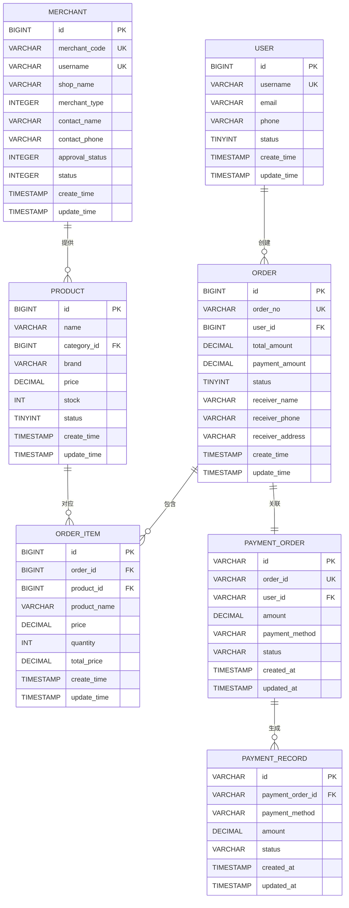

# 数据模型

<cite>
**本文档引用的文件**   
- [数据字典.md](file://数据字典.md)
- [User.java](file://backend/user-service/src/main/java/com/mall/user/domain/entity/User.java)
- [Product.java](file://backend/product-service/src/main/java/com/mall/product/domain/entity/Product.java)
- [Order.java](file://backend/order-service/src/main/java/com/mall/order/entity/Order.java)
- [OrderItem.java](file://backend/order-service/src/main/java/com/mall/order/entity/OrderItem.java)
- [Merchant.java](file://backend/merchant-service/src/main/java/com/mall/merchant/domain/entity/Merchant.java)
- [PaymentRecord.java](file://backend/payment-service/src/main/java/com/mall/payment/entity/PaymentRecord.java)
- [PaymentOrder.java](file://backend/payment-service/src/main/java/com/mall/payment/entity/PaymentOrder.java)
- [OrderStatus.java](file://backend/order-service/src/main/java/com/mall/order/enums/OrderStatus.java)
</cite>

## 目录
1. [简介](#简介)
2. [核心实体定义](#核心实体定义)
3. [实体关系图](#实体关系图)
4. [订单状态机](#订单状态机)
5. [数据生命周期管理](#数据生命周期管理)
6. [索引与约束设计](#索引与约束设计)

## 简介

本数据模型文档全面记录了基于Spring Cloud的在线商城系统的核心业务实体及其关系。文档基于系统数据字典和实体类，详细描述了用户、商品、订单、商家、支付记录等关键表的字段定义、数据类型、约束条件和业务含义。

系统采用微服务架构，每个服务拥有独立的数据库，确保数据隔离和服务自治。主要数据库包括：用户服务数据库（mall_user）、商品服务数据库（mall_product）、订单服务数据库（mall_order）、支付服务数据库（mall_payment）和商户服务数据库（mall_merchant）。

**Section sources**
- [数据字典.md](file://数据字典.md)

## 核心实体定义

### 用户实体 (User)

用户实体存储系统用户的核心数据，是系统中最基础的业务实体。

| 字段名 | 数据类型 | 是否为空 | 默认值 | 描述 |
|--------|----------|----------|--------|------|
| id | BIGINT | NOT NULL | AUTO_INCREMENT | 用户唯一标识ID |
| username | VARCHAR(50) | NOT NULL | - | 用户名，登录凭证 |
| password | VARCHAR(255) | NOT NULL | - | 加密后的用户密码 |
| email | VARCHAR(100) | NULL | - | 用户邮箱地址 |
| phone | VARCHAR(20) | NULL | - | 用户手机号码 |
| avatar | VARCHAR(255) | NULL | - | 用户头像URL |
| nickname | VARCHAR(50) | NULL | - | 用户昵称 |
| gender | TINYINT | NULL | 0 | 性别：0-未知，1-男，2-女 |
| birthday | DATE | NULL | - | 用户生日 |
| status | TINYINT | NOT NULL | 1 | 用户状态：0-禁用，1-启用 |
| create_time | TIMESTAMP | NOT NULL | CURRENT_TIMESTAMP | 创建时间 |
| update_time | TIMESTAMP | NOT NULL | CURRENT_TIMESTAMP ON UPDATE | 更新时间 |

**Section sources**
- [数据字典.md](file://数据字典.md#L37-L50)
- [User.java](file://backend/user-service/src/main/java/com/mall/user/domain/entity/User.java)

### 商品实体 (Product)

商品实体存储商品的核心数据，是电商平台的核心业务对象。

| 字段名 | 数据类型 | 是否为空 | 默认值 | 描述 |
|--------|----------|----------|--------|------|
| id | BIGINT | NOT NULL | AUTO_INCREMENT | 商品唯一标识ID |
| name | VARCHAR(255) | NOT NULL | - | 商品名称 |
| category_id | BIGINT | NOT NULL | - | 分类ID，关联categories表 |
| brand | VARCHAR(100) | NULL | - | 商品品牌 |
| price | DECIMAL(10,2) | NOT NULL | - | 商品价格 |
| original_price | DECIMAL(10,2) | NULL | - | 原价 |
| stock | INT | NOT NULL | 0 | 库存数量 |
| sales | INT | NOT NULL | 0 | 销量 |
| main_image | VARCHAR(255) | NULL | - | 主图URL |
| images | TEXT | NULL | - | 商品图片JSON数组 |
| description | TEXT | NULL | - | 商品描述 |
| specifications | TEXT | NULL | - | 商品规格JSON |
| weight | DECIMAL(8,2) | NULL | - | 商品重量(kg) |
| status | TINYINT | NOT NULL | 1 | 状态：0-下架，1-上架 |
| create_time | TIMESTAMP | NOT NULL | CURRENT_TIMESTAMP | 创建时间 |
| update_time | TIMESTAMP | NOT NULL | CURRENT_TIMESTAMP ON UPDATE | 更新时间 |

**Section sources**
- [数据字典.md](file://数据字典.md#L113-L130)
- [Product.java](file://backend/product-service/src/main/java/com/mall/product/domain/entity/Product.java)

### 订单实体 (Order)

订单实体存储订单的基本信息，包含订单状态、金额、收货信息等关键数据。

| 字段名 | 数据类型 | 是否为空 | 默认值 | 描述 |
|--------|----------|----------|--------|------|
| id | BIGINT | NOT NULL | AUTO_INCREMENT | 订单唯一标识ID |
| order_no | VARCHAR(32) | NOT NULL | - | 订单编号 |
| user_id | BIGINT | NOT NULL | - | 用户ID |
| total_amount | DECIMAL(10,2) | NOT NULL | - | 订单总金额 |
| payment_amount | DECIMAL(10,2) | NOT NULL | - | 实付金额 |
| freight_amount | DECIMAL(10,2) | NOT NULL | 0.00 | 运费 |
| discount_amount | DECIMAL(10,2) | NOT NULL | 0.00 | 优惠金额 |
| payment_type | TINYINT | NULL | - | 支付方式：1-微信，2-支付宝，3-银行卡 |
| status | TINYINT | NOT NULL | 1 | 订单状态：1-待付款，2-待发货，3-待收货，4-已完成，5-已取消 |
| receiver_name | VARCHAR(50) | NOT NULL | - | 收货人姓名 |
| receiver_phone | VARCHAR(20) | NOT NULL | - | 收货人电话 |
| receiver_address | VARCHAR(500) | NOT NULL | - | 收货地址 |
| remark | VARCHAR(500) | NULL | - | 订单备注 |
| payment_time | TIMESTAMP | NULL | - | 支付时间 |
| delivery_time | TIMESTAMP | NULL | - | 发货时间 |
| receive_time | TIMESTAMP | NULL | - | 收货时间 |
| create_time | TIMESTAMP | NOT NULL | CURRENT_TIMESTAMP | 创建时间 |
| update_time | TIMESTAMP | NOT NULL | CURRENT_TIMESTAMP ON UPDATE | 更新时间 |

**Section sources**
- [数据字典.md](file://数据字典.md#L146-L165)
- [Order.java](file://backend/order-service/src/main/java/com/mall/order/entity/Order.java)

### 订单项实体 (OrderItem)

订单项实体存储订单中包含的商品明细信息，与订单实体形成一对多关系。

| 字段名 | 数据类型 | 是否为空 | 默认值 | 描述 |
|--------|----------|----------|--------|------|
| id | BIGINT | NOT NULL | AUTO_INCREMENT | 明细唯一标识ID |
| order_id | BIGINT | NOT NULL | - | 订单ID，关联orders表 |
| product_id | BIGINT | NOT NULL | - | 商品ID |
| product_name | VARCHAR(255) | NOT NULL | - | 商品名称 |
| product_image | VARCHAR(255) | NULL | - | 商品图片 |
| price | DECIMAL(10,2) | NOT NULL | - | 商品单价 |
| quantity | INT | NOT NULL | - | 购买数量 |
| total_price | DECIMAL(10,2) | NOT NULL | - | 小计金额 |
| specifications | VARCHAR(500) | NULL | - | 商品规格 |
| create_time | TIMESTAMP | NOT NULL | CURRENT_TIMESTAMP | 创建时间 |
| update_time | TIMESTAMP | NOT NULL | CURRENT_TIMESTAMP ON UPDATE | 更新时间 |

**Section sources**
- [数据字典.md](file://数据字典.md#L177-L189)
- [OrderItem.java](file://backend/order-service/src/main/java/com/mall/order/entity/OrderItem.java)

### 商家实体 (Merchant)

商家实体存储商家的基本信息、认证信息和状态，是平台商家管理的核心。

| 字段名 | 数据类型 | 是否为空 | 默认值 | 描述 |
|--------|----------|----------|--------|------|
| id | BIGINT | NOT NULL | AUTO_INCREMENT | 商户唯一标识ID |
| merchant_code | VARCHAR(32) | NULL | - | 商家编码（系统自动生成） |
| username | VARCHAR(50) | NOT NULL | - | 商家用户名（登录账号） |
| password | VARCHAR(100) | NOT NULL | - | 商家密码（加密存储） |
| shop_name | VARCHAR(100) | NOT NULL | - | 店铺名称 |
| company_name | VARCHAR(100) | NOT NULL | - | 公司名称（企业商家必填） |
| merchant_type | INTEGER | NOT NULL | - | 商家类型：1-个人商家，2-企业商家 |
| contact_name | VARCHAR(50) | NOT NULL | - | 联系人姓名 |
| contact_phone | VARCHAR(20) | NOT NULL | - | 联系人手机号 |
| contact_email | VARCHAR(100) | NULL | - | 联系人邮箱 |
| id_number | VARCHAR(50) | NOT NULL | - | 身份证号/营业执照号 |
| id_front_image | VARCHAR(200) | NULL | - | 身份证正面照/营业执照照片 |
| id_back_image | VARCHAR(200) | NULL | - | 身份证反面照 |
| bank_card_number | VARCHAR(30) | NULL | - | 银行卡号 |
| bank_name | VARCHAR(100) | NULL | - | 开户银行 |
| bank_account_name | VARCHAR(50) | NULL | - | 开户人姓名 |
| shop_description | VARCHAR(500) | NULL | - | 店铺描述 |
| shop_logo | VARCHAR(200) | NULL | - | 店铺logo |
| business_category | VARCHAR(100) | NULL | - | 经营类目 |
| address | VARCHAR(200) | NULL | - | 详细地址 |
| province | VARCHAR(50) | NULL | - | 省份 |
| city | VARCHAR(50) | NULL | - | 城市 |
| district | VARCHAR(50) | NULL | - | 区县 |
| approval_status | INTEGER | NOT NULL | 0 | 审核状态：0-待审核，1-审核通过，2-审核拒绝 |
| approval_reason | VARCHAR(200) | NULL | - | 审核意见 |
| approval_time | DATETIME | NULL | - | 审核时间 |
| approval_by | BIGINT | NULL | - | 审核人ID |
| status | INTEGER | NOT NULL | 1 | 商家状态：0-禁用，1-正常 |
| deposit_amount | DECIMAL(10,2) | NULL | - | 保证金金额 |
| deposit_paid | INTEGER | NOT NULL | 0 | 是否已缴纳保证金：0-未缴纳，1-已缴纳 |
| last_login_time | DATETIME | NULL | - | 最后登录时间 |
| last_login_ip | VARCHAR(50) | NULL | - | 最后登录IP |
| login_count | INTEGER | NOT NULL | 0 | 登录次数 |
| create_time | TIMESTAMP | NOT NULL | CURRENT_TIMESTAMP | 创建时间 |
| update_time | TIMESTAMP | NOT NULL | CURRENT_TIMESTAMP ON UPDATE | 更新时间 |

**Section sources**
- [Merchant.java](file://backend/merchant-service/src/main/java/com/mall/merchant/domain/entity/Merchant.java)

### 支付记录实体 (PaymentRecord)

支付记录实体存储每次支付操作的详细信息，包括支付请求、响应、状态变更等。

| 字段名 | 数据类型 | 是否为空 | 默认值 | 描述 |
|--------|----------|----------|--------|------|
| id | VARCHAR(36) | NOT NULL | - | 支付记录ID（UUID） |
| payment_order_id | VARCHAR(36) | NOT NULL | - | 支付订单ID |
| payment_method | VARCHAR(20) | NOT NULL | - | 支付方式 |
| amount | DECIMAL(15,2) | NOT NULL | - | 支付金额 |
| status | VARCHAR(20) | NOT NULL | PENDING | 支付状态：PENDING-待支付，SUCCESS-支付成功，FAILED-支付失败，REFUNDED-已退款 |
| third_party_trade_no | VARCHAR(64) | NULL | - | 第三方交易号 |
| payment_channel | VARCHAR(50) | NULL | - | 支付渠道 |
| request_params | TEXT | NULL | - | 支付请求参数（JSON） |
| response_data | TEXT | NULL | - | 支付响应数据（JSON） |
| pay_time | DATETIME | NULL | - | 支付完成时间 |
| fee_amount | DECIMAL(15,2) | NULL | - | 手续费 |
| error_code | VARCHAR(50) | NULL | - | 错误代码 |
| error_message | VARCHAR(500) | NULL | - | 错误信息 |
| retry_count | INTEGER | NULL | 0 | 重试次数 |
| client_ip | VARCHAR(45) | NULL | - | 客户端IP |
| user_agent | VARCHAR(500) | NULL | - | 用户代理 |
| device_info | VARCHAR(200) | NULL | - | 设备信息 |
| action | VARCHAR(100) | NULL | - | 操作类型 |
| description | VARCHAR(500) | NULL | - | 操作描述 |
| remark | VARCHAR(500) | NULL | - | 备注信息 |
| created_at | TIMESTAMP | NOT NULL | CURRENT_TIMESTAMP | 创建时间 |
| updated_at | TIMESTAMP | NOT NULL | CURRENT_TIMESTAMP ON UPDATE | 更新时间 |

**Section sources**
- [PaymentRecord.java](file://backend/payment-service/src/main/java/com/mall/payment/entity/PaymentRecord.java)

### 支付订单实体 (PaymentOrder)

支付订单实体存储支付订单的基本信息，与业务订单形成一对一关系。

| 字段名 | 数据类型 | 是否为空 | 默认值 | 描述 |
|--------|----------|----------|--------|------|
| id | VARCHAR(36) | NOT NULL | - | 支付订单ID（UUID） |
| order_id | VARCHAR(64) | NOT NULL | - | 业务订单ID |
| user_id | VARCHAR(36) | NOT NULL | - | 用户ID |
| amount | DECIMAL(15,2) | NOT NULL | - | 支付金额 |
| payment_method | VARCHAR(20) | NOT NULL | - | 支付方式 |
| status | VARCHAR(20) | NOT NULL | PENDING | 支付状态 |
| description | VARCHAR(255) | NULL | - | 支付描述 |
| return_url | VARCHAR(500) | NULL | - | 支付成功后的返回URL |
| notify_url | VARCHAR(500) | NULL | - | 异步通知URL |
| expire_time | DATETIME | NULL | - | 支付过期时间 |
| third_party_order_no | VARCHAR(64) | NULL | - | 第三方支付订单号 |
| pay_time | DATETIME | NULL | - | 支付完成时间 |
| actual_amount | DECIMAL(15,2) | NULL | - | 实际支付金额 |
| fee_amount | DECIMAL(15,2) | NULL | - | 手续费 |
| channel_response | TEXT | NULL | - | 支付渠道响应数据 |
| failure_reason | VARCHAR(500) | NULL | - | 失败原因 |
| retry_count | INTEGER | NULL | 0 | 重试次数 |
| created_at | TIMESTAMP | NOT NULL | CURRENT_TIMESTAMP | 创建时间 |
| updated_at | TIMESTAMP | NOT NULL | CURRENT_TIMESTAMP ON UPDATE | 更新时间 |
| deleted | BOOLEAN | NOT NULL | false | 删除标记（软删除） |

**Section sources**
- [PaymentOrder.java](file://backend/payment-service/src/main/java/com/mall/payment/entity/PaymentOrder.java)

## 实体关系图



**Diagram sources **
- [数据字典.md](file://数据字典.md)
- [Order.java](file://backend/order-service/src/main/java/com/mall/order/entity/Order.java)
- [OrderItem.java](file://backend/order-service/src/main/java/com/mall/order/entity/OrderItem.java)
- [Product.java](file://backend/product-service/src/main/java/com/mall/product/domain/entity/Product.java)
- [User.java](file://backend/user-service/src/main/java/com/mall/user/domain/entity/User.java)
- [Merchant.java](file://backend/merchant-service/src/main/java/com/mall/merchant/domain/entity/Merchant.java)
- [PaymentOrder.java](file://backend/payment-service/src/main/java/com/mall/payment/entity/PaymentOrder.java)
- [PaymentRecord.java](file://backend/payment-service/src/main/java/com/mall/payment/entity/PaymentRecord.java)

## 订单状态机

订单状态机定义了订单在其生命周期中的状态流转规则，确保订单状态变更的正确性和一致性。

```mermaid
stateDiagram-v2
[*] --> PENDING
PENDING --> PAID : 用户支付
PENDING --> CANCELLED : 用户取消或超时
PAID --> SHIPPED : 商家发货
PAID --> REFUNDING : 用户申请退款
SHIPPED --> COMPLETED : 用户确认收货
SHIPPED --> REFUNDING : 用户申请退款
COMPLETED --> REFUNDING : 用户申请售后退款
REFUNDING --> REFUNDED : 退款成功
REFUNDING --> PAID : 退款拒绝
CANCELLED --> [*]
REFUNDED --> [*]
COMPLETED --> [*]
state PENDING {
状态码 : 1
描述 : 待付款
可执行操作 : 取消订单、支付
}
state PAID {
状态码 : 2
描述 : 已付款
可执行操作 : 发货、申请退款
}
state SHIPPED {
状态码 : 3
描述 : 已发货
可执行操作 : 确认收货、申请退款
}
state COMPLETED {
状态码 : 4
描述 : 已完成
可执行操作 : 申请售后
}
state CANCELLED {
状态码 : 5
描述 : 已取消
可执行操作 : 无
}
state REFUNDING {
状态码 : 6
描述 : 退款中
可执行操作 : 处理退款
}
state REFUNDED {
状态码 : 7
描述 : 已退款
可执行操作 : 无
}
```

**Diagram sources **
- [OrderStatus.java](file://backend/order-service/src/main/java/com/mall/order/enums/OrderStatus.java)
- [Order.java](file://backend/order-service/src/main/java/com/mall/order/entity/Order.java)

## 数据生命周期管理

### 数据创建

所有实体在创建时都会自动设置创建时间（create_time）和更新时间（update_time）字段。系统通过JPA的@PrePersist和@PreUpdate注解实现这一功能，确保数据完整性。

```java
@PrePersist
protected void onCreate() {
    LocalDateTime now = LocalDateTime.now();
    this.createTime = now;
    this.updateTime = now;
}
```

### 数据更新

当实体数据被修改时，系统会自动更新update_time字段，记录最后一次修改时间。这有助于追踪数据变更历史和实现缓存失效策略。

```java
@PreUpdate
protected void onUpdate() {
    this.updateTime = LocalDateTime.now();
}
```

### 数据删除

系统采用软删除策略而非物理删除，通过在实体中添加deleted字段来标记数据的删除状态。这种方式可以保留历史数据，便于数据恢复和审计追踪。

```java
@Column(name = "deleted", nullable = false)
private Boolean deleted = false;
```

### 数据归档

对于历史订单数据，系统会定期进行归档处理。归档策略包括：
- 订单完成超过180天的数据迁移到历史订单表
- 支付记录超过365天的数据进行压缩存储
- 日志类数据超过90天的数据进行归档或删除

**Section sources**
- [Order.java](file://backend/order-service/src/main/java/com/mall/order/entity/Order.java)
- [PaymentOrder.java](file://backend/payment-service/src/main/java/com/mall/payment/entity/PaymentOrder.java)

## 索引与约束设计

### 主键约束

所有表都必须有主键约束，主键字段统一使用BIGINT类型自增（除支付服务使用UUID外）。主键约束确保了每条记录的唯一性。

```sql
PRIMARY KEY (`id`)
```

### 唯一约束

对于需要保证唯一性的字段，如用户名、订单号等，系统创建了唯一约束，防止重复数据的产生。

```sql
UNIQUE KEY `username` (`username`)
UNIQUE KEY `order_no` (`order_no`)
```

### 外键约束

系统通过外键约束维护数据完整性，确保关联数据的一致性。例如，订单项表中的order_id字段外键关联订单表的id字段。

```sql
FOREIGN KEY (`order_id`) REFERENCES `orders`(`id`)
```

### 索引策略

系统根据查询需求创建了适当的索引，以提高查询性能：

| 表名 | 索引字段 | 索引类型 | 用途 |
|------|----------|----------|------|
| users | username | UNIQUE | 用户登录验证 |
| users | phone | INDEX | 手机号查询 |
| users | email | INDEX | 邮箱查询 |
| users | status | INDEX | 状态筛选 |
| products | name | INDEX | 商品名称搜索 |
| products | category_id | INDEX | 分类筛选 |
| products | price | INDEX | 价格排序 |
| products | stock | INDEX | 库存预警 |
| products | status | INDEX | 上下架状态 |
| orders | order_no | UNIQUE | 订单号查询 |
| orders | user_id | INDEX | 用户订单查询 |
| orders | status | INDEX | 订单状态筛选 |
| orders | create_time | INDEX | 时间范围查询 |
| payment_records | payment_order_id | INDEX | 支付订单查询 |
| payment_records | third_party_trade_no | INDEX | 第三方交易号查询 |
| payment_records | status | INDEX | 支付状态筛选 |

**Section sources**
- [数据字典.md](file://数据字典.md)