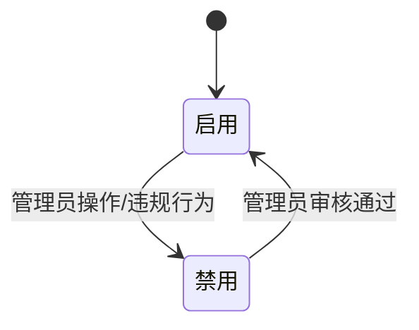
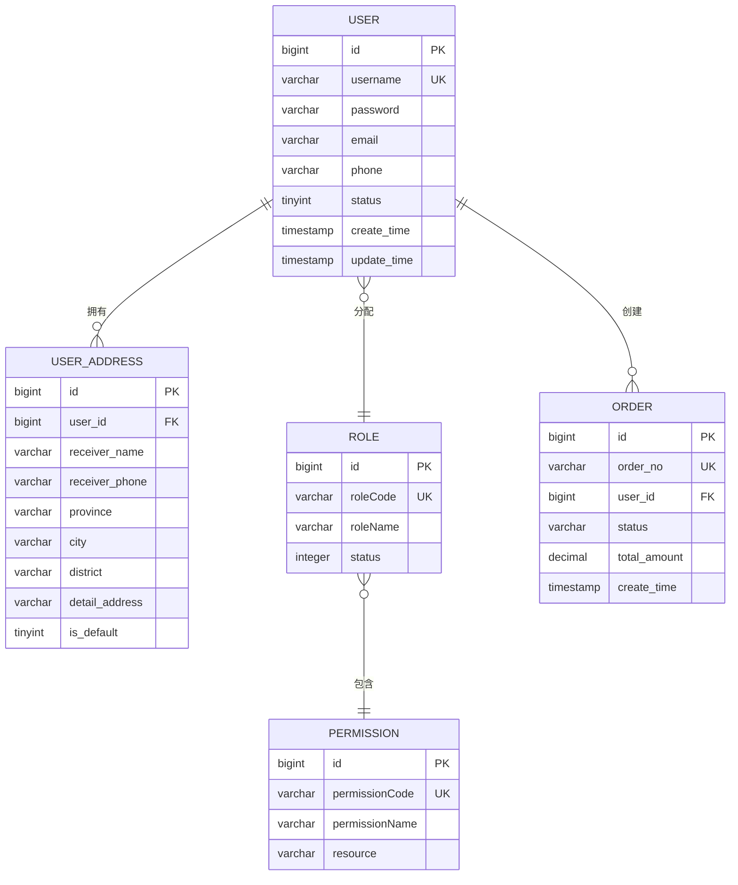

# 用户模型

<cite>
**本文档引用文件**  
- [数据字典.md](file://数据字典.md)
- [User.java](file://backend/user-service/src/main/java/com/mall/user/domain/entity/User.java)
- [UserMapper.java](file://backend/user-service/src/main/java/com/mall/user/mapper/UserMapper.java)
- [Role.java](file://backend/admin-service/src/main/java/com/mall/admin/domain/entity/Role.java)
- [Permission.java](file://backend/admin-service/src/main/java/com/mall/admin/domain/entity/Permission.java)
- [Order.java](file://backend/order-service/src/main/java/com/mall/order/entity/Order.java)
</cite>

## 目录
1. [简介](#简介)
2. [用户表结构定义](#用户表结构定义)
3. [核心字段设计说明](#核心字段设计说明)
4. [用户状态管理机制](#用户状态管理机制)
5. [实体关系与ER图](#实体关系与er图)
6. [数据删除策略](#数据删除策略)
7. [与其他服务的关联关系](#与其他服务的关联关系)

## 简介
本文档详细描述了在线商城系统中用户模型的数据结构设计，基于数据字典和User实体类，全面阐述用户表(users)的字段定义、数据类型、约束条件及业务含义。重点说明用户名、密码加密存储、邮箱手机号索引、状态管理等核心字段的设计。同时解释用户状态流转机制（启用/禁用），以及与其他服务（如订单、购物车）的关联关系。

**Section sources**
- [数据字典.md](file://数据字典.md#L1-L474)

## 用户表结构定义
用户表 `users` 是用户服务数据库（mall_user）中的核心表，用于存储系统用户的基本信息。

| 字段名 | 数据类型 | 长度 | 是否为空 | 默认值 | 主键 | 外键 | 索引 | 描述 |
|--------|--------|------|--------|--------|------|------|------|------|
| id | BIGINT | - | NOT NULL | AUTO_INCREMENT | ✓ | - | PRIMARY | 用户唯一标识 ID |
| username | VARCHAR | 50 | NOT NULL | - | - | - | UNIQUE | 用户名，登录凭证 |
| password | VARCHAR | 255 | NOT NULL | - | - | - | - | 加密后的用户密码 |
| email | VARCHAR | 100 | NULL | - | - | - | INDEX | 用户邮箱地址 |
| phone | VARCHAR | 20 | NULL | - | - | - | INDEX | 用户手机号码 |
| avatar | VARCHAR | 255 | NULL | - | - | - | - | 用户头像 URL |
| nickname | VARCHAR | 50 | NULL | - | - | - | - | 用户昵称 |
| gender | TINYINT | - | NULL | 0 | - | - | - | 性别：0-未知，1-男，2-女 |
| birthday | DATE | - | NULL | - | - | - | - | 用户生日 |
| status | TINYINT | - | NOT NULL | 1 | - | - | INDEX | 用户状态：0-禁用，1-启用 |
| create_time | TIMESTAMP | - | NOT NULL | CURRENT_TIMESTAMP | - | - | INDEX | 创建时间 |
| update_time | TIMESTAMP | - | NOT NULL | CURRENT_TIMESTAMP ON UPDATE | - | - | - | 更新时间 |

**索引信息**:
- 主键索引: `id`
- 唯一索引: `username`
- 普通索引: `email`, `phone`, `status`, `create_time`

**Section sources**
- [数据字典.md](file://数据字典.md#L37-L57)
- [User.java](file://backend/user-service/src/main/java/com/mall/user/domain/entity/User.java#L27-L76)

## 核心字段设计说明

### 用户名字段
`username` 字段作为用户登录的核心凭证，具有以下设计特点：
- 数据类型为 `VARCHAR(50)`，确保足够长度支持多样化用户名
- 设置为 `NOT NULL` 且具有 `UNIQUE` 唯一索引，防止重复注册
- 在数据库层面强制保证唯一性，避免用户名冲突

### 密码加密存储
`password` 字段采用安全加密存储机制：
- 字段长度为 `VARCHAR(255)`，足以容纳加密后的哈希值
- 明文密码绝不存储，使用强哈希算法（如BCrypt）进行加密
- 配合 `passwordSetTime` 字段记录密码设置时间，便于实施定期更换策略

### 邮箱与手机号索引
`email` 和 `phone` 字段均建立了数据库索引：
- 两者均为 `VARCHAR` 类型，分别设置合理长度限制
- 建立 `INDEX` 索引以提升查询性能，支持快速查找用户
- 支持基于邮箱或手机号的登录、找回密码等功能场景

**Section sources**
- [数据字典.md](file://数据字典.md#L37-L57)
- [User.java](file://backend/user-service/src/main/java/com/mall/user/domain/entity/User.java#L31-L47)

## 用户状态管理机制
用户状态通过 `status` 字段进行管理，实现启用与禁用的状态流转。

### 状态值定义
| 状态值 | 含义 | 说明 |
|--------|------|------|
| 0 | 禁用 | 用户账户被锁定或停用 |
| 1 | 启用 | 用户账户正常可用 |

### 状态流转逻辑

### 状态管理实现
在 `User` 实体类中，提供了便捷的状态文本获取方法：
- `getStatusText()` 方法可将状态码转换为可读文本
- 支持前端展示"正常"或"禁用"等友好提示
- 状态变更通过管理员后台或系统规则自动触发

**Section sources**
- [数据字典.md](file://数据字典.md#L48)
- [User.java](file://backend/user-service/src/main/java/com/mall/user/domain/entity/User.java#L61-L109)

## 实体关系与ER图
用户模型与其他实体存在明确的关系关联，以下是主要实体关系的ER图展示。

**Diagram sources**
- [数据字典.md](file://数据字典.md#L37-L75)
- [User.java](file://backend/user-service/src/main/java/com/mall/user/domain/entity/User.java)
- [Role.java](file://backend/admin-service/src/main/java/com/mall/admin/domain/entity/Role.java)
- [Permission.java](file://backend/admin-service/src/main/java/com/mall/admin/domain/entity/Permission.java)
- [Order.java](file://backend/order-service/src/main/java/com/mall/order/entity/Order.java)

## 数据删除策略
系统采用逻辑删除与物理删除相结合的策略，优先推荐逻辑删除。

### 逻辑删除实现
- 不直接从数据库删除记录
- 可通过添加 `deleted` 字段标记删除状态（当前设计未显式包含，但符合最佳实践建议）
- 保留用户历史数据，便于审计和恢复

### 物理删除场景
- 仅在特定合规要求下执行
- 需要经过多重确认和审批流程
- 通常只适用于测试数据或违规账户清理

**Section sources**
- [数据字典.md](file://数据字典.md#L472-L473)

## 与其他服务的关联关系
用户模型作为系统核心，与多个微服务存在紧密关联。

### 订单服务关联
- 通过 `user_id` 外键关联订单表
- 支持查询用户历史订单记录
- 订单创建时验证用户状态有效性

### 购物车服务关联
- 购物车项通过 `user_id` 关联用户
- 用户登录后自动加载其购物车数据
- 支持多设备同步购物车状态

### 权限管理服务关联
- 用户与角色多对多关联
- 角色绑定具体权限（Permission）
- 实现基于RBAC的细粒度权限控制

### 认证服务关联
- 用户凭据用于身份验证
- 登录成功后生成访问令牌
- 支持单点登录和会话管理

**Section sources**
- [数据字典.md](file://数据字典.md#L146-L166)
- [UserMapper.java](file://backend/user-service/src/main/java/com/mall/user/mapper/UserMapper.java)
- [Order.java](file://backend/order-service/src/main/java/com/mall/order/entity/Order.java)