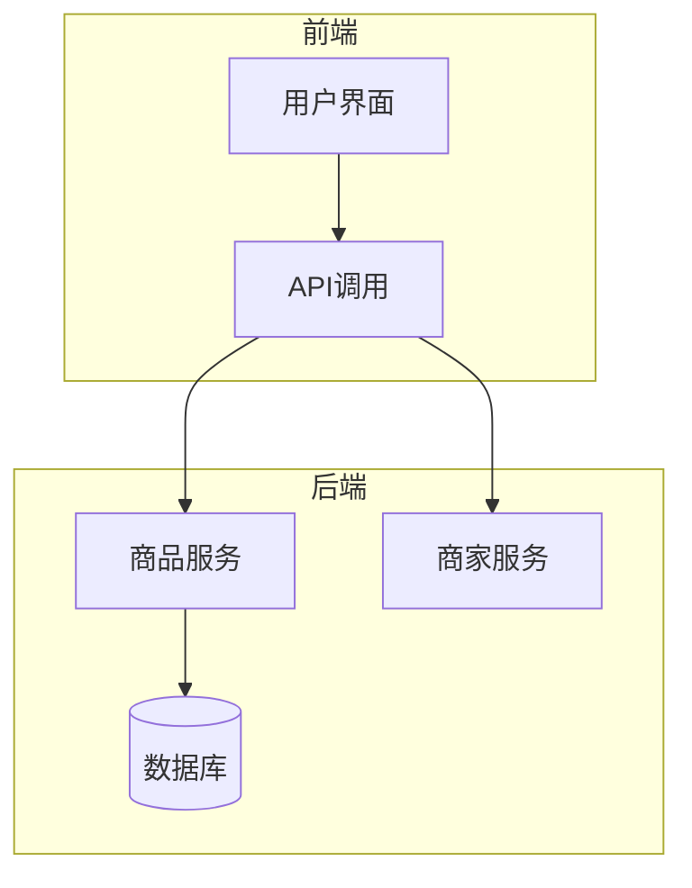
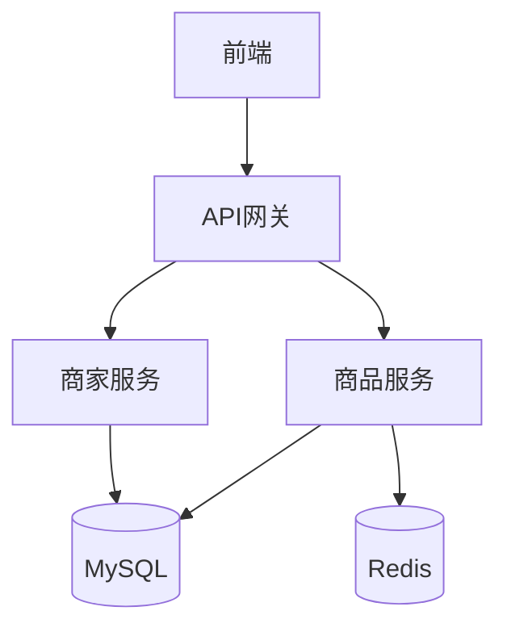
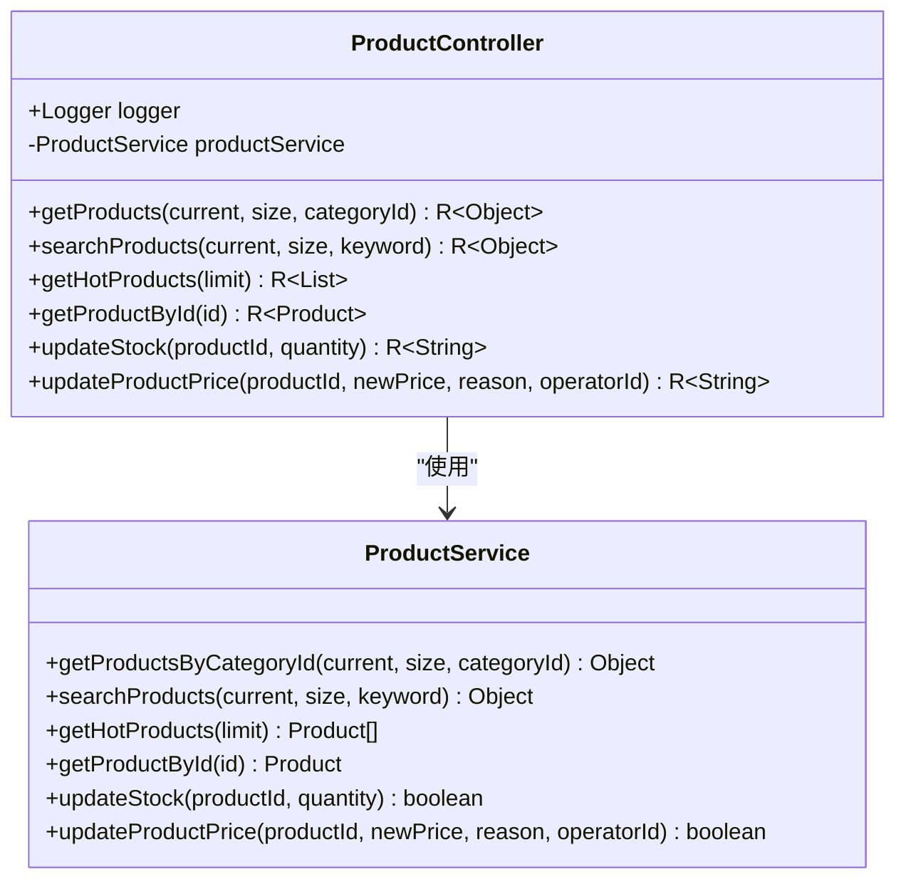
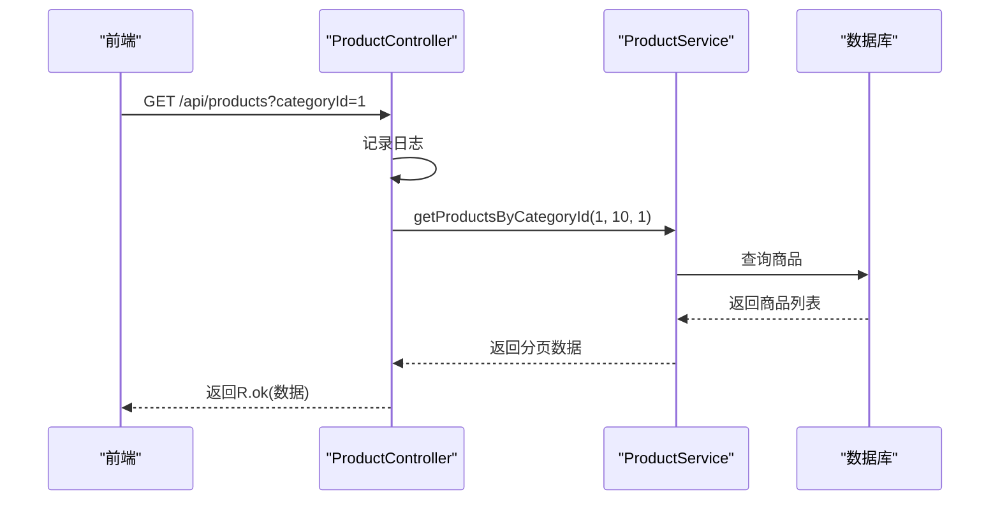
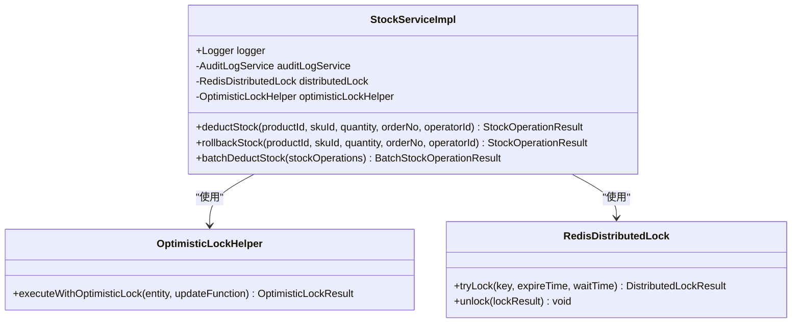
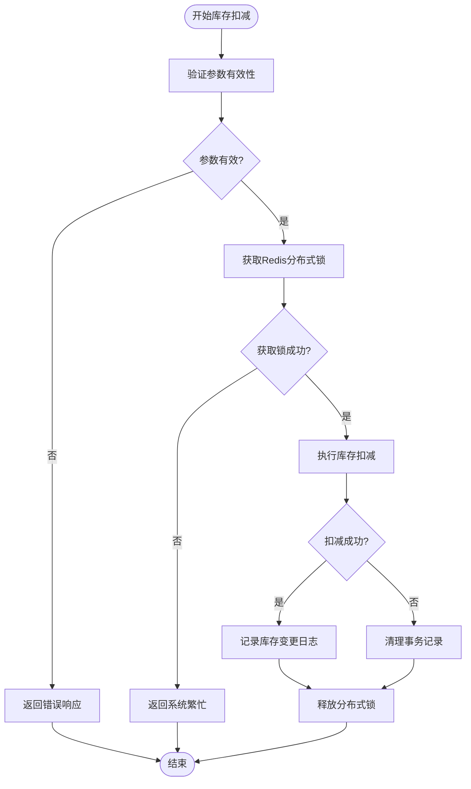
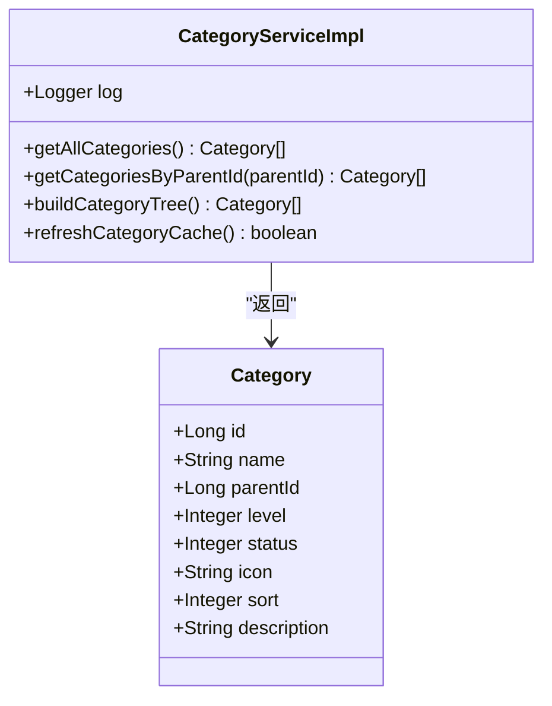
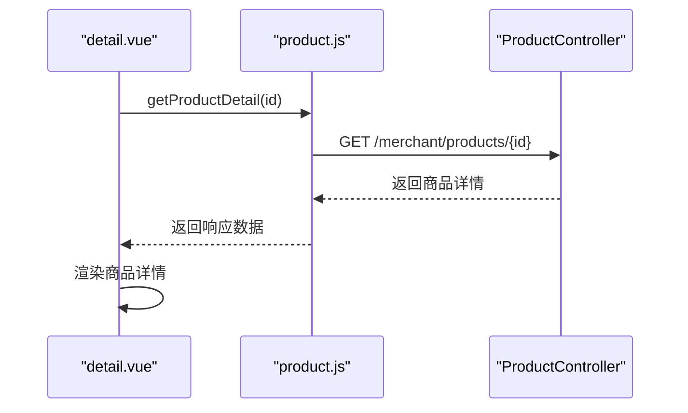
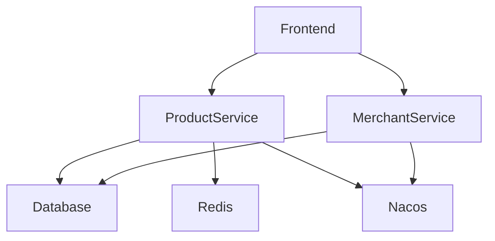

# 商品系统

<cite>
**本文档引用文件**   
- [ProductController.java](file://backend/product-service/src/main/java/com/mall/product/controller/ProductController.java)
- [StockServiceImpl.java](file://backend/product-service/src/main/java/com/mall/product/service/impl/StockServiceImpl.java)
- [CategoryServiceImpl.java](file://backend/product-service/src/main/java/com/mall/product/service/impl/CategoryServiceImpl.java)
- [product.js](file://frontend/src/api/product.js)
- [detail.vue](file://frontend/src/views/product/detail.vue)
- [application.yml](file://backend/product-service/src/main/resources/application.yml)
</cite>

## 目录
1. [简介](#简介)
2. [项目结构](#项目结构)
3. [核心组件](#核心组件)
4. [架构概述](#架构概述)
5. [详细组件分析](#详细组件分析)
6. [依赖分析](#依赖分析)
7. [性能考虑](#性能考虑)
8. [故障排除指南](#故障排除指南)
9. [结论](#结论)

## 简介
商品系统是电商平台的核心模块，负责商品浏览、分类管理、库存控制和价格调整等关键功能。本系统采用微服务架构，通过`ProductController`处理商品查询、分类加载和库存变更请求，支持商品上下架、多规格SKU和分类树形结构。库存服务使用乐观锁机制和Redis缓存策略确保高并发下的数据一致性。前端通过API获取商品列表并渲染页面，实现分页、筛选和搜索功能。文档还涵盖商品详情页数据加载流程、库存扣减与购物车联动机制，以及缓存预热和热点商品降级等性能优化建议。

## 项目结构
商品系统由后端服务和前端组件构成。后端`product-service`提供REST API，包括商品、分类和库存管理功能。`merchant-service`允许商家管理商品。前端位于`frontend`目录，使用Vue.js构建用户界面，通过API与后端交互。

**图表来源**
- [product.js](file://frontend/src/api/product.js)
- [ProductController.java](file://backend/product-service/src/main/java/com/mall/product/controller/ProductController.java)

**章节来源**
- [ProductController.java](file://backend/product-service/src/main/java/com/mall/product/controller/ProductController.java)
- [product.js](file://frontend/src/api/product.js)

## 核心组件
商品系统的核心组件包括`ProductController`处理HTTP请求，`StockService`管理库存，`CategoryService`处理分类。`ProductController`提供商品查询、库存更新和价格调整的API。`StockService`实现乐观锁和分布式锁确保库存数据一致性。`CategoryService`构建分类树形结构。前端`detail.vue`渲染商品详情，`product.js`封装API调用。

**章节来源**
- [ProductController.java](file://backend/product-service/src/main/java/com/mall/product/controller/ProductController.java)
- [StockServiceImpl.java](file://backend/product-service/src/main/java/com/mall/product/service/impl/StockServiceImpl.java)
- [CategoryServiceImpl.java](file://backend/product-service/src/main/java/com/mall/product/service/impl/CategoryServiceImpl.java)

## 架构概述
系统采用前后端分离架构。前端通过API获取数据并渲染页面。后端`product-service`处理商品相关请求，与数据库交互。`merchant-service`提供商家管理功能。服务通过Nacos注册发现，使用Redis缓存提高性能。

**图表来源**
- [ProductController.java](file://backend/product-service/src/main/java/com/mall/product/controller/ProductController.java)
- [application.yml](file://backend/product-service/src/main/resources/application.yml)

## 详细组件分析

### ProductController分析
`ProductController`是商品系统的入口，处理所有商品相关请求。它提供分页查询、搜索、库存和价格管理API。

#### 对象导向组件：

**图表来源**
- [ProductController.java](file://backend/product-service/src/main/java/com/mall/product/controller/ProductController.java)

#### API/服务组件：

**图表来源**
- [ProductController.java](file://backend/product-service/src/main/java/com/mall/product/controller/ProductController.java)

**章节来源**
- [ProductController.java](file://backend/product-service/src/main/java/com/mall/product/controller/ProductController.java)

### 库存服务分析
`StockServiceImpl`实现库存管理，使用乐观锁和分布式锁防止并发问题。

#### 对象导向组件：

**图表来源**
- [StockServiceImpl.java](file://backend/product-service/src/main/java/com/mall/product/service/impl/StockServiceImpl.java)

#### 复杂逻辑组件：

**图表来源**
- [StockServiceImpl.java](file://backend/product-service/src/main/java/com/mall/product/service/impl/StockServiceImpl.java)

**章节来源**
- [StockServiceImpl.java](file://backend/product-service/src/main/java/com/mall/product/service/impl/StockServiceImpl.java)

### 分类服务分析
`CategoryServiceImpl`处理商品分类，支持树形结构和缓存。

#### 对象导向组件：

**图表来源**
- [CategoryServiceImpl.java](file://backend/product-service/src/main/java/com/mall/product/service/impl/CategoryServiceImpl.java)

**章节来源**
- [CategoryServiceImpl.java](file://backend/product-service/src/main/java/com/mall/product/service/impl/CategoryServiceImpl.java)

### 前端组件分析
前端使用Vue.js组件和API调用与后端交互。

#### API/服务组件：

**图表来源**
- [detail.vue](file://frontend/src/views/product/detail.vue)
- [product.js](file://frontend/src/api/product.js)

**章节来源**
- [detail.vue](file://frontend/src/views/product/detail.vue)
- [product.js](file://frontend/src/api/product.js)

## 依赖分析
商品系统依赖多个服务和组件。`product-service`依赖数据库和Redis，通过Nacos注册。前端依赖`product-service`和`merchant-service`的API。

**图表来源**
- [application.yml](file://backend/product-service/src/main/resources/application.yml)
- [product.js](file://frontend/src/api/product.js)

**章节来源**
- [application.yml](file://backend/product-service/src/main/resources/application.yml)
- [product.js](file://frontend/src/api/product.js)

## 性能考虑
为提高性能，系统使用Redis缓存热门商品和分类数据。实现缓存预热机制，在系统启动时加载热点数据。对于高并发场景，使用乐观锁和分布式锁确保数据一致性。建议对热点商品实施降级策略，当系统压力大时返回缓存数据而非实时查询。

## 故障排除指南
常见问题包括商品无法加载、库存更新失败和分类显示异常。检查后端服务日志，确认数据库连接正常。对于库存问题，验证乐观锁版本号是否正确。前端问题通常与API路径或数据映射有关，检查`product.js`中的URL配置。

**章节来源**
- [ProductController.java](file://backend/product-service/src/main/java/com/mall/product/controller/ProductController.java)
- [StockServiceImpl.java](file://backend/product-service/src/main/java/com/mall/product/service/impl/StockServiceImpl.java)
- [detail.vue](file://frontend/src/views/product/detail.vue)

## 结论
商品系统实现了完整的商品管理功能，支持高并发场景下的数据一致性。通过合理的架构设计和性能优化，系统能够稳定处理大量商品请求。未来可进一步优化缓存策略和引入消息队列解耦服务。