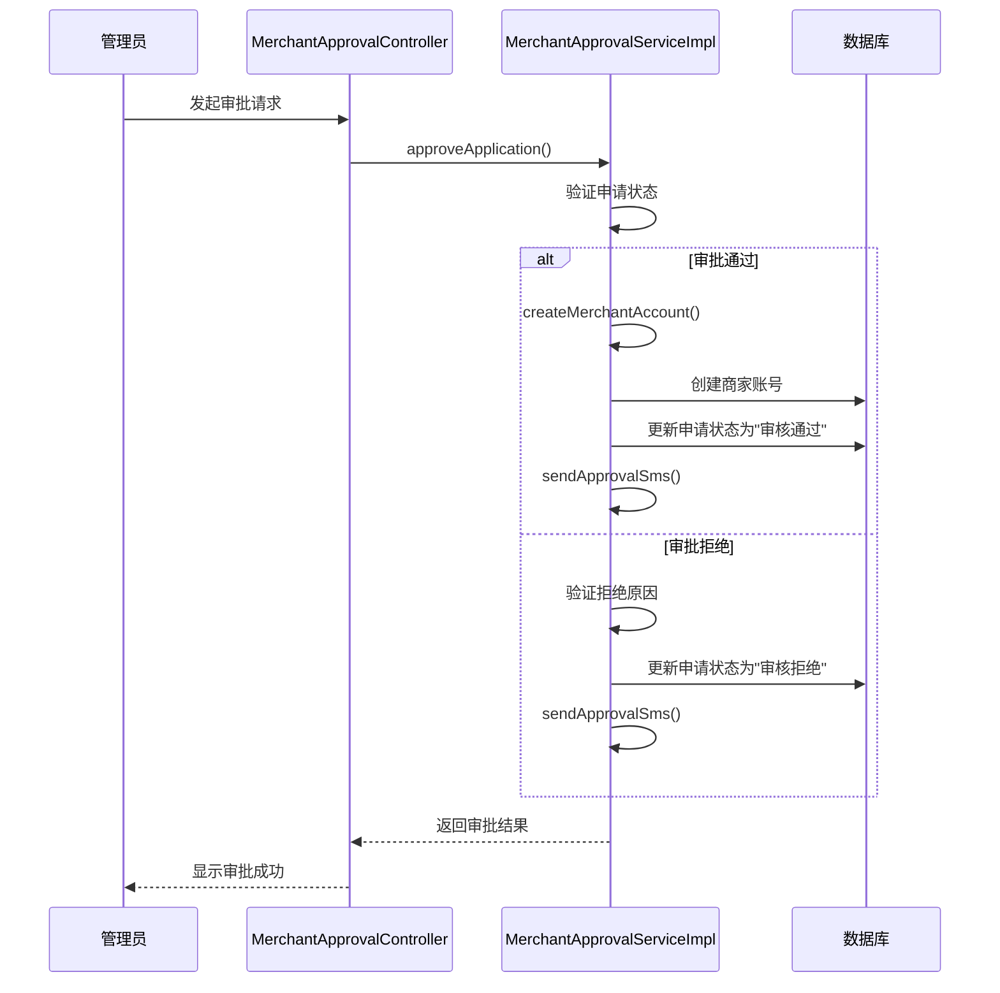
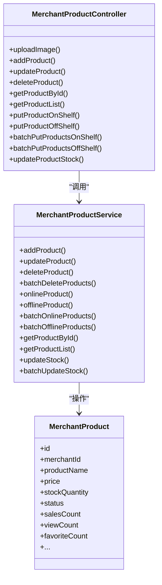
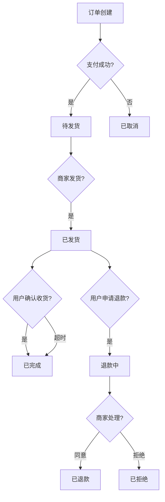

# 商家系统

<cite>
**本文档引用文件**  
- [MerchantApplicationController.java](file://backend/merchant-service/src/main/java/com/mall/merchant/controller/MerchantApplicationController.java)
- [MerchantApplicationService.java](file://backend/merchant-service/src/main/java/com/mall/merchant/service/MerchantApplicationService.java)
- [MerchantApplicationServiceImpl.java](file://backend/merchant-service/src/main/java/com/mall/merchant/service/impl/MerchantApplicationServiceImpl.java)
- [MerchantProductController.java](file://backend/merchant-service/src/main/java/com/mall/merchant/controller/MerchantProductController.java)
- [MerchantProductService.java](file://backend/merchant-service/src/main/java/com/mall/merchant/service/MerchantProductService.java)
- [MerchantOrderController.java](file://backend/merchant-service/src/main/java/com/mall/merchant/controller/MerchantOrderController.java)
- [MerchantOrderService.java](file://backend/merchant-service/src/main/java/com/mall/merchant/service/MerchantOrderService.java)
- [MerchantStatisticsController.java](file://backend/merchant-service/src/main/java/com/mall/merchant/controller/MerchantStatisticsController.java)
- [MerchantStatisticsService.java](file://backend/merchant-service/src/main/java/com/mall/merchant/service/MerchantStatisticsService.java)
- [FileUploadService.java](file://backend/merchant-service/src/main/java/com/mall/merchant/service/FileUploadService.java)
- [MinioConfig.java](file://backend/merchant-service/src/main/java/com/mall/merchant/config/MinioConfig.java)
- [MerchantApplication.java](file://backend/merchant-service/src/main/java/com/mall/merchant/domain/entity/MerchantApplication.java)
- [商家审核系统-完整实现报告.md](file://商家审核系统-完整实现报告.md)
</cite>

## 目录
1. [商家入驻申请与资质审核](#商家入驻申请与资质审核)
2. [商家审核状态机与管理员审批](#商家审核状态机与管理员审批)
3. [商品管理功能](#商品管理功能)
4. [订单处理流程](#订单处理流程)
5. [数据统计功能](#数据统计功能)
6. [商家入驻业务闭环](#商家入驻业务闭环)
7. [常见审核失败原因及解决方案](#常见审核失败原因及解决方案)

## 商家入驻申请与资质审核

商家入驻申请功能由 `MerchantApplicationController` 提供核心接口，处理商家注册请求的全流程。商家通过前端表单提交包括主体类型、店铺名称、联系人信息、资质文件（如营业执照、身份证）以及登录账号密码等信息。系统通过 `submitApplication` 方法接收请求，调用 `MerchantApplicationService` 服务进行业务处理。

在服务层，`MerchantApplicationServiceImpl` 实现了完整的业务逻辑。首先，系统会对用户名、手机号和店铺名称进行唯一性验证，确保这些关键信息在待审核和已通过的申请中不重复。对于已拒绝的申请，允许商家重新提交，历史记录完整保留。其次，系统会对提交的密码进行 BCrypt 加密，保障信息安全。最后，将申请信息保存至 `merchant_applications` 数据库表中，并返回唯一的申请ID。

文件上传功能通过 MinIO 对象存储实现。`FileUploadService` 服务负责处理图片上传，它会连接到 MinIO 服务器，将商家上传的证件照片等文件存储在名为 `mall-products` 的存储桶中，并返回可公开访问的文件URL。该服务在启动时会自动检查并创建存储桶，同时设置为公开读权限，确保前端可以正常显示图片。

**Section sources**
- [MerchantApplicationController.java](file://backend/merchant-service/src/main/java/com/mall/merchant/controller/MerchantApplicationController.java#L37-L75)
- [MerchantApplicationServiceImpl.java](file://backend/merchant-service/src/main/java/com/mall/merchant/service/impl/MerchantApplicationServiceImpl.java#L45-L123)
- [FileUploadService.java](file://backend/merchant-service/src/main/java/com/mall/merchant/service/FileUploadService.java#L81-L92)
- [MinioConfig.java](file://backend/merchant-service/src/main/java/com/mall/merchant/config/MinioConfig.java#L26-L32)

## 商家审核状态机与管理员审批

商家审核状态机定义了商家申请的生命周期，包含三种核心状态：**待审核 (0)**、**审核通过 (1)** 和 **审核拒绝 (2)**。该状态机由 `MerchantApplication` 实体类中的 `approvalStatus` 字段实现，并通过 `getApprovalStatusText()` 方法提供状态的文本描述。

管理员审批流程由 `MerchantApprovalController` 和 `MerchantApprovalServiceImpl` 协同完成。管理员登录后台后，可进入“商家入驻申请”页面，查看待审核列表。点击“审批”按钮后，可查看申请详情和上传的证件照片。审批决策分为“通过”和“拒绝”两种。

当管理员选择“通过”时，系统会执行一系列操作：
1.  更新申请记录的审批状态为“审核通过”。
2.  调用 `createMerchantAccount()` 方法，根据申请信息在 `merchant` 表中创建正式的商家账号。
3.  生成唯一的商家编码（格式为 `MER + 商家ID + 时间戳后6位`）。
4.  将新创建的商家ID关联回申请记录。
5.  （未来）发送短信通知商家审核已通过。

当管理员选择“拒绝”时，系统要求必须填写拒绝原因。随后，系统会更新申请记录的审批状态为“审核拒绝”，并记录拒绝原因。

**Diagram sources**
- [MerchantApplication.java](file://backend/merchant-service/src/main/java/com/mall/merchant/domain/entity/MerchantApplication.java#L144-L153)
- [MerchantApprovalServiceImpl.java](file://backend/admin-service/src/main/java/com/mall/admin/service/impl/MerchantApprovalServiceImpl.java#L137-L154)

**Section sources**
- [MerchantApplication.java](file://backend/merchant-service/src/main/java/com/mall/merchant/domain/entity/MerchantApplication.java#L273-L283)
- [MerchantApprovalServiceImpl.java](file://backend/admin-service/src/main/java/com/mall/admin/service/impl/MerchantApprovalServiceImpl.java#L137-L154)

## 商品管理功能

商家通过 `MerchantProductController` 发布和管理商品。该控制器提供了商品的增、删、改、查以及上下架操作的完整API。

商家首先通过 `/upload-image` 接口上传商品图片，文件上传至MinIO后返回图片URL。然后，通过 `/merchants/products` 接口提交商品信息，包括商品名称、价格、库存、分类、品牌等。`MerchantProductService` 服务负责处理这些请求，确保商品信息的完整性和商家权限的验证。

商品的上下架是核心管理操作。`onlineProduct()` 方法用于上架商品，将商品状态设置为1（上架），并检查商品信息是否完整。`offlineProduct()` 方法用于下架商品，将商品状态设置为0（下架），并重置销售量、收藏数等统计信息。系统还支持批量操作，如 `batchOnlineProducts()` 和 `batchOfflineProducts()`，允许商家一次性管理多个商品。

库存同步通过 `updateStock()` 方法实现，商家可以增加或减少商品的库存数量。系统在更新库存时会进行权限校验，确保操作的商家ID与商品所属商家ID一致。

**Diagram sources**
- [MerchantProductController.java](file://backend/merchant-service/src/main/java/com/mall/merchant/controller/MerchantProductController.java#L75-L240)
- [MerchantProductService.java](file://backend/merchant-service/src/main/java/com/mall/merchant/service/MerchantProductService.java#L28-L73)
- [MerchantProduct.java](file://backend/merchant-service/src/main/java/com/mall/merchant/domain/entity/MerchantProduct.java#L9-L783)

**Section sources**
- [MerchantProductController.java](file://backend/merchant-service/src/main/java/com/mall/merchant/controller/MerchantProductController.java#L75-L240)
- [MerchantProductService.java](file://backend/merchant-service/src/main/java/com/mall/merchant/service/MerchantProductService.java#L28-L73)

## 订单处理流程

商家后台的订单处理流程由 `MerchantOrderController` 提供支持。商家可以查询订单列表，支持按订单号、状态、用户ID和时间范围进行筛选。核心订单状态包括待发货、待收货和退款中。

待发货订单是商家需要处理的主要任务。商家通过 `getPendingShipmentOrders()` 方法获取待发货订单列表。处理发货时，调用 `shipOrder()` 方法，填写物流公司和物流单号，系统会更新订单状态为“已发货”，并记录物流信息。

对于已发货的订单，系统会进入“待收货”状态。商家也可以通过 `getPendingReceiptOrders()` 查看这些订单。如果用户申请退款，订单会进入“退款中”状态，商家可通过 `getRefundOrders()` 查看并处理退款请求。

**Diagram sources**
- [MerchantOrderController.java](file://backend/merchant-service/src/main/java/com/mall/merchant/controller/MerchantOrderController.java#L104-L122)
- [MerchantOrderService.java](file://backend/merchant-service/src/main/java/com/mall/merchant/service/MerchantOrderService.java#L57-L64)

**Section sources**
- [MerchantOrderController.java](file://backend/merchant-service/src/main/java/com/mall/merchant/controller/MerchantOrderController.java#L104-L122)
- [MerchantOrderService.java](file://backend/merchant-service/src/main/java/com/mall/merchant/service/MerchantOrderService.java#L57-L64)

## 数据统计功能

`MerchantStatisticsController` 提供了全面的数据统计功能，帮助商家分析经营状况。系统支持按日、月、年获取统计数据，包括今日、昨日、本月、上月等快捷查询。

统计服务 `MerchantStatisticsService` 会从订单、商品等数据源聚合信息，计算总销售额、订单数、商品访问量、独立访客数等关键指标。商家可以获取总览统计数据，也可以查询特定时间段的详细数据。

此外，系统还支持生成统计报告和导出数据。商家可以手动触发统计计算，或批量计算多个商家的数据。`getRecentDailyStatistics()` 等方法可以获取近期的趋势数据，便于商家进行销售预测和决策。

**Section sources**
- [MerchantStatisticsController.java](file://backend/merchant-service/src/main/java/com/mall/merchant/controller/MerchantStatisticsController.java#L133-L289)
- [MerchantStatisticsService.java](file://backend/merchant-service/src/main/java/com/mall/merchant/service/MerchantStatisticsService.java#L51-L134)

## 商家入驻业务闭环

商家入驻的完整业务闭环从申请开始，到开店结束，形成一个无缝的流程。

1.  **申请提交**：商家填写入驻表单，上传资质文件，设置登录账号，提交申请。系统验证信息后，保存申请并返回申请ID。
2.  **资质审核**：管理员在后台查看待审核列表，审查商家提交的资质信息。做出审批决定后，系统自动执行后续操作。
3.  **审核通过**：若审核通过，系统自动创建商家账号，生成商家编码，并将申请状态更新为“审核通过”。
4.  **商家开店**：商家使用注册的账号登录商家后台，即可开始发布商品、管理订单、查看数据，正式开启电商之旅。

此闭环确保了从申请到运营的顺畅过渡，极大地提升了商家的入驻体验。

**Section sources**
- [商家审核系统-完整实现报告.md](file://商家审核系统-完整实现报告.md#L461-L502)

## 常见审核失败原因及解决方案

根据系统实现和业务逻辑，常见的审核失败原因及解决方案如下：

-   **用户名或手机号已被使用**：系统会检查待审核和已通过的申请。解决方案是商家更换一个未被使用的用户名或手机号重新提交。
-   **店铺名称已存在**：为保证品牌唯一性，店铺名称在系统内必须唯一。解决方案是商家修改店铺名称。
-   **资质文件不清晰或信息不全**：管理员无法清晰辨认营业执照或身份证上的信息。解决方案是商家重新上传清晰、完整的证件照片。
-   **拒绝原因未填写**：当管理员选择拒绝时，系统强制要求填写原因。解决方案是管理员在审批时务必填写明确的拒绝理由。
-   **主体类型信息不匹配**：例如，个人商家提交了企业营业执照。解决方案是商家根据自身情况选择正确的主体类型并提交对应的资质文件。