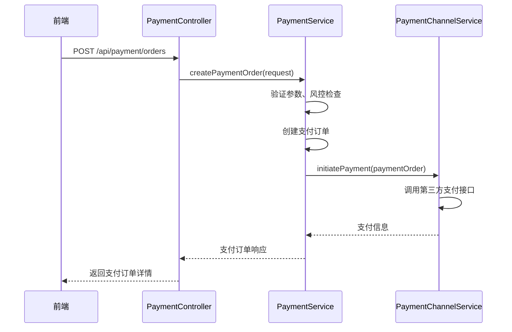
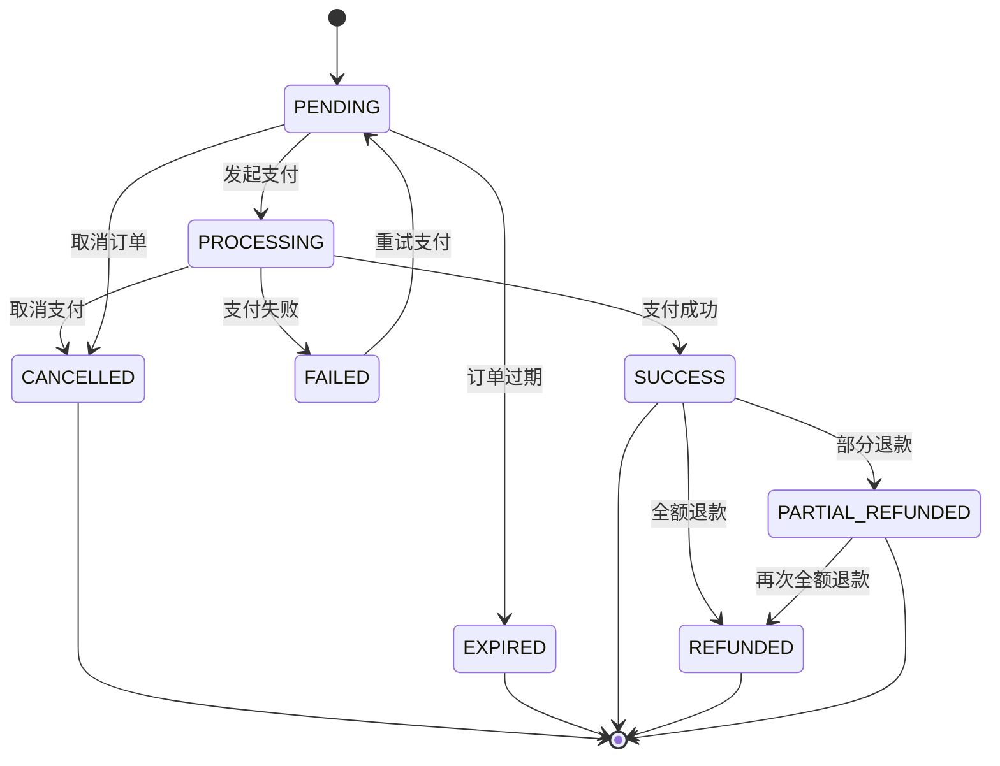
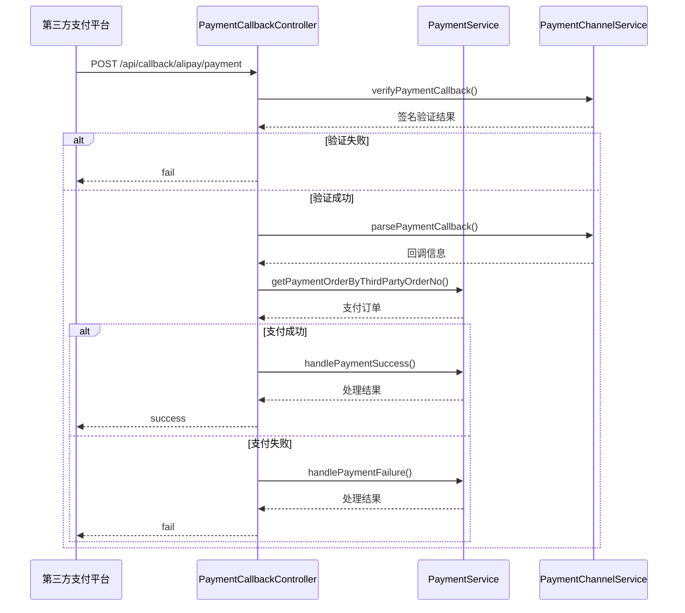
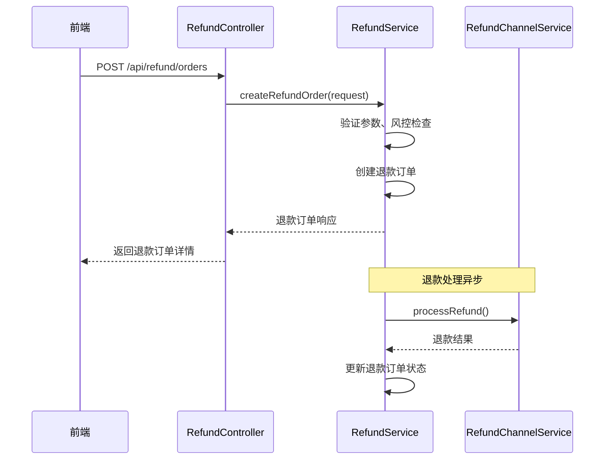
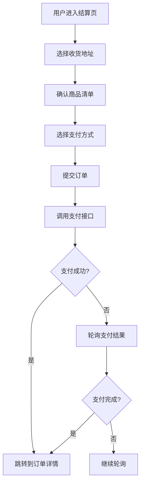
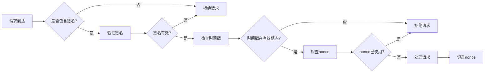

# 支付系统

<cite>
**本文档引用的文件**   
- [PaymentController.java](file://backend\payment-service\src\main\java\com\mall\payment\controller\PaymentController.java)
- [PaymentCallbackController.java](file://backend\payment-service\src\main\java\com\mall\payment\controller\PaymentCallbackController.java)
- [PaymentService.java](file://backend\payment-service\src\main\java\com\mall\payment\service\PaymentService.java)
- [PaymentServiceImpl.java](file://backend\payment-service\src\main\java\com\mall\payment\service\impl\PaymentServiceImpl.java)
- [PaymentChannelServiceImpl.java](file://backend\payment-service\src\main\java\com\mall\payment\service\impl\PaymentChannelServiceImpl.java)
- [RefundServiceImpl.java](file://backend\payment-service\src\main\java\com\mall\payment\service\impl\RefundServiceImpl.java)
- [RefundChannelServiceImpl.java](file://backend\payment-service\src\main\java\com\mall\payment\service\impl\RefundChannelServiceImpl.java)
- [PaymentOrder.java](file://backend\payment-service\src\main\java\com\mall\payment\entity\PaymentOrder.java)
- [RefundOrder.java](file://backend\payment-service\src\main\java\com\mall\payment\entity\RefundOrder.java)
- [PaymentStatus.java](file://backend\payment-service\src\main\java\com\mall\payment\enums\PaymentStatus.java)
- [RefundStatus.java](file://backend\payment-service\src\main\java\com\mall\payment\enums\RefundStatus.java)
- [PaymentCreateRequest.java](file://backend\payment-service\src\main\java\com\mall\payment\dto\request\PaymentCreateRequest.java)
- [RefundCreateRequest.java](file://backend\payment-service\src\main\java\com\mall\payment\dto\request\RefundCreateRequest.java)
- [index.vue](file://frontend\src\views\checkout\index.vue)
- [order.js](file://frontend\src\api\order.js)
</cite>

## 目录
1. [支付系统](#支付系统)
2. [核心组件](#核心组件)
3. [支付创建流程](#支付创建流程)
4. [支付状态机](#支付状态机)
5. [支付回调处理](#支付回调处理)
6. [退款处理机制](#退款处理机制)
7. [前端支付集成](#前端支付集成)
8. [安全防护措施](#安全防护措施)

## 核心组件

支付系统由多个核心组件构成，包括支付控制器、支付服务、支付渠道服务、退款服务等。`PaymentController`负责接收支付请求并调用`PaymentService`进行业务处理，`PaymentChannelService`负责与第三方支付平台的交互，`PaymentCallbackController`处理来自第三方平台的异步通知。

**Section sources**
- [PaymentController.java](file://backend\payment-service\src\main\java\com\mall\payment\controller\PaymentController.java#L57-L526)
- [PaymentService.java](file://backend\payment-service\src\main\java\com\mall\payment\service\PaymentService.java#L40-L278)
- [PaymentChannelServiceImpl.java](file://backend\payment-service\src\main\java\com\mall\payment\service\impl\PaymentChannelServiceImpl.java#L63-L1157)

## 支付创建流程

支付创建流程始于前端结算页调用支付接口，`PaymentController`接收`PaymentCreateRequest`请求，验证参数后调用`PaymentService.createPaymentOrder()`方法创建支付订单。系统支持多种支付方式，包括微信、支付宝、银行卡和余额支付，通过`PaymentMethod`枚举统一管理。

**Diagram sources**
- [PaymentController.java](file://backend\payment-service\src\main\java\com\mall\payment\controller\PaymentController.java#L93-L117)
- [PaymentService.java](file://backend\payment-service\src\main\java\com\mall\payment\service\PaymentService.java#L60-L65)
- [PaymentChannelServiceImpl.java](file://backend\payment-service\src\main\java\com\mall\payment\service\impl\PaymentChannelServiceImpl.java#L89-L110)

## 支付状态机

支付状态机定义了支付订单的完整生命周期，从创建到最终状态的流转过程。状态包括待支付、支付中、支付成功、支付失败、已取消、已过期、已退款和部分退款。状态流转受到严格控制，确保数据一致性。

**Diagram sources**
- [PaymentStatus.java](file://backend\payment-service\src\main\java\com\mall\payment\enums\PaymentStatus.java#L35-L162)
- [PaymentOrder.java](file://backend\payment-service\src\main\java\com\mall\payment\entity\PaymentOrder.java#L108-L110)

## 支付回调处理

支付回调处理是支付系统的关键环节，`PaymentCallbackController`接收来自第三方支付平台的异步通知，验证签名后解析回调数据，更新本地订单状态。系统支持支付宝、微信支付和银行卡支付的回调处理，确保支付状态的最终一致性。

**Diagram sources**
- [PaymentCallbackController.java](file://backend\payment-service\src\main\java\com\mall\payment\controller\PaymentCallbackController.java#L64-L575)
- [PaymentChannelServiceImpl.java](file://backend\payment-service\src\main\java\com\mall\payment\service\impl\PaymentChannelServiceImpl.java#L735-L792)

## 退款处理机制

退款处理机制包括退款申请、审核、处理和状态同步等环节。`RefundServiceImpl`负责处理退款业务逻辑，`RefundChannelService`负责与第三方支付平台的交互。系统支持部分退款和多次退款，通过风控检查和异步处理机制确保退款安全。

**Diagram sources**
- [RefundServiceImpl.java](file://backend\payment-service\src\main\java\com\mall\payment\service\impl\RefundServiceImpl.java#L95-L117)
- [RefundChannelServiceImpl.java](file://backend\payment-service\src\main\java\com\mall\payment\service\impl\RefundChannelServiceImpl.java#L78-L111)

## 前端支付集成

前端在结算页通过`index.vue`组件集成支付功能，用户选择商品和支付方式后，调用支付接口创建支付订单。系统支持轮询支付结果，实时更新订单状态，提供流畅的支付体验。

**Diagram sources**
- [index.vue](file://frontend\src\views\checkout\index.vue#L1-L662)
- [order.js](file://frontend\src\api\order.js#L71-L78)

## 安全防护措施

支付系统实施了多层次的安全防护措施，包括签名验证、防重放攻击、敏感信息加密等。系统使用分布式锁防止重复支付，通过风控检查识别异常交易，确保支付安全。

**Diagram sources**
- [PaymentChannelServiceImpl.java](file://backend\payment-service\src\main\java\com\mall\payment\service\impl\PaymentChannelServiceImpl.java#L735-L757)
- [RefundChannelServiceImpl.java](file://backend\payment-service\src\main\java\com\mall\payment\service\impl\RefundChannelServiceImpl.java#L149-L174)