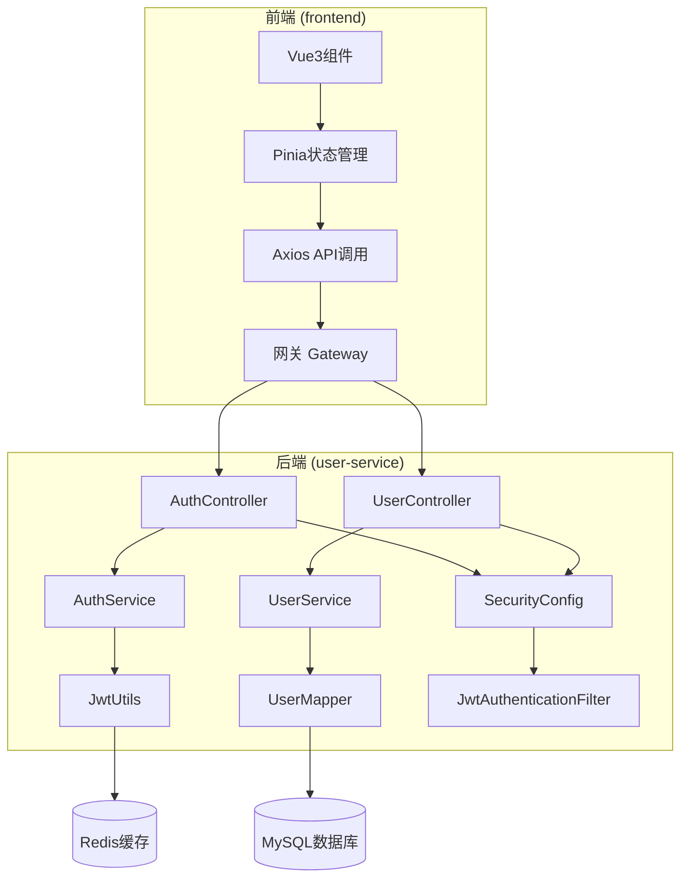
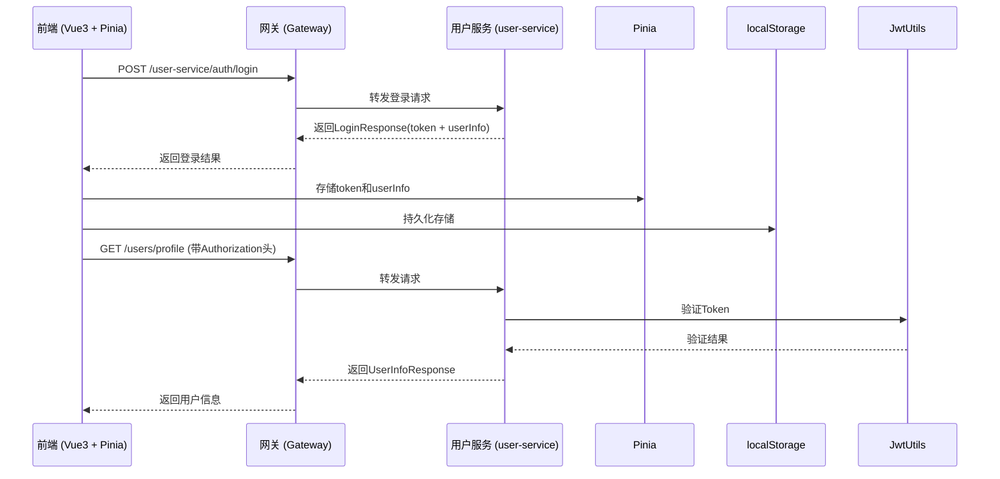
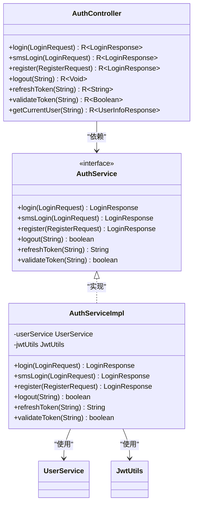
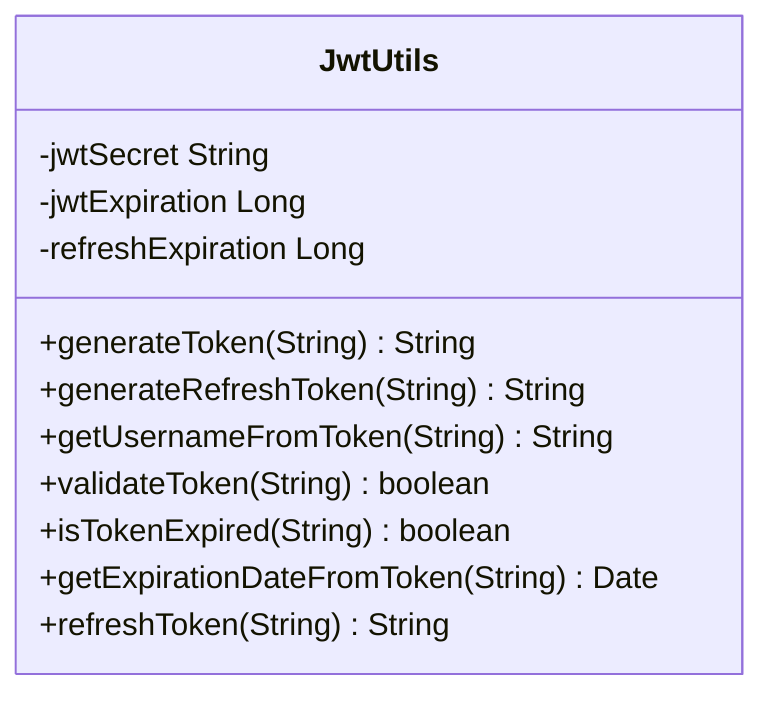
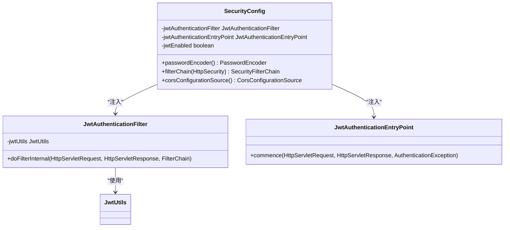
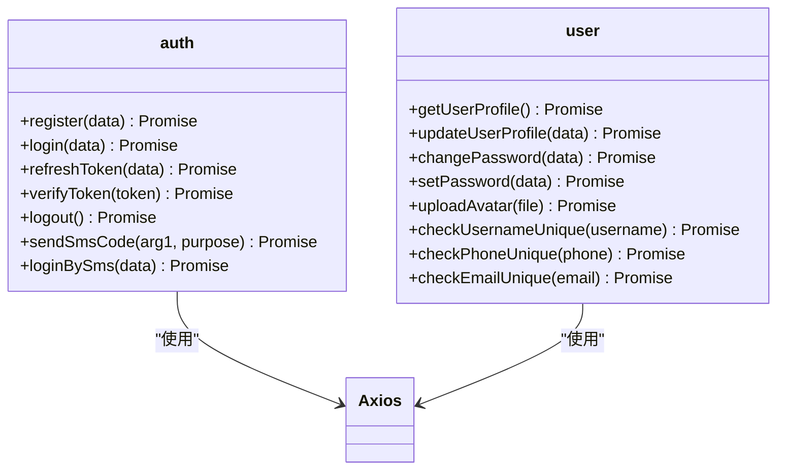
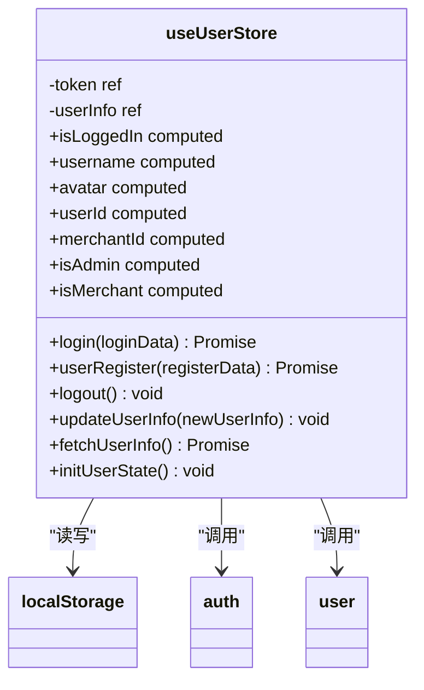
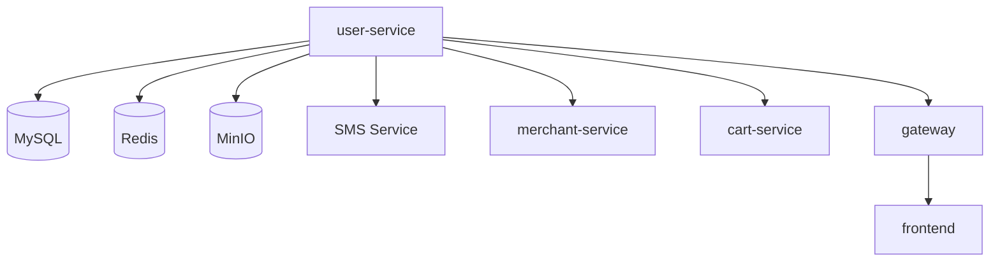

# 用户系统

<cite>
**本文档引用文件**   
- [AuthController.java](file://backend/user-service/src/main/java/com/mall/user/controller/AuthController.java)
- [UserController.java](file://backend/user-service/src/main/java/com/mall/user/controller/UserController.java)
- [AuthService.java](file://backend/user-service/src/main/java/com/mall/user/service/AuthService.java)
- [UserService.java](file://backend/user-service/src/main/java/com/mall/user/service/UserService.java)
- [JwtUtils.java](file://backend/user-service/src/main/java/com/mall/user/utils/JwtUtils.java)
- [SecurityConfig.java](file://backend/user-service/src/main/java/com/mall/user/config/SecurityConfig.java)
- [auth.js](file://frontend/src/api/auth.js)
- [user.js](file://frontend/src/api/user.js)
- [user.js](file://frontend/src/stores/user.js)
</cite>

## 目录
1. [简介](#简介)
2. [项目结构](#项目结构)
3. [核心组件](#核心组件)
4. [架构概述](#架构概述)
5. [详细组件分析](#详细组件分析)
6. [依赖分析](#依赖分析)
7. [性能考虑](#性能考虑)
8. [故障排除指南](#故障排除指南)
9. [结论](#结论)

## 简介
本系统为基于Spring Cloud的微服务电商平台中的用户管理模块，涵盖用户注册、登录、个人信息管理、密码修改、安全设置等核心功能。系统采用JWT与Spring Security实现认证授权机制，通过RESTful API提供服务，并由前端Vue3 + Pinia实现状态管理。后端服务部署于独立的user-service模块中，通过网关对外暴露接口，支持手机号验证码登录、密码登录、Token刷新与验证等功能。

## 项目结构
用户系统主要由后端`user-service`和前端`frontend`两部分构成，通过API进行交互。后端采用Spring Boot + MyBatis Plus + JWT + Spring Security技术栈，前端采用Vue3 + Vite + Pinia + Axios架构。

**图示来源**
- [AuthController.java](file://backend/user-service/src/main/java/com/mall/user/controller/AuthController.java)
- [UserController.java](file://backend/user-service/src/main/java/com/mall/user/controller/UserController.java)
- [AuthService.java](file://backend/user-service/src/main/java/com/mall/user/service/AuthService.java)
- [UserService.java](file://backend/user-service/src/main/java/com/mall/user/service/UserService.java)
- [JwtUtils.java](file://backend/user-service/src/main/java/com/mall/user/utils/JwtUtils.java)
- [SecurityConfig.java](file://backend/user-service/src/main/java/com/mall/user/config/SecurityConfig.java)

**本节来源**
- [backend/user-service](file://backend/user-service)
- [frontend](file://frontend)

## 核心组件
用户系统的核心组件包括认证控制器（AuthController）、用户控制器（UserController）、认证服务（AuthService）、用户服务（UserService）、JWT工具类（JwtUtils）以及安全配置（SecurityConfig）。前端通过auth.js和user.js封装API调用，由Pinia的user.js管理用户状态。

**本节来源**
- [AuthController.java](file://backend/user-service/src/main/java/com/mall/user/controller/AuthController.java#L1-L208)
- [UserController.java](file://backend/user-service/src/main/java/com/mall/user/controller/UserController.java#L1-L800)
- [AuthService.java](file://backend/user-service/src/main/java/com/mall/user/service/AuthService.java#L1-L67)
- [UserService.java](file://backend/user-service/src/main/java/com/mall/user/service/UserService.java#L1-L144)

## 架构概述
系统采用前后端分离架构，前端通过Axios调用网关暴露的/user和/auth接口，后端通过Spring Security结合JWT实现无状态认证。用户登录后，服务端生成JWT Token并返回，前端存储于Pinia及localStorage中，后续请求携带Token完成身份验证。

**图示来源**
- [AuthController.java](file://backend/user-service/src/main/java/com/mall/user/controller/AuthController.java#L64-L69)
- [UserController.java](file://backend/user-service/src/main/java/com/mall/user/controller/UserController.java#L189-L261)
- [auth.js](file://frontend/src/api/auth.js#L20-L26)
- [user.js](file://frontend/src/api/user.js#L14-L18)
- [user.js](file://frontend/src/stores/user.js#L41-L93)

## 详细组件分析

### 认证流程实现

#### 认证控制器与服务
认证功能由`AuthController`和`AuthService`协同完成，支持密码登录、短信登录、注册、登出、Token刷新与验证。

**图示来源**
- [AuthController.java](file://backend/user-service/src/main/java/com/mall/user/controller/AuthController.java#L30-L208)
- [AuthService.java](file://backend/user-service/src/main/java/com/mall/user/service/AuthService.java#L14-L67)
- [AuthServiceImpl.java](file://backend/user-service/src/main/java/com/mall/user/service/impl/AuthServiceImpl.java)

**本节来源**
- [AuthController.java](file://backend/user-service/src/main/java/com/mall/user/controller/AuthController.java#L30-L208)
- [AuthService.java](file://backend/user-service/src/main/java/com/mall/user/service/AuthService.java#L14-L67)

### JWT与Spring Security实现机制

#### JWT工具类
`JwtUtils`负责Token的生成、解析、验证与刷新，使用HS512算法签名，支持访问Token和刷新Token两种类型。

**图示来源**
- [JwtUtils.java](file://backend/user-service/src/main/java/com/mall/user/utils/JwtUtils.java#L21-L174)

#### 安全配置
`SecurityConfig`配置了Spring Security的安全策略，包括JWT过滤器、异常处理入口、CORS配置等，支持通过`security.jwt.enabled`开关控制是否启用JWT认证。

**图示来源**
- [SecurityConfig.java](file://backend/user-service/src/main/java/com/mall/user/config/SecurityConfig.java#L36-L159)
- [JwtAuthenticationFilter.java](file://backend/user-service/src/main/java/com/mall/user/security/JwtAuthenticationFilter.java)
- [JwtAuthenticationEntryPoint.java](file://backend/user-service/src/main/java/com/mall/user/security/JwtAuthenticationEntryPoint.java)

**本节来源**
- [JwtUtils.java](file://backend/user-service/src/main/java/com/mall/user/utils/JwtUtils.java#L21-L174)
- [SecurityConfig.java](file://backend/user-service/src/main/java/com/mall/user/config/SecurityConfig.java#L36-L159)

### 前端API调用与状态管理

#### 前端API封装
前端通过`auth.js`和`user.js`封装对后端API的调用，使用Axios发送HTTP请求，统一处理请求地址和方法。

**图示来源**
- [auth.js](file://frontend/src/api/auth.js#L1-L100)
- [user.js](file://frontend/src/api/user.js#L1-L177)

#### Pinia状态管理
`user.js`中的Pinia store管理用户登录状态、Token、用户信息等，并实现与后端会话状态的同步。

**图示来源**
- [user.js](file://frontend/src/stores/user.js#L15-L259)

**本节来源**
- [auth.js](file://frontend/src/api/auth.js#L1-L100)
- [user.js](file://frontend/src/api/user.js#L1-L177)
- [user.js](file://frontend/src/stores/user.js#L15-L259)

## 依赖分析
用户系统依赖于多个内部和外部组件，包括数据库（MySQL）、对象存储（MinIO）、消息队列（RabbitMQ）、缓存（Redis）以及短信服务（SMS Service）。通过Feign客户端与其他微服务（如merchant-service、cart-service）进行通信。

**图示来源**
- [pom.xml](file://backend/user-service/pom.xml)
- [application.yml](file://backend/user-service/src/main/resources/application.yml)

**本节来源**
- [pom.xml](file://backend/user-service/pom.xml)
- [application.yml](file://backend/user-service/src/main/resources/application.yml)

## 性能考虑
系统在设计时考虑了性能优化，包括使用Redis缓存用户信息、Token黑名单、短信验证码等，减少数据库查询压力。JWT的无状态特性也减轻了服务器会话管理的负担。前端通过Pinia缓存用户信息，避免频繁调用/profile接口。

## 故障排除指南
### Token过期处理
当Token过期时，前端应捕获401错误，尝试使用刷新Token获取新Token，若刷新失败则跳转至登录页。

### 登录失败重试限制
系统可通过Redis实现登录失败次数限制，同一IP或用户名在短时间内多次失败将触发锁定机制，防止暴力破解。

### 常见问题
- **注册提示用户名已存在**：调用`/users/check-username`接口预先检查。
- **无法上传头像**：确认MinIO服务正常运行，bucket存在且权限正确。
- **短信验证码收不到**：检查SMS服务日志，确认手机号格式正确且未在黑名单中。

**本节来源**
- [AuthController.java](file://backend/user-service/src/main/java/com/mall/user/controller/AuthController.java#L114-L129)
- [UserController.java](file://backend/user-service/src/main/java/com/mall/user/controller/UserController.java#L626-L692)
- [JwtUtils.java](file://backend/user-service/src/main/java/com/mall/user/utils/JwtUtils.java#L91-L98)

## 结论
本用户系统实现了完整的用户生命周期管理，基于JWT和Spring Security构建了安全可靠的认证授权机制。前后端分离架构清晰，API设计规范，状态管理高效。系统具备良好的扩展性和可维护性，为电商平台提供了坚实的用户基础服务。