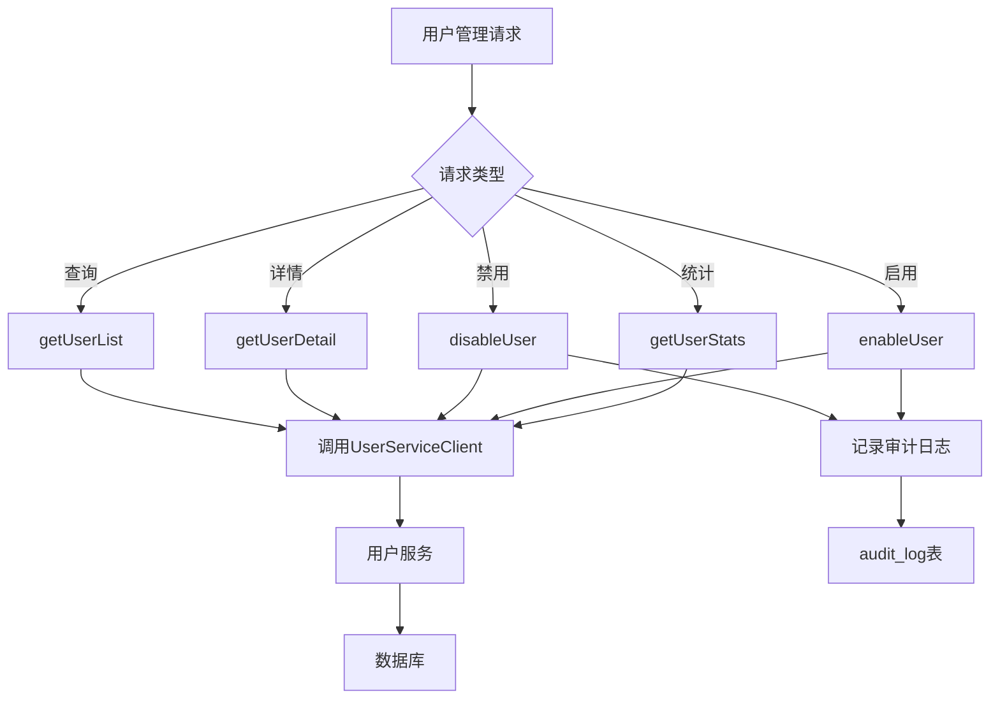
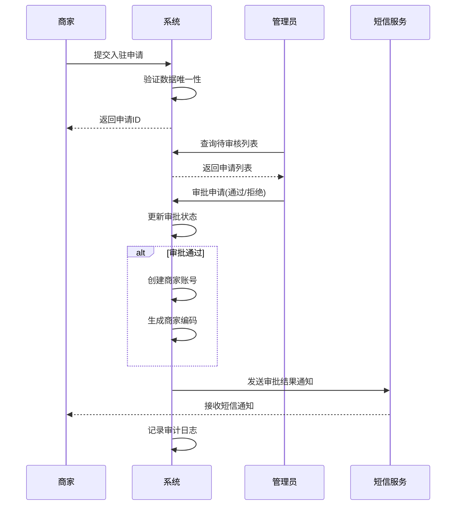
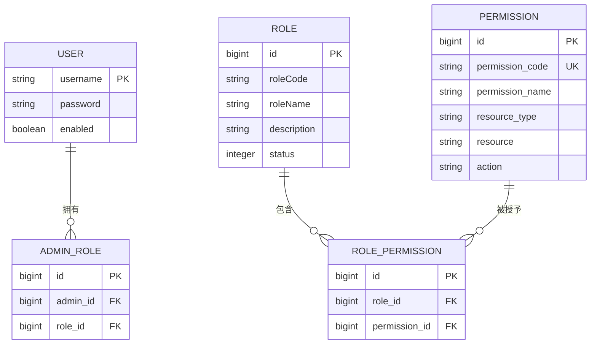
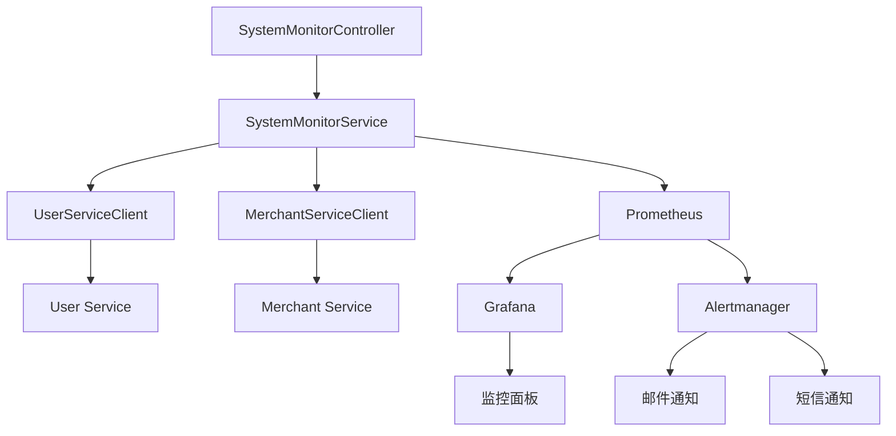

# 管理系统

<cite>
**本文档引用文件**  
- [UserManagementController.java](file://backend/admin-service/src/main/java/com/mall/admin/controller/UserManagementController.java)
- [UserManagementServiceImpl.java](file://backend/admin-service/src/main/java/com/mall/admin/service/impl/UserManagementServiceImpl.java)
- [MerchantApprovalController.java](file://backend/admin-service/src/main/java/com/mall/admin/controller/MerchantApprovalController.java)
- [MerchantApplicationServiceImpl.java](file://backend/merchant-service/src/main/java/com/mall/merchant/service/impl/MerchantApplicationServiceImpl.java)
- [SystemMonitorController.java](file://backend/admin-service/src/main/java/com/mall/admin/controller/SystemMonitorController.java)
- [SystemMonitorServiceImpl.java](file://backend/admin-service/src/main/java/com/mall/admin/service/impl/SystemMonitorServiceImpl.java)
- [schema.sql](file://backend/admin-service/src/main/resources/sql/schema.sql)
- [商家审核系统-完整实现报告.md](file://商家审核系统-完整实现报告.md)
- [商家审核系统-README.md](file://商家审核系统-README.md)
- [商家审核系统-交付总结.md](file://商家审核系统-交付总结.md)
- [系统实现报告.md](file://系统实现报告.md)
- [prometheus.yml](file://config/prometheus.yml)
- [nacos-schema.sql](file://sql/nacos-schema.sql)
- [在线商城需求说明.md](file://在线商城需求说明.md)
</cite>

## 目录
1. [简介](#简介)
2. [用户管理功能](#用户管理功能)
3. [商家审核流程](#商家审核流程)
4. [权限控制机制](#权限控制机制)
5. [系统监控接口](#系统监控接口)
6. [管理员后台界面](#管理员后台界面)
7. [权限配置最佳实践](#权限配置最佳实践)
8. [结论](#结论)

## 简介

本系统是一个基于Spring Cloud微服务架构的综合电商平台管理系统，涵盖用户管理、商家审核、权限控制和系统监控等核心功能。系统采用RBAC（基于角色的访问控制）模型实现精细化权限管理，通过分布式架构确保高可用性和可扩展性。管理员可通过后台界面完成用户状态变更、角色分配、商家入驻审批等关键操作，并实时监控系统健康状况。

系统包含多个微服务模块，其中`admin-service`负责提供管理后台的API接口，`merchant-service`处理商家相关业务逻辑，`user-service`管理用户数据，各服务通过Feign客户端进行通信。前端采用Vue框架构建响应式管理界面，支持分页查询、条件筛选和批量操作等功能。

**本文档引用文件**  
- [UserManagementController.java](file://backend/admin-service/src/main/java/com/mall/admin/controller/UserManagementController.java)
- [商家审核系统-README.md](file://商家审核系统-README.md)
- [系统实现报告.md](file://系统实现报告.md)

## 用户管理功能

用户管理功能由`UserManagementController`和`UserManagementServiceImpl`实现，提供用户查询、状态变更和角色分配等核心操作。控制器通过RESTful API暴露接口，服务层调用`UserServiceClient`与用户服务进行通信，实现跨服务的数据访问。

用户查询接口支持分页、关键词搜索和状态筛选，返回包含用户基本信息的分页结果。状态变更操作包括启用和禁用用户，执行时会记录详细的审计日志，包括操作管理员ID、操作类型、资源ID和操作结果。角色分配功能通过`AssignRolesRequest` DTO接收角色ID列表，实现用户与角色的多对多关联。

系统采用RBAC权限模型，用户权限由其所属角色决定，角色与权限的映射关系存储在数据库中。所有敏感操作均需经过权限验证，并在审计日志中完整记录，确保操作的可追溯性。

**图示来源**  
- [UserManagementController.java](file://backend/admin-service/src/main/java/com/mall/admin/controller/UserManagementController.java#L30-L77)
- [UserManagementServiceImpl.java](file://backend/admin-service/src/main/java/com/mall/admin/service/impl/UserManagementServiceImpl.java#L32-L85)

**本节来源**  
- [UserManagementController.java](file://backend/admin-service/src/main/java/com/mall/admin/controller/UserManagementController.java#L1-L78)
- [UserManagementServiceImpl.java](file://backend/admin-service/src/main/java/com/mall/admin/service/impl/UserManagementServiceImpl.java#L1-L103)

## 商家审核流程

商家审核流程是系统的核心业务之一，涵盖商家提交申请、管理员审核和审批后处理三个阶段。该流程确保了商家入驻的合规性和安全性，同时提供了良好的用户体验和管理效率。

在商家提交申请阶段，系统会对用户名、手机号和店铺名称进行唯一性验证，仅检查待审批和已通过的申请记录，允许被拒绝的申请重新提交。申请信息包括主体类型（企业、个体工商户或个人）、店铺信息、联系人信息和证件照片等。

管理员审核阶段提供完整的审批工作流，支持通过和拒绝两种操作。审批通过时，系统自动创建商家账号，生成唯一的商家编码，并发送短信通知；审批拒绝时，需填写拒绝原因，系统同样发送通知。所有审批操作均记录详细的审计日志，包括操作人、操作时间、IP地址和操作结果。

**图示来源**  
- [MerchantApprovalController.java](file://backend/admin-service/src/main/java/com/mall/admin/controller/MerchantApprovalController.java#L33-L132)
- [MerchantApplicationServiceImpl.java](file://backend/merchant-service/src/main/java/com/mall/merchant/service/impl/MerchantApplicationServiceImpl.java#L138-L165)

**本节来源**  
- [商家审核系统-完整实现报告.md](file://商家审核系统-完整实现报告.md#L461-L517)
- [商家审核系统-交付总结.md](file://商家审核系统-交付总结.md#L186-L196)
- [MerchantApplicationServiceImpl.java](file://backend/merchant-service/src/main/java/com/mall/merchant/service/impl/MerchantApplicationServiceImpl.java#L1-L386)

## 权限控制机制

系统采用RBAC（基于角色的访问控制）权限模型，通过角色、用户和权限的三元关系实现精细化的权限管理。权限控制机制确保了系统的安全性和数据隔离，不同角色的管理员只能访问其权限范围内的资源。

权限体系由三个核心表构成：`permission`（权限表）、`role`（角色表）和`role_permission`（角色权限关联表）。权限表定义了具体的权限项，包括权限编码、名称、资源类型、资源标识和操作类型；角色表定义了角色的基本信息；角色权限关联表建立了角色与权限的多对多关系。

系统在`nacos-schema.sql`中定义了默认的管理员用户和角色，通过BCrypt算法对密码进行加密存储。所有敏感操作均需经过权限验证，关键操作（如用户状态变更、商家审核）必须记录审计日志，包含操作者、时间、来源和原因等信息。

**图示来源**  
- [schema.sql](file://backend/admin-service/src/main/resources/sql/schema.sql#L42-L69)
- [nacos-schema.sql](file://sql/nacos-schema.sql#L177-L187)

**本节来源**  
- [在线商城需求说明.md](file://在线商城需求说明.md#L25-L39)
- [schema.sql](file://backend/admin-service/src/main/resources/sql/schema.sql#L42-L69)

## 系统监控接口

系统监控接口由`SystemMonitorController`和`SystemMonitorServiceImpl`实现，提供系统概览统计和服务健康状态两大核心功能。这些接口为管理员提供了系统的全局视图，帮助及时发现和解决潜在问题。

系统概览统计功能通过聚合多个微服务的数据，展示用户和商家的总体情况。服务健康状态功能则通过调用各微服务的健康检查端点，实时监控服务的可用性。监控数据通过Prometheus进行收集和存储，Grafana进行可视化展示，Alertmanager实现告警管理。

系统监控接口不仅关注应用层指标，还覆盖基础设施监控，包括CPU使用率、内存使用率、磁盘使用率等系统资源指标，以及数据库连接、Redis缓存等关键组件的健康状况。当监控指标超过预设阈值时，系统会通过邮件和短信等多种渠道发送告警通知。

**图示来源**  
- [SystemMonitorController.java](file://backend/admin-service/src/main/java/com/mall/admin/controller/SystemMonitorController.java#L1-L44)
- [SystemMonitorServiceImpl.java](file://backend/admin-service/src/main/java/com/mall/admin/service/impl/SystemMonitorServiceImpl.java#L1-L96)

**本节来源**  
- [SystemMonitorController.java](file://backend/admin-service/src/main/java/com/mall/admin/controller/SystemMonitorController.java#L1-L45)
- [SystemMonitorServiceImpl.java](file://backend/admin-service/src/main/java/com/mall/admin/service/impl/SystemMonitorServiceImpl.java#L1-L96)
- [系统实现报告.md](file://系统实现报告.md#L692-L743)

## 管理员后台界面

管理员后台界面采用Vue框架构建，提供现代化的用户界面和流畅的操作体验。界面支持响应式布局，可在桌面和移动设备上正常使用，确保管理员随时随地都能高效完成管理工作。

用户和商家管理界面均支持分页查询、条件筛选和批量操作。分页查询采用标准的分页控件，每页默认显示10-20条记录，支持自定义页大小。条件筛选提供关键词搜索、状态筛选、日期范围筛选等多种方式，帮助管理员快速定位目标数据。

批量操作功能允许管理员对多个用户或商家执行统一操作，如批量启用/禁用、批量分配角色等，显著提高了管理效率。界面还提供详细的详情查看功能，支持查看用户和商家的完整信息，包括基本信息、联系信息和操作历史等。

**本节来源**  
- [frontend/src/views/admin/users/index.vue](file://frontend/src/views/admin/users/index.vue)
- [frontend/src/views/admin/merchants/index.vue](file://frontend/src/views/admin/merchants/index.vue)

## 权限配置最佳实践

权限配置应遵循最小权限原则，即角色仅授予完成其职责所必需的资源访问权限。这有助于降低安全风险，防止权限滥用。在定义角色时，应根据实际业务需求进行细分，如系统管理员、风控管理员、运营管理员等，每个角色拥有明确的权限边界。

权限分配应通过专门的权限管理界面完成，支持批量分配和撤销。系统应提供权限预览功能，让管理员在分配前清楚了解角色将拥有的具体权限。所有权限变更操作必须记录审计日志，包括操作者、时间、变更内容和原因，确保操作的可追溯性。

审计日志应包含足够的信息以支持事后追溯，包括操作类型、资源类型、资源ID、操作描述、操作结果和客户端IP地址等。日志数据应定期归档和备份，确保在需要时能够快速检索。对于关键操作，系统应实施二次确认机制，防止误操作。

**本节来源**  
- [在线商城需求说明.md](file://在线商城需求说明.md#L36-L39)
- [UserManagementServiceImpl.java](file://backend/admin-service/src/main/java/com/mall/admin/service/impl/UserManagementServiceImpl.java#L87-L102)

## 结论

本系统通过完善的用户管理、商家审核、权限控制和系统监控功能，构建了一个安全、高效、易用的电商管理平台。RBAC权限模型的引入实现了精细化的访问控制，确保了系统的安全性和数据隔离。商家审核流程的自动化和标准化显著提高了管理效率，同时保证了商家入驻的合规性。

系统监控体系的建立为平台的稳定运行提供了有力保障，通过实时监控和告警机制，能够及时发现和解决潜在问题。管理员后台界面的现代化设计和丰富的功能，为管理员提供了良好的操作体验。

未来可进一步优化的方向包括：增强权限配置的灵活性，支持更细粒度的权限控制；完善审计日志分析功能，提供操作行为分析和异常检测；优化系统监控告警策略，减少误报和漏报。