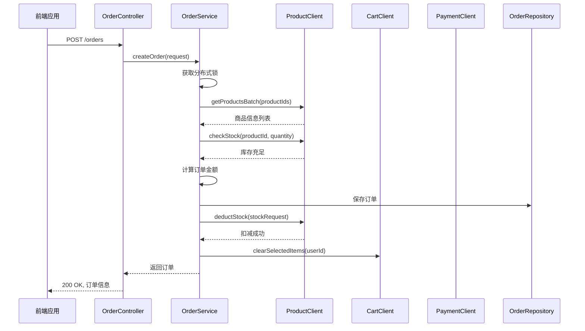
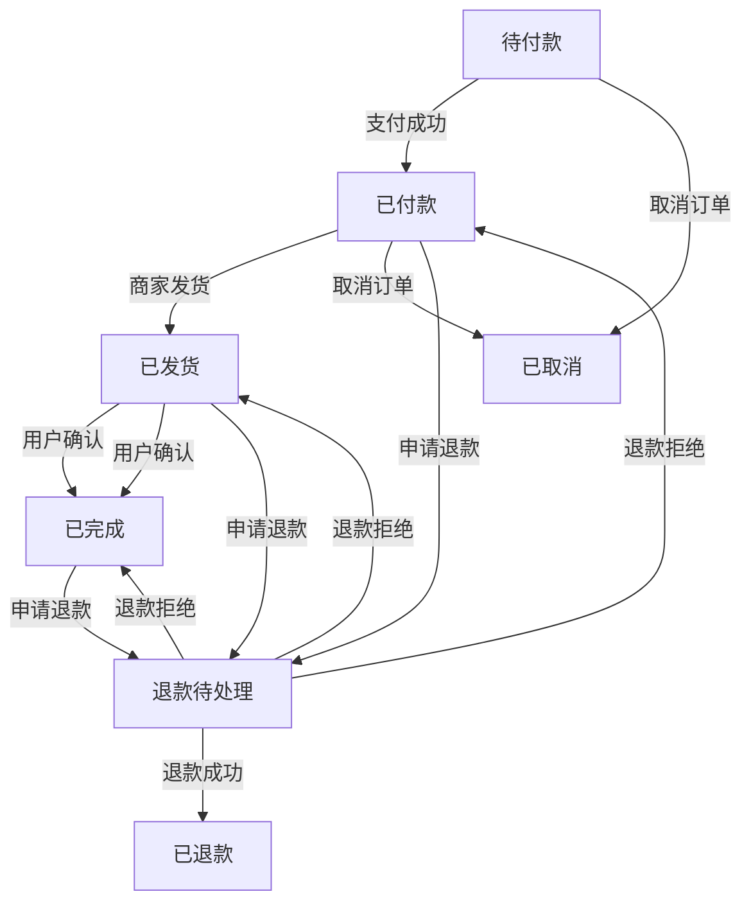
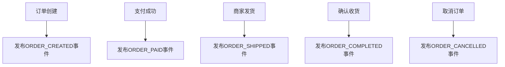
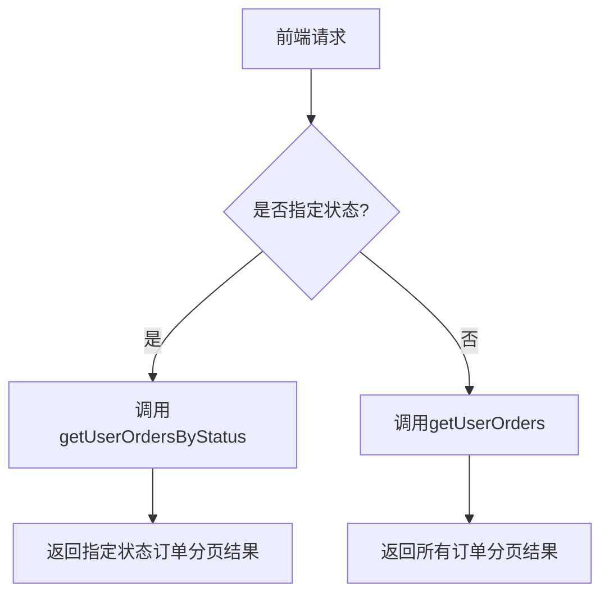
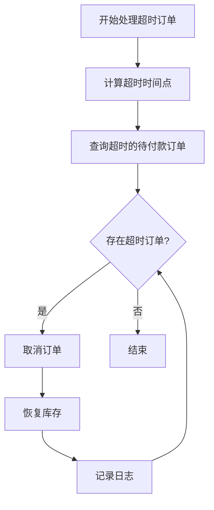

# 订单系统

<cite>
**本文档引用文件**  
- [OrderController.java](file://backend/order-service/src/main/java/com/mall/order/controller/OrderController.java)
- [OrderServiceImpl.java](file://backend/order-service/src/main/java/com/mall/order/service/impl/OrderServiceImpl.java)
- [OrderService.java](file://backend/order-service/src/main/java/com/mall/order/service/OrderService.java)
- [OrderStatus.java](file://backend/order-service/src/main/java/com/mall/order/enums/OrderStatus.java)
- [OrderEvent.java](file://backend/order-service/src/main/java/com/mall/order/event/OrderEvent.java)
- [OrderEventPublisher.java](file://backend/order-service/src/main/java/com/mall/order/event/OrderEventPublisher.java)
- [OrderTask.java](file://backend/order-service/src/main/java/com/mall/order/task/OrderTask.java)
- [order.js](file://frontend/src/api/order.js)
- [detail.vue](file://frontend/src/views/order/detail.vue)
</cite>

## 目录
1. [引言](#引言)
2. [下单流程](#下单流程)
3. [订单状态机](#订单状态机)
4. [订单查询](#订单查询)
5. [超时关闭机制](#超时关闭机制)
6. [前端订单详情页](#前端订单详情页)
7. [异常处理方案](#异常处理方案)
8. [结论](#结论)

## 引言

订单系统是电商平台的核心模块，负责管理用户从下单到完成的完整生命周期。本系统采用微服务架构，订单服务（order-service）通过Feign调用购物车、商品、支付等服务，使用Seata实现分布式事务一致性，并通过RabbitMQ进行事件驱动通信。系统支持订单创建、支付、发货、确认收货、退款等完整流程，并提供超时自动取消和自动确认收货功能。

**本文档引用文件**  
- [OrderController.java](file://backend/order-service/src/main/java/com/mall/order/controller/OrderController.java)
- [OrderServiceImpl.java](file://backend/order-service/src/main/java/com/mall/order/service/impl/OrderServiceImpl.java)

## 下单流程

下单流程由`OrderController`的`createOrder`接口驱动，协调购物车、库存、支付等多个服务完成订单创建，采用分布式事务保证数据一致性。

### 创建订单接口

`OrderController.createOrder`接收`CreateOrderRequest`请求，调用`OrderService.createOrder`方法创建订单。该接口使用`@Valid`进行参数校验，确保请求数据的合法性。



**图示来源**  
- [OrderController.java](file://backend/order-service/src/main/java/com/mall/order/controller/OrderController.java#L98-L104)
- [OrderServiceImpl.java](file://backend/order-service/src/main/java/com/mall/order/service/impl/OrderServiceImpl.java#L75-L210)

### 分布式事务处理

系统使用Seata实现分布式事务，确保订单创建过程中库存扣减、购物车清空等操作的原子性。在`OrderServiceImpl.doCreateOrder`方法中，通过`@Transactional(rollbackFor = Exception.class)`注解开启本地事务，并结合分布式锁防止重复提交。

订单创建流程如下：
1. 验证订单项不为空
2. 批量获取商品信息并验证存在性
3. 逐项检查库存是否充足
4. 创建订单实体并计算总金额
5. 保存订单到数据库
6. 扣减商品库存
7. 清空购物车中已下单商品
8. 发布订单创建事件

若任一环节失败，事务将回滚，确保数据一致性。

**本节来源**  
- [OrderServiceImpl.java](file://backend/order-service/src/main/java/com/mall/order/service/impl/OrderServiceImpl.java#L75-L210)

## 订单状态机

订单状态机定义了订单在其生命周期中的各种状态及转换规则，通过事件驱动模型实现状态变更。

### 订单状态定义

`OrderStatus`枚举类定义了订单的七种状态：

```java
public enum OrderStatus {
    PENDING("pending", "待付款"),
    PAID("paid", "已付款"),
    SHIPPED("shipped", "已发货"),
    COMPLETED("completed", "已完成"),
    CANCELLED("cancelled", "已取消"),
    REFUND_PENDING("refund_pending", "退款待处理"),
    REFUNDED("refunded", "已退款");
}
```

每种状态包含状态码和描述信息，并提供`canCancel()`、`canRefund()`、`canConfirm()`等方法判断是否可执行相应操作。

### 状态转换规则

订单状态转换遵循严格的业务规则：



状态转换通过调用`OrderService`的相应方法实现，如`payOrder`、`confirmOrder`、`applyRefund`等，每个方法内部会验证当前状态是否允许转换。

### 事件驱动模型

系统使用RabbitMQ实现事件驱动，`OrderEventPublisher`负责发布订单相关事件。当订单状态变更时，会发布对应的事件消息：



事件包含订单ID、订单号、用户ID、金额等信息，其他服务（如用户服务、统计服务）可以订阅这些事件进行后续处理。

**图示来源**  
- [OrderStatus.java](file://backend/order-service/src/main/java/com/mall/order/enums/OrderStatus.java#L11-L56)
- [OrderEvent.java](file://backend/order-service/src/main/java/com/mall/order/event/OrderEvent.java#L66-L137)
- [OrderEventPublisher.java](file://backend/order-service/src/main/java/com/mall/order/event/OrderEventPublisher.java#L32-L62)

## 订单查询

系统提供灵活的订单查询功能，支持分页查询、按状态筛选和统计信息获取。

### 用户订单列表

`OrderController.getOrders`接口支持按用户ID、订单状态进行分页查询。未指定状态时返回所有订单，指定状态时返回对应状态的订单列表。



后端使用Spring Data JPA的`Pageable`接口实现分页，返回包含内容、总记录数、总页数等信息的分页结果。

### 订单详情查询

`OrderController.getOrderById`接口根据订单ID和用户ID获取订单详情。该方法使用`@Cacheable`注解进行Redis缓存，缓存键为`orderId_userId`，提高查询性能。

### 订单统计信息

`OrderController.getOrderStats`接口获取用户的订单统计信息，包括各状态订单数量、总订单数和总消费金额。统计结果以Map形式返回，便于前端展示。

**本节来源**  
- [OrderController.java](file://backend/order-service/src/main/java/com/mall/order/controller/OrderController.java#L45-L74)
- [OrderServiceImpl.java](file://backend/order-service/src/main/java/com/mall/order/service/impl/OrderServiceImpl.java#L255-L267)

## 超时关闭机制

系统通过定时任务实现订单超时自动取消功能，防止用户下单后长时间不支付占用库存。

### 定时任务实现

`OrderTask`类使用`@Scheduled`注解定义定时任务，每5分钟执行一次超时订单处理：

```java
@Scheduled(fixedRate = 5 * 60 * 1000, initialDelay = 60 * 1000)
public void processTimeoutOrders() {
    // 处理超时订单
}
```

任务执行前会检查应用是否已完全启动，并使用分布式锁防止多实例重复执行。

### 超时处理逻辑

`OrderServiceImpl.handleTimeoutOrders`方法负责处理超时订单：

1. 计算超时时间点（当前时间减去配置的超时分钟数）
2. 查询状态为`PENDING`且创建时间早于超时时间点的订单
3. 遍历超时订单，逐个取消
4. 恢复对应商品的库存
5. 记录处理结果日志



超时时间通过配置项`order.timeout-minutes`控制，默认为30分钟。

**图示来源**  
- [OrderTask.java](file://backend/order-service/src/main/java/com/mall/order/task/OrderTask.java#L49-L79)
- [OrderServiceImpl.java](file://backend/order-service/src/main/java/com/mall/order/service/impl/OrderServiceImpl.java#L739-L788)

## 前端订单详情页

前端订单详情页提供完整的订单信息展示和操作功能，基于Vue3和Element Plus构建。

### 数据结构

订单详情页的数据结构包含以下主要字段：

| 字段 | 类型 | 描述 |
|------|------|------|
| id | Long | 订单ID |
| orderNo | String | 订单号 |
| status | Integer | 订单状态 |
| totalAmount | BigDecimal | 订单总金额 |
| createTime | LocalDateTime | 创建时间 |
| payTime | LocalDateTime | 支付时间 |
| shipTime | LocalDateTime | 发货时间 |
| receiverName | String | 收货人姓名 |
| receiverPhone | String | 收货人电话 |
| receiverAddress | String | 收货地址 |
| items | List<OrderItem> | 订单商品项列表 |

### 状态展示逻辑

页面根据订单状态展示不同的信息和操作按钮：

- **待付款**：显示支付倒计时，提供"立即支付"和"取消订单"按钮
- **已付款**：显示"申请退款"按钮
- **已发货**：显示物流信息和"确认收货"按钮
- **已完成**：显示"评价"按钮
- **已取消**：显示取消原因

状态展示通过`statusMap`对象进行映射，包含状态文本、描述、颜色和图标信息。

### 操作按钮控制

操作按钮的显示通过计算属性控制：

```javascript
const canCancel = (status) => status === 1 || status === 2
const canPay = (status) => status === 1
const canConfirm = (status) => status === 3
const canRefund = (status) => status === 2 || status === 3 || status === 4
```

**本节来源**  
- [detail.vue](file://frontend/src/views/order/detail.vue#L313-L322)
- [order.js](file://frontend/src/api/order.js#L11-L110)

## 异常处理方案

系统针对常见订单异常情况提供了完善的处理方案。

### 库存不足处理

在创建订单时，系统会先调用商品服务的`checkStock`接口验证库存。若库存不足，抛出`InsufficientStockException`异常，前端提示用户"商品库存不足"。

### 重复提交处理

通过分布式锁防止用户重复提交订单。在`OrderServiceImpl.createOrder`方法中，使用`distributedLockService.getOrderCreateLock`获取用户级别的锁，确保同一用户不能同时创建多个订单。

### 支付结果不一致处理

支付结果不一致可能由网络问题导致。系统通过以下机制处理：
1. 支付回调接口`handlePaymentSuccess`使用分布式锁防止重复处理
2. 更新订单状态前验证当前状态是否为"待付款"
3. 若状态已变更，直接返回成功，避免重复处理

### 事务回滚处理

当分布式事务中任一服务调用失败时，Seata会自动回滚所有已执行的操作。同时，系统在`OrderServiceImpl`中捕获异常并记录日志，便于问题排查。

**本节来源**  
- [OrderServiceImpl.java](file://backend/order-service/src/main/java/com/mall/order/service/impl/OrderServiceImpl.java#L119-L120)
- [OrderServiceImpl.java](file://backend/order-service/src/main/java/com/mall/order/service/impl/OrderServiceImpl.java#L79-L85)
- [OrderServiceImpl.java](file://backend/order-service/src/main/java/com/mall/order/service/impl/OrderServiceImpl.java#L552-L560)

## 结论

订单系统通过微服务架构实现了高内聚、低耦合的设计，采用Seata保证分布式事务一致性，使用RabbitMQ实现事件驱动，通过定时任务处理超时订单。系统具备完整的订单生命周期管理能力，从前端展示到后端处理都提供了完善的实现方案和异常处理机制，能够稳定支撑电商平台的订单业务需求。