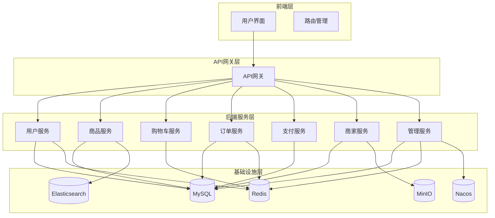
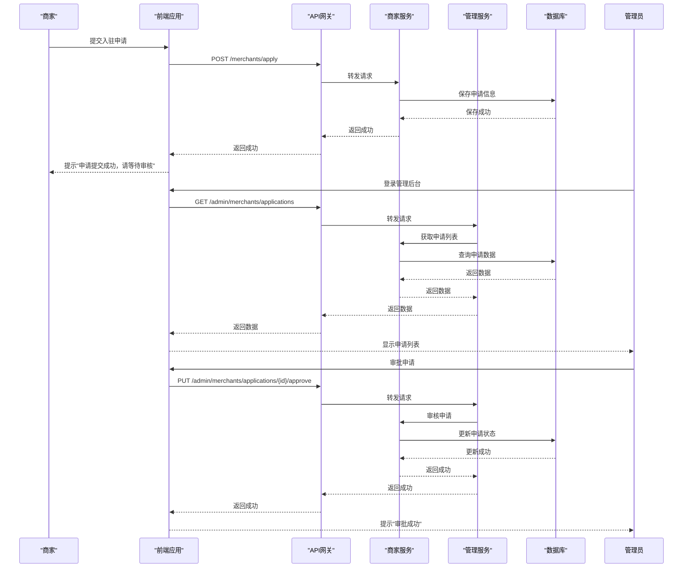

# 系统概述

<cite>
**本文档引用的文件**  
- [README.md](file://README.md)
- [技术栈设计.md](file://技术栈设计.md)
- [在线商城需求说明.md](file://在线商城需求说明.md)
- [系统实现报告.md](file://系统实现报告.md)
- [商家审核系统-README.md](file://商家审核系统-README.md)
- [数据字典.md](file://数据字典.md)
- [backend/admin-service/src/main/java/com/mall/admin/controller/MerchantApplicationController.java](file://backend/admin-service/src/main/java/com/mall/admin/controller/MerchantApplicationController.java)
- [backend/merchant-service/src/main/java/com/mall/merchant/controller/MerchantApplicationController.java](file://backend/merchant-service/src/main/java/com/mall/merchant/controller/MerchantApplicationController.java)
- [frontend/src/views/admin/merchants/applications.vue](file://frontend/src/views/admin/merchants/applications.vue)
- [frontend/src/api/merchant.js](file://frontend/src/api/merchant.js)
</cite>

## 目录
1. [系统架构与技术定位](#系统架构与技术定位)
2. [核心功能模块](#核心功能模块)
3. [用户角色与业务场景](#用户角色与业务场景)
4. [微服务架构与模块协作](#微服务架构与模块协作)
5. [前后端分离架构](#前后端分离架构)
6. [商家入驻审核流程](#商家入驻审核流程)
7. [系统上下文图](#系统上下文图)
8. [核心流程示意图](#核心流程示意图)

## 系统架构与技术定位

本系统是一个基于Spring Cloud Alibaba的智能化微服务架构在线商城系统，采用前后端分离的设计模式。项目集成了自动服务发现与启动功能，支持动态服务管理，大幅简化开发和部署流程。

### 技术栈说明

#### 前端技术栈
- **框架**: Vue 3 + Vite
- **UI 组件**: Element Plus
- **状态管理**: Pinia
- **路由**: Vue Router 4
- **HTTP 客户端**: Axios
- **工具库**: VueUse + Hutool

#### 后端技术栈
- **核心框架**: Java 22 + Spring Boot 3.x + Spring Cloud Alibaba
- **注册中心**: Nacos
- **配置中心**: Nacos Config
- **服务网关**: Spring Cloud Gateway
- **服务调用**: OpenFeign
- **熔断限流**: Sentinel
- **分布式事务**: Seata
- **消息队列**: RocketMQ
- **数据库**: MySQL 8.0
- **缓存**: Redis Cluster
- **搜索引擎**: Elasticsearch 8
- **对象存储**: MinIO
- **监控**: Prometheus + Grafana
- **文档**: Knife4j (Swagger3)

**Section sources**
- [README.md](file://README.md#L20-L38)
- [技术栈设计.md](file://技术栈设计.md#L14-L34)

## 核心功能模块

系统涵盖了电商平台的核心功能，包括商品、订单、支付、购物车、商家入驻审核等主要模块。

### 商品服务模块
- 商品分类管理：多级分类，启停与排序，商品绑定
- 商品信息管理：SPU/SKU、价格、上下架、媒体资源、属性标签
- 商品搜索服务：关键词、筛选与排序、联想与推荐、分页与缓存
- 评价管理系统：评价发布/审核/展示；与订单完成状态校验

### 订单服务模块
- 购物车管理：增减删清、SKU 合并与限购、结算勾选、跨设备同步
- 订单处理：下单校验（库存/价格/优惠/地址/运费）、状态流转、取消关闭、物流跟踪
- 售后服务：退换仅退款、申请与审核、凭证上传、与退款联动、进度通知

### 支付服务模块
- 支付集成：多渠道聚合、支付单生成与签名、回调处理
- 支付处理：二维码/跳转、成功失败取消回调、幂等与对账、风控校验
- 退款管理：申请/审核/执行、渠道回调与同步、异常重试与对账

### 商家用户模块
- 商家入驻与审核：主体类型（企业/个体）、联系人、资质与证照上传、银行账户信息
- 店铺管理：店铺信息、LOGO、简介、经营类目、展示模板与装修
- 商家商品与库存：商品发布、价格、主图与详情、上下架；库存维护
- 商家订单与售后：订单列表、发货处理、批量操作、售后协同
- 结算与账务：结算周期与费率、对账与结算单、提现申请与打款

**Section sources**
- [在线商城需求说明.md](file://在线商城需求说明.md#L54-L100)

## 用户角色与业务场景

系统设计了三种主要使用角色：用户端、商家端和管理端，满足不同用户的业务需求。

### 用户端
- 能力：购物车全功能、下单与支付、订单查询与取消、地址与资料维护、评价与追评、申请售后与退款、消息通知订阅
- 边界：仅操作本人订单与数据；敏感操作需二次确认与风控校验

### 商家端
- 能力：店铺信息配置、商品/SPU/SKU 发布与上下架、库存维护、订单发货与批量处理、售后协同与逆向物流、活动与优惠券、数据看板；成员管理与岗位权限；结算与提现申请
- 边界：仅可访问所属店铺数据；平台级配置不可变更；敏感动作触发审核与审计

### 管理端
- 能力：用户与角色管理、服务治理与监控、限流熔断与开关、商家入驻审核与违规处置、费率与结算规则配置、全局日志与审计、数据权限与脱敏策略
- 边界：变更需走审批或变更单；关键操作记录审计（含原因与工单）

**Section sources**
- [在线商城需求说明.md](file://在线商城需求说明.md#L20-L28)

## 微服务架构与模块协作

系统采用微服务架构，将业务功能拆分为多个独立的服务，通过服务间协作完成复杂的业务流程。

### 微服务划分
- gateway-service：网关服务
- auth-service：认证服务
- user-service：用户服务
- product-service：商品服务
- search-service：搜索服务
- cart-service：购物车服务
- order-service：订单服务
- inventory-service：库存服务
- payment-service：支付服务
- refund-service：退款服务
- merchant-service：商家服务
- settlement-service：结算服务
- withdrawal-service：提现服务
- cms-service：内容管理服务
- coupon-service：优惠券服务
- admin-service：管理服务
- notify-service：通知服务

### 服务间协作
- 下单：cart → order → inventory(占用) → payment(可选预创建) → settlement(事件)
- 发货：merchant → order(发货/物流) → notify → settlement
- 售后：order/refund ↔ payment ↔ settlement；inventory（逆向补库存）

**Section sources**
- [技术栈设计.md](file://技术栈设计.md#L50-L54)

## 前后端分离架构

系统采用前后端分离架构，前端与后端通过API接口进行通信，实现了关注点分离和独立开发部署。

### 前端架构
- 采用Vue 3 + Vite构建现代化前端应用
- 使用Element Plus作为UI组件库
- 通过Pinia进行状态管理
- 利用Vue Router实现路由管理
- 使用Axios进行HTTP请求

### 后端架构
- 基于Spring Boot 3.x构建微服务
- 使用Spring Cloud Alibaba提供微服务治理能力
- 通过Nacos实现服务注册发现和配置管理
- 利用Sentinel实现熔断限流
- 使用Seata处理分布式事务

**Section sources**
- [技术栈设计.md](file://技术栈设计.md#L56-L63)

## 商家入驻审核流程

商家入驻审核是系统的重要功能之一，确保了平台商家的合规性和安全性。

### 业务流程
```
商家提交申请 → 保存到数据库 → 管理员审核 → 通过后创建账号
```

### 审核功能
- 申请列表查询（分页、筛选、搜索）
- 实时统计数据
- 申请详情查看
- 证件图片预览（支持放大）
- 审批操作（通过/拒绝）
- 审核历史查询

### 技术实现
- 前端：`frontend/src/views/admin/merchants/applications.vue`
- 后端：`backend/admin-service/src/main/java/com/mall/admin/controller/MerchantApplicationController.java`
- API接口：`/admin/merchants/applications`

**Section sources**
- [商家审核系统-README.md](file://商家审核系统-README.md#L127-L129)
- [backend/admin-service/src/main/java/com/mall/admin/controller/MerchantApplicationController.java](file://backend/admin-service/src/main/java/com/mall/admin/controller/MerchantApplicationController.java#L24-L96)
- [frontend/src/views/admin/merchants/applications.vue](file://frontend/src/views/admin/merchants/applications.vue#L1-L800)

## 系统上下文图



**Diagram sources**
- [README.md](file://README.md#L50-L70)
- [系统实现报告.md](file://系统实现报告.md#L56-L71)

## 核心流程示意图



**Diagram sources**
- [商家审核系统-完整实现报告.md](file://商家审核系统-完整实现报告.md#L461-L517)
- [backend/merchant-service/src/main/java/com/mall/merchant/controller/MerchantApplicationController.java](file://backend/merchant-service/src/main/java/com/mall/merchant/controller/MerchantApplicationController.java#L37-L76)
- [frontend/src/api/merchant.js](file://frontend/src/api/merchant.js#L23-L28)