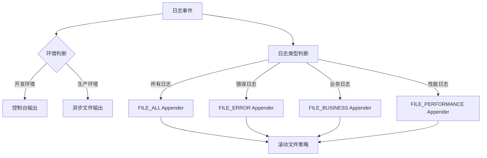
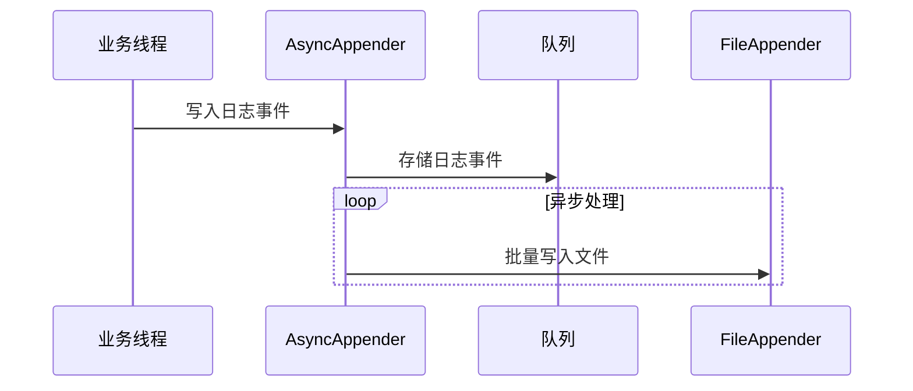
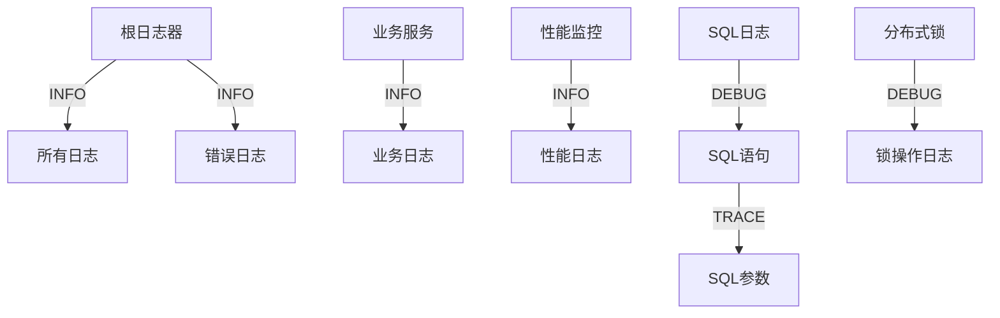
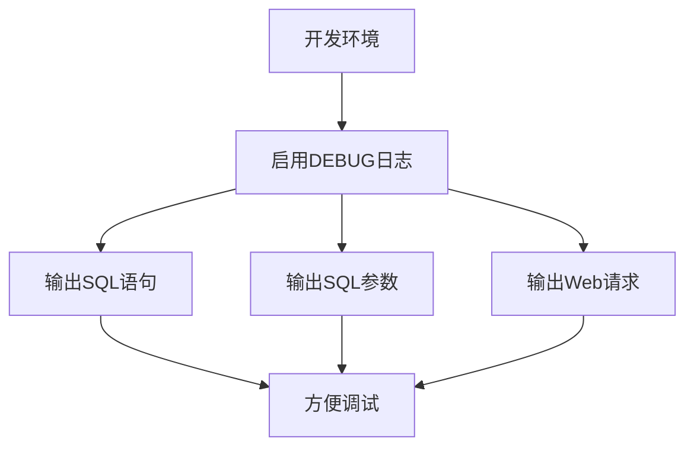
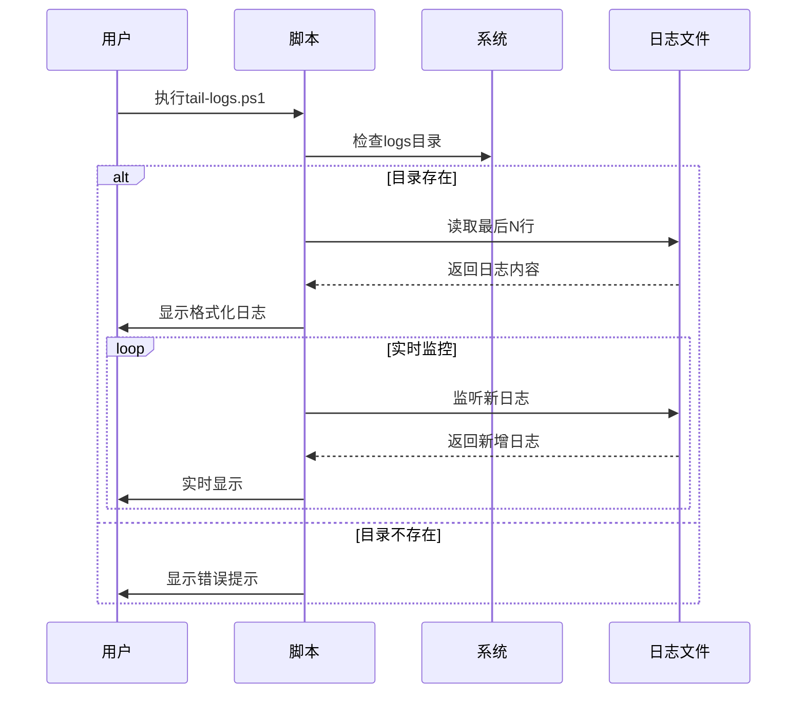
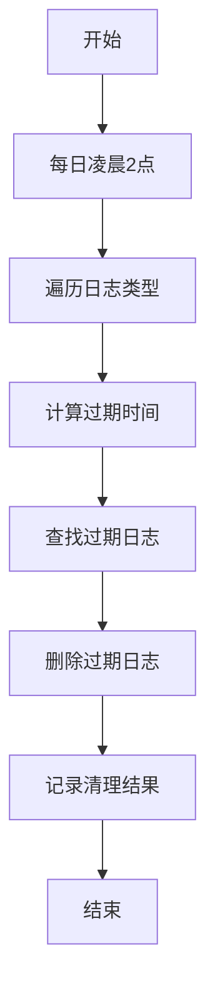
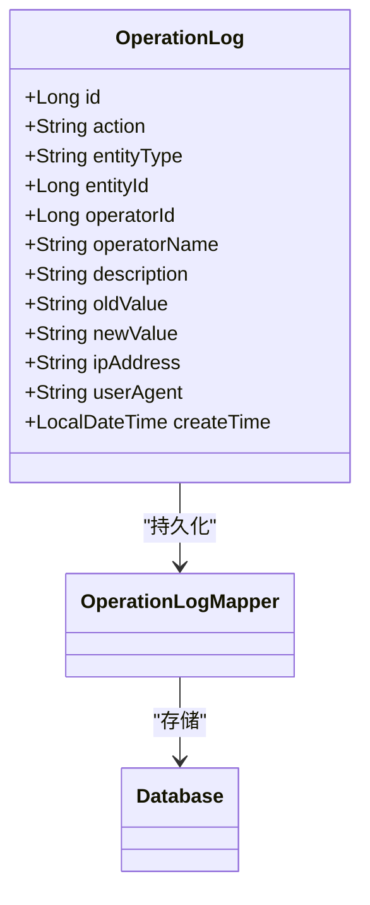
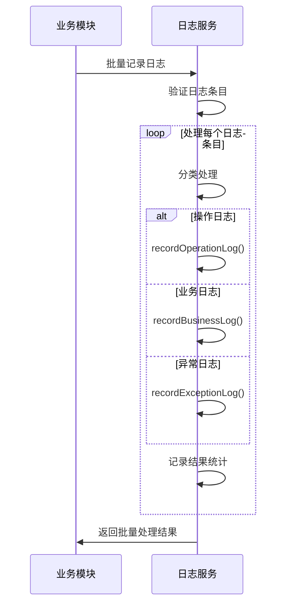

# 日志管理

<cite>
**本文档引用文件**   
- [logback-spring.xml](file://backend/order-service/src/main/resources/logback-spring.xml)
- [logback-spring.xml](file://backend/sms-service/src/main/resources/logback-spring.xml)
- [tail-logs.ps1](file://tail-logs.ps1)
- [logger.js](file://frontend/src/utils/logger.js)
- [AuditLogServiceImpl.java](file://backend/product-service/src/main/java/com/mall/product/service/impl/AuditLogServiceImpl.java)
</cite>

## 目录
1. [日志框架概述](#日志框架概述)
2. [Appender配置分析](#appender配置分析)
3. [日志级别与格式化](#日志级别与格式化)
4. [多环境日志策略](#多环境日志策略)
5. [日志查看与实时监控](#日志查看与实时监控)
6. [日志存储与归档](#日志存储与归档)
7. [日志分析最佳实践](#日志分析最佳实践)
8. [敏感信息处理](#敏感信息处理)
9. [性能优化建议](#性能优化建议)

## 日志框架概述

本系统采用Logback作为核心日志框架，结合Spring Boot的`logback-spring.xml`配置文件实现灵活的日志管理。系统在多个微服务中实现了统一的日志规范，包括订单服务、短信服务等，确保日志输出的一致性和可维护性。前端也实现了基于Winston风格的轻量级日志模块，提供debug、info、warn、error四种级别日志输出。

**Section sources**
- [logback-spring.xml](file://backend/order-service/src/main/resources/logback-spring.xml#L1-L178)
- [logger.js](file://frontend/src/utils/logger.js#L1-L82)

## Appender配置分析

系统配置了多种Appender以满足不同场景的日志输出需求。主要包含控制台输出、文件输出、错误日志专用输出和异步输出等。



**Diagram sources**
- [logback-spring.xml](file://backend/order-service/src/main/resources/logback-spring.xml#L16-L87)

### 控制台Appender

控制台Appender用于开发和调试阶段的实时日志查看，配置了统一的日志格式，包含时间戳、线程名、日志级别、日志器名称和消息内容。

**Section sources**
- [logback-spring.xml](file://backend/order-service/src/main/resources/logback-spring.xml#L17-L22)

### 文件Appender

文件Appender实现了日志的持久化存储，采用`RollingFileAppender`配合`SizeAndTimeBasedRollingPolicy`实现基于大小和时间的双重滚动策略。每个服务的日志文件按天分割，当日志文件达到100MB时也会触发滚动。

**Section sources**
- [logback-spring.xml](file://backend/order-service/src/main/resources/logback-spring.xml#L25-L37)

### 错误日志Appender

错误日志Appender通过`LevelFilter`过滤器专门捕获ERROR级别的日志，便于快速定位系统异常。该Appender独立于常规日志文件，确保错误信息不会被大量正常日志淹没。

**Section sources**
- [logback-spring.xml](file://backend/order-service/src/main/resources/logback-spring.xml#L40-L57)

### 异步Appender

在短信服务等高性能要求的模块中，采用了`AsyncAppender`实现异步日志输出，配置了1024的队列大小和0的丢弃阈值，确保日志记录不会阻塞业务线程，同时最大限度地减少日志丢失。



**Diagram sources**
- [logback-spring.xml](file://backend/sms-service/src/main/resources/logback-spring.xml#L52-L63)

## 日志级别与格式化

系统定义了统一的日志格式，采用`%d{yyyy-MM-dd HH:mm:ss.SSS} [%thread] %-5level [%logger{50}] - %msg%n`模式，确保日志信息完整且易于解析。

### 日志级别配置

不同组件配置了不同的日志级别，实现精细化的日志控制：



**Diagram sources**
- [logback-spring.xml](file://backend/order-service/src/main/resources/logback-spring.xml#L89-L157)

### 格式化模式

日志格式化模式包含以下关键元素：
- `%d{yyyy-MM-dd HH:mm:ss.SSS}`：精确到毫秒的时间戳
- `[%thread]`：生成日志的线程名称
- `%-5level`：左对齐的5字符日志级别（TRACE、DEBUG、INFO、WARN、ERROR）
- `[%logger{50}]`：最多50字符的日志器名称
- `%msg%n`：日志消息内容和换行符

**Section sources**
- [logback-spring.xml](file://backend/order-service/src/main/resources/logback-spring.xml#L19-L20)

## 多环境日志策略

系统通过Spring Profile实现了不同环境下的差异化日志策略，确保开发、测试和生产环境各有侧重。

### 开发环境

开发环境配置为DEBUG级别，启用详细的调试信息输出，包括Web请求、SQL语句和参数绑定等，便于开发人员快速定位问题。



**Diagram sources**
- [logback-spring.xml](file://backend/order-service/src/main/resources/logback-spring.xml#L160-L163)

### 生产环境

生产环境采用更严格的日志策略，根日志级别设置为WARN，减少日志输出量，同时将SQL和参数日志级别提升至WARN，避免敏感信息泄露和性能影响。

**Section sources**
- [logback-spring.xml](file://backend/order-service/src/main/resources/logback-spring.xml#L172-L177)

### 测试环境

测试环境保持INFO级别，平衡了日志详细程度和性能开销，适合自动化测试和集成验证。

**Section sources**
- [logback-spring.xml](file://backend/order-service/src/main/resources/logback-spring.xml#L166-L169)

## 日志查看与实时监控

系统提供了`tail-logs.ps1`脚本用于实时查看服务日志，支持单个服务和所有服务的日志查看。

### 脚本使用方法

```powershell
# 查看指定服务日志
pwsh -File tail-logs.ps1 order

# 查看所有服务日志
pwsh -File tail-logs.ps1 all

# 自定义显示行数
pwsh -File tail-logs.ps1 user -Lines 50
```

### 脚本功能特性

- **服务映射**：内置服务名称到日志文件的映射关系
- **颜色编码**：根据日志级别自动着色（ERROR-红色，WARN-黄色，INFO-绿色）
- **实时跟踪**：使用`Get-Content -Wait`实现日志文件的实时监控
- **错误处理**：检查logs目录存在性，提供友好的错误提示



**Diagram sources**
- [tail-logs.ps1](file://tail-logs.ps1#L1-L136)

**Section sources**
- [tail-logs.ps1](file://tail-logs.ps1#L1-L136)

## 日志存储与归档

系统实现了完善的日志存储和归档策略，确保日志数据的可追溯性和存储效率。

### 存储位置

所有服务日志统一存储在项目根目录下的`logs`文件夹中，每个服务有独立的日志文件，如`order.log`、`sms.log`等。

**Section sources**
- [tail-logs.ps1](file://tail-logs.ps1#L33-L37)

### 归档策略

日志归档采用基于时间和大小的双重策略：
- **时间维度**：每天生成一个新的日志文件，按`yyyy-MM-dd`格式命名
- **大小维度**：单个日志文件达到100MB时触发滚动
- **保留周期**：最多保留30天的历史日志文件
- **总容量限制**：所有日志文件总大小不超过设定上限（如3GB）

**Section sources**
- [logback-spring.xml](file://backend/order-service/src/main/resources/logback-spring.xml#L32-L35)

### 定时清理

系统实现了定时任务清理过期日志，不同类型的日志有不同的保留周期：
- 业务日志：保留180天
- 异常日志：保留365天
- 安全日志：保留730天



**Diagram sources**
- [AuditLogServiceImpl.java](file://backend/product-service/src/main/java/com/mall/product/service/impl/AuditLogServiceImpl.java#L541-L559)

## 日志分析最佳实践

### 关键业务操作日志记录

系统对关键业务操作实施了标准化的日志记录规范，确保所有重要操作都有迹可循。

#### 操作日志记录



**Diagram sources**
- [AuditLogServiceImpl.java](file://backend/product-service/src/main/java/com/mall/product/service/impl/AuditLogServiceImpl.java#L754-L770)

#### 业务日志记录

业务日志记录包含操作类型、业务ID、操作人、操作结果和执行耗时等关键信息，便于性能分析和问题追踪。

**Section sources**
- [AuditLogServiceImpl.java](file://backend/product-service/src/main/java/com/mall/product/service/impl/AuditLogServiceImpl.java#L102-L134)

### 批量日志处理

系统实现了批量日志记录功能，支持一次性处理大量日志条目，提高日志记录效率。



**Diagram sources**
- [AuditLogServiceImpl.java](file://backend/product-service/src/main/java/com/mall/product/service/impl/AuditLogServiceImpl.java#L474-L516)

## 敏感信息处理

系统实施了严格的敏感信息保护措施，防止敏感数据泄露。

### 数据脱敏

在日志输出前对敏感信息进行脱敏处理，如手机号显示为`138****8000`格式，确保即使日志被非授权访问也不会泄露用户隐私。

**Section sources**
- [系统验证报告-2025-11-12.md](file://系统验证报告-2025-11-12.md#L238-L239)

### 日志过滤

通过日志级别控制和条件输出，避免在生产环境中记录敏感的SQL参数和请求体内容。

**Section sources**
- [logback-spring.xml](file://backend/order-service/src/main/resources/logback-spring.xml#L175-L176)

## 性能优化建议

### 异步日志

在高并发场景下，建议使用异步Appender，避免日志I/O操作阻塞业务线程，提高系统吞吐量。

**Section sources**
- [logback-spring.xml](file://backend/sms-service/src/main/resources/logback-spring.xml#L52-L63)

### 批量写入

配置合理的异步队列大小和刷新策略，实现日志的批量写入，减少磁盘I/O次数，提高日志写入性能。

**Section sources**
- [logback-spring.xml](file://backend/sms-service/src/main/resources/logback-spring.xml#L54-L55)

### 日志级别优化

根据运行环境合理设置日志级别，生产环境避免使用DEBUG和TRACE级别，减少不必要的日志输出，降低系统开销。

**Section sources**
- [logback-spring.xml](file://backend/order-service/src/main/resources/logback-spring.xml#L172-L177)

### 监控与告警

建立日志监控体系，对ERROR和WARN级别的日志进行实时监控和告警，及时发现和处理系统异常。

**Section sources**
- [AuditLogServiceImpl.java](file://backend/product-service/src/main/java/com/mall/product/service/impl/AuditLogServiceImpl.java#L210-L212)