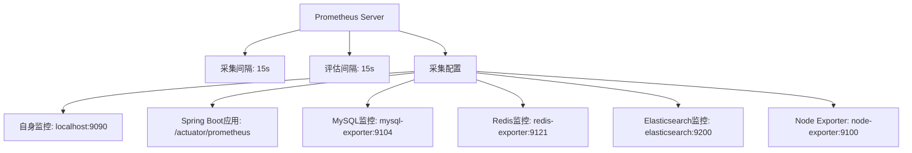
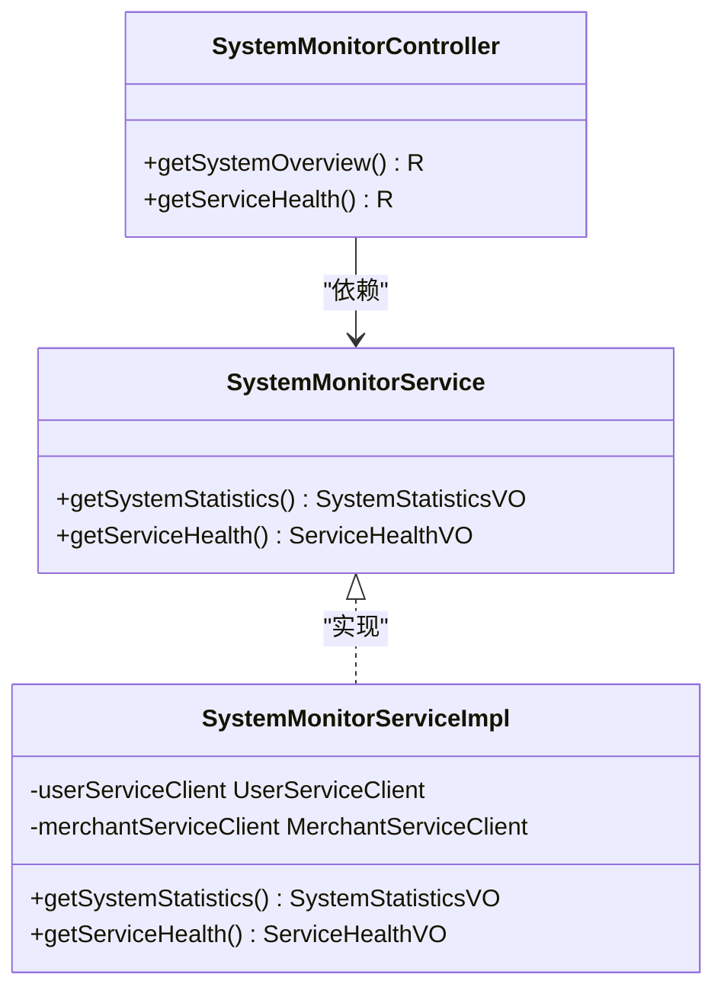
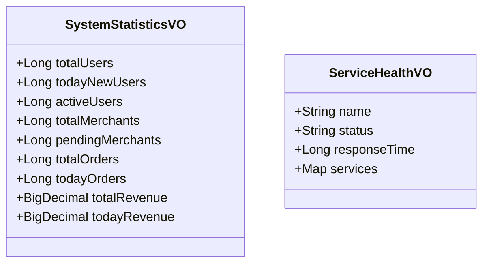

# 监控配置

<cite>
**Referenced Files in This Document**   
- [prometheus.yml](file://config/prometheus.yml)
- [SystemMonitorController.java](file://backend/admin-service/src/main/java/com/mall/admin/controller/SystemMonitorController.java)
- [SystemMonitorService.java](file://backend/admin-service/src/main/java/com/mall/admin/service/SystemMonitorService.java)
- [SystemMonitorServiceImpl.java](file://backend/admin-service/src/main/java/com/mall/admin/service/impl/SystemMonitorServiceImpl.java)
- [SystemStatisticsVO.java](file://backend/admin-service/src/main/java/com/mall/admin/domain/vo/SystemStatisticsVO.java)
- [ServiceHealthVO.java](file://backend/admin-service/src/main/java/com/mall/admin/domain/vo/ServiceHealthVO.java)
</cite>

## 目录
1. [监控配置](#监控配置)
2. [Prometheus配置详解](#prometheus配置详解)
3. [系统监控接口](#系统监控接口)
4. [数据结构定义](#数据结构定义)
5. [监控指标采集](#监控指标采集)
6. [Grafana可视化](#grafana可视化)
7. [自定义监控扩展](#自定义监控扩展)
8. [告警规则配置](#告警规则配置)

## Prometheus配置详解

Prometheus配置文件定义了监控系统的全局设置和采集配置，通过静态配置方式发现各个微服务的监控端点。



**Diagram sources**
- [prometheus.yml](file://config/prometheus.yml#L1-L45)

**Section sources**
- [prometheus.yml](file://config/prometheus.yml#L1-L45)

### 全局配置

全局配置定义了Prometheus的采集和评估间隔，确保监控数据的实时性和准确性。

```yaml
global:
  scrape_interval: 15s
  evaluation_interval: 15s
```

- **scrape_interval**: 采集间隔设置为15秒，平衡了监控数据的实时性和系统负载
- **evaluation_interval**: 规则评估间隔同样为15秒，与采集间隔保持一致

### 采集配置

采集配置定义了多个job，分别监控不同的系统组件和服务。

#### Spring Boot应用监控

```yaml
- job_name: 'spring-boot-apps'
  metrics_path: '/actuator/prometheus'
  static_configs:
    - targets: 
      - 'host.docker.internal:8080'  # Gateway
      - 'host.docker.internal:8081'  # User Service
      - 'host.docker.internal:8082'  # Product Service
      - 'host.docker.internal:8083'  # Order Service
      - 'host.docker.internal:8084'  # Payment Service
```

- **metrics_path**: 指定Spring Boot Actuator的Prometheus指标路径
- **targets**: 列出所有需要监控的微服务实例，通过Docker内部网络进行访问

#### 外部组件监控

配置了对数据库、缓存和搜索服务的监控，通过相应的exporter收集指标。

```yaml
- job_name: 'mysql'
  static_configs:
    - targets: ['mysql-exporter:9104']

- job_name: 'redis'
  static_configs:
    - targets: ['redis-exporter:9121']

- job_name: 'elasticsearch'
  static_configs:
    - targets: ['elasticsearch:9200']

- job_name: 'node'
  static_configs:
    - targets: ['node-exporter:9100']
```

## 系统监控接口

系统监控控制器提供了健康检查和服务状态接口，用于监控系统的整体运行状况。



**Diagram sources**
- [SystemMonitorController.java](file://backend/admin-service/src/main/java/com/mall/admin/controller/SystemMonitorController.java#L12-L43)
- [SystemMonitorService.java](file://backend/admin-service/src/main/java/com/mall/admin/service/SystemMonitorService.java#L5-L26)
- [SystemMonitorServiceImpl.java](file://backend/admin-service/src/main/java/com/mall/admin/service/impl/SystemMonitorServiceImpl.java#L15-L94)

**Section sources**
- [SystemMonitorController.java](file://backend/admin-service/src/main/java/com/mall/admin/controller/SystemMonitorController.java#L12-L43)

### 健康检查接口

`/admin/system/health` 接口用于检查系统中各个服务的健康状态。

```java
@GetMapping("/health")
public R<ServiceHealthVO> getServiceHealth() {
    ServiceHealthVO health = systemMonitorService.getServiceHealth();
    return R.ok(health);
}
```

该接口通过调用其他微服务的统计接口来验证服务的可用性，如果调用成功则服务状态为UP，否则为DOWN。

### 系统概览接口

`/admin/system/overview` 接口提供系统的整体统计信息。

```java
@GetMapping("/overview")
public R<SystemStatisticsVO> getSystemOverview() {
    SystemStatisticsVO statistics = systemMonitorService.getSystemStatistics();
    return R.ok(statistics);
}
```

该接口聚合了用户服务和商家服务的统计信息，为管理员提供全面的系统视图。

## 数据结构定义

系统监控相关的数据传输对象定义了监控数据的结构和字段。



**Diagram sources**
- [SystemStatisticsVO.java](file://backend/admin-service/src/main/java/com/mall/admin/domain/vo/SystemStatisticsVO.java#L5-L55)
- [ServiceHealthVO.java](file://backend/admin-service/src/main/java/com/mall/admin/domain/vo/ServiceHealthVO.java#L5-L30)

**Section sources**
- [SystemStatisticsVO.java](file://backend/admin-service/src/main/java/com/mall/admin/domain/vo/SystemStatisticsVO.java#L5-L55)
- [ServiceHealthVO.java](file://backend/admin-service/src/main/java/com/mall/admin/domain/vo/ServiceHealthVO.java#L5-L30)

### 系统统计数据

`SystemStatisticsVO` 类定义了系统统计信息的数据结构，包含用户、商家、订单和交易额等关键指标。

### 服务健康信息

`ServiceHealthVO` 类定义了服务健康状态的数据结构，包含服务名称、状态、响应时间和服务列表等信息。

## 监控指标采集

Prometheus通过HTTP请求从各个微服务的Actuator端点采集指标，Spring Boot应用自动暴露了JVM、HTTP请求、数据库连接等关键指标。

### JVM指标

Spring Boot Actuator自动提供JVM相关的监控指标，包括：

- 内存使用情况（heap, non-heap）
- GC次数和时间
- 线程数量
- 类加载数量

### HTTP请求指标

通过Micrometer收集HTTP请求的性能指标：

- 请求次数（按状态码、HTTP方法、路径分类）
- 请求延迟（响应时间分布）
- 活跃请求数量

### 数据库连接池指标

监控数据库连接池的状态：

- 活跃连接数
- 空闲连接数
- 连接获取等待时间
- 连接创建和销毁次数

## Grafana可视化

通过Grafana仪表板对采集的监控指标进行可视化展示，提供直观的系统运行状况视图。

### 仪表板配置

创建Grafana仪表板，连接Prometheus数据源，配置以下面板：

- **系统概览**: 显示总用户数、总商家数、总订单数等关键业务指标
- **服务健康**: 显示各个微服务的健康状态（UP/DOWN）
- **性能监控**: 显示HTTP请求延迟、错误率等性能指标
- **资源使用**: 显示JVM内存、GC、线程等资源使用情况
- **数据库监控**: 显示数据库连接池状态和查询性能

### 查询示例

在Grafana中使用PromQL查询语言展示监控数据：

```promql
# HTTP请求速率（每秒请求数）
rate(http_server_requests_seconds_count[5m])

# JVM堆内存使用率
jvm_memory_used_bytes{area="heap"} / jvm_memory_max_bytes{area="heap"}

# 数据库连接活跃数
hikaricp_connections_active
```

## 自定义监控扩展

系统提供了扩展点，允许添加自定义的监控指标。

### 自定义指标实现

通过Micrometer的MeterRegistry注册自定义指标：

```java
@Component
public class CustomMetrics {
    
    private final MeterRegistry meterRegistry;
    
    public CustomMetrics(MeterRegistry meterRegistry) {
        this.meterRegistry = meterRegistry;
        
        // 注册计数器
        Counter.builder("custom_event_count")
               .description("自定义事件计数")
               .register(meterRegistry);
               
        // 注册计时器
        Timer.builder("custom_operation_duration")
             .description("自定义操作耗时")
             .register(meterRegistry);
    }
}
```

### 业务指标扩展

可以在`SystemMonitorServiceImpl`中添加新的业务指标收集逻辑：

```java
public SystemStatisticsVO getSystemStatistics() {
    // ... 现有逻辑
    
    // 添加新的业务指标
    try {
        R<Map<String, Object>> orderStats = orderServiceClient.getOrderStatistics();
        if (orderStats.isSuccess()) {
            Map<String, Object> data = orderStats.getData();
            statistics.setTotalOrders(getLongValue(data, "totalOrders"));
            statistics.setTodayOrders(getLongValue(data, "todayOrders"));
        }
    } catch (Exception e) {
        log.error("获取订单统计失败", e);
    }
    
    return statistics;
}
```

## 告警规则配置

通过Prometheus的告警规则配置，实现对关键指标的实时监控和告警。

### 告警规则示例

在Prometheus配置中添加告警规则文件，定义以下告警规则：

```yaml
# alert_rules.yml
groups:
  - name: service-health
    rules:
      - alert: ServiceDown
        expr: up{job="spring-boot-apps"} == 0
        for: 1m
        labels:
          severity: critical
        annotations:
          summary: "服务 {{ $labels.instance }} 已经宕机"
          description: "服务 {{ $labels.instance }} 在过去1分钟内无法访问"
          
      - alert: HighRequestLatency
        expr: histogram_quantile(0.95, rate(http_server_requests_seconds_bucket[5m])) > 1
        for: 5m
        labels:
          severity: warning
        annotations:
          summary: "高请求延迟"
          description: "95%的请求延迟超过1秒"
          
      - alert: HighErrorRate
        expr: sum(rate(http_server_requests_seconds_count{status=~"5.."}[5m])) / sum(rate(http_server_requests_seconds_count[5m])) > 0.05
        for: 10m
        labels:
          severity: warning
        annotations:
          summary: "高错误率"
          description: "HTTP 5xx错误率超过5%"
```

### 告警通知

配置Alertmanager将告警通知发送到指定渠道：

- 邮件通知
- 微信/钉钉机器人
- 短信通知
- 企业微信

通过合理的告警规则配置，可以及时发现系统异常，保障系统的稳定运行。