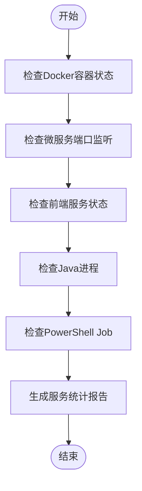
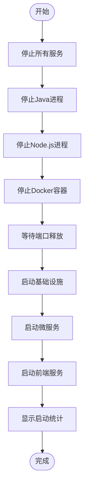
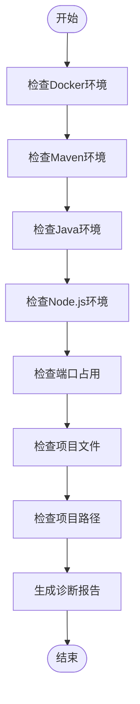
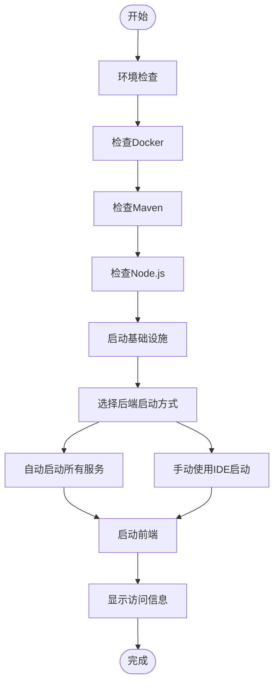
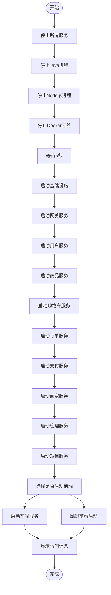
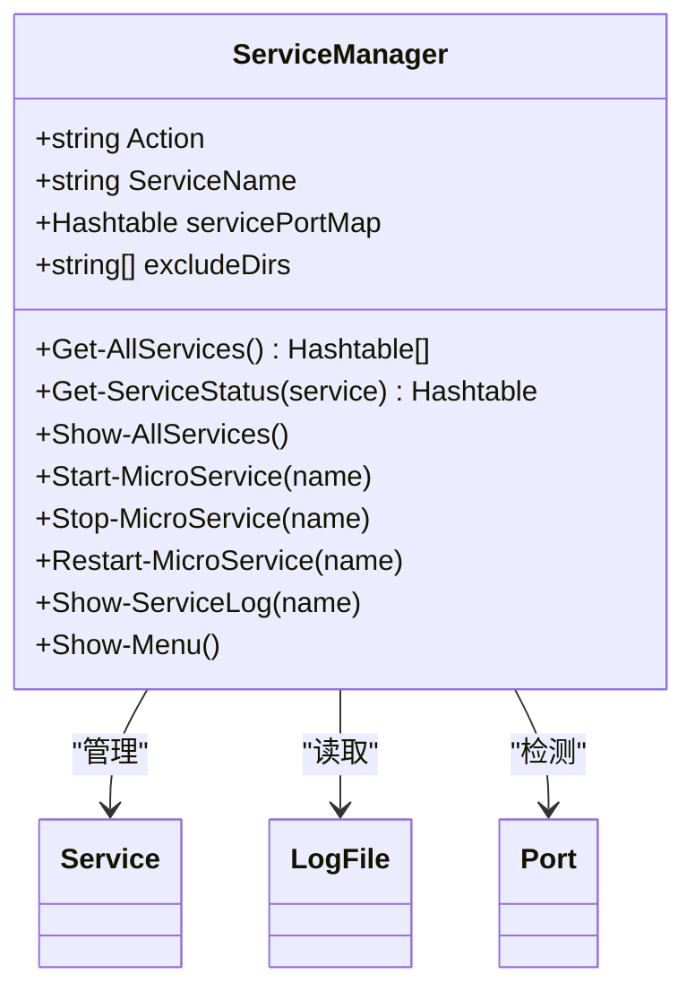
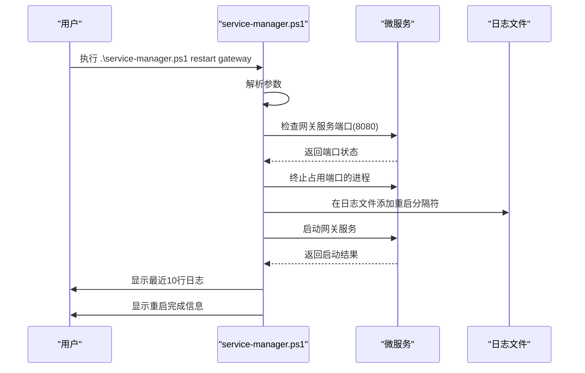
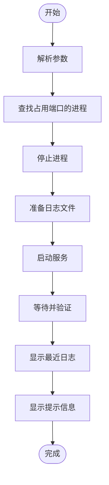
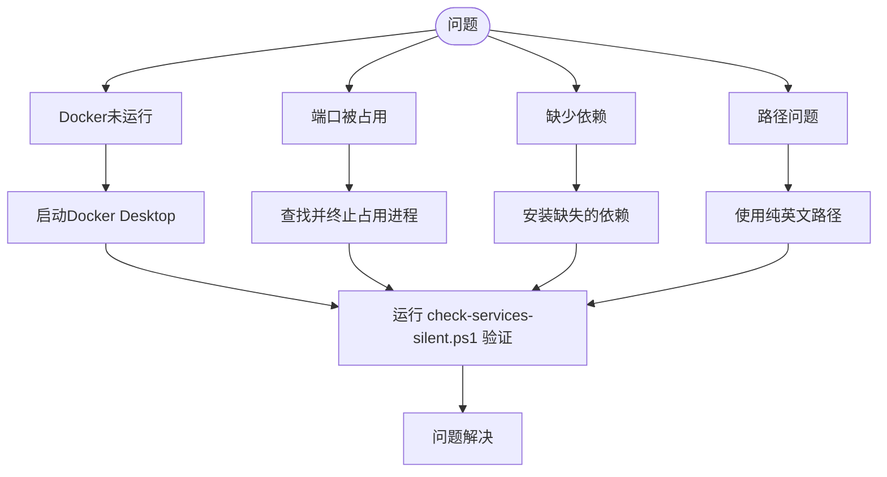

# 运维脚本

<cite>
**本文档引用文件**   
- [check-status.ps1](file://check-status.ps1)
- [restart-all-services-silent.ps1](file://restart-all-services-silent.ps1)
- [service-manager.ps1](file://service-manager.ps1)
- [一键启动.bat](file://一键启动.bat)
- [完整重启.bat](file://完整重启.bat)
- [check-services-silent.ps1](file://check-services-silent.ps1)
- [diagnose.ps1](file://diagnose.ps1)
- [restart-service.ps1](file://restart-service.ps1)
- [start-all-services.ps1](file://start-all-services.ps1)
- [start-dev.bat](file://start-dev.bat)
</cite>

## 目录
1. [简介](#简介)
2. [PowerShell脚本使用指南](#powershell脚本使用指南)
3. [批处理脚本使用指南](#批处理脚本使用指南)
4. [高级运维脚本详解](#高级运维脚本详解)
5. [脚本执行权限与安全建议](#脚本执行权限与安全建议)
6. [错误处理与故障排查](#错误处理与故障排查)

## 简介

本指南全面介绍在线商城项目提供的各类运维工具脚本，涵盖PowerShell脚本和批处理文件的使用方法、功能说明和最佳实践。这些脚本旨在简化开发和运维流程，提高系统管理效率，确保服务稳定运行。

**Section sources**
- [check-status.ps1](file://check-status.ps1)
- [restart-all-services-silent.ps1](file://restart-all-services-silent.ps1)
- [service-manager.ps1](file://service-manager.ps1)

## PowerShell脚本使用指南

### 服务状态检查脚本

`check-status.ps1` 脚本用于全面检查系统中所有服务的运行状态。该脚本会检测Docker基础设施、微服务端口监听状态、前端服务状态、Java进程统计和PowerShell Job状态。



**Diagram sources**
- [check-status.ps1](file://check-status.ps1#L1-L112)

### 批量重启服务脚本

`restart-all-services-silent.ps1` 脚本实现完整重启所有服务的功能，采用静默模式运行，不弹出命令窗口。脚本执行流程包括停止所有服务、启动基础设施、按依赖顺序启动微服务和启动前端服务。



**Diagram sources**
- [restart-all-services-silent.ps1](file://restart-all-services-silent.ps1#L1-L239)

### 系统诊断脚本

`diagnose.ps1` 脚本提供全面的系统诊断功能，自动检测并报告所有潜在问题。脚本检查Docker环境、Maven环境、Java环境、Node.js环境、端口占用情况、项目文件结构和项目路径等关键要素。



**Diagram sources**
- [diagnose.ps1](file://diagnose.ps1#L1-L386)

**Section sources**
- [check-status.ps1](file://check-status.ps1#L1-L112)
- [restart-all-services-silent.ps1](file://restart-all-services-silent.ps1#L1-L239)
- [diagnose.ps1](file://diagnose.ps1#L1-L386)

## 批处理脚本使用指南

### 一键启动脚本

`一键启动.bat` 批处理文件提供图形化交互界面，引导用户完成环境检查、基础设施启动、后端服务启动和前端服务启动的完整流程。脚本首先检查Docker、Maven和Node.js环境，然后启动MySQL、Redis和Nacos等基础设施服务。



**Diagram sources**
- [一键启动.bat](file://一键启动.bat#L1-L231)

### 完整重启脚本

`完整重启.bat` 批处理文件执行完整的系统重启操作，包括停止所有服务、启动基础设施、启动后端微服务和启动前端服务。脚本按预定义顺序启动各微服务，并提供适当的延迟以确保服务依赖关系。



**Diagram sources**
- [完整重启.bat](file://完整重启.bat#L1-L134)

**Section sources**
- [一键启动.bat](file://一键启动.bat#L1-L231)
- [完整重启.bat](file://完整重启.bat#L1-L134)

## 高级运维脚本详解

### 服务管理器脚本

`service-manager.ps1` 是一个功能强大的服务管理工具，支持多种操作模式。脚本通过参数化设计，可执行不同运维任务，包括服务状态查看、启动、停止、重启和日志查看等。



**Diagram sources**
- [service-manager.ps1](file://service-manager.ps1#L1-L387)

#### 参数说明

`service-manager.ps1` 支持以下参数：

- `list`: 显示所有服务状态
- `start <服务名>`: 启动指定服务
- `stop <服务名>`: 停止指定服务
- `restart <服务名>`: 重启指定服务
- `log <服务名>`: 查看指定服务日志
- 无参数: 显示交互式菜单

#### 自动化运维示例



**Diagram sources**
- [service-manager.ps1](file://service-manager.ps1#L1-L387)
- [restart-service.ps1](file://restart-service.ps1#L1-L212)

#### 单个服务重启脚本

`restart-service.ps1` 脚本专门用于重启指定的微服务，支持网关、用户、商品、购物车、订单、支付、管理、商家、短信和前端等服务。脚本执行流程包括查找并停止占用端口的进程、准备日志文件、启动服务和验证服务状态。



**Diagram sources**
- [restart-service.ps1](file://restart-service.ps1#L1-L212)

**Section sources**
- [service-manager.ps1](file://service-manager.ps1#L1-L387)
- [restart-service.ps1](file://restart-service.ps1#L1-L212)

## 脚本执行权限与安全建议

### 执行权限配置

为确保脚本正常运行，需要正确配置PowerShell执行策略。建议使用以下命令设置执行策略：

```powershell
Set-ExecutionPolicy RemoteSigned -Scope CurrentUser
```

此设置允许运行本地创建的脚本，同时要求从互联网下载的脚本必须经过数字签名。

### 安全使用建议

1. **权限最小化原则**：仅授予脚本执行所需的最低权限
2. **代码审查**：在执行任何脚本前，应审查其代码内容
3. **备份策略**：定期备份重要数据和配置文件
4. **环境隔离**：在生产环境执行脚本前，先在测试环境验证
5. **审计日志**：记录所有脚本执行操作，便于追踪和审计

**Section sources**
- [check-status.ps1](file://check-status.ps1#L1-L112)
- [restart-all-services-silent.ps1](file://restart-all-services-silent.ps1#L1-L239)
- [service-manager.ps1](file://service-manager.ps1#L1-L387)

## 错误处理与故障排查

### 错误处理机制

所有运维脚本均内置完善的错误处理机制，包括：

- **异常捕获**：使用try-catch结构捕获和处理异常
- **错误码返回**：根据执行结果返回适当的错误码
- **详细错误信息**：提供具体的错误描述和解决方案建议
- **日志记录**：将关键操作和错误信息记录到日志文件

### 常见问题及解决方案



**Diagram sources**
- [check-services-silent.ps1](file://check-services-silent.ps1#L1-L257)
- [diagnose.ps1](file://diagnose.ps1#L1-L386)

**Section sources**
- [check-services-silent.ps1](file://check-services-silent.ps1#L1-L257)
- [diagnose.ps1](file://diagnose.ps1#L1-L386)