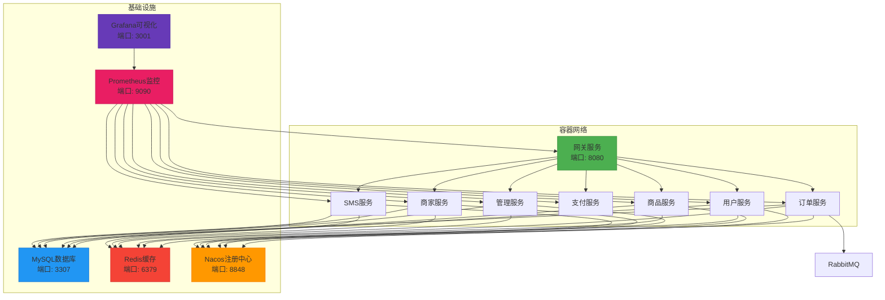
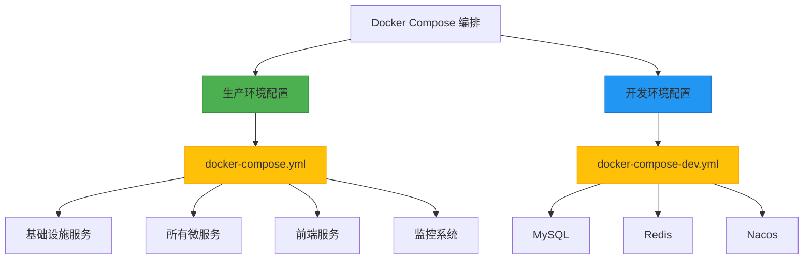
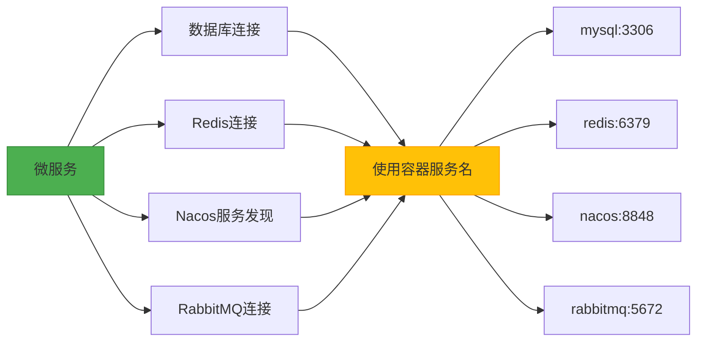
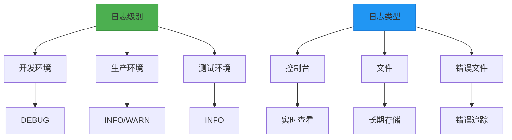
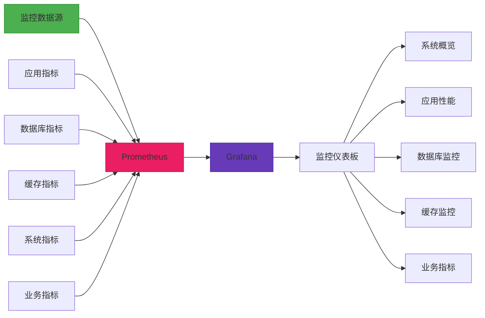
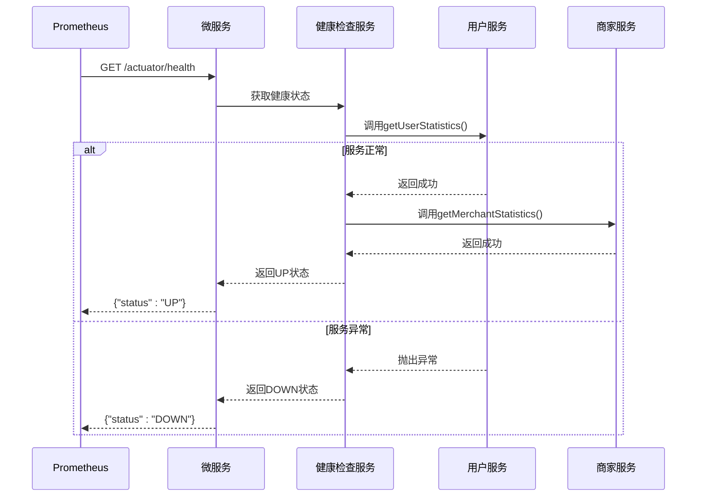
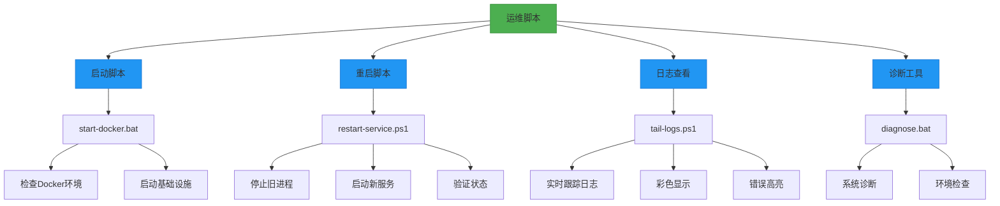
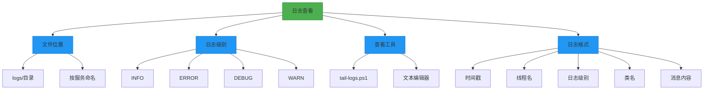
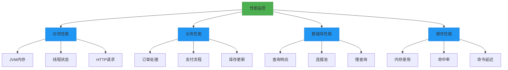
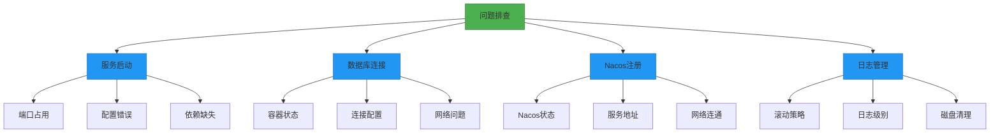

# 部署与运维

<cite>
**本文档引用文件**  
- [docker-compose.yml](file://docker-compose.yml)
- [docker-compose-dev.yml](file://docker-compose-dev.yml)
- [prometheus.yml](file://config/prometheus.yml)
- [logback-spring.xml](file://backend/order-service/src/main/resources/logback-spring.xml)
- [logback-spring.xml](file://backend/sms-service/src/main/resources/logback-spring.xml)
- [application-docker.yml](file://backend/admin-service/src/main/resources/application-docker.yml)
- [application-docker.yml](file://backend/order-service/src/main/resources/application-docker.yml)
- [application-docker.yml](file://backend/merchant-service/src/main/resources/application-docker.yml)
- [application-docker.yml](file://backend/user-service/src/main/resources/application-docker.yml)
- [application-docker.yml](file://backend/cart-service/src/main/resources/application-docker.yml)
- [Dockerfile](file://backend/admin-service/Dockerfile)
- [SystemMonitorController.java](file://backend/admin-service/src/main/java/com/mall/admin/controller/SystemMonitorController.java)
- [SystemMonitorServiceImpl.java](file://backend/admin-service/src/main/java/com/mall/admin/service/impl/SystemMonitorServiceImpl.java)
- [start-docker.bat](file://start-docker.bat)
- [restart-service.ps1](file://restart-service.ps1)
- [tail-logs.ps1](file://tail-logs.ps1)
- [diagnose.bat](file://diagnose.bat)
</cite>

## 目录
1. [简介](#简介)
2. [容器化部署方案](#容器化部署方案)
3. [Docker Compose 编排配置](#docker-compose-编排配置)
4. [生产环境配置优化](#生产环境配置优化)
5. [日志管理](#日志管理)
6. [系统监控](#系统监控)
7. [健康检查接口](#健康检查接口)
8. [运维脚本使用指南](#运维脚本使用指南)
9. [服务状态检查](#服务状态检查)
10. [日志查看](#日志查看)
11. [性能监控](#性能监控)
12. [常见问题排查](#常见问题排查)

## 简介

本部署与运维文档为在线商城系统提供从开发到生产环境的完整部署解决方案。文档涵盖Docker容器化部署、docker-compose编排、生产环境配置优化、日志管理、系统监控和健康检查等核心运维内容。通过本指南，运维人员可以快速部署系统，监控服务状态，查看日志信息，并执行日常维护操作，确保系统稳定运行。

## 容器化部署方案

系统采用Docker容器化部署方案，所有微服务均打包为独立容器，通过统一的Docker镜像运行。每个服务使用Eclipse Temurin 17 JRE作为基础镜像，确保Java运行环境的一致性。

核心容器化特点：
- 所有微服务以Spring Boot可执行JAR方式运行
- 统一挂载到容器`/app/app.jar`路径
- 使用`java -jar`命令启动服务
- 仅网关服务暴露端口到宿主机
- 其他微服务在容器网络中通过注册中心互通



**Diagram sources**
- [docker-compose.yml](file://docker-compose.yml#L1-L485)

**Section sources**
- [docker-compose.yml](file://docker-compose.yml#L1-L485)
- [Dockerfile](file://backend/admin-service/Dockerfile#L1-L15)

## Docker Compose 编排配置

系统提供两套Docker Compose配置文件，分别用于不同环境的部署。

### 生产环境编排 (docker-compose.yml)

生产环境使用完整的`docker-compose.yml`文件，包含所有微服务和基础设施组件。该配置文件定义了485行的完整服务编排，包括：

- **数据库服务**：MySQL 8.0，端口映射3307:3306
- **缓存服务**：Redis 7，端口映射6379:6379
- **注册中心**：Nacos v2.3.0，端口映射8848:8848
- **监控系统**：Prometheus + Grafana
- **消息队列**：RabbitMQ，端口映射5672:5672
- **微服务**：网关、用户、商品、订单、支付、管理、商家、短信等服务
- **前端服务**：Node.js容器运行Vite开发服务器

### 开发环境编排 (docker-compose-dev.yml)

开发环境使用简化的`docker-compose-dev.yml`文件，仅包含核心基础设施组件：

- MySQL数据库
- Redis缓存
- Nacos注册中心

此配置用于开发人员快速启动基础环境，便于本地开发调试。



**Diagram sources**
- [docker-compose.yml](file://docker-compose.yml#L1-L485)
- [docker-compose-dev.yml](file://docker-compose-dev.yml#L1-L92)

**Section sources**
- [docker-compose.yml](file://docker-compose.yml#L1-L485)
- [docker-compose-dev.yml](file://docker-compose-dev.yml#L1-L92)

## 生产环境配置优化

生产环境配置针对性能、安全和稳定性进行了专门优化，通过`application-docker.yml`文件实现环境特定配置。

### 服务端口配置

各微服务在Docker环境中使用固定的端口配置：

| 服务名称 | 端口号 | 配置文件 |
|---------|-------|---------|
| 订单服务 | 8083 | application-docker.yml |
| 商家服务 | 8087 | application-docker.yml |
| 购物车服务 | 8085 | application-docker.yml |

### 数据库连接优化

数据库连接配置采用容器网络服务名而非IP地址，确保服务发现的可靠性：

```yaml
spring:
  datasource:
    url: jdbc:mysql://mysql:3306/mall_order?useUnicode=true&characterEncoding=utf-8&useSSL=false&serverTimezone=UTC
    username: root
    password: 123456
```

### Redis配置

Redis配置指定容器网络中的redis服务作为主机：

```yaml
spring:
  redis:
    host: redis
    port: 6379
    database: 2
    timeout: 5000ms
```

### Nacos服务发现

Nacos服务发现配置指向容器网络中的nacos服务：

```yaml
spring:
  cloud:
    nacos:
      discovery:
        server-addr: nacos:8848
        namespace: public
```

### RabbitMQ集成

订单服务与RabbitMQ的集成配置：

```yaml
spring:
  rabbitmq:
    host: rabbitmq
    port: 5672
    username: guest
    password: guest
```



**Diagram sources**
- [application-docker.yml](file://backend/order-service/src/main/resources/application-docker.yml#L1-L110)
- [application-docker.yml](file://backend/merchant-service/src/main/resources/application-docker.yml#L1-L73)
- [application-docker.yml](file://backend/cart-service/src/main/resources/application-docker.yml#L1-L51)

**Section sources**
- [application-docker.yml](file://backend/order-service/src/main/resources/application-docker.yml#L1-L110)
- [application-docker.yml](file://backend/merchant-service/src/main/resources/application-docker.yml#L1-L73)
- [application-docker.yml](file://backend/cart-service/src/main/resources/application-docker.yml#L1-L51)
- [application-docker.yml](file://backend/user-service/src/main/resources/application-docker.yml#L1-L46)
- [application-docker.yml](file://backend/admin-service/src/main/resources/application-docker.yml#L1-L38)

## 日志管理

系统采用Logback作为日志框架，通过`logback-spring.xml`配置文件实现灵活的日志管理策略。

### 订单服务日志配置

订单服务配置了多维度的日志输出策略：

- **控制台输出**：实时查看日志信息
- **文件输出**：所有日志、错误日志、业务日志、性能日志分离存储
- **滚动策略**：基于时间和大小的滚动策略
- **环境适配**：开发、测试、生产环境不同日志级别

```xml
<configuration>
    <!-- 定义日志文件路径 -->
    <property name="LOG_PATH" value="logs"/>
    <property name="LOG_FILE" value="${LOG_PATH}/order-service"/>
    
    <!-- 控制台输出 -->
    <appender name="CONSOLE" class="ch.qos.logback.core.ConsoleAppender">
        <encoder>
            <pattern>%d{yyyy-MM-dd HH:mm:ss.SSS} [%thread] %-5level [%logger{50}] - %msg%n</pattern>
            <charset>UTF-8</charset>
        </encoder>
    </appender>
    
    <!-- 文件输出 - 所有日志 -->
    <appender name="FILE_ALL" class="ch.qos.logback.core.rolling.RollingFileAppender">
        <file>${LOG_FILE}.log</file>
        <rollingPolicy class="ch.qos.logback.core.rolling.SizeAndTimeBasedRollingPolicy">
            <fileNamePattern>${LOG_FILE}.%d{yyyy-MM-dd}.%i.log</fileNamePattern>
            <maxFileSize>100MB</maxFileSize>
            <maxHistory>30</maxHistory>
            <totalSizeCap>3GB</totalSizeCap>
        </rollingPolicy>
    </appender>
</configuration>
```

### 短信服务日志配置

短信服务采用异步日志输出，提高性能：

- **异步输出**：使用AsyncAppender减少I/O阻塞
- **队列大小**：1024的队列容量
- **丢弃阈值**：0，确保不丢失日志

```xml
<appender name="ASYNC_FILE" class="ch.qos.logback.classic.AsyncAppender">
    <discardingThreshold>0</discardingThreshold>
    <queueSize>1024</queueSize>
    <appender-ref ref="FILE"/>
</appender>
```

### 日志级别管理

通过Spring Profile实现不同环境的日志级别控制：

- **开发环境**：DEBUG级别，便于调试
- **生产环境**：INFO/WARN级别，减少日志量
- **测试环境**：INFO级别，平衡调试和性能



**Diagram sources**
- [logback-spring.xml](file://backend/order-service/src/main/resources/logback-spring.xml#L1-L178)
- [logback-spring.xml](file://backend/sms-service/src/main/resources/logback-spring.xml#L1-L101)

**Section sources**
- [logback-spring.xml](file://backend/order-service/src/main/resources/logback-spring.xml#L1-L178)
- [logback-spring.xml](file://backend/sms-service/src/main/resources/logback-spring.xml#L1-L101)

## 系统监控

系统集成Prometheus和Grafana实现全面的监控解决方案。

### Prometheus配置

Prometheus通过`prometheus.yml`文件配置监控目标：

```yaml
global:
  scrape_interval: 15s
  evaluation_interval: 15s

scrape_configs:
  - job_name: 'prometheus'
    static_configs:
      - targets: ['localhost:9090']
  
  - job_name: 'spring-boot-apps'
    metrics_path: '/actuator/prometheus'
    static_configs:
      - targets: 
        - 'host.docker.internal:8080'  # Gateway
        - 'host.docker.internal:8081'  # User Service
        - 'host.docker.internal:8082'  # Product Service
        - 'host.docker.internal:8083'  # Order Service
        - 'host.docker.internal:8084'  # Payment Service
```

### 监控指标类型

系统监控涵盖多个维度的指标：

| 监控类型 | 采集方式 | 用途 |
|---------|---------|-----|
| 应用性能 | Actuator | JVM、HTTP请求、线程等 |
| 数据库 | mysql_exporter | 连接数、查询性能等 |
| 缓存 | redis_exporter | 内存使用、命中率等 |
| 系统资源 | node_exporter | CPU、内存、磁盘等 |
| 搜索引擎 | 内置监控 | 索引、查询性能等 |

### Grafana可视化

Grafana提供直观的监控仪表板：

- **系统概览**：CPU、内存、磁盘使用率
- **应用性能**：请求量、响应时间、错误率
- **数据库监控**：连接数、慢查询
- **缓存监控**：命中率、内存使用
- **业务指标**：订单量、用户活跃度



**Diagram sources**
- [prometheus.yml](file://config/prometheus.yml#L1-L45)

**Section sources**
- [prometheus.yml](file://config/prometheus.yml#L1-L45)

## 健康检查接口

系统提供标准化的健康检查接口，用于服务状态监控和自动恢复。

### 健康检查端点

所有微服务通过Spring Boot Actuator提供健康检查端点：

- **路径**：`/actuator/health`
- **响应格式**：JSON
- **详细信息**：`show-details: always`

### 管理服务健康检查

管理服务提供专门的健康检查接口，用于监控整个系统的健康状态：

```java
@RestController
@RequestMapping("/admin/system")
public class SystemMonitorController {
    
    @GetMapping("/health")
    public R<ServiceHealthVO> getServiceHealth() {
        ServiceHealthVO health = systemMonitorService.getServiceHealth();
        return R.ok(health);
    }
}
```

### 健康检查实现

健康检查服务通过Feign客户端调用其他服务的统计接口，验证服务连通性：

```java
@Service
public class SystemMonitorServiceImpl implements SystemMonitorService {
    
    private final UserServiceClient userServiceClient;
    private final MerchantServiceClient merchantServiceClient;
    
    @Override
    public ServiceHealthVO getServiceHealth() {
        ServiceHealthVO health = new ServiceHealthVO();
        Map<String, String> services = new HashMap<>();
        
        // 检查用户服务
        try {
            userServiceClient.getUserStatistics();
            services.put("user-service", "UP");
        } catch (Exception e) {
            services.put("user-service", "DOWN");
        }
        
        // 检查商家服务
        try {
            merchantServiceClient.getMerchantStatistics();
            services.put("merchant-service", "UP");
        } catch (Exception e) {
            services.put("merchant-service", "DOWN");
        }
        
        health.setServices(services);
        return health;
    }
}
```

### Docker健康检查

Docker容器配置了健康检查指令，确保容器状态的准确性：

```dockerfile
HEALTHCHECK --interval=30s --timeout=10s --start-period=60s --retries=3 \
  CMD curl -f http://localhost:8081/actuator/health || exit 1
```



**Diagram sources**
- [SystemMonitorController.java](file://backend/admin-service/src/main/java/com/mall/admin/controller/SystemMonitorController.java#L1-L45)
- [SystemMonitorServiceImpl.java](file://backend/admin-service/src/main/java/com/mall/admin/service/impl/SystemMonitorServiceImpl.java#L1-L96)
- [Dockerfile](file://backend/admin-service/Dockerfile#L13-L15)

**Section sources**
- [SystemMonitorController.java](file://backend/admin-service/src/main/java/com/mall/admin/controller/SystemMonitorController.java#L1-L45)
- [SystemMonitorServiceImpl.java](file://backend/admin-service/src/main/java/com/mall/admin/service/impl/SystemMonitorServiceImpl.java#L1-L96)
- [Dockerfile](file://backend/admin-service/Dockerfile#L13-L15)

## 运维脚本使用指南

系统提供一系列运维脚本，简化日常维护操作。

### 启动脚本

`start-docker.bat`脚本用于启动Docker基础设施服务：

```bat
@echo off
chcp 65001 >nul
setlocal enabledelayedexpansion

echo ========================================
echo 启动Docker基础设施服务
echo ========================================
echo.

cd /d "%~dp0"

echo [1/4] 检查Docker环境...
docker --version >nul 2>&1
if %errorlevel% neq 0 (
    echo [错误] Docker未安装或未运行
    echo 请先启动Docker Desktop
    pause
    exit /b 1
)
```

### 重启脚本

`restart-service.ps1`脚本用于重启指定的微服务：

```powershell
param(
  [Parameter(Mandatory = $true, Position = 0)]
  [ValidateSet('gateway', 'user', 'product', 'cart', 'order', 'payment', 'admin', 'merchant', 'sms', 'frontend')]
  [string]$ServiceName
)
```

### 日志查看脚本

`tail-logs.ps1`脚本用于实时查看服务日志：

```powershell
param(
  [Parameter(Position = 0)]
  [ValidateSet('gateway', 'user', 'product', 'cart', 'order', 'payment', 'admin', 'merchant', 'sms', 'frontend', 'all', '')]
  [string]$ServiceName = 'all',
  
  [Parameter()]
  [int]$Lines = 20
)
```

### 诊断脚本

`diagnose.bat`脚本启动系统诊断工具：

```bat
@echo off

REM 启动 PowerShell 诊断脚本
echo.
echo ========================================
echo    启动系统诊断工具...
echo ========================================
echo.

REM 检查 PowerShell 是否可用
pwsh --version >nul 2>&1
if %errorlevel% equ 0 (
    REM 使用 PowerShell Core (pwsh)
    pwsh -ExecutionPolicy Bypass -File "%~dp0diagnose.ps1"
) else (
    REM 回退到 Windows PowerShell
    powershell -ExecutionPolicy Bypass -File "%~dp0diagnose.ps1"
)
```



**Diagram sources**
- [start-docker.bat](file://start-docker.bat#L1-L61)
- [restart-service.ps1](file://restart-service.ps1#L1-L212)
- [tail-logs.ps1](file://tail-logs.ps1#L1-L136)
- [diagnose.bat](file://diagnose.bat#L1-L21)

**Section sources**
- [start-docker.bat](file://start-docker.bat#L1-L61)
- [restart-service.ps1](file://restart-service.ps1#L1-L212)
- [tail-logs.ps1](file://tail-logs.ps1#L1-L136)
- [diagnose.bat](file://diagnose.bat#L1-L21)

## 服务状态检查

系统提供多种方式检查服务状态，确保系统稳定运行。

### 容器状态检查

使用Docker Compose命令检查容器状态：

```bash
docker-compose -f docker-compose.yml ps
```

### 健康检查接口

通过HTTP请求访问健康检查接口：

```bash
curl http://localhost:8080/actuator/health
curl http://localhost:8086/admin/system/health
```

### 服务依赖检查

管理服务的健康检查接口会自动检查其依赖服务的状态：

- 用户服务
- 商家服务
- 订单服务
- 支付服务

### 状态响应格式

健康检查返回标准化的JSON响应：

```json
{
  "status": "UP",
  "services": {
    "user-service": "UP",
    "merchant-service": "UP",
    "order-service": "UP"
  }
}
```

```mermaid
graph TD
A[服务状态检查] --> B[容器层面]
A --> C[应用层面]
A --> D[业务层面]
B --> E[docker-compose ps]
B --> F[容器健康状态]
C --> G[/actuator/health]
C --> H[HTTP状态码]
D --> I[/admin/system/health]
D --> J[服务依赖检查]
style A fill:#4CAF50,stroke:#388E3C
style B fill:#2196F3,stroke:#1976D2
style C fill:#2196F3,stroke:#1976D2
style D fill:#2196F3,stroke:#1976D2
```

**Section sources**
- [docker-compose.yml](file://docker-compose.yml#L1-L485)
- [SystemMonitorController.java](file://backend/admin-service/src/main/java/com/mall/admin/controller/SystemMonitorController.java#L1-L45)

## 日志查看

系统提供多种日志查看方式，便于问题排查和系统监控。

### 日志文件位置

日志文件存储在`logs`目录下，按服务命名：

- `logs/order-service.log`：订单服务日志
- `logs/sms-service.log`：短信服务日志
- `logs/gateway.log`：网关服务日志

### 日志级别

日志按级别分类存储：

- **INFO**：常规操作日志
- **ERROR**：错误日志，存储在`-error.log`文件中
- **DEBUG**：调试日志，开发环境启用
- **WARN**：警告日志

### 实时日志查看

使用`tail-logs.ps1`脚本实时查看日志：

```powershell
# 查看所有服务日志
pwsh -File tail-logs.ps1 all

# 查看用户服务日志
pwsh -File tail-logs.ps1 user

# 查看订单服务日志（最后50行）
pwsh -File tail-logs.ps1 order -Lines 50
```

### 日志分析

日志文件采用标准格式，便于分析：

```
2025-01-27 10:30:15.123 [http-nio-8083-exec-1] INFO  [com.mall.order.service.OrderServiceImpl] - 创建订单成功，订单号：ORD20250127103015123
```



**Section sources**
- [logback-spring.xml](file://backend/order-service/src/main/resources/logback-spring.xml#L1-L178)
- [tail-logs.ps1](file://tail-logs.ps1#L1-L136)

## 性能监控

系统通过多种机制实现全面的性能监控。

### 应用性能监控

使用Spring Boot Actuator和Micrometer收集应用性能指标：

- JVM内存使用
- 线程状态
- HTTP请求统计
- 数据库连接池

### 业务性能监控

订单服务配置专门的性能日志：

```xml
<!-- 文件输出 - 性能日志 -->
<appender name="FILE_PERFORMANCE" class="ch.qos.logback.core.rolling.RollingFileAppender">
    <file>${LOG_FILE}-performance.log</file>
    <rollingPolicy class="ch.qos.logback.core.rolling.SizeAndTimeBasedRollingPolicy">
        <fileNamePattern>${LOG_FILE}-performance.%d{yyyy-MM-dd}.%i.log</fileNamePattern>
        <maxFileSize>100MB</maxFileSize>
        <maxHistory>15</maxHistory>
        <totalSizeCap>1GB</totalSizeCap>
    </rollingPolicy>
</appender>
```

### 数据库性能监控

通过Prometheus监控MySQL性能指标：

- 查询响应时间
- 连接数
- 缓存命中率
- 慢查询

### 缓存性能监控

Redis性能监控指标：

- 内存使用率
- 命中率
- 连接数
- 命令执行时间



**Section sources**
- [logback-spring.xml](file://backend/order-service/src/main/resources/logback-spring.xml#L74-L87)
- [prometheus.yml](file://config/prometheus.yml#L1-L45)

## 常见问题排查

提供常见问题的排查指南，帮助快速解决问题。

### 服务无法启动

**症状**：服务启动失败，端口被占用

**解决方案**：
1. 使用`restart-service.ps1`脚本重启服务
2. 检查端口占用情况
3. 查看日志文件中的错误信息

### 数据库连接失败

**症状**：服务无法连接数据库

**解决方案**：
1. 检查MySQL容器是否正常运行
2. 验证数据库连接配置
3. 检查网络连接

### Nacos注册失败

**症状**：服务无法注册到Nacos

**解决方案**：
1. 检查Nacos容器状态
2. 验证Nacos服务地址配置
3. 检查网络连通性

### 日志文件过大

**症状**：日志文件占用过多磁盘空间

**解决方案**：
1. 检查日志滚动配置
2. 调整日志级别
3. 清理旧日志文件



**Section sources**
- [restart-service.ps1](file://restart-service.ps1#L1-L212)
- [docker-compose.yml](file://docker-compose.yml#L1-L485)
- [application-docker.yml](file://backend/order-service/src/main/resources/application-docker.yml#L1-L110)