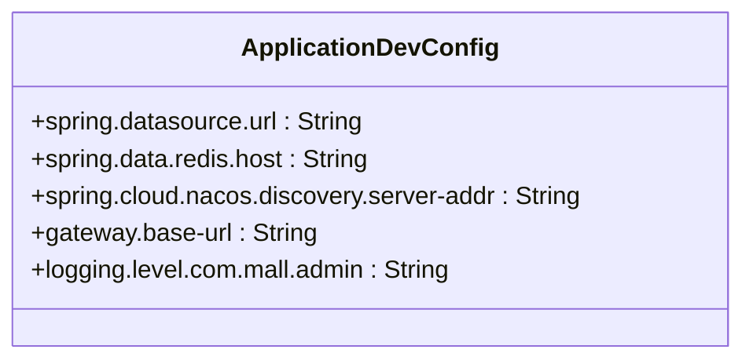
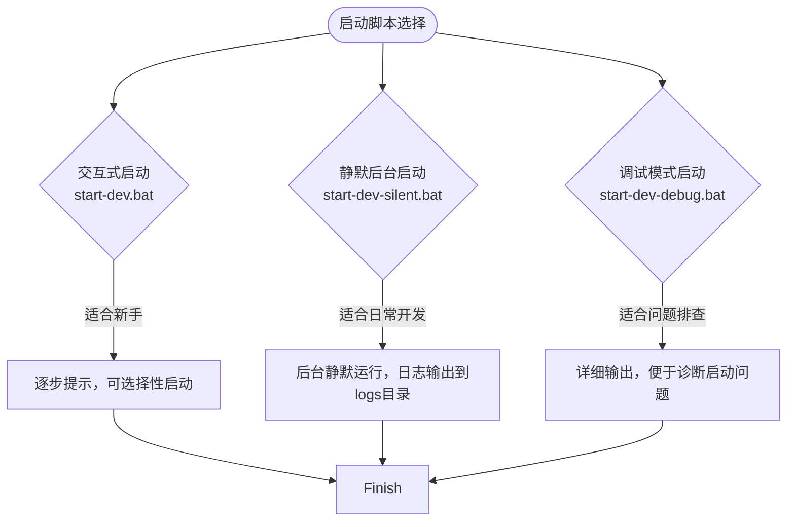
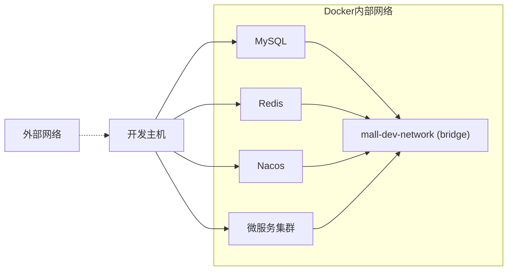
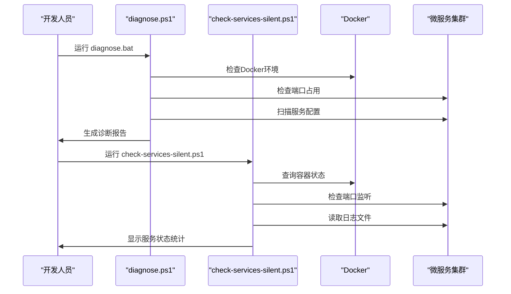

# 开发环境部署

<cite>
**本文档引用文件**  
- [docker-compose-dev.yml](file://docker-compose-dev.yml)
- [application-dev.yml](file://backend/admin-service/src/main/resources/application-dev.yml)
- [start-dev.bat](file://start-dev.bat)
- [start-dev-debug.bat](file://start-dev-debug.bat)
- [start-dev-silent.bat](file://start-dev-silent.bat)
- [check-services-silent.ps1](file://check-services-silent.ps1)
- [diagnose.ps1](file://diagnose.ps1)
- [diagnose.bat](file://diagnose.bat)
</cite>

## 目录
1. [开发环境概述](#开发环境概述)
2. [基础设施部署](#基础设施部署)
3. [开发配置详解](#开发配置详解)
4. [启动脚本使用指南](#启动脚本使用指南)
5. [服务热重载与远程调试](#服务热重载与远程调试)
6. [网络隔离策略](#网络隔离策略)
7. [常见问题排查](#常见问题排查)
8. [自动化诊断流程](#自动化诊断流程)

## 开发环境概述

本项目采用微服务架构，开发环境通过Docker容器化方式部署核心依赖服务，包括MySQL、Redis、Nacos等基础设施。开发人员可通过一系列批处理脚本快速启动完整开发环境，支持交互式、静默式和调试模式三种启动方式。系统提供完善的诊断工具链，可自动检测环境配置、端口占用、服务状态等关键指标。

**本文档引用文件**  
- [docker-compose-dev.yml](file://docker-compose-dev.yml)
- [start-dev.bat](file://start-dev.bat)

## 基础设施部署

开发环境的基础设施通过`docker-compose-dev.yml`文件定义，包含MySQL、Redis和Nacos三个核心服务。

```mermaid
graph TB
subgraph "开发网络 mall-dev-network"
MySQL[(MySQL 3307)]
Redis[(Redis 6379)]
Nacos[(Nacos 8848)]
end
MySQL --> Nacos
Redis --> Nacos
Nacos --> "微服务"
```

**Diagram sources**  
- [docker-compose-dev.yml](file://docker-compose-dev.yml#L7-L92)

**Section sources**  
- [docker-compose-dev.yml](file://docker-compose-dev.yml#L7-L92)

### MySQL服务配置
- 镜像版本：mysql:8.0
- 容器名称：mall-mysql-dev
- 端口映射：3307→3306
- 数据卷：mysql_dev_data
- 初始化脚本：./sql目录下的SQL文件
- 健康检查：通过mysqladmin ping检测

### Redis服务配置
- 镜像版本：redis:7-alpine
- 容器名称：mall-redis-dev
- 端口映射：6379→6379
- 数据持久化：redis_dev_data卷
- 启动参数：--appendonly yes
- 健康检查：redis-cli ping

### Nacos服务配置
- 镜像版本：nacos/nacos-server:v2.3.0
- 容器名称：mall-nacos-dev
- 端口映射：8848→8848, 9848→9848
- 数据库连接：指向本地MySQL实例
- 健康检查：HTTP请求/nacos/actuator/health
- 启动依赖：等待MySQL健康状态

## 开发配置详解

开发专用配置文件`application-dev.yml`定义了本地开发环境的各项参数，主要包含数据库连接、注册中心地址和日志级别等关键配置。



**Diagram sources**  
- [application-dev.yml](file://backend/admin-service/src/main/resources/application-dev.yml#L1-L18)

**Section sources**  
- [application-dev.yml](file://backend/admin-service/src/main/resources/application-dev.yml#L1-L18)

### 数据库连接配置
```yaml
spring:
  datasource:
    url: jdbc:mysql://localhost:3307/mall_admin?useUnicode=true&characterEncoding=UTF-8&zeroDateTimeBehavior=convertToNull&useSSL=false&serverTimezone=GMT%2B8&allowPublicKeyRetrieval=true
```
- 使用本地MySQL实例（端口3307）
- 字符集设置为utf8mb4
- 时区设置为GMT+8
- 禁用SSL连接

### 注册中心配置
```yaml
spring:
  cloud:
    nacos:
      discovery:
        server-addr: localhost:8848
```
- 指向本地Nacos服务
- 用于服务注册与发现
- 支持动态配置管理

### 日志级别配置
```yaml
logging:
  level:
    com.mall.admin: DEBUG
```
- 设置核心包为DEBUG级别
- 便于开发过程中的问题排查
- 可根据需要调整其他包的日志级别

## 启动脚本使用指南

项目提供三种启动脚本，分别适用于不同开发场景：



**Diagram sources**  
- [start-dev.bat](file://start-dev.bat#L1-L154)
- [start-dev-silent.bat](file://start-dev-silent.bat#L1-L316)
- [start-dev-debug.bat](file://start-dev-debug.bat#L1-L346)

**Section sources**  
- [start-dev.bat](file://start-dev.bat#L1-L154)
- [start-dev-silent.bat](file://start-dev-silent.bat#L1-L316)
- [start-dev-debug.bat](file://start-dev-debug.bat#L1-L346)

### 交互式启动模式 (start-dev.bat)
- 提供用户交互提示
- 可选择是否启动后端微服务
- 可选择是否启动前端开发服务器
- 显示详细的启动步骤和访问地址
- 适合初次使用或需要选择性启动的场景

### 静默后台启动模式 (start-dev-silent.bat)
- 无用户交互，自动执行所有步骤
- 所有服务在后台静默运行
- 日志统一输出到logs目录
- 支持服务依赖关系管理
- 适合日常开发的快速启动

### 调试模式启动 (start-dev-debug.bat)
- 提供详细的调试信息输出
- 分步骤显示执行过程
- 包含环境检查和状态反馈
- 便于诊断启动过程中的问题
- 适合排查启动失败等异常情况

## 服务热重载与远程调试

开发环境支持Spring Boot热重载功能，可通过配置实现代码修改后的自动重启。

### 热重载配置
- 在pom.xml中添加spring-boot-devtools依赖
- IDE中启用编译后自动构建功能
- 修改代码后，相关服务会自动重启
- 大大提高开发效率

### 远程调试端口设置
- 默认启用远程调试支持
- 调试端口配置在JVM参数中
- 可通过IDE连接进行断点调试
- 调试模式下建议使用start-dev-debug.bat启动

## 网络隔离策略

开发环境采用Docker网络隔离策略，确保服务间通信的安全性和稳定性。



**Diagram sources**  
- [docker-compose-dev.yml](file://docker-compose-dev.yml#L88-L90)

**Section sources**  
- [docker-compose-dev.yml](file://docker-compose-dev.yml#L88-L90)

- 创建专用bridge网络mall-dev-network
- 所有服务加入同一网络实现内部通信
- 外部通过端口映射访问服务
- 内部服务通过容器名称直接通信
- 实现网络层面的隔离与安全

## 常见问题排查

开发过程中可能遇到的常见问题及解决方案：

### 依赖服务启动失败
**现象**：docker-compose启动失败  
**原因**：
- Docker Desktop未运行
- 端口被占用（3307, 6379, 8848）
- docker-compose-dev.yml配置错误

**解决方案**：
1. 确认Docker Desktop已启动
2. 检查端口占用情况
3. 运行`diagnose.bat`进行完整诊断

### 数据初始化异常
**现象**：数据库表结构不完整  
**原因**：
- SQL初始化脚本未正确执行
- 数据库连接配置错误
- 字符集设置不匹配

**解决方案**：
1. 检查./sql目录下的SQL文件
2. 确认MySQL容器日志
3. 验证数据库连接字符串

### 断点调试连接超时
**现象**：IDE无法连接远程调试  
**原因**：
- 调试端口未正确暴露
- 防火墙阻止连接
- JVM调试参数配置错误

**解决方案**：
1. 确认服务启动时包含调试参数
2. 检查防火墙设置
3. 使用`check-services-silent.ps1`验证服务状态

## 自动化诊断流程

项目提供完整的自动化诊断工具链，帮助开发人员快速定位和解决问题。



**Diagram sources**  
- [diagnose.ps1](file://diagnose.ps1#L1-L386)
- [check-services-silent.ps1](file://check-services-silent.ps1#L1-L257)

**Section sources**  
- [diagnose.ps1](file://diagnose.ps1#L1-L386)
- [check-services-silent.ps1](file://check-services-silent.ps1#L1-L257)

### 诊断工具功能
- **环境检查**：验证Docker、Maven、Java、Node.js等依赖
- **端口检测**：扫描关键端口占用情况
- **文件验证**：确认必要配置文件存在
- **路径检查**：避免中文路径和空格导致的问题
- **状态统计**：实时显示服务运行状态

### 使用流程
1. 遇到启动问题时，首先运行`diagnose.bat`
2. 根据诊断报告解决环境配置问题
3. 使用`check-services-silent.ps1`监控服务状态
4. 查看logs目录下的详细日志进行深入分析