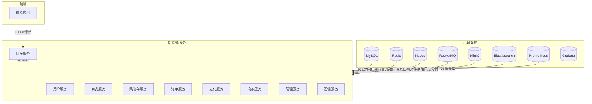
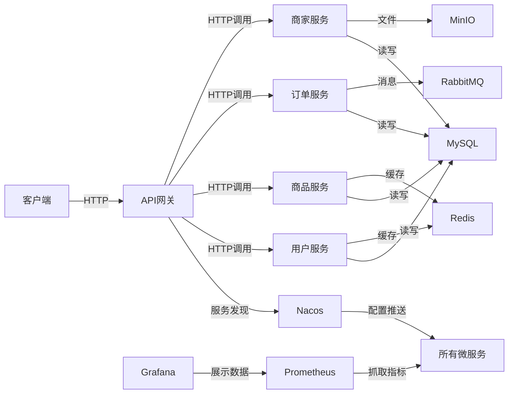
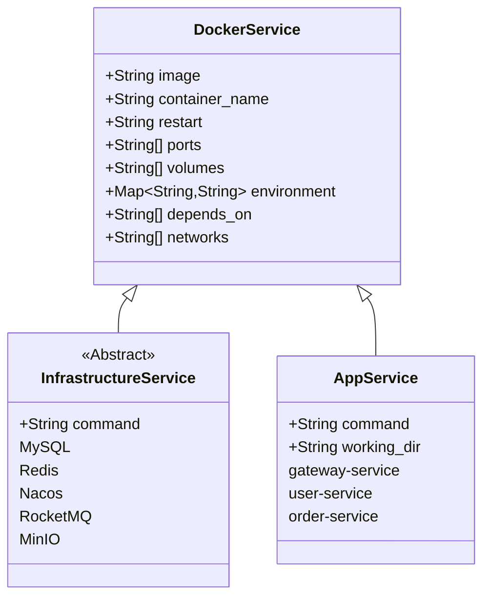
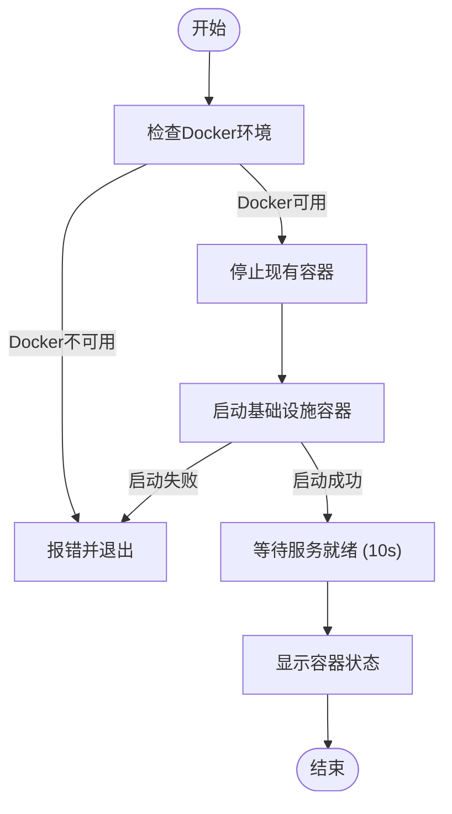
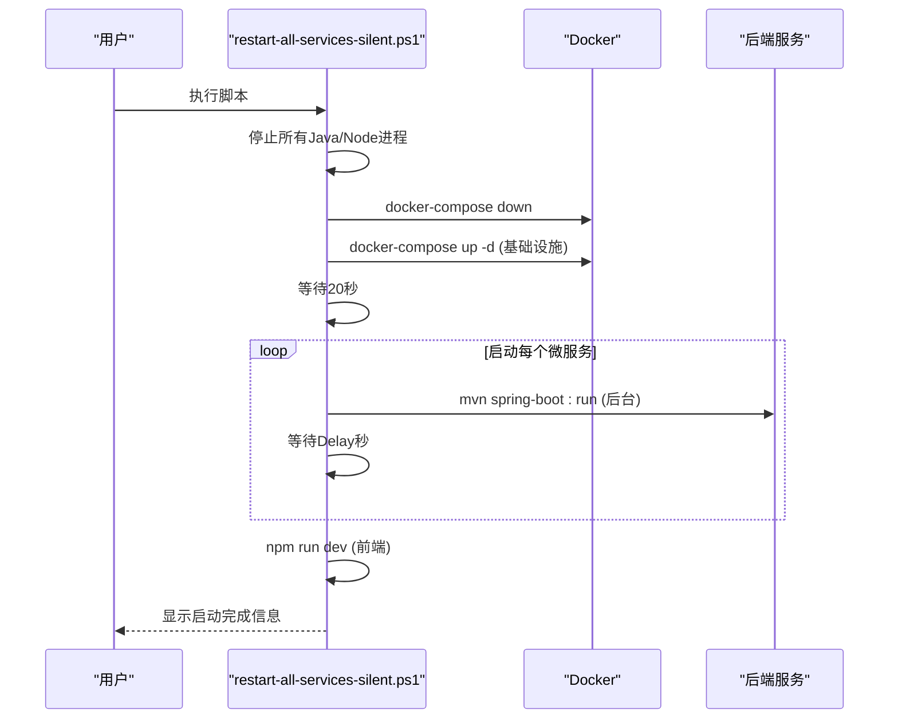
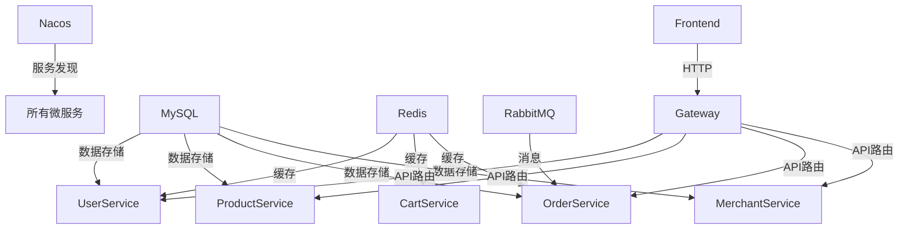

# 生产环境部署

<cite>
**本文档引用文件**  
- [docker-compose.yml](file://docker-compose.yml)
- [application-docker.yml](file://backend/admin-service/src/main/resources/application-docker.yml)
- [application-docker.yml](file://backend/cart-service/src/main/resources/application-docker.yml)
- [application-docker.yml](file://backend/merchant-service/src/main/resources/application-docker.yml)
- [application-docker.yml](file://backend/order-service/src/main/resources/application-docker.yml)
- [application-docker.yml](file://backend/user-service/src/main/resources/application-docker.yml)
- [start-docker.bat](file://start-docker.bat)
- [restart-service.ps1](file://restart-service.ps1)
- [restart-all-services-silent.ps1](file://restart-all-services-silent.ps1)
</cite>

## 目录
1. [简介](#简介)
2. [项目结构](#项目结构)
3. [核心组件](#核心组件)
4. [架构概览](#架构概览)
5. [详细组件分析](#详细组件分析)
6. [依赖分析](#依赖分析)
7. [性能考虑](#性能考虑)
8. [故障排查指南](#故障排查指南)
9. [结论](#结论)

## 简介
本文档旨在为 `springcloud-mall` 项目提供详尽的生产环境部署指南，重点阐述基于 `docker-compose.yml` 的服务编排最佳实践，涵盖资源限制、健康检查、重启策略、日志轮转和安全配置。深入解析各微服务的 `application-docker.yml` 生产级配置，包括数据库连接池优化、Redis集群配置、JWT令牌安全参数、分布式锁超时设置等关键参数。说明 `start-docker.bat` 的执行流程和依赖关系处理机制，并结合 `restart-service.ps1` 和 `restart-all-services-silent.ps1` 实现自动化运维。同时提供服务滚动更新、蓝绿部署、故障恢复等生产运维策略，以及安全加固、性能监控和容量规划指导。

## 项目结构
项目采用典型的前后端分离微服务架构，后端由多个Spring Boot微服务组成，前端使用Vue.js框架。基础设施通过Docker Compose统一编排，包含MySQL、Redis、Nacos、RocketMQ、MinIO等核心组件。自动化脚本（.bat和.ps1）用于服务的启动、停止和重启，日志和配置文件集中管理。

**Diagram sources**
- [docker-compose.yml](file://docker-compose.yml#L10-L467)

**Section sources**
- [docker-compose.yml](file://docker-compose.yml#L1-L485)

## 核心组件
本项目的核心组件包括：Nacos作为服务注册与配置中心，确保服务发现和配置动态更新；MySQL作为主数据库，存储所有业务数据；Redis作为分布式缓存，提升数据访问性能；RocketMQ作为消息中间件，实现服务间的异步解耦；MinIO提供对象存储服务，用于图片等文件的上传与管理；Prometheus和Grafana构成监控告警体系，保障系统稳定性。后端微服务通过Spring Cloud Alibaba实现服务治理，前端通过Vite构建，通过API网关与后端交互。

**Section sources**
- [docker-compose.yml](file://docker-compose.yml#L40-L467)

## 架构概览
系统采用微服务架构，所有服务通过Docker容器化部署。Nacos负责服务注册发现和配置管理，各微服务启动时从Nacos获取配置并注册自身实例。API网关（gateway-service）作为系统的唯一入口，接收前端请求并路由到相应的后端服务。服务间通过Feign或RestTemplate进行HTTP通信，部分场景使用RabbitMQ进行异步消息传递。数据存储采用MySQL，Redis用于缓存热点数据和会话管理。前端通过Vite开发服务器运行，与后端通过RESTful API交互。

**Diagram sources**
- [docker-compose.yml](file://docker-compose.yml#L40-L467)

## 详细组件分析

### Docker Compose 服务编排分析
`docker-compose.yml` 文件定义了18个服务和11个数据卷，构建了一个完整的生产级微服务运行环境。

#### 服务编排最佳实践

**Diagram sources**
- [docker-compose.yml](file://docker-compose.yml#L1-L485)

**Section sources**
- [docker-compose.yml](file://docker-compose.yml#L1-L485)

#### 资源限制与健康检查
在 `docker-compose.yml` 中，所有服务均配置了 `restart: always` 策略，确保容器在异常退出后能自动重启。虽然未显式设置CPU和内存限制，但通过JVM参数（如 `-Xmx512m`）间接控制了Java应用的内存使用。健康检查主要依赖于Spring Boot Actuator的 `/actuator/health` 端点，通过 `management.endpoint.health.show-details: always` 暴露详细健康信息。Nacos、MySQL等基础设施服务通过 `depends_on` 实现启动顺序依赖，确保服务按正确顺序启动。

#### 日志轮转与安全配置
日志配置在 `application-docker.yml` 中通过 `logging.file.name` 指定日志文件路径，结合外部日志管理工具（如ELK）实现日志轮转和集中分析。安全配置方面，所有服务通过环境变量注入敏感信息（如数据库密码），避免硬编码。容器间通信通过自定义的 `mall-network` 网络实现隔离，仅API网关和前端服务暴露端口到宿主机，其他服务仅在内部网络中通信，增强了安全性。

### 生产级配置分析
各微服务的 `application-docker.yml` 文件定义了生产环境下的具体配置。

#### 数据库连接池优化
在 `order-service` 的配置中，通过JPA的 `hibernate.jdbc.batch_size`、`order_inserts` 和 `order_updates` 参数优化了批量操作性能，减少了数据库交互次数。`cart-service` 和 `merchant-service` 配置了Lettuce连接池，设置了 `max-active: 8` 和 `max-idle: 8`，合理控制了Redis连接数，避免资源耗尽。

#### Redis集群与JWT安全
`cart-service` 使用Redis数据库1，`order-service` 使用数据库2，实现了不同服务间缓存数据的逻辑隔离。JWT安全参数在 `user-service` 和 `admin-service` 的代码中实现，通过 `JwtUtil` 类进行令牌的生成和验证，配置中通过 `security` 相关注解和过滤器实现权限控制。

#### 分布式锁超时设置
在 `order-service` 的 `application-docker.yml` 中，明确配置了 `order.lock-timeout-seconds: 30`，即分布式锁的超时时间为30秒。此配置用于防止在创建订单等关键操作中因服务崩溃导致锁无法释放，从而引发死锁。该参数与Redis的TTL机制配合，确保锁的最终释放。

**Section sources**
- [backend/admin-service/src/main/resources/application-docker.yml](file://backend/admin-service/src/main/resources/application-docker.yml#L1-L38)
- [backend/cart-service/src/main/resources/application-docker.yml](file://backend/cart-service/src/main/resources/application-docker.yml#L1-L51)
- [backend/merchant-service/src/main/resources/application-docker.yml](file://backend/merchant-service/src/main/resources/application-docker.yml#L1-L73)
- [backend/order-service/src/main/resources/application-docker.yml](file://backend/order-service/src/main/resources/application-docker.yml#L1-L110)
- [backend/user-service/src/main/resources/application-docker.yml](file://backend/user-service/src/main/resources/application-docker.yml#L1-L46)

### 启动与运维脚本分析
#### start-docker.bat 执行流程
`start-docker.bat` 脚本负责启动基础设施服务，其执行流程如下：
1.  **环境检查**：检查Docker是否安装并运行。
2.  **停止旧容器**：调用 `docker-compose -f docker-compose-dev.yml down` 停止可能存在的旧容器。
3.  **启动基础设施**：使用 `docker-compose up -d` 在后台启动MySQL、Redis、Nacos等基础设施容器。
4.  **等待与验证**：等待10秒后，通过 `docker-compose ps` 显示容器状态，提示用户Nacos初始化需要1-2分钟。

该脚本通过 `depends_on` 确保了服务的启动顺序，并通过 `timeout` 命令给予服务足够的初始化时间。

**Diagram sources**
- [start-docker.bat](file://start-docker.bat#L1-L61)

**Section sources**
- [start-docker.bat](file://start-docker.bat#L1-L61)

#### 自动化运维脚本
`restart-service.ps1` 和 `restart-all-services-silent.ps1` 实现了精细化的自动化运维。

`restart-service.ps1` 允许重启单个指定服务。其流程为：1) 停止占用服务端口的旧进程；2) 在日志文件中添加重启分隔符；3) 在后台启动新服务；4) 等待并验证服务是否成功启动。该脚本通过 `netstat` 检查端口占用，并通过 `Start-Process` 在后台静默运行，避免了命令行窗口的弹出。

`restart-all-services-silent.ps1` 则用于完整重启所有服务。其流程为：1) 停止所有Java、Node.js进程和Docker容器；2) 启动Docker基础设施；3) 按照预定义的依赖顺序（网关->认证->用户->...）依次启动所有微服务；4) 最后启动前端服务。该脚本通过 `Start-Process` 和 `mvn spring-boot:run` 在后台启动每个服务，并通过 `Start-Sleep` 控制启动间隔，确保服务依赖关系得到满足。

**Diagram sources**
- [restart-service.ps1](file://restart-service.ps1#L1-L212)
- [restart-all-services-silent.ps1](file://restart-all-services-silent.ps1#L1-L239)

**Section sources**
- [restart-service.ps1](file://restart-service.ps1#L1-L212)
- [restart-all-services-silent.ps1](file://restart-all-services-silent.ps1#L1-L239)

## 依赖分析
项目依赖关系清晰，分为基础设施依赖和微服务间依赖。

**Diagram sources**
- [docker-compose.yml](file://docker-compose.yml#L40-L467)

**Section sources**
- [docker-compose.yml](file://docker-compose.yml#L40-L467)

## 性能考虑
生产环境的性能优化主要体现在以下几个方面：
1.  **数据库优化**：通过JPA批量操作和索引优化（如 `order-service` 的 `V2__add_indexes.sql`）提升数据库性能。
2.  **缓存策略**：广泛使用Redis缓存，减少对数据库的直接访问，特别是用户会话和商品信息等热点数据。
3.  **异步处理**：利用RabbitMQ将订单创建、短信发送等耗时操作异步化，提升API响应速度。
4.  **连接池管理**：合理配置Redis和数据库连接池，避免连接泄漏和资源争用。
5.  **JVM调优**：通过 `-Xmx512m` 等JVM参数，为每个服务分配合适的内存，平衡性能和资源消耗。

## 故障排查指南
当服务出现故障时，可按以下步骤排查：
1.  **检查容器状态**：使用 `docker-compose ps` 查看所有容器的运行状态。
2.  **查看日志**：检查对应服务的日志文件（位于 `logs/` 目录）或使用 `tail-logs.ps1` 脚本查看实时日志。
3.  **验证端口占用**：使用 `netstat -ano | findstr :端口号` 检查端口是否被意外占用。
4.  **检查依赖服务**：确认Nacos、MySQL、Redis等依赖服务是否正常运行。
5.  **使用健康检查端点**：访问 `http://localhost:服务端口/actuator/health` 获取服务的详细健康信息。

**Section sources**
- [restart-service.ps1](file://restart-service.ps1#L1-L212)
- [tail-logs.ps1](file://tail-logs.ps1)

## 结论
本文档全面分析了 `springcloud-mall` 项目的生产环境部署方案。通过 `docker-compose.yml` 实现了基础设施和微服务的统一编排，`application-docker.yml` 提供了精细化的生产配置，而 `*.bat` 和 `*.ps1` 脚本则实现了自动化运维。该部署方案具备高可用性、可维护性和可扩展性，为系统的稳定运行提供了坚实基础。建议在实际生产环境中，进一步完善监控告警、CI/CD流水线和安全审计机制。