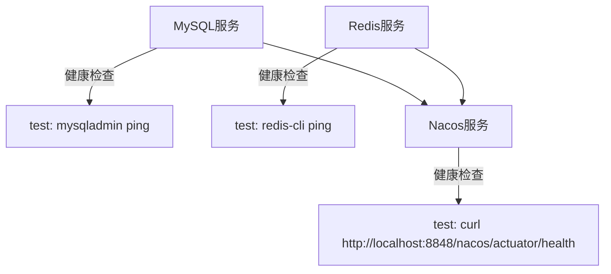
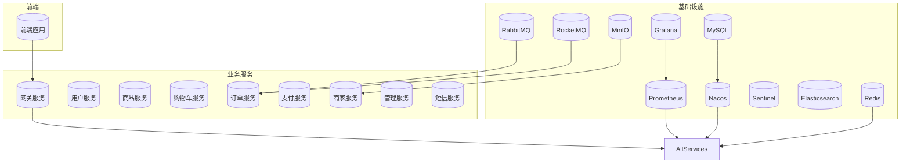
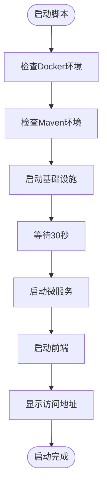
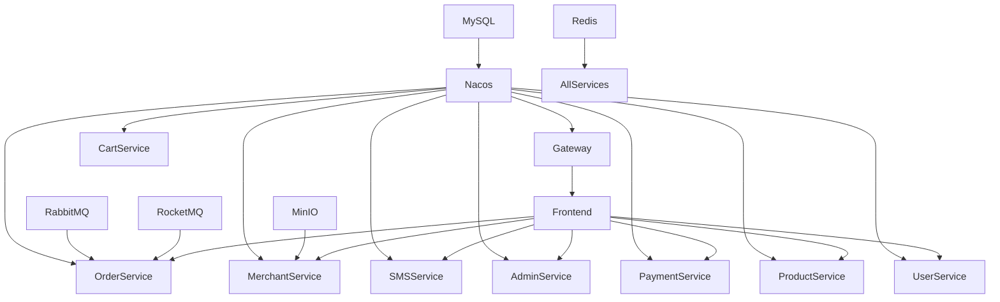
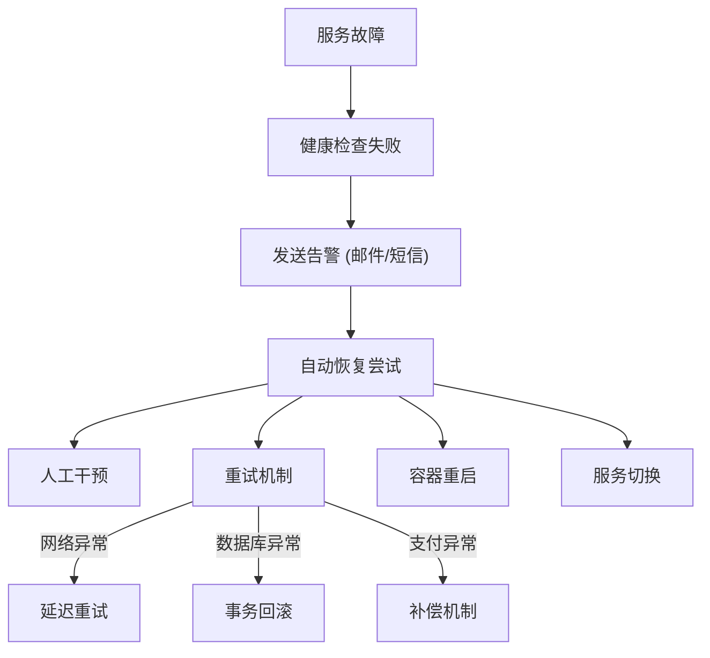

# 部署指南

<cite>
**本文档引用文件**  
- [docker-compose.yml](file://docker-compose.yml)
- [docker-compose-dev.yml](file://docker-compose-dev.yml)
- [start-all.bat](file://start-all.bat)
- [start-docker.bat](file://start-docker.bat)
- [backend/admin-service/src/main/resources/application-docker.yml](file://backend/admin-service/src/main/resources/application-docker.yml)
- [backend/cart-service/src/main/resources/application-docker.yml](file://backend/cart-service/src/main/resources/application-docker.yml)
- [backend/merchant-service/src/main/resources/application-docker.yml](file://backend/merchant-service/src/main/resources/application-docker.yml)
- [backend/order-service/src/main/resources/application-docker.yml](file://backend/order-service/src/main/resources/application-docker.yml)
- [backend/sms-service/src/main/resources/application-docker.yml](file://backend/sms-service/src/main/resources/application-docker.yml)
- [backend/user-service/src/main/resources/application-docker.yml](file://backend/user-service/src/main/resources/application-docker.yml)
</cite>

## 目录
1. [简介](#简介)
2. [开发环境部署](#开发环境部署)
3. [生产环境部署](#生产环境部署)
4. [服务编排与容器化](#服务编排与容器化)
5. [启动脚本使用说明](#启动脚本使用说明)
6. [服务依赖与启动顺序](#服务依赖与启动顺序)
7. [健康检查与故障恢复](#健康检查与故障恢复)
8. [常见部署问题排查](#常见部署问题排查)
9. [附录](#附录)

## 简介

本部署指南详细说明了在线商城系统的完整部署流程，涵盖开发环境与生产环境的配置、多服务容器编排、启动脚本使用、服务依赖管理、健康检查机制及常见问题解决方案。系统采用Spring Cloud微服务架构，通过Docker Compose实现基础设施与业务服务的统一编排，支持一键式部署与快速诊断。

系统核心组件包括：MySQL、Redis、Nacos、RocketMQ、MinIO、Prometheus、Grafana等基础设施，以及网关、用户、商品、订单、支付、商家、购物车、短信等微服务模块。前端基于Vue3 + Vite构建，通过Nginx反向代理对外提供服务。

**Section sources**
- [docker-compose.yml](file://docker-compose.yml#L1-L485)
- [README.md](file://README.md)

## 开发环境部署

开发环境使用 `docker-compose-dev.yml` 文件启动核心基础设施，包括MySQL、Redis和Nacos注册中心。该配置专为本地开发设计，仅包含必要的依赖服务，便于快速启动和调试。

### 基础设施配置

`docker-compose-dev.yml` 定义了以下服务：

- **MySQL**：使用 `mysql:8.0` 镜像，容器名为 `mall-mysql-dev`，宿主机端口 `3307` 映射到容器 `3306` 端口，数据卷 `mysql_dev_data` 持久化数据库数据。
- **Redis**：使用 `redis:7-alpine` 镜像，容器名为 `mall-redis-dev`，宿主机端口 `6379` 映射到容器 `6379` 端口，数据卷 `redis_dev_data` 持久化数据。
- **Nacos**：使用 `nacos/nacos-server:v2.3.0` 镜像，容器名为 `mall-nacos-dev`，宿主机端口 `8848` 和 `9848` 分别映射到容器对应端口，数据卷 `nacos_dev_logs` 存储日志。

所有服务通过自定义桥接网络 `mall-dev-network` 通信，确保容器间网络隔离与安全。

### 健康检查机制

开发环境配置了完善的健康检查机制，确保服务启动顺序正确：



**Diagram sources**
- [docker-compose-dev.yml](file://docker-compose-dev.yml#L25-L78)

Nacos服务通过 `depends_on` 条件等待MySQL和Redis健康后才启动，避免因依赖服务未就绪导致的启动失败。

### 启动流程

开发环境可通过 `start-dev.bat` 或 `start-dev-silent.bat` 脚本一键启动。脚本执行流程如下：

1. 检查Docker环境是否可用
2. 检查Maven环境是否配置
3. 使用 `docker compose -f docker-compose-dev.yml up -d` 启动基础设施
4. 等待30秒让服务初始化
5. 通过Maven依次启动各微服务（`mvn spring-boot:run`）
6. 启动前端开发服务器（`npm run dev`）

**Section sources**
- [docker-compose-dev.yml](file://docker-compose-dev.yml#L1-L92)
- [start-dev-silent.bat](file://start-dev-silent.bat#L1-L179)

## 生产环境部署

生产环境使用 `docker-compose.yml` 文件进行全量服务编排，包含所有基础设施和业务服务，适用于生产或预发布环境。

### 多服务容器编排

`docker-compose.yml` 定义了完整的微服务架构，共包含25个服务：



**Diagram sources**
- [docker-compose.yml](file://docker-compose.yml#L1-L485)

### 生产环境配置最佳实践

基于 `application-docker.yml` 的生产环境配置遵循以下最佳实践：

#### 服务间通信

所有微服务通过Nacos注册中心实现服务发现与通信。服务配置中指定Nacos地址为容器网络内的 `nacos:8848`，确保容器间通过内部DNS解析通信，避免网络延迟。

```yaml
spring:
  cloud:
    nacos:
      discovery:
        server-addr: nacos:8848
        namespace: docker
```

#### 端口映射

生产环境严格控制端口暴露：
- 仅网关服务暴露宿主机 `8080` 端口
- MySQL、Redis、Nacos等基础设施暴露必要端口用于管理
- 其他微服务仅在容器网络内通信，不暴露宿主机端口

#### 环境变量设置

通过环境变量实现配置外部化，避免敏感信息硬编码：

```yaml
environment:
  SPRING_PROFILES_ACTIVE: "docker"
  SPRING_CLOUD_NACOS_DISCOVERY_SERVER_ADDR: "nacos:8848"
  SPRING_DATA_REDIS_HOST: "redis"
  SPRING_DATA_REDIS_PORT: "6379"
  MYSQL_SERVICE_PASSWORD: "123456"
```

#### 资源限制与健康检查

为关键服务配置资源限制和健康检查，确保系统稳定性：

```yaml
healthcheck:
  test: ["CMD", "curl", "-f", "http://localhost:8080/actuator/health"]
  interval: 30s
  timeout: 10s
  retries: 3
  start_period: 60s
```

**Section sources**
- [docker-compose.yml](file://docker-compose.yml#L1-L485)
- [backend/admin-service/src/main/resources/application-docker.yml](file://backend/admin-service/src/main/resources/application-docker.yml#L1-L38)
- [backend/cart-service/src/main/resources/application-docker.yml](file://backend/cart-service/src/main/resources/application-docker.yml#L1-L51)

## 服务编排与容器化

系统采用Docker Compose实现多服务容器编排，通过声明式YAML文件定义服务依赖、网络配置、数据卷挂载等。

### 网络配置

所有服务通过自定义桥接网络 `mall-network` 通信：

```yaml
networks:
  mall-network:
    driver: bridge
```

该网络确保：
- 服务间通过容器名直接通信（如 `redis`、`mysql`）
- 网络隔离，提高安全性
- 支持服务发现和负载均衡

### 数据卷管理

使用命名数据卷实现数据持久化：

```yaml
volumes:
  mysql_data:
  redis_data:
  nacos_logs:
  # ... 其他数据卷
```

数据卷优势：
- 数据与容器生命周期解耦
- 重启容器不丢失数据
- 支持数据备份与迁移

### 服务依赖管理

通过 `depends_on` 指令定义服务启动依赖：

```yaml
depends_on:
  - mysql
  - nacos
  - redis
```

对于需要等待依赖服务完全就绪的场景，结合健康检查使用：

```yaml
depends_on:
  mysql:
    condition: service_healthy
```

### 容器镜像与启动命令

微服务使用 `eclipse-temurin:17-jre` 基础镜像，通过挂载宿主机JAR包并执行 `java -jar` 启动：

```yaml
image: eclipse-temurin:17-jre
volumes:
  - ./backend/admin-service/target:/app
working_dir: /app
command: ["java", "-Xmx512m", "-Xms256m", "-jar", "/app/admin-service-1.0.0.jar"]
```

前端使用 `node:18-alpine` 镜像，通过Vite开发服务器运行：

```yaml
image: node:18-alpine
command: ["sh", "-c", "npm install && npm run dev -- --host 0.0.0.0"]
```

**Section sources**
- [docker-compose.yml](file://docker-compose.yml#L1-L485)
- [docker-compose-dev.yml](file://docker-compose-dev.yml#L1-L92)

## 启动脚本使用说明

系统提供多个启动脚本，满足不同场景需求。

### 脚本列表

| 脚本名称 | 用途 | 运行方式 |
|---------|------|---------|
| `start-all.bat` | 完整启动（基础设施 + 微服务 + 前端） | 双击运行或命令行执行 |
| `start-dev.bat` | 开发环境启动（仅基础设施） | 双击运行 |
| `start-dev-silent.bat` | 静默启动开发环境 | 双击运行 |
| `start-docker.bat` | 仅启动Docker基础设施 | 双击运行 |
| `start-all-services.ps1` | PowerShell版完整启动 | PowerShell执行 |
| `start-docker-services.ps1` | PowerShell版Docker启动 | PowerShell执行 |

### 参数配置

启动脚本通过环境变量和配置文件实现参数化：

#### 环境变量

```bat
set "PROJECT_DIR=%~dp0"
set "BACKEND_DIR=%PROJECT_DIR%backend"
set "FRONTEND_DIR=%PROJECT_DIR%frontend"
set "LOGS_DIR=%PROJECT_DIR%logs"
```

#### 服务配置

通过字符串拼接定义服务启动配置：

```bat
set "SERVICES_CONFIG="
set "SERVICES_CONFIG=!SERVICES_CONFIG!gateway-service:8080:simple:5;"
set "SERVICES_CONFIG=!SERVICES_CONFIG!user-service:8082::3;"
```

格式：`服务名:端口:配置文件:启动延迟(秒)`

### 使用方法

#### 完整启动流程



**Diagram sources**
- [start-all.bat](file://start-all.bat#L1-L179)

#### 访问地址

启动完成后，可通过以下地址访问系统：

- **前端**：http://localhost:5173
- **网关**：http://localhost:8080
- **Nacos**：http://localhost:8848/nacos (nacos/nacos)
- **MySQL**：localhost:3307 (root/123456)
- **Redis**：localhost:6379

**Section sources**
- [start-all.bat](file://start-all.bat#L1-L179)
- [start-docker.bat](file://start-docker.bat#L1-L60)

## 服务依赖与启动顺序

系统存在明确的服务依赖关系，正确的启动顺序对系统稳定性至关重要。

### 依赖关系图



**Diagram sources**
- [docker-compose.yml](file://docker-compose.yml#L1-L485)

### 启动顺序策略

系统采用分阶段启动策略：

1. **基础设施启动**（20秒）
   - MySQL → Redis → Nacos（按健康检查顺序）

2. **网关服务启动**（5秒）
   - 优先启动网关，作为其他服务的注册中心客户端

3. **认证与核心服务启动**（3秒/个）
   - 用户服务 → 商品服务 → 购物车服务

4. **业务服务启动**（3秒/个）
   - 订单服务 → 支付服务 → 商家服务 → 管理服务 → 短信服务

5. **前端启动**（10秒）
   - 等待后端服务就绪后启动前端

### 故障恢复策略

当服务启动失败时，系统提供以下恢复策略：

- **自动重试**：脚本检测到启动失败后，可配置重试机制
- **日志分析**：所有服务日志输出到 `logs/` 目录，便于问题排查
- **健康检查**：通过 `check-services-silent.ps1` 脚本检查服务健康状态
- **手动重启**：使用 `restart-service.ps1` 脚本重启指定服务

**Section sources**
- [UPDATE_SUMMARY.md](file://UPDATE_SUMMARY.md#L308-L316)
- [SERVICE_COMPLETION_SUMMARY.md](file://SERVICE_COMPLETION_SUMMARY.md#L127-L135)

## 健康检查与故障恢复

系统配置了多层次的健康检查机制，确保服务稳定运行。

### 容器健康检查

在 `docker-compose.yml` 中为关键服务配置健康检查：

```yaml
healthcheck:
  test: ["CMD", "curl", "-f", "http://localhost:8080/actuator/health"]
  interval: 30s
  timeout: 10s
  retries: 3
  start_period: 60s
```

健康检查类型：
- **MySQL**：`mysqladmin ping`
- **Redis**：`redis-cli ping`
- **Nacos**：`curl http://localhost:8848/nacos/actuator/health`
- **微服务**：`curl http://localhost:端口/actuator/health`

### 应用健康检查

微服务通过Spring Boot Actuator提供健康检查端点：

```yaml
management:
  endpoints:
    web:
      exposure:
        include: health,info,metrics
  endpoint:
    health:
      show-details: always
```

健康检查内容包括：
- 数据库连接
- Redis连接
- 磁盘空间
- 自定义业务健康检查

### 故障恢复机制

系统实现多级故障恢复策略：



**Diagram sources**
- [backend/product-service/src/main/java/com/mall/product/service/impl/StockCompensationServiceImpl.java](file://backend/product-service/src/main/java/com/mall/product/service/impl/StockCompensationServiceImpl.java#L386-L518)
- [backend/payment-service/src/main/java/com/mall/payment/task/PaymentScheduledTask.java](file://backend/payment-service/src/main/java/com/mall/payment/task/PaymentScheduledTask.java#L274-L322)

#### 网络异常处理

对于网络异常，系统采用指数退避重试策略：

```java
if (retryCount < NETWORK_MAX_RETRY) {
    networkRetryCount.put(key, retryCount + 1);
    scheduledExecutor.schedule(() -> {
        executeCompensation(compensationId);
    }, NETWORK_RETRY_DELAY, TimeUnit.MILLISECONDS);
}
```

#### 数据库异常处理

数据库操作失败时，执行事务回滚并创建补偿记录：

```java
record.setStatus("FAILED");
record.setFailReason("数据库操作失败");
// 创建回滚补偿记录
compensationService.createRollbackCompensation(originalId);
```

**Section sources**
- [backend/product-service/src/main/java/com/mall/product/service/impl/StockCompensationServiceImpl.java](file://backend/product-service/src/main/java/com/mall/product/service/impl/StockCompensationServiceImpl.java#L386-L518)
- [backend/payment-service/src/main/java/com/mall/payment/service/impl/RiskControlServiceImpl.java](file://backend/payment-service/src/main/java/com/mall/payment/service/impl/RiskControlServiceImpl.java#L665-L696)

## 常见部署问题排查

### 端口冲突

#### 问题现象
基础设施启动失败，提示端口被占用。

#### 检查方法
```powershell
netstat -ano | findstr "3307 6379 8848 8080 8081 8082 8083 8084 8085 8086 8087 8088 8089 5173"
```

#### 解决方案
```powershell
# 结束占用端口的进程
taskkill /PID <PID> /F
```

或修改 `docker-compose.yml` 中的端口映射。

### 网络配置错误

#### 问题现象
服务间无法通信，出现连接超时。

#### 检查方法
```bash
# 进入容器检查网络
docker exec -it mall-gateway-service ping redis
docker exec -it mall-gateway-service ping nacos
```

#### 解决方案
确保所有服务在同一自定义网络 `mall-network` 中，且服务名正确。

### 服务启动超时

#### 问题现象
Nacos或MySQL启动缓慢，导致依赖服务启动失败。

#### 解决方案
增加健康检查的 `start_period` 和 `retries`：

```yaml
healthcheck:
  start_period: 120s
  retries: 10
```

### Docker环境问题

#### 问题现象
脚本闪退，无任何输出。

#### 可能原因
1. **Docker Desktop未运行**：启动Docker Desktop并等待托盘图标变绿
2. **权限问题**：以管理员身份运行脚本
3. **路径问题**：项目路径包含中文或空格，移动到纯英文路径

#### 诊断工具
使用 `diagnose.bat` 脚本进行全面诊断：

```bash
diagnose.bat
```

该脚本会检查Docker、Maven、Java、端口占用等环境因素。

**Section sources**
- [TROUBLESHOOTING.md](file://TROUBLESHOOTING.md#L1-L85)
- [STARTUP_FIXES.md](file://STARTUP_FIXES.md#L135-L282)
- [QUICK_REFERENCE.md](file://QUICK_REFERENCE.md#L175-L182)

## 附录

### 系统要求

- **操作系统**：Windows 10/11
- **PowerShell**：5.1+
- **Docker Desktop**：最新版本
- **Maven**：3.6+
- **JDK**：17+
- **Node.js**：18+

### 端口要求

确保以下端口未被占用：

| 端口 | 服务 | 说明 |
|------|------|------|
| 3307 | MySQL | 数据库服务 |
| 6379 | Redis | 缓存服务 |
| 8848 | Nacos | 注册中心 |
| 9848 | Nacos | gRPC端口 |
| 8080 | 网关 | API入口 |
| 8081-8089 | 微服务 | 业务服务 |
| 5173 | 前端 | Vite开发服务器 |
| 8858 | Sentinel | 流控中心 |
| 9876 | RocketMQ | NameServer |
| 10911 | RocketMQ | Broker |

### 管理命令

```bash
# 检查服务状态
pwsh -File check-services-silent.ps1

# 查看日志
pwsh -File tail-logs.ps1 gateway-service

# 重启服务
pwsh -File restart-service.ps1 user-service

# 停止所有服务
docker compose -f docker-compose.yml down
```

**Section sources**
- [UPDATE_SUMMARY.md](file://UPDATE_SUMMARY.md#L322-L335)
- [QUICK_REFERENCE.md](file://QUICK_REFERENCE.md#L193-L203)
- [start-docker-services.ps1](file://start-docker-services.ps1#L1-L35)