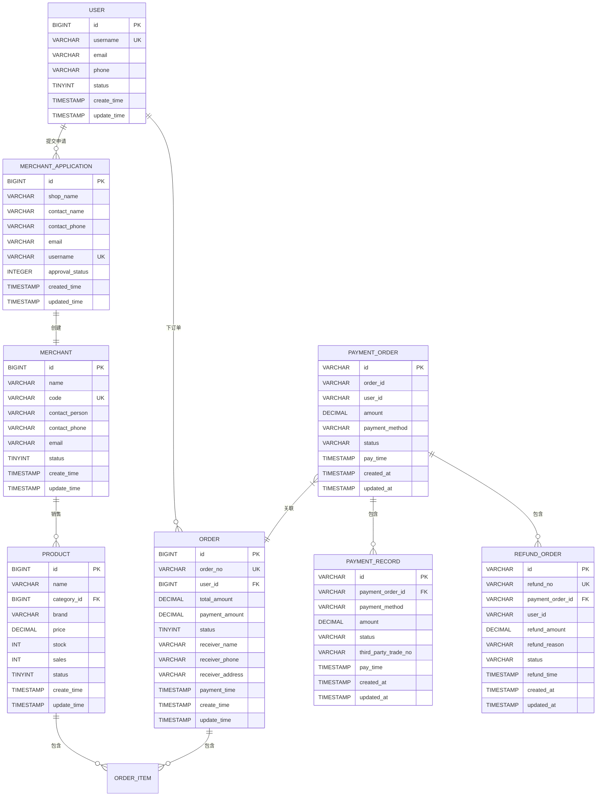

# 数据字典

<cite>
**本文档引用文件**   
- [数据字典.md](file://数据字典.md)
- [Product.java](file://backend/product-service/src/main/java/com/mall/product/domain/entity/Product.java)
- [Order.java](file://backend/order-service/src/main/java/com/mall/order/entity/Order.java)
- [MerchantApplication.java](file://backend/merchant-service/src/main/java/com/mall/merchant/domain/entity/MerchantApplication.java)
- [PaymentRecord.java](file://backend/payment-service/src/main/java/com/mall/payment/entity/PaymentRecord.java)
- [PaymentOrder.java](file://backend/payment-service/src/main/java/com/mall/payment/entity/PaymentOrder.java)
- [RefundOrder.java](file://backend/payment-service/src/main/java/com/mall/payment/entity/RefundOrder.java)
- [User.java](file://backend/user-service/src/main/java/com/mall/user/domain/entity/User.java)
- [Merchant.java](file://backend/merchant-service/src/main/java/com/mall/merchant/domain/entity/Merchant.java)
</cite>

## 目录
1. [概述](#概述)
2. [数据库架构](#数据库架构)
3. [用户实体](#用户实体)
4. [商品实体](#商品实体)
5. [订单实体](#订单实体)
6. [商家实体](#商家实体)
7. [支付实体](#支付实体)
8. [实体关系图](#实体关系图)
9. [公共字段说明](#公共字段说明)
10. [数据库设计原则](#数据库设计原则)

## 概述

本数据字典详细描述了基于SpringCloud的在线商城系统中所有核心实体的数据结构。文档结合MyBatis-Plus实体类和数据库初始化脚本，解释了用户、商品、订单、商家、支付记录等关键表的字段定义、数据类型、约束条件、索引策略和业务含义。文档同时服务于数据库管理员和开发人员，既可用于数据库维护，也可用于接口开发时的数据结构参考。

**本文档引用文件**  
- [数据字典.md](file://数据字典.md#L1-L474)

## 数据库架构

### 数据库列表

| 数据库名称    | 服务名称         | 描述               | 端口 |
| ------------- | ---------------- | ------------------ | ---- |
| mall_gateway  | gateway-service  | 网关服务数据库     | 8081 |
| mall_auth     | auth-service     | 认证授权服务数据库 | 8083 |
| mall_user     | user-service     | 用户服务数据库     | 8082 |
| mall_product  | product-service  | 商品服务数据库     | 8084 |
| mall_cart     | cart-service     | 购物车服务数据库   | 8089 |
| mall_order    | order-service    | 订单服务数据库     | 8085 |
| mall_payment  | payment-service  | 支付服务数据库     | 8086 |
| mall_merchant | merchant-service | 商户服务数据库     | 8087 |
| mall_admin    | admin-service    | 管理服务数据库     | 8088 |
| nacos         | nacos            | 配置中心数据库     | -    |

**本文档引用文件**  
- [数据字典.md](file://数据字典.md#L14-L28)

## 用户实体

### users 表

**表描述**: 用户基本信息表，存储系统用户的核心数据

| 字段名      | 数据类型  | 长度 | 是否为空 | 默认值                      | 主键 | 外键 | 索引    | 描述                     |
| ----------- | --------- | ---- | -------- | --------------------------- | ---- | ---- | ------- | ------------------------ |
| id          | BIGINT    | -    | NOT NULL | AUTO_INCREMENT              | ✓    | -    | PRIMARY | 用户唯一标识 ID          |
| username    | VARCHAR   | 50   | NOT NULL | -                           | -    | -    | UNIQUE  | 用户名，登录凭证         |
| password    | VARCHAR   | 255  | NOT NULL | -                           | -    | -    | -       | 加密后的用户密码         |
| email       | VARCHAR   | 100  | NULL     | -                           | -    | -    | INDEX   | 用户邮箱地址             |
| phone       | VARCHAR   | 20   | NULL     | -                           | -    | -    | INDEX   | 用户手机号码             |
| avatar      | VARCHAR   | 255  | NULL     | -                           | -    | -    | -       | 用户头像 URL             |
| nickname    | VARCHAR   | 50   | NULL     | -                           | -    | -    | -       | 用户昵称                 |
| gender      | TINYINT   | -    | NULL     | 0                           | -    | -    | -       | 性别：0-未知，1-男，2-女 |
| birthday    | DATE      | -    | NULL     | -                           | -    | -    | -       | 用户生日                 |
| status      | TINYINT   | -    | NOT NULL | 1                           | -    | -    | INDEX   | 用户状态：0-禁用，1-启用 |
| create_time | TIMESTAMP | -    | NOT NULL | CURRENT_TIMESTAMP           | -    | -    | INDEX   | 创建时间                 |
| update_time | TIMESTAMP | -    | NOT NULL | CURRENT_TIMESTAMP ON UPDATE | -    | -    | -       | 更新时间                 |

**索引信息**:
- PRIMARY KEY: `id`
- UNIQUE KEY: `username`
- INDEX: `email`, `phone`, `status`, `create_time`

**本文档引用文件**  
- [User.java](file://backend/user-service/src/main/java/com/mall/user/domain/entity/User.java#L12-L110)

## 商品实体

### products 表

**表描述**: 商品基本信息表，存储商品的核心数据

| 字段名             | 数据类型  | 长度 | 是否为空 | 默认值                      | 主键 | 外键 | 索引    | 描述                        |
| ------------------ | --------- | ---- | -------- | --------------------------- | ---- | ---- | ------- | --------------------------- |
| id                 | BIGINT    | -    | NOT NULL | AUTO_INCREMENT              | ✓    | -    | PRIMARY | 商品唯一标识 ID             |
| name               | VARCHAR   | 255  | NOT NULL | -                           | -    | -    | INDEX   | 商品名称                    |
| category_id        | BIGINT    | -    | NOT NULL | -                           | -    | ✓    | INDEX   | 分类 ID，关联 categories 表 |
| brand              | VARCHAR   | 100  | NULL     | -                           | -    | -    | INDEX   | 商品品牌                    |
| price              | DECIMAL   | 10,2 | NOT NULL | -                           | -    | -    | INDEX   | 商品价格                    |
| original_price     | DECIMAL   | 10,2 | NULL     | -                           | -    | -    | -       | 原价                        |
| stock              | INT       | -    | NOT NULL | 0                           | -    | -    | INDEX   | 库存数量                    |
| sales              | INT       | -    | NOT NULL | 0                           | -    | -    | INDEX   | 销量                        |
| main_image         | VARCHAR   | 255  | NULL     | -                           | -    | -    | -       | 主图 URL                    |
| images             | TEXT      | -    | NULL     | -                           | -    | -    | -       | 商品图片 JSON 数组          |
| description        | TEXT      | -    | NULL     | -                           | -    | -    | -       | 商品描述                    |
| specifications     | TEXT      | -    | NULL     | -                           | -    | -    | -       | 商品规格 JSON               |
| weight             | DECIMAL   | 8,2  | NULL     | -                           | -    | -    | -       | 商品重量(kg)                |
| status             | TINYINT   | -    | NOT NULL | 1                           | -    | -    | INDEX   | 状态：0-下架，1-上架        |
| create_time        | TIMESTAMP | -    | NOT NULL | CURRENT_TIMESTAMP           | -    | -    | INDEX   | 创建时间                    |
| update_time        | TIMESTAMP | -    | NOT NULL | CURRENT_TIMESTAMP ON UPDATE | -    | -    | -       | 更新时间                    |

**索引信息**:
- PRIMARY KEY: `id`
- INDEX: `name`, `category_id`, `brand`, `price`, `stock`, `sales`, `status`, `create_time`
- FOREIGN KEY: `category_id` REFERENCES `categories(id)`

**本文档引用文件**  
- [Product.java](file://backend/product-service/src/main/java/com/mall/product/domain/entity/Product.java#L11-L183)

## 订单实体

### orders 表

**表描述**: 订单主表，存储订单的基本信息

| 字段名               | 数据类型  | 长度 | 是否为空 | 默认值                      | 主键 | 外键 | 索引    | 描述                                                       |
| -------------------- | --------- | ---- | -------- | --------------------------- | ---- | ---- | ------- | ---------------------------------------------------------- |
| id                   | BIGINT    | -    | NOT NULL | AUTO_INCREMENT              | ✓    | -    | PRIMARY | 订单唯一标识 ID                                            |
| order_no             | VARCHAR   | 32   | NOT NULL | -                           | -    | -    | UNIQUE  | 订单编号                                                   |
| user_id              | BIGINT    | -    | NOT NULL | -                           | -    | -    | INDEX   | 用户 ID                                                    |
| total_amount         | DECIMAL   | 10,2 | NOT NULL | -                           | -    | -    | INDEX   | 订单总金额                                                 |
| payment_amount       | DECIMAL   | 10,2 | NOT NULL | -                           | -    | -    | -       | 实付金额                                                   |
| freight_amount       | DECIMAL   | 10,2 | NOT NULL | 0.00                        | -    | -    | -       | 运费                                                       |
| discount_amount      | DECIMAL   | 10,2 | NOT NULL | 0.00                        | -    | -    | -       | 优惠金额                                                   |
| payment_type         | TINYINT   | -    | NULL     | -                           | -    | -    | INDEX   | 支付方式：1-微信，2-支付宝，3-银行卡                       |
| status               | TINYINT   | -    | NOT NULL | 1                           | -    | -    | INDEX   | 订单状态：1-待付款，2-待发货，3-待收货，4-已完成，5-已取消 |
| receiver_name        | VARCHAR   | 50   | NOT NULL | -                           | -    | -    | -       | 收货人姓名                                                 |
| receiver_phone       | VARCHAR   | 20   | NOT NULL | -                           | -    | -    | -       | 收货人电话                                                 |
| receiver_address     | VARCHAR   | 500  | NOT NULL | -                           | -    | -    | -       | 收货地址                                                   |
| remark               | VARCHAR   | 500  | NULL     | -                           | -    | -    | -       | 订单备注                                                   |
| payment_time         | TIMESTAMP | -    | NULL     | -                           | -    | -    | INDEX   | 支付时间                                                   |
| delivery_time        | TIMESTAMP | -    | NULL     | -                           | -    | -    | -       | 发货时间                                                   |
| receive_time         | TIMESTAMP | -    | NULL     | -                           | -    | -    | -       | 收货时间                                                   |
| create_time          | TIMESTAMP | -    | NOT NULL | CURRENT_TIMESTAMP           | -    | -    | INDEX   | 创建时间                                                   |
| update_time          | TIMESTAMP | -    | NOT NULL | CURRENT_TIMESTAMP ON UPDATE | -    | -    | -       | 更新时间                                                   |

**索引信息**:
- PRIMARY KEY: `id`
- UNIQUE KEY: `order_no`
- INDEX: `user_id`, `total_amount`, `payment_type`, `status`, `payment_time`, `create_time`

### order_items 表

**表描述**: 订单商品明细表，存储订单中的商品详情

| 字段名         | 数据类型  | 长度 | 是否为空 | 默认值                      | 主键 | 外键 | 索引    | 描述                    |
| -------------- | --------- | ---- | -------- | --------------------------- | ---- | ---- | ------- | ----------------------- |
| id             | BIGINT    | -    | NOT NULL | AUTO_INCREMENT              | ✓    | -    | PRIMARY | 明细唯一标识 ID         |
| order_id       | BIGINT    | -    | NOT NULL | -                           | -    | ✓    | INDEX   | 订单 ID，关联 orders 表 |
| product_id     | BIGINT    | -    | NOT NULL | -                           | -    | -    | INDEX   | 商品 ID                 |
| product_name   | VARCHAR   | 255  | NOT NULL | -                           | -    | -    | -       | 商品名称                |
| product_image  | VARCHAR   | 255  | NULL     | -                           | -    | -    | -       | 商品图片                |
| price          | DECIMAL   | 10,2 | NOT NULL | -                           | -    | -    | -       | 商品单价                |
| quantity       | INT       | -    | NOT NULL | -                           | -    | -    | -       | 购买数量                |
| total_price    | DECIMAL   | 10,2 | NOT NULL | -                           | -    | -    | -       | 小计金额                |
| specifications | VARCHAR   | 500  | NULL     | -                           | -    | -    | -       | 商品规格                |
| create_time    | TIMESTAMP | -    | NOT NULL | CURRENT_TIMESTAMP           | -    | -    | -       | 创建时间                |
| update_time    | TIMESTAMP | -    | NOT NULL | CURRENT_TIMESTAMP ON UPDATE | -    | -    | -       | 更新时间                |

**索引信息**:
- PRIMARY KEY: `id`
- INDEX: `order_id`, `product_id`
- FOREIGN KEY: `order_id` REFERENCES `orders(id)`

**本文档引用文件**  
- [Order.java](file://backend/order-service/src/main/java/com/mall/order/entity/Order.java#L11-L297)

## 商家实体

### merchants 表

**表描述**: 商户基本信息表

| 字段名           | 数据类型  | 长度 | 是否为空 | 默认值                      | 主键 | 外键 | 索引    | 描述                 |
| ---------------- | --------- | ---- | -------- | --------------------------- | ---- | ---- | ------- | -------------------- |
| id               | BIGINT    | -    | NOT NULL | AUTO_INCREMENT              | ✓    | -    | PRIMARY | 商户唯一标识 ID      |
| name             | VARCHAR   | 100  | NOT NULL | -                           | -    | -    | INDEX   | 商户名称             |
| code             | VARCHAR   | 50   | NOT NULL | -                           | -    | -    | UNIQUE  | 商户编码             |
| contact_person   | VARCHAR   | 50   | NOT NULL | -                           | -    | -    | -       | 联系人               |
| contact_phone    | VARCHAR   | 20   | NOT NULL | -                           | -    | -    | INDEX   | 联系电话             |
| email            | VARCHAR   | 100  | NULL     | -                           | -    | -    | -       | 邮箱地址             |
| address          | VARCHAR   | 255  | NULL     | -                           | -    | -    | -       | 商户地址             |
| business_license | VARCHAR   | 255  | NULL     | -                           | -    | -    | -       | 营业执照             |
| status           | TINYINT   | -    | NOT NULL | 1                           | -    | -    | INDEX   | 状态：0-禁用，1-启用 |
| create_time      | TIMESTAMP | -    | NOT NULL | CURRENT_TIMESTAMP           | -    | -    | -       | 创建时间             |
| update_time      | TIMESTAMP | -    | NOT NULL | CURRENT_TIMESTAMP ON UPDATE | -    | -    | -       | 更新时间             |

**索引信息**:
- PRIMARY KEY: `id`
- UNIQUE KEY: `code`
- INDEX: `name`, `contact_phone`, `status`

### merchant_applications 表

**表描述**: 商家入驻申请表

| 字段名             | 数据类型      | 长度  | 是否为空 | 默认值                      | 主键 | 外键 | 索引    | 描述                                                         |
| ------------------ | ------------- | ----- | -------- | --------------------------- | ---- | ---- | ------- | ------------------------------------------------------------ |
| id                 | BIGINT        | -     | NOT NULL | AUTO_INCREMENT              | ✓    | -    | PRIMARY | 申请唯一标识 ID                                              |
| entity_type        | VARCHAR       | 20    | NOT NULL | -                           | -    | -    | -       | 主体类型：enterprise-企业, individual-个体, personal-个人    |
| shop_type          | VARCHAR       | 20    | NULL     | -                           | -    | -    | -       | 店铺类型                                                     |
| shop_name          | VARCHAR       | 100   | NOT NULL | -                           | -    | -    | INDEX   | 店铺名称                                                     |
| contact_name       | VARCHAR       | 50    | NOT NULL | -                           | -    | -    | -       | 联系人姓名                                                   |
| contact_phone      | VARCHAR       | 20    | NOT NULL | -                           | -    | -    | INDEX   | 联系电话                                                     |
| email              | VARCHAR       | 100   | NULL     | -                           | -    | -    | -       | 邮箱地址                                                     |
| company_name       | VARCHAR       | 100   | NULL     | -                           | -    | -    | -       | 公司名称                                                     |
| credit_code        | VARCHAR       | 18    | NULL     | -                           | -    | -    | -       | 统一社会信用代码                                             |
| legal_person       | VARCHAR       | 50    | NULL     | -                           | -    | -    | -       | 法人代表                                                     |
| business_license   | VARCHAR       | 500   | NULL     | -                           | -    | -    | -       | 营业执照图片URL                                              |
| id_card            | VARCHAR       | 18    | NULL     | -                           | -    | -    | -       | 身份证号                                                     |
| id_card_front      | VARCHAR       | 500   | NULL     | -                           | -    | -    | -       | 身份证正面照片URL                                            |
| id_card_back       | VARCHAR       | 500   | NULL     | -                           | -    | -    | -       | 身份证反面照片URL                                            |
| username           | VARCHAR       | 50    | NOT NULL | -                           | -    | -    | UNIQUE  | 登录账号                                                     |
| password           | VARCHAR       | 255   | NOT NULL | -                           | -    | -    | -       | 登录密码（加密）                                             |
| approval_status    | INT           | -     | NULL     | 0                           | -    | -    | INDEX   | 审批状态：0-待审批，1-已通过，2-已拒绝                      |
| approval_reason    | TEXT          | -     | NULL     | -                           | -    | -    | -       | 审批备注                                                     |
| approval_time      | TIMESTAMP     | -     | NULL     | -                           | -    | -    | -       | 审批时间                                                     |
| approval_by        | BIGINT        | -     | NULL     | -                           | -    | -    | -       | 审批人ID                                                     |
| approval_by_name   | VARCHAR       | 50    | NULL     | -                           | -    | -    | -       | 审批人用户名                                                 |
| merchant_id        | BIGINT        | -     | NULL     | -                           | -    | -    | -       | 关联的商家ID（审批通过后创建）                               |
| sms_sent           | BOOLEAN       | -     | NULL     | false                       | -    | -    | -       | 短信是否已发送                                               |
| sms_sent_time      | TIMESTAMP     | -     | NULL     | -                           | -    | -    | -       | 短信发送时间                                                 |
| sms_retry_count    | INT           | -     | NULL     | 0                           | -    | -    | -       | 短信重试次数                                                 |
| remark             | VARCHAR       | 500   | NULL     | -                           | -    | -    | -       | 备注                                                         |
| created_time       | TIMESTAMP     | -     | NOT NULL | CURRENT_TIMESTAMP           | -    | -    | INDEX   | 创建时间                                                     |
| updated_time       | TIMESTAMP     | -     | NOT NULL | CURRENT_TIMESTAMP ON UPDATE | -    | -    | -       | 更新时间                                                     |

**索引信息**:
- PRIMARY KEY: `id`
- UNIQUE KEY: `username`
- INDEX: `shop_name`, `contact_phone`, `approval_status`, `created_time`

**本文档引用文件**  
- [Merchant.java](file://backend/merchant-service/src/main/java/com/mall/merchant/domain/entity/Merchant.java#L10-L606)
- [MerchantApplication.java](file://backend/merchant-service/src/main/java/com/mall/merchant/domain/entity/MerchantApplication.java#L9-L187)

## 支付实体

### payment_orders 表

**表描述**: 支付订单表，存储支付订单的基本信息

| 字段名               | 数据类型      | 长度  | 是否为空 | 默认值                      | 主键 | 外键 | 索引    | 描述                                                         |
| -------------------- | ------------- | ----- | -------- | --------------------------- | ---- | ---- | ------- | ------------------------------------------------------------ |
| id                   | VARCHAR       | 36    | NOT NULL | UUID                        | ✓    | -    | PRIMARY | 支付订单ID - 主键，使用UUID生成                              |
| order_id             | VARCHAR       | 64    | NOT NULL | -                           | -    | -    | INDEX   | 业务订单ID - 关联的业务订单编号                              |
| user_id              | VARCHAR       | 36    | NOT NULL | -                           | -    | -    | INDEX   | 用户ID - 发起支付的用户                                      |
| amount               | DECIMAL       | 15,2  | NOT NULL | -                           | -    | -    | INDEX   | 支付金额 - 以分为单位存储，避免精度问题                      |
| payment_method       | VARCHAR       | 20    | NOT NULL | -                           | -    | -    | INDEX   | 支付方式 - 使用枚举类型                                      |
| status               | VARCHAR       | 20    | NOT NULL | PENDING                     | -    | -    | INDEX   | 支付状态 - 使用枚举类型                                      |
| description          | VARCHAR       | 255   | NULL     | -                           | -    | -    | -       | 支付描述 - 支付订单的描述信息                                |
| return_url           | VARCHAR       | 500   | NULL     | -                           | -    | -    | -       | 支付成功后的返回URL                                          |
| notify_url           | VARCHAR       | 500   | NULL     | -                           | -    | -    | -       | 异步通知URL                                                  |
| expire_time          | TIMESTAMP     | -     | NULL     | -                           | -    | -    | -       | 支付过期时间 - 超过此时间支付订单自动失效                    |
| third_party_order_no | VARCHAR       | 64    | NULL     | -                           | -    | -    | -       | 第三方支付订单号 - 来自支付宝、微信等第三方平台的订单号      |
| pay_time             | TIMESTAMP     | -     | NULL     | -                           | -    | -    | -       | 支付完成时间                                                 |
| actual_amount        | DECIMAL       | 15,2  | NULL     | -                           | -    | -    | -       | 实际支付金额 - 可能与订单金额不同（优惠券、折扣等）          |
| fee_amount           | DECIMAL       | 15,2  | NULL     | -                           | -    | -    | -       | 手续费 - 支付渠道收取的手续费                                |
| channel_response     | TEXT          | -     | NULL     | -                           | -    | -    | -       | 支付渠道响应数据 - JSON格式存储第三方返回的原始数据          |
| failure_reason       | VARCHAR       | 500   | NULL     | -                           | -    | -    | -       | 失败原因 - 支付失败时的错误信息                              |
| retry_count          | INT           | -     | NULL     | 0                           | -    | -    | -       | 重试次数 - 支付失败后的重试次数                              |
| created_at           | TIMESTAMP     | -     | NOT NULL | CURRENT_TIMESTAMP           | -    | -    | INDEX   | 创建时间 - 自动设置                                          |
| updated_at           | TIMESTAMP     | -     | NOT NULL | CURRENT_TIMESTAMP ON UPDATE | -    | -    | -       | 更新时间 - 自动更新                                          |
| deleted              | BOOLEAN       | -     | NOT NULL | false                       | -    | -    | -       | 删除标记 - 软删除标记，false表示未删除，true表示已删除       |

**索引信息**:
- PRIMARY KEY: `id`
- INDEX: `order_id`, `user_id`, `status`, `created_at`

### payment_records 表

**表描述**: 支付记录表，记录每次支付操作的详细信息

| 字段名               | 数据类型      | 长度  | 是否为空 | 默认值                      | 主键 | 外键 | 索引    | 描述                                                         |
| -------------------- | ------------- | ----- | -------- | --------------------------- | ---- | ---- | ------- | ------------------------------------------------------------ |
| id                   | VARCHAR       | 36    | NOT NULL | UUID                        | ✓    | -    | PRIMARY | 支付记录ID - 主键，使用UUID生成                              |
| payment_order_id     | VARCHAR       | 36    | NOT NULL | -                           | -    | ✓    | INDEX   | 支付订单ID - 关联的支付订单                                  |
| payment_method       | VARCHAR       | 20    | NOT NULL | -                           | -    | -    | -       | 支付方式 - 本次支付使用的方式                                |
| amount               | DECIMAL       | 15,2  | NOT NULL | -                           | -    | -    | INDEX   | 支付金额 - 本次支付的金额                                    |
| status               | VARCHAR       | 20    | NOT NULL | PENDING                     | -    | -    | INDEX   | 支付状态 - 本次支付的状态                                    |
| third_party_trade_no | VARCHAR       | 64    | NULL     | -                           | -    | -    | INDEX   | 第三方交易号 - 支付渠道返回的交易流水号                      |
| payment_channel      | VARCHAR       | 50    | NULL     | -                           | -    | -    | -       | 支付渠道 - 具体的支付渠道标识                                |
| request_params       | TEXT          | -     | NULL     | -                           | -    | -    | -       | 支付请求参数 - JSON格式存储发送给第三方的请求参数            |
| response_data        | TEXT          | -     | NULL     | -                           | -    | -    | -       | 支付响应数据 - JSON格式存储第三方返回的响应数据              |
| pay_time             | TIMESTAMP     | -     | NULL     | -                           | -    | -    | -       | 支付完成时间 - 第三方确认支付成功的时间                      |
| fee_amount           | DECIMAL       | 15,2  | NULL     | -                           | -    | -    | -       | 手续费 - 本次支付产生的手续费                                |
| error_code           | VARCHAR       | 50    | NULL     | -                           | -    | -    | -       | 错误代码 - 支付失败时的错误代码                              |
| error_message        | VARCHAR       | 500   | NULL     | -                           | -    | -    | -       | 错误信息 - 支付失败时的详细错误信息                          |
| retry_count          | INT           | -     | NULL     | 0                           | -    | -    | -       | 重试次数 - 当前记录的重试次数                                |
| client_ip            | VARCHAR       | 45    | NULL     | -                           | -    | -    | -       | 客户端IP - 发起支付的客户端IP地址                            |
| user_agent           | VARCHAR       | 500   | NULL     | -                           | -    | -    | -       | 用户代理 - 客户端浏览器信息                                  |
| device_info          | VARCHAR       | 200   | NULL     | -                           | -    | -    | -       | 设备信息 - 支付设备的相关信息                                |
| action               | VARCHAR       | 100   | NULL     | -                           | -    | -    | -       | 操作类型 - 记录本次支付记录的操作类型                        |
| description          | VARCHAR       | 500   | NULL     | -                           | -    | -    | -       | 操作描述 - 记录本次支付记录的详细描述                        |
| remark               | VARCHAR       | 500   | NULL     | -                           | -    | -    | -       | 备注信息 - 额外的备注说明                                    |
| created_at           | TIMESTAMP     | -     | NOT NULL | CURRENT_TIMESTAMP           | -    | -    | INDEX   | 创建时间 - 自动设置                                          |
| updated_at           | TIMESTAMP     | -     | NOT NULL | CURRENT_TIMESTAMP ON UPDATE | -    | -    | -       | 更新时间 - 自动更新                                          |

**索引信息**:
- PRIMARY KEY: `id`
- INDEX: `payment_order_id`, `third_party_trade_no`, `status`, `created_at`
- FOREIGN KEY: `payment_order_id` REFERENCES `payment_orders(id)`

### refund_orders 表

**表描述**: 退款订单表，存储退款申请的基本信息

| 字段名                 | 数据类型      | 长度  | 是否为空 | 默认值                      | 主键 | 外键 | 索引    | 描述                                                         |
| ---------------------- | ------------- | ----- | -------- | --------------------------- | ---- | ---- | ------- | ------------------------------------------------------------ |
| id                     | VARCHAR       | 36    | NOT NULL | UUID                        | ✓    | -    | PRIMARY | 退款订单ID - 主键，使用UUID生成                              |
| refund_no              | VARCHAR       | 64    | NOT NULL | -                           | -    | -    | UNIQUE  | 退款单号 - 业务退款单号，用于对外展示                        |
| payment_order_id       | VARCHAR       | 36    | NOT NULL | -                           | -    | ✓    | INDEX   | 支付订单ID - 关联的支付订单                                  |
| user_id                | VARCHAR       | 36    | NOT NULL | -                           | -    | -    | -       | 用户ID - 申请退款的用户                                      |
| refund_amount          | DECIMAL       | 15,2  | NOT NULL | -                           | -    | -    | INDEX   | 退款金额 - 申请退款的金额                                    |
| refund_reason          | VARCHAR       | 500   | NOT NULL | -                           | -    | -    | -       | 退款原因 - 用户填写的退款原因                                |
| refund_type            | INT           | -     | NOT NULL | 1                           | -    | -    | -       | 退款类型 - 1:用户申请 2:系统自动 3:客服处理                  |
| status                 | VARCHAR       | 20    | NOT NULL | PENDING_REVIEW              | -    | -    | INDEX   | 退款状态 - 使用枚举类型                                      |
| reviewer_id            | VARCHAR       | 36    | NULL     | -                           | -    | -    | -       | 审核人ID - 审核退款申请的管理员ID                            |
| review_time            | TIMESTAMP     | -     | NULL     | -                           | -    | -    | -       | 审核时间 - 审核完成的时间                                    |
| review_remark          | VARCHAR       | 500   | NULL     | -                           | -    | -    | -       | 审核备注 - 审核时的备注信息                                  |
| processor_id           | VARCHAR       | 36    | NULL     | -                           | -    | -    | -       | 处理人ID - 实际处理退款的操作员ID                            |
| process_time           | TIMESTAMP     | -     | NULL     | -                           | -    | -    | -       | 处理时间 - 开始处理退款的时间                                |
| refund_time            | TIMESTAMP     | -     | NULL     | -                           | -    | -    | -       | 退款完成时间 - 退款成功的时间                                |
| actual_refund_amount   | DECIMAL       | 15,2  | NULL     | -                           | -    | -    | -       | 实际退款金额 - 最终实际退款的金额（可能扣除手续费等）        |
| refund_fee             | DECIMAL       | 15,2  | NULL     | -                           | -    | -    | -       | 退款手续费 - 退款产生的手续费                                |
| third_party_refund_no  | VARCHAR       | 64    | NULL     | -                           | -    | -    | -       | 第三方退款单号 - 支付渠道返回的退款单号                      |
| channel_response       | TEXT          | -     | NULL     | -                           | -    | -    | -       | 退款渠道响应数据 - JSON格式存储第三方返回的原始数据          |
| failure_reason         | VARCHAR       | 500   | NULL     | -                           | -    | -    | -       | 失败原因 - 退款失败时的错误信息                              |
| retry_count            | INT           | -     | NULL     | 0                           | -    | -    | -       | 重试次数 - 退款失败后的重试次数                              |
| expected_arrival_time  | TIMESTAMP     | -     | NULL     | -                           | -    | -    | -       | 预计到账时间 - 退款预计到账的时间                            |
| refund_voucher         | VARCHAR       | 500   | NULL     | -                           | -    | -    | -       | 退款凭证 - 退款凭证文件路径或URL                             |
| remark                 | VARCHAR       | 500   | NULL     | -                           | -    | -    | -       | 备注信息 - 额外的备注说明                                    |
| created_at             | TIMESTAMP     | -     | NOT NULL | CURRENT_TIMESTAMP           | -    | -    | INDEX   | 创建时间 - 自动设置                                          |
| updated_at             | TIMESTAMP     | -     | NOT NULL | CURRENT_TIMESTAMP ON UPDATE | -    | -    | -       | 更新时间 - 自动更新                                          |

**索引信息**:
- PRIMARY KEY: `id`
- UNIQUE KEY: `refund_no`
- INDEX: `payment_order_id`, `status`, `created_at`
- FOREIGN KEY: `payment_order_id` REFERENCES `payment_orders(id)`

**本文档引用文件**  
- [PaymentOrder.java](file://backend/payment-service/src/main/java/com/mall/payment/entity/PaymentOrder.java#L59-L470)
- [PaymentRecord.java](file://backend/payment-service/src/main/java/com/mall/payment/entity/PaymentRecord.java#L61-L326)
- [RefundOrder.java](file://backend/payment-service/src/main/java/com/mall/payment/entity/RefundOrder.java#L67-L572)

## 实体关系图

**本文档引用文件**  
- [User.java](file://backend/user-service/src/main/java/com/mall/user/domain/entity/User.java#L12-L110)
- [Product.java](file://backend/product-service/src/main/java/com/mall/product/domain/entity/Product.java#L11-L183)
- [Order.java](file://backend/order-service/src/main/java/com/mall/order/entity/Order.java#L11-L297)
- [Merchant.java](file://backend/merchant-service/src/main/java/com/mall/merchant/domain/entity/Merchant.java#L10-L606)
- [PaymentOrder.java](file://backend/payment-service/src/main/java/com/mall/payment/entity/PaymentOrder.java#L59-L470)
- [PaymentRecord.java](file://backend/payment-service/src/main/java/com/mall/payment/entity/PaymentRecord.java#L61-L326)
- [RefundOrder.java](file://backend/payment-service/src/main/java/com/mall/payment/entity/RefundOrder.java#L67-L572)
- [MerchantApplication.java](file://backend/merchant-service/src/main/java/com/mall/merchant/domain/entity/MerchantApplication.java#L9-L187)

## 公共字段说明

### BaseEntity 公共字段

所有实体类都继承自 BaseEntity，包含以下公共字段：

| 字段名      | 数据类型  | 描述                   |
| ----------- | --------- | ---------------------- |
| id          | BIGINT    | 主键 ID，自增          |
| create_time | TIMESTAMP | 创建时间，默认当前时间 |
| update_time | TIMESTAMP | 更新时间，自动更新     |

### 状态字段枚举值

| 状态类型 | 枚举值 | 描述      |
| -------- | ------ | --------- |
| 通用状态 | 0      | 禁用/关闭 |
| 通用状态 | 1      | 启用/开启 |
| 订单状态 | 1      | 待付款    |
| 订单状态 | 2      | 待发货    |
| 订单状态 | 3      | 待收货    |
| 订单状态 | 4      | 已完成    |
| 订单状态 | 5      | 已取消    |
| 支付状态 | 1      | 待支付    |
| 支付状态 | 2      | 支付成功  |
| 支付状态 | 3      | 支付失败  |
| 支付状态 | 4      | 已退款    |

**本文档引用文件**  
- [数据字典.md](file://数据字典.md#L394-L421)

## 数据库设计原则

### 命名规范

- 数据库名：采用 `mall_` 前缀 + 服务名
- 表名：使用复数形式，如 `users`、`products`
- 字段名：使用下划线分隔的小写字母，如 `user_id`、`create_time`
- 索引名：使用 `idx_` 前缀 + 表名 + 字段名

### 数据类型选择

- 主键：统一使用 `BIGINT` 自增
- 时间：使用 `TIMESTAMP` 类型
- 金额：使用 `DECIMAL(10,2)` 类型
- 状态：使用 `TINYINT` 类型
- 文本：根据长度选择 `VARCHAR` 或 `TEXT`

### 索引策略

- 主键自动创建聚簇索引
- 外键字段创建普通索引
- 经常查询的字段创建索引
- 复合查询创建复合索引
- 唯一性约束创建唯一索引

### 约束设计

- 主键约束：每张表必须有主键
- 外键约束：维护数据完整性
- 唯一约束：防止重复数据
- 非空约束：保证数据完整性
- 默认值：提供合理的默认值

**本文档引用文件**  
- [数据字典.md](file://数据字典.md#L424-L455)